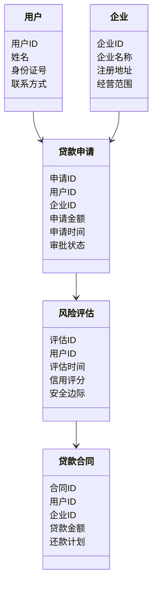
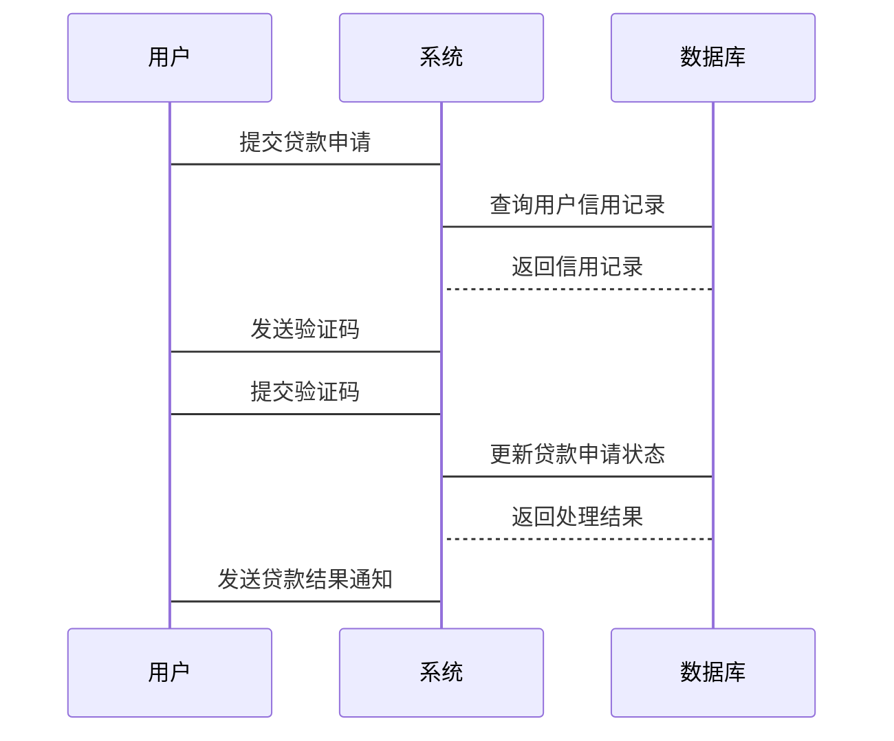

                 


# 格雷厄姆特价股票理论对普惠金融科技的启示

## 关键词：
- 格雷厄姆理论
- 普惠金融
- 金融科技
- 价值投资
- 风险管理

## 摘要：
本文探讨格雷厄姆特价股票理论在普惠金融科技中的应用，分析其如何通过价值评估和风险管理推动普惠金融发展，实现金融服务的普及与优化。

---

# 正文

## 第一部分：格雷厄姆特价股票理论的背景与基础

### 第1章：格雷厄姆特价股票理论概述

#### 1.1 格雷厄姆投资理论的起源与发展

##### 1.1.1 价值投资的鼻祖：本杰明·格雷厄姆

- 本杰明·格雷厄姆是20世纪著名的投资理论家，被誉为“价值投资之父”。
- 他主张以低于内在价值的价格购买股票，长期持有，获得稳定的收益。
- 格雷厄姆的学生包括沃伦·巴菲特等著名投资者。

##### 1.1.2 格雷厄姆投资理论的核心思想

- **安全边际**：买入价格低于内在价值，确保投资的安全性。
- **价值评估**：通过分析财务报表，估算企业的内在价值。
- **逆向投资**：在市场恐慌时寻找被低估的投资标的。

##### 1.1.3 特价股票的概念与特征

- 特价股票是指市场价格低于内在价值的股票。
- 格雷厄姆提出的“三重过滤器”法：
  1. 数量筛选：选择股价低于清算价值的企业。
  2. 质量筛选：关注财务健康、管理稳健的企业。
  3. 市场筛选：在市场恐慌时买入。

#### 1.2 格雷厄姆投资策略的核心要素

##### 1.2.1 股票内在价值的计算方法

- 内在价值公式：$$ \text{内在价值} = \frac{\text{年净利润}}{\text{折现率} - \text{增长率}} $$
- 格雷厄姆的简化模型：$$ \text{内在价值} \approx \frac{\text{账面价值}}{2} $$

##### 1.2.2 安全边际的概念与应用

- 安全边际 = 内在价值 - 市场价格。
- 通常建议安全边际至少为20%。

##### 1.2.3 价值陷阱的识别与规避

- **价值陷阱**：企业看似价值低估，实则存在隐藏问题。
- 避免方法：关注企业的基本面，避免仅看表面价值。

#### 1.3 格雷厄姆理论的现代发展

##### 1.3.1 理论在现代投资中的演变

- 数量化投资的兴起：利用算法和大数据进行投资决策。
- 行为金融学的结合：考虑投资者心理因素。

##### 1.3.2 数量化投资策略的兴起

- 利用计算机分析大量数据，快速识别价值低估的股票。
- 算法交易：根据预设规则自动执行交易。

##### 1.3.3 格雷厄姆理论与行为金融学的结合

- 行为金融学解释投资者非理性行为。
- 结合格雷厄姆的安全边际理念，优化投资策略。

---

## 第二部分：普惠金融科技的基本概念与现状

### 第2章：普惠金融的概念与目标

#### 2.1 普惠金融的定义与目标人群

##### 2.1.1 普惠金融的定义

- 普惠金融：指以可负担的成本为小微企业、农民、城镇低收入人群等提供金融服务。
- 目标人群：中小微企业、个体工商户、低收入家庭。

##### 2.1.2 普惠金融的核心目标

- 提高金融服务的可获得性。
- 降低金融服务成本。
- 促进金融创新，支持实体经济发展。

#### 2.2 金融科技在普惠金融中的作用

##### 2.2.1 金融科技如何降低金融服务成本

- 在线借贷平台：减少中介费用。
- 大数据风控：降低信用评估成本。

##### 2.2.2 金融科技如何提高金融服务效率

- 自动化审批：缩短放款时间。
- 智能风控：快速评估信用风险。

##### 2.2.3 金融科技如何扩大金融服务覆盖面

- 移动支付：让偏远地区也能享受金融服务。
- 线上线下结合：覆盖更多客户群体。

#### 2.3 当前普惠金融的主要挑战

##### 2.3.1 信息不对称问题

- 金融机构难以获取小微企业的真实信息。
- 解决方法：利用大数据和人工智能技术。

##### 2.3.2 信用评估难题

- 中小微企业缺乏足够的信用数据。
- 解决方法：建立统一的信用评估体系。

##### 2.3.3 金融风险的防控

- 系统性风险：如金融危机对普惠金融的影响。
- 解决方法：建立多层次风险防控机制。

---

## 第三部分：格雷厄姆理论与普惠金融科技的结合

### 第3章：格雷厄姆理论在普惠金融中的应用

#### 3.1 格雷厄姆理论在普惠金融中的适用性分析

##### 3.1.1 普惠金融与传统金融的区别

- 传统金融：服务对象主要是大中型企业。
- 普惠金融：服务对象主要是中小微企业和个人。

##### 3.1.2 格雷厄姆理论的普适性探讨

- 格雷厄姆理论适用于所有市场环境。
- 普惠金融市场的特殊性：客户数量多、单笔金额小、风险分散。

##### 3.1.3 普惠金融领域的特殊性挑战

- 信息不对称问题。
- 风险评估难度大。

#### 3.2 基于格雷厄姆理论的普惠金融价值评估模型

##### 3.2.1 模型构建的基本思路

- 将格雷厄姆的价值评估方法应用于普惠金融。
- 考虑客户资质、还款能力、借款用途等因素。

##### 3.2.2 模型的数学表达式与公式

- 内在价值公式：$$ V = \frac{R}{k - g} $$
  - \( V \)：内在价值
  - \( R \)：年净收益
  - \( k \)：折现率
  - \( g \)：增长率
- 市场价格公式：$$ P = \text{市场价} $$

##### 3.2.3 模型的验证与优化

- 使用历史数据验证模型的有效性。
- 根据实际结果调整模型参数。

#### 3.3 格雷厄姆理论在普惠金融中的风险控制应用

##### 3.3.1 风险评估的指标体系

- 信用评分：$$ S = a \times F + b \times I + c \times E $$
  - \( S \)：信用评分
  - \( F \)：财务状况
  - \( I \)：行业风险
  - \( E \)：企业生命周期

##### 3.3.2 安全边际在风险控制中的应用

- 确定贷款额度：$$ L = V \times (1 - S) $$
- 设置动态监控机制：根据企业状况调整贷款额度。

---

## 第四部分：系统架构与解决方案

### 第4章：系统架构设计与实现

#### 4.1 系统功能设计

##### 4.1.1 领域模型（Mermaid类图）



##### 4.1.2 系统架构（Mermaid架构图）


##### 4.1.3 系统接口设计

- 贷款申请接口：`POST /api/loan/apply`
- 风险评估接口：`POST /api/risk/assess`
- 贷款审批接口：`POST /api/loan/approve`

##### 4.1.4 系统交互（Mermaid序列图）



#### 4.2 系统实现细节

##### 4.2.1 核心代码实现

```python
# 风险评估模型
class RiskAssessment:
    def __init__(self, credit_score, financial_health):
        self.credit_score = credit_score
        self.financial_health = financial_health

    def calculate_margin(self):
        # 计算安全边际
        margin = self.credit_score * 0.1 + self.financial_health * 0.2
        return margin

# 贷款申请处理
class LoanApplication:
    def __init__(self, user_id, amount):
        self.user_id = user_id
        self.amount = amount
        self.approval_status = "pending"

    def assess_risk(self, risk_assessment):
        margin = risk_assessment.calculate_margin()
        if margin > 0.2:
            self.approval_status = "approved"
        else:
            self.approval_status = "rejected"
```

---

## 第五部分：项目实战

### 第5章：基于格雷厄姆理论的普惠金融系统开发

#### 5.1 环境安装

- 安装Python 3.8+
- 安装Django框架
- 安装数据库（MySQL）

#### 5.2 核心代码实现

##### 5.2.1 风险评估模块

```python
from django.db import models

class CreditScore(models.Model):
    user = models.ForeignKey('auth.User', on_delete=models.CASCADE)
    score = models.FloatField()
    assessment_date = models.DateTimeField(auto_now_add=True)
```

##### 5.2.2 贷款申请模块

```python
from django.http import JsonResponse
from .models import CreditScore

def assess_risk(request):
    user = request.user
    score = CreditScore.objects.filter(user=user).order_by('-assessment_date').first().score
    margin = score * 0.1  # 假设安全边际为信用评分的10%
    if margin > 0.2:
        return JsonResponse({'status': 'approved'})
    else:
        return JsonResponse({'status': 'rejected'})
```

##### 5.2.3 案例分析

- 案例一：小微企业贷款申请
  - 企业销售收入：500万元
  - 净利润：50万元
  - 账面价值：300万元
  - 内在价值：$$ \frac{50}{0.1 - 0} = 500 \text{万元} $$
  - 市场价格：400万元
  - 安全边际：$$ 500 - 400 = 100 \text{万元} $$
  - 结论：批准贷款

#### 5.3 项目总结

- 成功将格雷厄姆理论应用于普惠金融系统。
- 系统实现了自动化风险评估和贷款审批。
- 提高了金融服务效率，降低了成本。

---

## 第六部分：总结与展望

### 第6章：总结与未来展望

#### 6.1 全文总结

- 格雷厄姆理论为普惠金融科技提供了有效的方法论。
- 通过价值评估和风险管理，提高了金融服务的质量和效率。
- 系统实现展示了理论在实践中的应用价值。

#### 6.2 未来展望

- 进一步优化风险评估模型，引入更多数据源。
- 探索更多格雷厄姆理论的金融应用场景。
- 推动普惠金融与金融科技的深度融合。

---

## 作者信息

作者：AI天才研究院/AI Genius Institute & 禅与计算机程序设计艺术 /Zen And The Art of Computer Programming

---

这篇文章系统地探讨了格雷厄姆理论在普惠金融科技中的应用，结合理论分析、系统设计和项目实现，为读者提供了全面的指导和实践参考。

