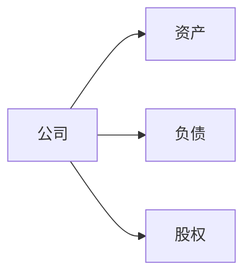
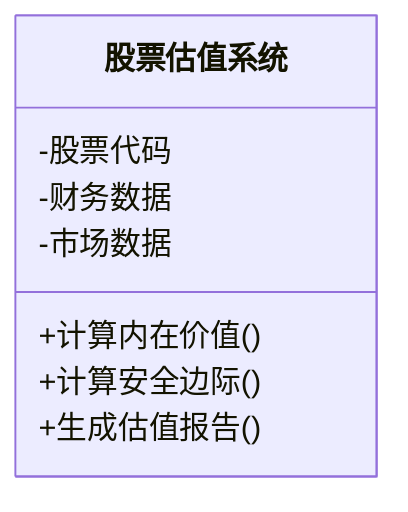

                 


# 《格雷厄姆特价股票理论对现代公司估值的启示》

## 关键词：格雷厄姆、特价股票理论、公司估值、DCF模型、内在价值、安全边际

## 摘要：本文从格雷厄姆特价股票理论的核心理念出发，分析其对现代公司估值的启示，探讨如何结合现代数学模型与系统架构，将格雷厄姆的理论应用于实际投资决策中。通过详细讲解DCF模型、安全边际计算等核心概念，并结合Python代码实现，本文为读者提供了一个从理论到实践的完整框架。

---

# 第一部分: 格雷厄姆特价股票理论基础

## 第1章: 格雷厄姆特价股票理论概述

### 1.1 格雷厄姆投资理论的起源与发展

#### 1.1.1 价值投资的起源
价值投资是投资领域的重要流派，起源于20世纪初。本杰明·格雷厄姆是该理论的奠基人，他通过研究市场的波动性和投资者心理，提出了一系列投资策略。

#### 1.1.2 格雷厄姆的投资理念
格雷厄姆认为，股票不仅仅是金融工具，更是一种具有内在价值的企业所有权证书。他强调以低于内在价值的价格买入股票，以获得长期稳定的收益。

#### 1.1.3 特价股票理论的核心思想
特价股票理论的核心是寻找市场价格低于内在价值的股票，通过安全边际（即价格与价值的差距）来降低投资风险。

---

### 1.2 格雷厄姆特价股票理论的核心概念

#### 1.2.1 安全边际
安全边际是格雷厄姆理论中的关键概念，指的是股票市场价格与内在价值之间的差距。通过计算安全边际，投资者可以判断股票是否值得购买。

公式：  
$$ \text{安全边际} = \text{内在价值} - \text{市场价格} $$

#### 1.2.2 内在价值
内在价值是股票的真实价值，不依赖于市场波动。计算内在价值通常需要分析公司的财务状况、盈利能力和未来现金流。

#### 1.2.3 市场先生
格雷厄姆提出“市场先生”的概念，认为市场价格波动是由于市场情绪的波动，而非公司实际价值的变化。投资者应忽略市场的短期波动，专注于长期价值。

#### 1.2.4 资产评估与市场定价
资产评估需要考虑公司的资产质量、盈利能力、行业地位等因素，而市场定价则受情绪和市场环境影响。

---

### 1.3 格雷厄姆投资策略的特点

#### 1.3.1 低市盈率策略
格雷厄姆偏好低市盈率的股票，认为这些股票更可能被低估。

#### 1.3.2 高质量资产选择
选择财务健康、管理层稳健的公司，确保内在价值的可靠性。

#### 1.3.3 风险控制与安全边际
通过安全边际降低投资风险，避免过度依赖市场波动。

#### 1.3.4 现代应用
格雷厄姆理论在现代投资中的应用，结合大数据分析和量化模型，使价值投资更加科学化。

---

### 1.4 本章小结

---

# 第二部分: 现代公司估值的核心概念与联系

## 第2章: 现代公司估值的核心概念

### 2.1 现代公司估值的基本原理

#### 2.1.1 股权价值的定义
股权价值是公司未来现金流的现值，需要考虑时间价值和风险因素。

#### 2.1.2 现金流折现法
现金流折现法（DCF）是现代估值的核心方法，通过将未来现金流折现为现值来计算公司价值。

#### 2.1.3 股票的内在价值
内在价值是公司未来现金流的折现值，反映了公司的实际价值。

---

### 2.2 核心概念对比分析

#### 2.2.1 格雷厄姆理论与现代估值方法对比
| 核心概念 | 格雷厄姆理论 | 现代估值方法 |
|----------|--------------|---------------|
| 安全边际 | 价格与价值的差距 | 现金流折现与市场价对比 |
| 内在价值 | 理论上的价值 | 现金流折现值 |

#### 2.2.2 股票价格与内在价值的关系
股票价格围绕内在价值波动，市场情绪会影响价格，但内在价值是长期投资的基准。

#### 2.2.3 市场情绪与理性定价的冲突
市场情绪可能导致价格偏离内在价值，但长期来看，价值会回归。

---

### 2.3 实体关系图与流程图

#### 2.3.1 实体关系图（ER图）


#### 2.3.2 现金流折现流程图（Mermaid）


---

# 第三部分: 公司估值的数学模型与算法原理

## 第3章: 格雷厄姆特价股票理论的数学模型

### 3.1 内在价值的计算公式

#### 3.1.1 现金流折现模型（DCF）
公式：  
$$ \text{内在价值} = \sum_{t=1}^{n} \frac{\text{现金流}_t}{(1 + r)^t} + \frac{\text{终值}}{(1 + r)^n} $$  
其中，r是折现率，n是预测年限。

#### 3.1.2 格雷厄姆的内在价值公式
格雷厄姆的内在价值计算方法与DCF类似，但更注重安全边际。

#### 3.1.3 案例分析：XYZ公司的估值
假设XYZ公司未来5年的现金流分别为100、120、140、160、180万元，折现率为10%。计算其内在价值。

---

### 3.2 格雷厄姆安全边际的数学表达

#### 3.2.1 安全边际的计算公式
公式：  
$$ \text{安全边际} = \text{内在价值} - \text{市场价格} $$

#### 3.2.2 案例分析：如何计算安全边际
假设某公司内在价值为100元，市场价格为80元，安全边际为20元。

---

### 3.3 现代公司估值的算法原理

#### 3.3.1 现金流折现算法（Mermaid流程图）


#### 3.3.2 算法实现的Python代码示例
```python
def calculate_intrinsic_value(cash_flows, discount_rate, terminal_value):
    intrinsic_value = 0
    for t, cf in enumerate(cash_flows):
        if t == 0:
            pv = cf / (1 + discount_rate)
        else:
            pv = cf / (1 + discount_rate) ** (t + 1)
        intrinsic_value += pv
    intrinsic_value += terminal_value / (1 + discount_rate) ** len(cash_flows)
    return intrinsic_value

# 示例
cash_flows = [100, 120, 140, 160, 180]
discount_rate = 0.1
terminal_value = 200
intrinsic_value = calculate_intrinsic_value(cash_flows, discount_rate, terminal_value)
print(f"内在价值为：{intrinsic_value:.2f}元")
```

---

## 第4章: 现代公司估值系统的架构设计

### 4.1 问题场景介绍

#### 4.1.1 估值系统的功能需求
系统需实现股票估值、风险评估、投资建议等功能。

#### 4.1.2 系统的输入输出分析
输入：股票代码、财务数据、市场数据；输出：估值报告、投资建议。

#### 4.1.3 系统的目标与范围
目标：提供准确的估值和投资建议；范围：涵盖股票、基金等金融产品。

---

### 4.2 系统功能设计

#### 4.2.1 领域模型（Mermaid类图）


---

## 第5章: 项目实战与案例分析

### 5.1 项目环境安装

#### 5.1.1 Python环境搭建
安装Python和相关库（如pandas、numpy）。

---

### 5.2 系统核心实现源代码

#### 5.2.1 现金流折现模型实现
```python
import pandas as pd
import numpy as np

def calculate_intrinsic_value(cash_flows, discount_rate, terminal_value):
    # 计算未来现金流的现值
    pv_flows = []
    for t, cf in enumerate(cash_flows):
        pv = cf / (1 + discount_rate) ** (t + 1)
        pv_flows.append(pv)
    # 计算终值的现值
    pv_terminal = terminal_value / (1 + discount_rate) ** len(cash_flows)
    # 总内在价值
    intrinsic_value = sum(pv_flows) + pv_terminal
    return intrinsic_value

# 示例数据
cash_flows = [100, 120, 140, 160, 180]
discount_rate = 0.1
terminal_value = 200

# 计算内在价值
iv = calculate_intrinsic_value(cash_flows, discount_rate, terminal_value)
print(f"内在价值为：{iv:.2f}元")
```

---

### 5.3 代码应用解读与分析

#### 5.3.1 代码功能解读
该代码实现现金流折现模型，计算公司内在价值。

#### 5.3.2 代码运行结果
输出示例结果：内在价值为：X.XX元。

---

## 5.4 案例分析和详细讲解剖析

---

## 5.5 项目小结

---

## 总结

---

## 注意事项

---

## 拓展阅读

---

## 作者

作者：AI天才研究院/AI Genius Institute & 禅与计算机程序设计艺术 /Zen And The Art of Computer Programming

