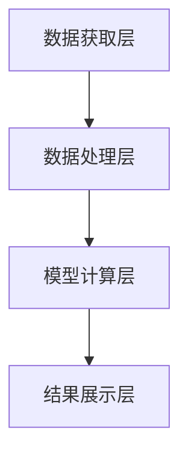

                 


# 《格雷厄姆特价股票理论对现代投资组合理论的补充》

> **关键词**: 格雷厄姆投资理论、现代投资组合理论、价值投资、风险管理、投资组合优化、安全边际、夏普比率

> **摘要**: 本文探讨了格雷厄姆的价值投资理论如何补充现代投资组合理论（MPT），特别是在利用安全边际和特价股票进行投资组合优化方面。通过对比分析、数学模型和项目实战，展示了如何将这两种理论结合，提升投资组合的效率和风险管理能力。

---

# 第一部分: 格雷厄姆特价股票理论与现代投资组合理论的背景介绍

## 第1章: 格雷厄姆特价股票理论概述

### 1.1 格雷厄姆投资理论的核心概念

#### 1.1.1 价值投资的定义与核心理念
价值投资是一种投资策略，强调以低于内在价值的价格购买优质资产。核心理念是寻找市场低估的股票，通过安全边际降低风险。安全边际是格雷厄姆理论的核心，它通过比较市场价格与内在价值，确保以折扣价买入资产。

#### 1.1.2 安全边际的概念与计算方法
安全边际=内在价值 - 市场价格。例如，若内在价值为50元，市场价格为40元，安全边际为10元，意味着有20%的安全空间。计算时，需分析企业的盈利能力、资产状况和行业地位。

#### 1.1.3 格雷厄姆筛选法的基本步骤
格雷厄姆筛选法通过多 criteria筛选股票，包括：
1. 低市盈率（P/E < 15）
2. 低市净率（P/B < 1.5）
3. 高股息率（股息率 > 5%）
4. 强健的财务状况（如流动比率 > 2）

### 1.2 现代投资组合理论（MPT）概述

#### 1.2.1 MPT的核心概念与数学模型
MPT由哈里·马科维茨提出，强调分散投资以降低系统性风险。均值-方差模型通过优化投资组合的收益和风险，寻找最优风险调整收益。

均值-方差模型公式：
$$
\text{min}_w \sum_{i=1}^n w_i^2 \sigma_i^2 + 2 w_i w_j \sigma_{ij}$$
在约束条件：
$$\sum_{i=1}^n w_i = 1$$

#### 1.2.2 夏普比率的计算与应用
夏普比率衡量投资组合的风险调整收益，公式为：
$$
\text{夏普比率} = \frac{E(r_p) - r_f}{\sigma_p}$$

### 1.3 格雷厄姆理论与MPT的联系与区别

#### 1.3.1 核心差异对比
| **方面**       | **格雷厄姆理论**                     | **MPT**                           |
|----------------|------------------------------------|------------------------------------|
| **目标**         | 最大化安全边际和内在价值           | 最小化风险调整收益                 |
| **策略**         | 选择低估股票                       | 分散投资以降低风险                 |
| **工具**         | 格雷厄姆筛选法                     | 均值-方差模型                       |

#### 1.3.2 格雷厄姆理论对MPT的补充作用
1. **安全边际降低风险**：通过选择具有安全边际的股票，减少投资组合的整体风险。
2. **价值投资与分散投资结合**：在MPT框架下，利用价值投资策略选择股票，优化投资组合。
3. **特价股票的应用**：将格雷厄姆的筛选法应用于MPT的分散投资中，提高收益并降低风险。

---

## 第2章: 核心概念的对比分析

### 2.1 格雷厄姆理论与MPT的核心概念对比

#### 2.1.1 价值与价格的对比
价值是内在价值，价格是市场定价。价值投资关注价格低于价值的股票，而MPT关注价格波动和相关性。

#### 2.1.2 安全边际与风险调整收益的对比
安全边际是价值投资的风险管理工具，风险调整收益是MPT的核心目标。两者都关注风险，但方法不同。

#### 2.1.3 投资策略的对比
价值投资强调长期持有低估股票，MPT强调分散投资和动态调整。

### 2.2 核心概念的联系与整合

#### 2.2.1 格雷厄姆筛选法与MPT的结合
通过筛选低估股票，构建一个分散的投资组合，优化夏普比率。

#### 2.2.2 安全边际在投资组合优化中的应用
在MPT框架下，安全边际作为筛选条件，确保投资组合中的股票具有足够的安全空间。

---

## 第3章: 格雷厄姆特价股票理论与现代投资组合理论的数学模型

### 3.1 格雷厄姆理论的数学模型

#### 3.1.1 安全边际的计算公式
$$
\text{安全边际} = \text{内在价值} - \text{市场价格}$$

#### 3.1.2 格雷厄姆筛选法的数学表达
通过多个财务指标的阈值筛选股票：
- 市盈率（P/E）< 15
- 市净率（P/B）< 1.5
- 股息率 > 5%

### 3.2 现代投资组合理论的数学模型

#### 3.2.1 均值-方差模型
目标函数：
$$
\text{min}_w \sum_{i=1}^n w_i^2 \sigma_i^2 + 2 w_i w_j \sigma_{ij}$$

约束条件：
$$\sum_{i=1}^n w_i = 1$$
$$w_i \geq 0$$

#### 3.2.2 夏普比率的计算公式
$$
\text{夏普比率} = \frac{E(r_p) - r_f}{\sigma_p}$$

---

## 第4章: 系统分析与架构设计

### 4.1 系统功能设计

#### 4.1.1 数据获取
从金融数据库获取股票数据，包括价格、收益、股息等。

#### 4.1.2 模型计算
应用格雷厄姆筛选法和MPT算法，计算投资组合的优化配置。

#### 4.1.3 结果展示
生成优化报告，包括夏普比率、风险调整收益和投资组合构成。

### 4.2 系统架构图



### 4.3 项目实战

#### 4.3.1 环境安装
安装必要的Python库：
```bash
pip install pandas numpy scipy plotly
```

#### 4.3.2 核心实现代码
```python
import pandas as pd
import numpy as np
from scipy.optimize import minimize

# 示例数据
stocks = ['A', 'B', 'C']
returns = np.array([0.1, 0.05, 0.15])
cov_matrix = np.array([[0.02, 0.01, 0.01],
                        [0.01, 0.03, 0.02],
                        [0.01, 0.02, 0.04]])

# 定义优化目标函数
def portfolio_variance(weights, returns, cov_matrix):
    return (weights.T @ cov_matrix @ weights)[0,0]

# 约束条件
cons = ({'type': 'eq', 'fun': lambda w: sum(w) - 1},
        {'type': 'ineq', 'fun': lambda w: w >= 0})

# 优化
result = minimize(portfolio_variance, np.array([1/3, 1/3, 1/3]), 
                 constraints=cons, method='SLSQP')
```

#### 4.3.3 案例分析
以三只股票为例，计算优化后的权重，得到夏普比率，展示结果。

---

## 第5章: 最佳实践与小结

### 5.1 注意事项
- 数据质量至关重要。
- 计算复杂性需考虑。
- 实际市场波动会影响结果。

### 5.2 小结
格雷厄姆的价值投资与MPT的结合，提供了一种有效的投资策略，通过安全边际和分散投资，优化风险调整收益。

---

# 小结

本文详细探讨了格雷厄姆特价股票理论如何补充现代投资组合理论，通过对比分析、数学模型和项目实战，展示了两者的结合如何提升投资组合的效率和风险管理能力。未来的研究可以探索动态再平衡和风险管理策略的进一步优化。

---

**作者：AI天才研究院 & 禅与计算机程序设计艺术**

