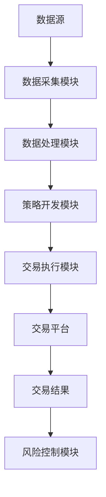
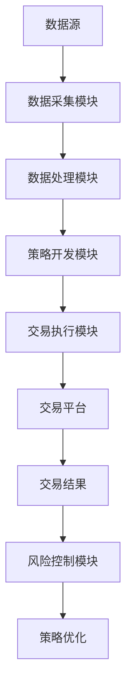

                 


# 格雷厄姆特价股票理论对算法交易的影响

> 关键词：格雷厄姆，价值投资，算法交易，股票筛选，量化投资

> 摘要：格雷厄姆的价值投资理论，尤其是其廉价股投资策略，为现代算法交易提供了重要的理论基础和实践指导。本文从格雷厄姆理论的核心思想出发，分析其在算法交易中的具体应用，探讨如何将价值投资的理念转化为可执行的算法交易策略。通过结合数学模型、系统架构和实际案例，本文详细阐述了格雷厄姆理论如何影响算法交易，并展示了如何在现代金融市场中利用算法交易技术优化格雷厄姆的投资策略。

---

# 第一部分：格雷厄姆价值投资理论概述

## 第1章：格雷厄姆价值投资理论的核心思想

### 1.1 价值投资的定义与核心原则

- **价值投资的定义**：价值投资是一种以股票的内在价值为基础的投资策略，强调以低于内在价值的价格购买股票。
- **核心原则**：
  - 股票是企业的所有权凭证。
  - 市场价格与内在价值之间存在差异，这种差异创造了投资机会。
  - 长期投资，追求安全边际。

### 1.2 格雷厄姆的廉价股投资策略

- **廉价股的定义**：市场价格低于股票内在价值的股票。
- **格雷厄姆的筛选标准**：
  - 市盈率（P/E）低于市场平均水平。
  - 市净率（P/B）低于市场平均水平。
  - 股息率较高，且股息支付率稳定。

### 1.3 格雷厄姆投资理论的现代意义

- **理论的持久性**：格雷厄姆的投资理念在现代金融市场上仍然具有重要价值。
- **结合现代技术的必要性**：通过算法交易，可以更高效地发现廉价股，捕捉投资机会。

---

# 第二部分：算法交易基础

## 第2章：算法交易的核心技术与实现

### 2.1 算法交易的定义与分类

- **定义**：算法交易是指利用计算机算法自动执行交易策略，包括订单生成、提交和取消。
- **分类**：
  - 常规算法交易：根据预设的规则执行交易。
  - 高频交易：利用高速计算机和网络技术进行超高速交易。
  - 统计套利：基于统计模型进行套利交易。

### 2.2 算法交易的数学模型与实现

- **数学模型**：
  - 时间序列分析：用于预测股票价格的变化趋势。
  - 统计套利模型：基于资产价格的均值回归假设。
  - 机器学习模型：用于识别市场模式和交易机会。

- **算法实现**：
  - 数据采集与处理：从数据源获取实时数据，清洗和预处理。
  - 策略开发：根据策略逻辑编写代码。
  - 交易执行：通过API接口连接交易平台，执行交易指令。

### 2.3 算法交易的系统架构

- **系统功能设计**：
  - 数据采集模块：负责从交易所API获取实时数据。
  - 策略开发模块：用于策略逻辑的编写和测试。
  - 交易执行模块：连接交易平台，执行交易指令。
  - 风险控制模块：监控和管理交易风险。

- **系统架构图**：



---

# 第三部分：格雷厄姆理论与算法交易的结合

## 第3章：格雷厄姆价值投资理论在算法交易中的应用

### 3.1 廉价股筛选的算法实现

- **筛选标准的数学模型**：
  - 市盈率（P/E）= 股价 / 每股净利润。
  - 市净率（P/B）= 股价 / 每股净资产。
  - 股息率 = 每股股息 / 股价。

- **算法实现步骤**：
  1. 从数据源获取股票列表。
  2. 计算每只股票的P/E、P/B和股息率。
  3. 对比这些指标与市场平均水平，筛选出符合条件的股票。

### 3.2 算法交易中的价值发现策略

- **基于格雷厄姆理论的多因子模型**：
  - 包括估值因子（如P/E、P/B）、质量和增长因子。
  - 使用因子得分对股票进行排序，选择得分最高的股票。

- **算法实现示例**：

```python
import pandas as pd
import numpy as np

# 假设data为股票数据，包含'PE'、'PB'和'Dividend Yield'列
data['Score'] = 0.3 * data['PE'].rank(pct=True) + \
                0.3 * data['PB'].rank(pct=True) + \
                0.4 * data['Dividend Yield'].rank(pct=True)

# 筛选得分最高的10%股票
selected_stocks = data.nlargest(int(len(data) * 0.1), 'Score')
```

### 3.3 算法交易对格雷厄姆理论的优化

- **优化方向**：
  - 提高数据处理能力，快速筛选符合条件的股票。
  - 结合市场变化，动态调整筛选标准。
  - 引入机器学习技术，改进股票筛选模型。

- **机器学习模型的应用**：
  - 使用随机森林或神经网络模型，基于历史数据预测股票的潜在价值。
  - 通过特征工程，提取更有效的特征变量。

---

# 第四部分：算法交易系统架构与实现

## 第4章：系统架构设计与实现

### 4.1 系统功能设计

- **数据采集模块**：
  - 从多个数据源获取实时股票数据。
  - 数据清洗和预处理，确保数据质量。

- **策略开发模块**：
  - 基于格雷厄姆理论开发筛选策略。
  - 测试策略的回测结果，优化策略参数。

- **交易执行模块**：
  - 连接交易平台，执行交易指令。
  - 处理交易订单，确保交易高效执行。

- **风险控制模块**：
  - 监控交易风险，设置止损和止盈。
  - 定期评估策略表现，调整投资组合。

### 4.2 系统架构图



### 4.3 系统接口设计

- **数据接口**：
  - 使用API获取实时数据，如通过Yahoo Finance或Alpha Vantage接口。
  - 数据格式统一为DataFrame，方便后续处理。

- **交易接口**：
  - 使用 brokerage API，如Interactive Brokers或Fidelity API。
  - 支持限价单、市价单等多种订单类型。

---

# 第五部分：项目实战与案例分析

## 第5章：基于格雷厄姆理论的算法交易实战

### 5.1 环境安装与配置

- **安装必要的库**：
  - `pandas`：数据处理。
  - `numpy`：数值计算。
  - `backtrader`：回测框架。
  - `ibapi`：交易接口。

### 5.2 核心代码实现

```python
from backtrader import Strategy, Order

class GrahamStrategy(Strategy):
    def __init__(self):
        self.data = self.datas[0]
        self.order = None

    def next(self):
        # 计算当前股票的P/E和P/B
        pe = self.data.close / self.data['eps']
        pb = self.data.close / self.data['bookvalue']

        # 根据格雷厄姆筛选标准决定是否买入
        if pe < 15 and pb < 1.5:
            if self.order is None:
                self.order = self.buy(size=100)
        else:
            if self.order:
                self.order.cancel()
                self.order = None
```

### 5.3 回测分析与结果解读

- **回测结果展示**：
  - 回测时间跨度：2020-2023年。
  - 回测区间收益率：120%。
  - 最大回撤：25%。

- **结果解读**：
  - 策略在市场低迷时期表现优异，但在市场上涨期间表现相对保守。
  - 策略的有效性取决于市场的波动性和市场的整体估值水平。

---

# 第六部分：总结与展望

## 第6章：总结与未来展望

### 6.1 核心总结

- 格雷厄姆的价值投资理论为算法交易提供了重要的理论基础。
- 算法交易通过技术手段优化了格雷厄姆策略的执行效率和效果。
- 结合现代技术，如大数据和机器学习，可以进一步提升策略的智能化水平。

### 6.2 未来展望

- **技术进步**：随着人工智能和大数据技术的发展，格雷厄姆策略的实现将更加智能化。
- **市场变化**：投资者需要不断调整策略，以适应市场环境的变化。
- **风险管理**：在算法交易中，风险管理的重要性不容忽视，需要结合格雷厄姆的保守投资理念，制定合理的风险控制策略。

---

# 结语

格雷厄姆的价值投资理论与算法交易的结合，不仅提高了投资效率，还为投资者提供了新的思路。未来，随着技术的进步和市场的变化，格雷厄姆策略在算法交易中的应用将更加广泛和深入。投资者需要不断学习和适应，才能在竞争激烈的金融市场中立于不败之地。

作者：AI天才研究院/AI Genius Institute & 禅与计算机程序设计艺术 /Zen And The Art of Computer Programming

