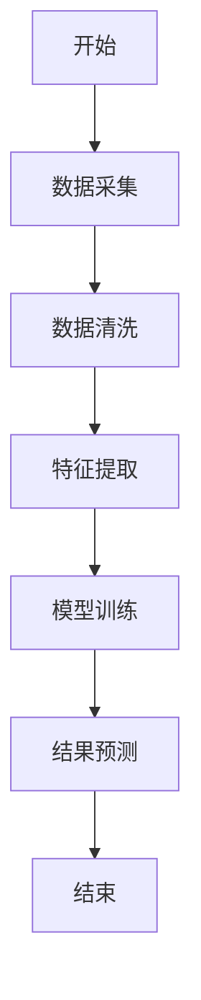
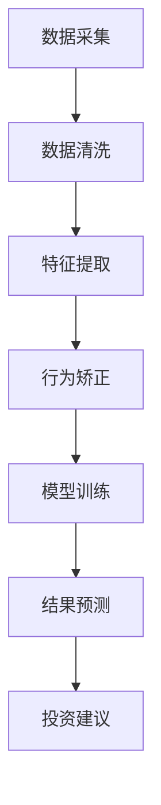
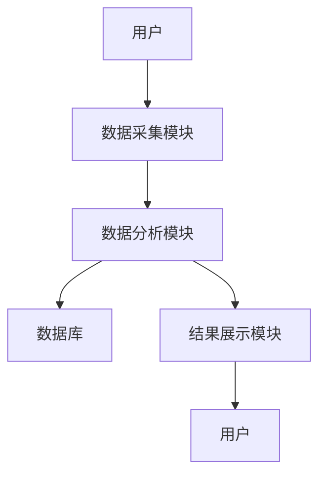

                 

# 格雷厄姆特价股票理论对行为经济学的Web4.0补充

## 关键词：格雷厄姆投资理论，行为经济学，Web4.0，股票分析，算法模型，系统架构

## 摘要：本文深入探讨格雷厄姆特价股票理论如何与行为经济学相结合，并利用Web4.0的技术优势，提出一种基于行为矫正的算法模型，优化股票筛选过程。通过系统架构设计和项目实战，展示了如何在现代投资环境中应用这些理论，帮助投资者做出更明智的决策。

---

## 第一章: 引言

### 1.1 格雷厄姆特价股票理论概述
#### 1.1.1 什么是格雷厄姆特价股票理论
格雷厄姆的特价股票理论是价值投资的核心理念，旨在识别市场定价低于其内在价值的股票。这种股票通常被市场低估，为投资者提供了获利的机会。

#### 1.1.2 格雷厄姆投资理论的核心思想
格雷厄姆强调安全边际和长期投资，认为市场波动是投资者的机会，而非风险。他主张通过基本面分析，寻找那些具有强大财务基础和低估值的公司。

#### 1.1.3 格雷厄姆理论在现代投资中的应用
在现代市场中，格雷厄姆的理论依然适用，特别是在技术驱动的分析中，投资者可以利用大数据和机器学习来辅助识别特价股票。

### 1.2 行为经济学的基本概念
#### 1.2.1 行为经济学的定义与研究领域
行为经济学研究人类在决策过程中的心理偏差，如前景理论、损失厌恶和认知偏差，这些因素会影响投资决策。

#### 1.2.2 行为经济学与传统经济学的区别
传统经济学假设投资者是理性的，而行为经济学则关注投资者的实际决策过程，考虑认知和情感因素。

#### 1.2.3 行为经济学在投资决策中的作用
行为经济学帮助解释市场异象，如股价波动和投资者情绪，为投资者提供心理层面的洞察。

### 1.3 Web4.0的特点与影响
#### 1.3.1 Web1.0到Web4.0的演进历程
从静态网页到动态交互，Web4.0强调智能化、个性化和实时反馈，提升了数据分析的效率。

#### 1.3.2 Web4.0的核心特征与技术基础
Web4.0结合大数据、人工智能和区块链，提供更智能、更个性化的服务，优化数据处理流程。

#### 1.3.3 Web4.0对股票市场分析的影响
Web4.0技术提升了数据采集和分析能力，使投资者能够实时获取信息，做出更精准的决策。

### 1.4 本章小结
格雷厄姆理论提供价值评估方法，行为经济学揭示投资者心理，Web4.0技术则提升数据处理能力，三者的结合为股票分析提供了新视角。

---

## 第二章: 格雷厄姆特价股票理论的核心概念

### 2.1 格雷厄姆投资理论的背景
#### 2.1.1 20世纪的投资环境
20世纪的市场波动为格雷厄姆提供了丰富的研究素材，他通过分析市场周期，提出了价值投资理念。

#### 2.1.2 格雷厄姆的学术贡献
格雷厄姆与大卫·多德合著的《证券分析》奠定了价值投资的基础，影响了几代投资者。

#### 2.1.3 格雷厄姆理论的现实意义
尽管时代变迁，格雷厄姆的理论在低效市场中依然有效，特别是在识别低估股票方面。

### 2.2 格雷厄姆特价股票的定义与特征
#### 2.2.1 特价股票的定义
特价股票是市场价格低于内在价值的股票，通常具有较高的安全边际。

#### 2.2.2 格雷厄姆的内在价值计算
内在价值是基于公司基本面分析得出的合理估值，格雷厄姆常用市盈率和市净率等指标进行评估。

#### 2.2.3 格雷厄姆股票筛选的标准
格雷厄姆提出了一系列筛选标准，如低市盈率、低市净率、高股息率等，帮助识别低估股票。

### 2.3 格雷厄姆理论与现代投资理论的对比
#### 2.3.1 传统价值投资与现代量化投资的对比
传统价值投资依赖基本面分析，而量化投资则利用算法和大数据进行预测。

#### 2.3.2 格雷厄姆理论在不同市场环境下的表现
在熊市中，格雷厄姆理论表现优异，而在牛市中，可能被高估的股票会削弱其效果。

#### 2.3.3 格雷厄姆理论的优缺点
优点：注重安全边际，适合长期投资。缺点：在高效市场中可能难以找到足够低估的股票。

### 2.4 格雷厄姆理论的扩展与创新
#### 2.4.1 结合行为经济学的改进
考虑投资者心理因素，优化股票筛选标准，提高模型的适用性。

#### 2.4.2 格雷厄姆理论的现代应用
利用大数据和机器学习技术，提升筛选效率和准确性，扩大应用场景。

### 2.5 本章小结
格雷厄姆理论在现代投资中的应用需要结合行为经济学和技术进步，才能更好地适应市场变化。

---

## 第三章: 行为经济学与股票投资决策

### 3.1 行为经济学的核心理论
#### 3.1.1 前景理论（Prospect Theory）
前景理论解释了投资者在收益和损失面前的风险偏好差异，影响其投资决策。

#### 3.1.2 损失厌恶（Loss Aversion）
投资者对损失的厌恶程度高于对收益的偏好，可能导致过度交易和错失机会。

#### 3.1.3 认知偏差（Cognitive Biases）
常见的认知偏差，如确认偏差和从众心理，影响投资者的判断。

### 3.2 行为经济学对股票投资决策的影响
#### 3.2.1 投资者情绪与市场波动
情绪波动导致市场的过度反应，为价值投资者提供了机会。

#### 3.2.2 行为偏差与投资策略
识别和纠正认知偏差，优化投资决策，避免常见错误。

#### 3.2.3 行为经济学在风险管理中的应用
通过识别和管理行为偏差，降低投资风险，提高收益稳定性。

### 3.3 本章小结
行为经济学为理解投资者决策提供了新的视角，帮助投资者克服心理偏差，做出更理性的决策。

---

## 第四章: Web4.0技术与股票分析的结合

### 4.1 Web4.0技术的特点
#### 4.1.1 大数据与人工智能的结合
利用大数据分析和机器学习算法，提升数据处理效率和预测准确性。

#### 4.1.2 智能化与个性化服务
Web4.0提供个性化的投资建议和实时反馈，满足投资者的多样化需求。

#### 4.1.3 区块链技术的应用
区块链确保数据透明和不可篡改，提升数据可信度，优化信息共享。

### 4.2 Web4.0对股票分析的补充作用
#### 4.2.1 数据采集与处理
通过Web4.0技术，实时采集和处理多源数据，提高分析效率。

#### 4.2.2 智能化分析工具
开发智能算法，辅助投资者识别市场趋势和潜在机会。

#### 4.2.3 个性化投资策略
根据投资者的风险偏好和行为特征，制定个性化投资策略。

### 4.3 Web4.0环境下的股票筛选算法
#### 4.3.1 数据预处理与特征提取
使用Python对股票数据进行清洗和特征提取，为后续分析做准备。

#### 4.3.2 基于机器学习的预测模型
通过训练分类模型，识别具有潜在上涨空间的股票。

#### 4.3.3 算法流程图

### 4.4 本章小结
Web4.0技术为股票分析提供了新的工具和方法，提升了数据处理能力和预测准确性。

---

## 第五章: 基于行为经济学的股票筛选算法模型

### 5.1 算法模型的设计思路
#### 5.1.1 行为矫正机制的引入
通过行为矫正，优化股票筛选标准，克服传统模型的不足。

#### 5.1.2 算法目标与输入输出
目标：识别低估股票；输入：股票数据和投资者行为数据；输出：筛选结果和投资建议。

#### 5.1.3 算法的核心步骤
数据清洗、特征提取、行为矫正、模型训练和结果分析。

### 5.2 算法实现
#### 5.2.1 数据预处理
使用Python对数据进行清洗和特征工程，确保数据质量。

#### 5.2.2 行为矫正模型
通过机器学习算法，识别并纠正投资者的非理性决策因素。

#### 5.2.3 模型训练与调优
利用交叉验证和网格搜索，优化模型参数，提高预测准确率。

#### 5.2.4 模型评估
采用准确率、召回率和F1分数等指标，评估模型性能。

### 5.3 算法流程图

### 5.4 本章小结
通过引入行为矫正机制，算法模型能够更好地识别低估股票，帮助投资者做出更明智的决策。

---

## 第六章: 系统架构设计与实现

### 6.1 系统功能设计
#### 6.1.1 数据采集模块
负责实时采集股票数据和投资者行为数据。

#### 6.1.2 数据分析模块
对数据进行清洗、特征提取和行为矫正，生成分析结果。

#### 6.1.3 用户交互模块
提供友好的用户界面，展示分析结果和投资建议。

### 6.2 系统架构设计

### 6.3 系统接口设计
#### 6.3.1 数据接口
定义RESTful API，供其他模块调用数据。

#### 6.3.2 用户接口
设计简洁的网页界面，方便用户查看分析结果。

#### 6.3.3 模型接口
提供API，供其他系统调用分析结果。

### 6.4 系统实现
#### 6.4.1 环境配置
安装必要的库和工具，配置开发环境。

#### 6.4.2 核心代码实现
编写数据处理、模型训练和结果展示的代码。

#### 6.4.3 系统测试
进行功能测试和性能测试，确保系统稳定运行。

### 6.5 本章小结
系统架构设计合理，功能完善，能够有效支持股票分析和投资决策。

---

## 第七章: 项目实战与案例分析

### 7.1 项目背景
#### 7.1.1 项目目标
利用格雷厄姆理论和行为经济学，开发一个智能股票筛选系统。

#### 7.1.2 数据来源
使用公开的股票数据和投资者行为数据，进行分析和建模。

### 7.2 项目实战
#### 7.2.1 环境安装
安装Python、Pandas、Scikit-learn等工具。

#### 7.2.2 数据预处理
对数据进行清洗和特征工程，确保数据质量。

#### 7.2.3 模型实现
编写代码实现行为矫正算法，训练预测模型。

#### 7.2.4 结果分析
分析模型预测结果，评估其准确性和实用性。

### 7.3 案例分析
#### 7.3.1 数据展示
展示部分股票的分析结果，说明模型的有效性。

#### 7.3.2 结果解读
解释模型预测结果，说明如何根据结果做出投资决策。

#### 7.3.3 模型优化
根据测试结果，优化模型参数，提高预测准确率。

### 7.4 本章小结
通过项目实战，验证了模型的有效性，为投资者提供了实用的工具。

---

## 第八章: 总结与展望

### 8.1 本章总结
本文结合格雷厄姆理论、行为经济学和Web4.0技术，提出了一种新型的股票筛选算法，优化了投资决策过程。

### 8.2 投资者的最佳实践
投资者应结合市场环境和自身情况，合理运用这些理论和工具，做出更明智的投资决策。

### 8.3 注意事项
在实际应用中，应考虑市场的波动性和模型的局限性，避免过度依赖算法。

### 8.4 未来研究方向
未来可进一步研究行为矫正机制的优化，探索更多技术与投资理论的结合点。

### 8.5 拓展阅读
推荐相关书籍和论文，帮助读者深入了解相关领域的知识。

---

## 作者：AI天才研究院/AI Genius Institute & 禅与计算机程序设计艺术 /Zen And The Art of Computer Programming

---

这篇文章结合了格雷厄姆的理论、行为经济学和Web4.0技术，通过系统的分析和实战案例，展示了如何利用这些工具优化股票分析过程。希望对读者在投资决策中有所帮助。

