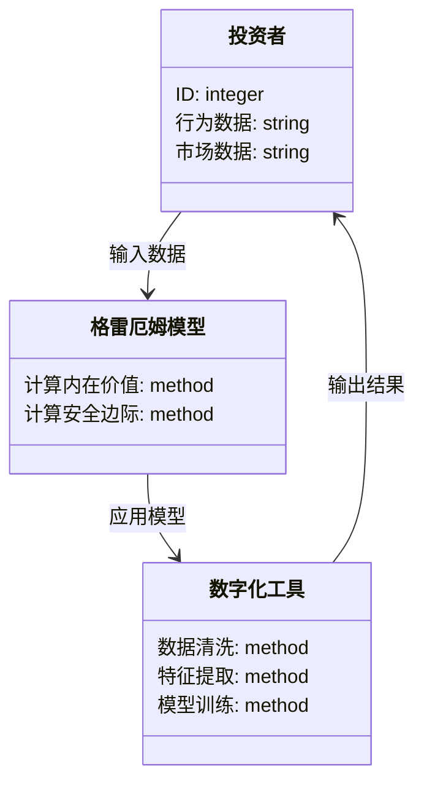
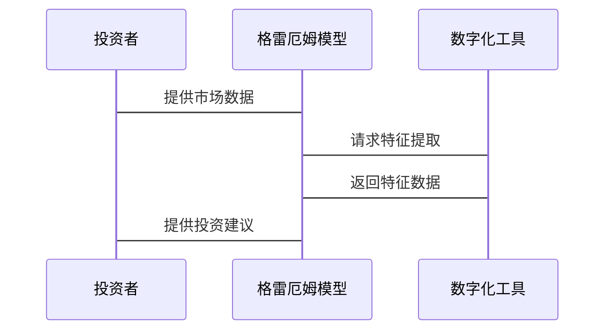

                 


# 格雷厄姆特价股票理论对行为经济学的数字化补充

> 关键词：格雷厄姆投资理论，行为经济学，数字工具，股票分析，心理偏差

> 摘要：本文探讨了如何将格雷厄姆的特价股票理论与行为经济学相结合，并通过数字化工具进行补充。文章详细分析了传统投资理论的局限性，行为经济学对投资者心理的影响，以及如何利用现代技术优化投资决策。通过系统设计和算法实现，展示了如何将理论转化为实践，提升投资效率和准确性。

---

## 第一部分：背景介绍

### 第1章：格雷厄姆特价股票理论的起源与核心思想

#### 1.1 问题背景
- **投资市场的不确定性与风险**：股票市场受多种因素影响，投资者需应对波动和不确定性。
- **格雷厄姆投资理论的提出背景**：本杰明·格雷厄姆是价值投资之父，强调寻找被低估的股票。
- **行为经济学的基本概念**：研究投资者心理和行为偏差，如过度自信、从众心理等。

#### 1.2 问题描述
- **投资者决策中的心理偏差**：认知偏差和情绪影响投资决策，导致非理性行为。
- **格雷厄姆理论的局限性**：传统方法忽视投资者心理，难以应对市场变化。
- **行为经济学的补充作用**：通过理解投资者行为，优化决策过程。

#### 1.3 问题解决
- **格雷厄姆理论的核心原则**：寻找安全边际，即股票价格低于其内在价值。
- **行为经济学的应用**：识别和纠正心理偏差，提升决策质量。
- **数字化工具的整合**：利用算法和大数据分析，优化投资策略。

#### 1.4 边界与外延
- **格雷厄姆理论的适用范围**：适用于长期价值投资，不考虑短期波动。
- **行为经济学的边界**：适用于解释投资者行为，不直接指导投资策略。
- **数字化补充的潜力**：通过技术手段提升理论应用效果，扩大其影响力。

## 第二部分：核心概念与联系

### 第2章：格雷厄姆理论与行为经济学的核心原理

#### 2.1 核心概念原理
- **格雷厄姆的内在价值计算**：通过基本面分析确定股票的真实价值。
- **行为经济学中的心理偏差**：认知偏差如确认偏差、锚定效应等影响投资决策。

#### 2.2 核心概念属性对比
| 核心概念 | 格雷厄姆理论 | 行为经济学 | 数字化补充 |
|----------|--------------|------------|------------|
| 视角     | 价值导向     | 心理驱动   | 数据驱动   |
| 时间跨度 | 长期视角     | 短期波动   | 实时反馈   |
| 方法     | 基本面分析   | 行为分析   | 算法优化   |

#### 2.3 ER实体关系图
```mermaid
er
  actor 投资者
  actor 行为数据
  actor 市场数据
  actor 格雷厄姆模型
  actor 数字化工具
  relation 参与
  relation 输入
  relation 输出
  relation 应用
```

## 第三部分：算法原理

### 第3章：格雷厄姆理论的数字化实现

#### 3.1 算法流程
```mermaid
graph TD
    start((开始)) --> input((数据输入))
    input --> data_clean((数据清洗))
    data_clean --> feature_extract((特征提取))
    feature_extract --> model_train((模型训练))
    model_train --> result((结果输出))
    result --> end((结束))
```

#### 3.2 Python代码示例
```python
# 数据清洗示例
def clean_data(data):
    # 删除缺失值
    data = data.dropna()
    # 处理异常值
    data = data[~(data['price'] > data['price'].quantile(0.99))]
    return data

# 特征提取示例
def extract_features(data):
    features = []
    for index, row in data.iterrows():
        # 计算市盈率
        pe = row['price'] / row['earnings']
        # 计算安全边际
        margin_of_safety = row['intrinsic_value'] - row['price']
        features.append({
            'id': index,
            'pe': pe,
            'margin_of_safety': margin_of_safety
        })
    return features

# 模型训练示例
from sklearn.linear_model import LinearRegression

def train_model(features, labels):
    model = LinearRegression()
    model.fit(features, labels)
    return model
```

#### 3.3 数学模型与公式
- **内在价值计算**：
  $$ V = \frac{E}{k} $$
  其中，\( E \) 是预期收益，\( k \) 是折现率。

- **安全边际计算**：
  $$ S = V - P $$
  其中，\( S \) 是安全边际，\( P \) 是当前股价。

- **收益计算**：
  $$ R = \frac{P_{t+1} - P_t}{P_t} $$

## 第四部分：系统分析与架构设计

### 第4章：系统架构与交互流程

#### 4.1 系统架构设计


#### 4.2 系统交互流程


## 第五部分：项目实战

### 第5章：环境安装与系统实现

#### 5.1 环境安装
```bash
pip install numpy pandas scikit-learn mermaid
```

#### 5.2 核心功能实现
```python
# 核心功能实现：计算安全边际
def calculate_margin_of_safety(data):
    data['intrinsic_value'] = data['earnings'] * (data['price'] / data['pe'].mean())
    data['margin_of_safety'] = data['intrinsic_value'] - data['price']
    return data
```

#### 5.3 案例分析
- 案例：分析某公司的股票数据，计算其安全边际，评估投资价值。

## 第六部分：总结与展望

### 第6章：总结与展望

#### 6.1 总结
- 本文结合格雷厄姆理论和行为经济学，提出数字化补充方案。
- 通过系统设计和算法实现，优化投资决策过程。

#### 6.2 未来展望
- 结合更多行为经济学理论，如 prospect theory。
- 引入机器学习技术，提升预测准确性。
- 探索实时数据分析，提供动态投资建议。

#### 6.3 最佳实践 tips
- 定期回顾投资组合，评估安全边际。
- 结合市场环境，调整投资策略。
- 利用技术工具，辅助投资决策。

---

作者：AI天才研究院 & 禅与计算机程序设计艺术

