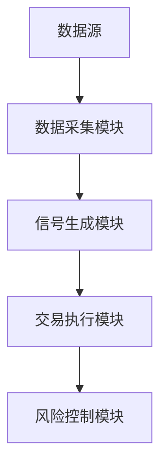
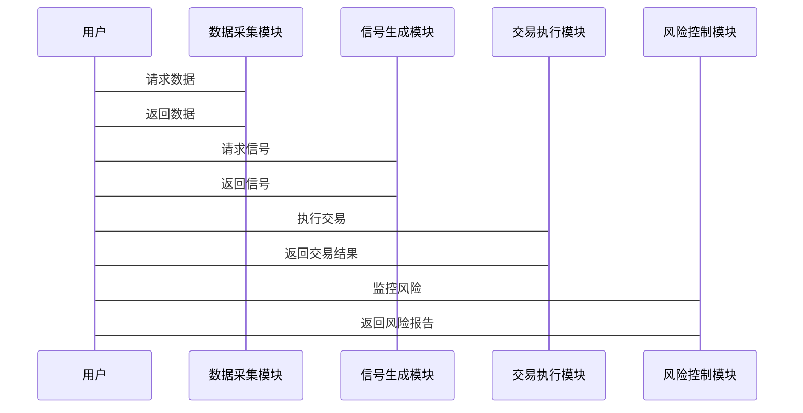

                 


# 格雷厄姆特价股票理论对高频量化交易的影响

> 关键词：格雷厄姆投资理论、特价股票、高频交易、量化交易、算法交易

> 摘要：格雷厄姆的价值投资理论强调寻找被市场低估的股票，而高频量化交易则依赖算法在极短时间内进行大量交易。本文探讨了格雷厄姆理论对高频量化交易策略和算法的影响，分析了两者在投资决策中的结合与冲突，以及对现代金融市场的影响。

---

# 第一部分: 格雷厄姆特价股票理论与高频量化交易的背景

## 第1章: 格雷厄姆特价股票理论概述

### 1.1 格雷厄姆投资理论的核心概念

#### 1.1.1 价值投资的定义与原则
价值投资是一种以股票的内在价值为导向的投资策略，强调以低于内在价值的价格买入股票。格雷厄姆在他的著作《证券分析》中提出，股票的价值应基于其财务报表中的各项指标，包括盈利能力、资产质量、偿债能力等。

#### 格雷厄姆投资理论的核心原则：
- **安全边际**：买入价格远低于内在价值，以降低投资风险。
- **长期视角**：关注企业的长期价值，而非短期市场波动。
- **分散投资**：通过投资于多个低估股票来降低风险。

#### 1.1.2 特价股票的识别标准
格雷厄姆提出的“特价股票”是指那些市场价格远低于其内在价值的股票。他提出了以下识别标准：
- **低市盈率（P/E）**：市盈率低于市场平均水平。
- **低市净率（P/B）**：市净率低于行业平均水平。
- **高股息率**：股息率远高于市场平均水平。
- **低债务比率**：企业债务负担较低，财务风险较小。

#### 1.1.3 格雷厄姆投资策略的历史影响
格雷厄姆的价值投资理论对巴菲特等投资大师产生了深远影响，成为价值投资的基石。他的理论不仅适用于长期投资者，也在高频量化交易中提供了新的思路。

### 1.2 高频量化交易的基本概念

#### 1.2.1 高频交易的定义与特点
高频交易是指利用计算机算法在极短的时间内进行大量交易的策略。其特点是：
- **高速**：交易速度以毫秒为单位。
- **高频**：每天交易次数可达数千次甚至数万次。
- **自动化**：完全依赖算法自动执行交易。

#### 1.2.2 量化交易的技术基础
量化交易依赖于复杂的数学模型和算法，主要技术包括：
- **算法交易**：基于数学模型生成交易信号。
- **高频数据分析**：处理大量实时市场数据。
- **低延迟技术**：优化交易系统的响应时间。

#### 1.2.3 高频交易对市场的潜在影响
高频交易可以提高市场的流动性和价格发现效率，但也可能引发市场波动和闪崩事件。

### 1.3 格雷厄姆理论与高频交易的联系

#### 1.3.1 价值投资与高频交易的结合点
格雷厄姆的理论为高频交易提供了基本面分析的框架，而高频交易则为格雷厄姆理论提供了快速执行的工具。

#### 1.3.2 格雷厄姆理论在高频交易中的应用潜力
高频交易可以通过算法快速识别市场中被低估的股票，执行买入策略，从而实现短期套利。

#### 1.3.3 两者的对比与融合
格雷厄姆理论注重长期价值，而高频交易注重短期价格波动。两者的结合需要平衡长期价值与短期机会。

---

## 第2章: 格雷厄姆特价股票理论的核心要素

### 2.1 股票内在价值的计算方法

#### 2.1.1 格雷厄姆计算内在价值的公式
格雷厄姆提出的企业内在价值可以通过以下公式计算：
$$
\text{内在价值} = \text{息税折旧摊销前利润（EBIT）} \times (4.25 \times \text{折现率})
$$
其中，折现率通常取8.5%至10.5%之间。

#### 2.1.2 财务指标分析的重要性
格雷厄姆特别关注以下财务指标：
- **市盈率（P/E）**：股价与每股收益的比率。
- **市净率（P/B）**：股价与每股净资产的比率。
- **股息率**：股息与股价的比率。

#### 2.1.3 市盈率与市净率的比较
市盈率适用于盈利稳定的公司，而市净率适用于资产密集型公司。两者结合可以更全面地评估股票价值。

### 2.2 投资安全边际的概念

#### 2.2.1 安全边际的定义
安全边际是指股票市场价格低于其内在价值的部分，公式为：
$$
\text{安全边际} = \text{内在价值} - \text{市场价格}
$$

#### 2.2.2 安全边际的计算方法
安全边际可以通过比较市场价与内在价值来确定，确保投资的安全性。

#### 2.2.3 安全边际与风险控制的关系
安全边际越大，投资风险越小，但潜在收益也可能减少。

### 2.3 投资组合的构建策略

#### 2.3.1 分散投资的重要性
通过投资于多个不同行业的股票，降低特定股票风险。

#### 2.3.2 投资组合的优化方法
使用现代投资组合理论（MPT）优化投资组合的风险和收益。

#### 2.3.3 定期调整的必要性
根据市场变化和企业基本面调整投资组合。

---

## 第3章: 高频量化交易的算法原理

### 3.1 高频交易中的算法模型

#### 3.1.1 时间序列分析模型
时间序列分析用于预测股票价格的变化趋势，常用ARIMA模型：
$$
\text{ARIMA}(p, d, q)
$$

#### 3.1.2 机器学习算法在高频交易中的应用
机器学习算法如支持向量机（SVM）和随机森林（RF）可用于分类和回归任务。

#### 3.1.3 基于统计套利的算法
统计套利算法寻找市场中的短期价格偏差，如配对交易策略。

### 3.2 高频交易中的数学模型

#### 3.2.1 市场微观结构模型
市场微观结构模型分析订单簿数据，预测价格变化。

#### 3.2.2 跳价模型与订单簿分析
跳价模型预测价格波动，订单簿分析监控市场深度。

#### 3.2.3 交易成本模型
交易成本包括佣金、滑点和机会成本。

### 3.3 高频交易的算法实现

#### 3.3.1 算法交易的步骤
1. 数据采集：实时获取市场数据。
2. 信号生成：基于算法生成交易信号。
3. 交易执行：自动执行交易指令。
4. 风险控制：监控和管理交易风险。

#### 3.3.2 高频交易算法的优化
优化算法的执行速度和准确性，降低交易成本。

---

## 第4章: 格雷厄姆理论与高频交易的结合

### 4.1 格雷厄姆理论对高频交易的影响

#### 4.1.1 高频交易中的价值投资策略
高频交易可以利用算法快速识别并执行格雷厄姆的特价股票策略。

#### 4.1.2 基于格雷厄姆理论的量化模型
开发量化模型，将格雷厄姆的内在价值计算方法融入高频交易策略。

#### 4.1.3 格雷厄姆理论与高频交易的冲突
高频交易的短期性与格雷厄姆的长期价值投资存在矛盾。

### 4.2 高频交易对格雷厄姆理论的影响

#### 4.2.1 高频交易推动市场效率
高频交易提高了市场的流动性和价格发现效率。

#### 4.2.2 高频交易加剧市场波动
高频交易可能导致市场的短期波动，影响股票的长期价值。

---

## 第5章: 高频量化交易中的系统设计

### 5.1 系统架构设计

#### 5.1.1 系统功能模块
- 数据采集模块：实时获取市场数据。
- 信号生成模块：基于算法生成交易信号。
- 交易执行模块：自动执行交易指令。
- 风险控制模块：监控和管理交易风险。

#### 5.1.2 系统架构图


### 5.2 系统接口设计

#### 5.2.1 数据接口设计
- 数据获取接口：从数据源获取实时数据。
- 数据处理接口：对数据进行清洗和转换。

#### 5.2.2 交易接口设计
- 订单生成接口：生成交易订单。
- 订单执行接口：执行交易订单。

### 5.3 系统交互流程

#### 5.3.1 交易流程


---

## 第6章: 项目实战与案例分析

### 6.1 环境安装与配置

#### 6.1.1 环境要求
- 操作系统：Windows/Mac/Linux
- 编程语言：Python 3.8+
- 库依赖：Pandas、NumPy、Matplotlib、QuantLib

#### 6.1.2 安装步骤
```bash
pip install pandas numpy matplotlib quantlib
```

### 6.2 核心实现与代码

#### 6.2.1 数据获取
```python
import pandas as pd
import numpy as np

# 获取股票数据
data = pd.read_csv('stock_data.csv')
```

#### 6.2.2 信号生成
```python
# 计算内在价值
def calculate_intrinsic_value(data):
    ebit = data['EBIT']
    discount_rate = 0.1
    intrinsic_value = ebit * (4.25 * discount_rate)
    return intrinsic_value

# 生成交易信号
data['Intrinsic Value'] = calculate_intrinsic_value(data)
data['Signal'] = np.where(data['Price'] < data['Intrinsic Value'], 1, 0)
```

#### 6.2.3 交易执行
```python
# 执行交易
positions = []
for i in range(len(data)):
    if data['Signal'].iloc[i] == 1:
        positions.append('Buy')
    else:
        positions.append('Hold')

# 记录交易结果
data['Position'] = positions
```

### 6.3 案例分析

#### 6.3.1 实际案例
假设某股票数据如下：
| 日期 | 价格 | EBIT | 内在价值 |
|------|------|------|----------|
| 2023-10-01 | 50 | 100 | 425 |
| 2023-10-02 | 45 | 100 | 425 |
| 2023-10-03 | 55 | 100 | 425 |

根据格雷厄姆理论，内在价值为425，市场价低于内在价值，生成买入信号。

#### 6.3.2 结果解读
在2023-10-01和2023-10-02，市场价低于内在价值，生成买入信号，投资者在2023-10-03以55元卖出，获利5元。

---

## 第7章: 最佳实践与总结

### 7.1 最佳实践 tips
- **数据质量**：确保数据的准确性和及时性。
- **算法优化**：不断优化算法，提高交易效率。
- **风险控制**：建立完善的风险控制机制，避免重大损失。

### 7.2 小结
格雷厄姆的价值投资理论与高频量化交易的结合，为投资者提供了新的思路。通过算法快速识别低估股票，实现短期套利，同时注重长期价值，平衡风险与收益。

### 7.3 注意事项
- 高频交易的风险较高，需谨慎操作。
- 结合市场环境和企业基本面，制定合理的交易策略。

### 7.4 拓展阅读
- 《证券分析》——本杰明·格雷厄姆
- 《算法交易：取胜秘诀》——拉尔夫·海斯曼

---

作者：AI天才研究院 & 禅与计算机程序设计艺术

