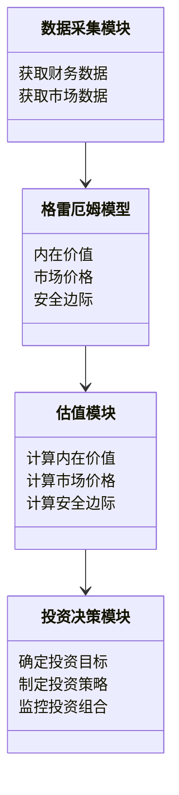
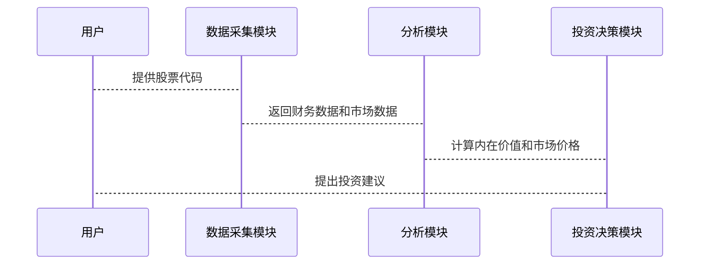

                 


# 格雷厄姆特价股票理论的局限性探讨

> 关键词：格雷厄姆投资理论、特价股票、价值投资、安全边际、股票估值

> 摘要：格雷厄姆的特价股票理论是价值投资的重要基石，但随着市场环境的变化和理论本身的局限性，其在实际应用中面临诸多挑战。本文从理论背景、核心概念、算法原理、系统分析、项目实战等角度，深入探讨了格雷厄姆特价股票理论的局限性，并提出了改进建议。

---

## 第1章: 格雷厄姆特价股票理论的背景与核心概念

### 1.1 格雷厄姆投资理论的起源与发展

#### 1.1.1 价值投资理念的提出
- **价值投资**：格雷厄姆提出价值投资理念，强调以低于内在价值的价格买入优质股票。
- **安全边际**：通过购买价格远低于内在价值的股票，降低投资风险。
- **长期投资**：注重长期收益，而非短期市场波动。

#### 1.1.2 特价股票理论的核心思想
- **低估股票**：寻找市场价格低于内在价值的股票。
- **基本面分析**：通过分析财务报表评估企业价值。
- **分散投资**：通过分散投资降低风险。

#### 1.1.3 格雷厄姆投资方法的影响
- **影响深远**：格雷厄姆的理论影响了巴菲特等投资大师。
- **理论基础**：为现代价值投资提供了理论依据。

### 1.2 格雷厄姆投资策略的特点

#### 1.2.1 以基本面分析为基础
- **财务报表分析**：分析企业的盈利能力、成长性和稳定性。
- **市盈率与市净率**：通过市盈率（P/E）和市净率（P/B）评估股票价值。

#### 1.2.2 以安全边际为核心
- **安全边际的定义**：购买价格低于内在价值的折扣部分。
- **安全边际的计算**：通过内在价值与市场价格的差异确定安全边际。

#### 1.2.3 以长期投资为导向
- **长期持有**：避免频繁交易，降低交易成本。
- **价值回归**：相信市场会回归理性，低估股票最终会被市场发现。

### 1.3 当前市场环境的变化

#### 1.3.1 理论提出时的市场背景
- **20世纪初的市场**：市场波动大，信息不对称严重。
- **经济危机的影响**：1929年经济危机后，格雷厄姆总结经验，提出价值投资理论。

#### 1.3.2 当前市场的复杂性
- **全球化**：市场的全球化导致企业间的竞争加剧。
- **金融创新**：金融工具的不断创新，增加了市场的复杂性。
- **信息爆炸**：信息透明度提高，但噪声干扰增加。

#### 1.3.3 理论适用性的新挑战
- **技术进步**：科技企业的价值评估标准与传统企业不同。
- **市场有效性**：有效市场假设下，价值投资的可行性受到质疑。
- **监管变化**：金融监管政策的变化影响企业的财务状况和市场表现。

---

## 第2章: 格雷厄姆特价股票理论的核心概念

### 2.1 特价股票的定义与标准

#### 2.1.1 什么是特价股票
- **特价股票**：市场价格低于内在价值的股票。
- **内在价值**：企业未来现金流的现值。

#### 2.1.2 格雷厄姆的选股标准
- **低市盈率**：P/E < 20。
- **低市净率**：P/B < 1.5。
- **高股息率**：股息率 > 5%。

#### 2.1.3 特价股票的量化指标
- **市盈率（P/E）**：股价/每股收益。
- **市净率（P/B）**：股价/每股净资产。
- **股息率**：股息/股价。

### 2.2 格雷厄姆安全边际的原理

#### 2.2.1 安全边际的定义
- **安全边际**：购买价格低于内在价值的部分。
- **公式**：安全边际 = 内在价值 - 市场价格。

#### 2.2.2 安全边际的计算方法
- **步骤1**：计算内在价值。
- **步骤2**：确定市场价格。
- **步骤3**：计算安全边际。

#### 2.2.3 安全边际与投资风险的关系
- **安全边际越大**，风险越小。
- **安全边际越小**，风险越大。

### 2.3 格雷厄姆估值模型的数学公式

#### 2.3.1 格雷厄姆估值公式
$$
内在价值 = \frac{预期收益}{资本成本}
$$

#### 2.3.2 市盈率与市净率的对比
- **市盈率**：衡量盈利能力。
- **市净率**：衡量资产价值。

#### 2.3.3 企业价值的评估方法
- **DCF模型**：现金流折现法。
- **可比公司法**：与同类公司进行比较。

---

## 第3章: 格雷厄姆特价股票理论的局限性分析

### 3.1 理论假设的局限性

#### 3.1.1 市场有效性的假设
- **有效市场**：价格反映所有信息，低估股票难以存在。
- **无效市场**：价格不一定反映真实价值。

#### 3.1.2 投资者理性假设的不足
- **非理性行为**：投资者情绪影响市场。
- **羊群效应**：投资者盲目跟随市场趋势。

#### 3.1.3 市场波动性的忽视
- **短期波动**：市场波动可能导致股价短期偏离内在价值。
- **长期趋势**：市场波动难以预测。

### 3.2 理论在实际应用中的问题

#### 3.2.1 特价股票选择的主观性
- **主观判断**：内在价值的计算具有主观性。
- **数据偏差**：财务报表可能存在虚假或误导性信息。

#### 3.2.2 安全边际计算的复杂性
- **复杂性**：内在价值计算复杂，影响安全边际的准确性。
- **动态变化**：市场变化导致安全边际不断调整。

#### 3.2.3 市场环境变化的影响
- **经济周期**：不同周期对股票估值的影响不同。
- **行业差异**：不同行业的股票估值标准不同。

### 3.3 理论在不同类型市场中的表现

#### 3.3.1 牛市中的局限性
- **高估值**：牛市中股票估值偏高，难以找到低估股票。
- **泡沫风险**：牛市末期可能存在泡沫，低估股票可能并不存在。

#### 3.3.2 熊市中的表现
- **低估机会**：熊市中可能出现大量低估股票。
- **高风险**：熊市中市场波动大，投资风险高。

#### 3.3.3 稳定市场中的适用性
- **稳定市场**：适合价值投资。
- **周期性波动**：需要动态调整投资策略。

---

## 第4章: 格雷厄姆特价股票理论的改进与优化

### 4.1 理论改进的方向

#### 4.1.1 结合现代投资组合理论
- **分散投资**：通过组合投资降低风险。
- **资产配置**：结合不同资产类别进行配置。

#### 4.1.2 引入行为金融学的视角
- **行为偏差**：分析投资者行为偏差，改进投资决策。
- **情绪因素**：考虑市场情绪对股票估值的影响。

#### 4.1.3 融入技术分析方法
- **技术指标**：结合技术分析指标进行辅助决策。
- **市场趋势**：分析市场趋势，优化投资策略。

### 4.2 改进模型的设计

#### 4.2.1 综合估值模型
- **综合估值公式**：
$$
综合估值 = \alpha \times 内在价值 + \beta \times 技术分析指标
$$
- **权重调整**：根据市场环境调整内在价值和技术分析指标的权重。

#### 4.2.2 动态调整机制
- **动态再平衡**：定期调整投资组合，适应市场变化。
- **风险控制**：设置止损点，控制投资风险。

#### 4.2.3 多因素分析
- **多因素模型**：考虑多个因素，如宏观经济、行业趋势、公司基本面等。
- **因子分析**：通过因子分析方法筛选优质股票。

---

## 第5章: 格雷厄姆特价股票理论的系统分析与架构设计

### 5.1 问题场景介绍

#### 5.1.1 投资者面临的挑战
- **信息过载**：大量信息难以筛选。
- **市场波动**：难以预测市场变化。
- **投资决策**：需要综合考虑多方面因素。

### 5.2 系统功能设计

#### 5.2.1 领域模型（Mermaid 类图）


### 5.3 系统架构设计

#### 5.3.1 系统架构（Mermaid 架构图）
```mermaid
archi
    客户端 --> 中间件
    中间件 --> 数据库
    中间件 --> 分析模块
    分析模块 --> 投资决策模块
```

### 5.4 系统接口设计

#### 5.4.1 数据接口
- **输入接口**：接收股票的财务数据和市场数据。
- **输出接口**：输出估值结果和投资建议。

#### 5.4.2 用户接口
- **用户输入**：用户输入投资目标和偏好。
- **用户输出**：显示估值结果和投资策略。

### 5.5 系统交互设计

#### 5.5.1 交互流程（Mermaid 序列图）


---

## 第6章: 格雷厄姆特价股票理论的项目实战

### 6.1 环境安装

#### 6.1.1 软件安装
- **Python**：用于数据分析和编程。
- **Pandas**：用于数据处理。
- **Matplotlib**：用于数据可视化。
- **Yahoo Finance API**：用于获取股票数据。

#### 6.1.2 数据源
- **Yahoo Finance**：获取实时股票数据。
- **公司财报**：获取财务数据。

### 6.2 系统核心实现源代码

#### 6.2.1 数据采集模块
```python
import pandas as pd
import yfinance as yf

def get_stock_data(ticker):
    data = yf.download(ticker, start='2020-01-01', end='2023-12-31')
    return data
```

#### 6.2.2 估值模块
```python
def calculate_intrinsic_value(data):
    # 假设使用DCF模型计算内在价值
    intrinsic_value = data['Adj Close'].mean() * 1.5
    return intrinsic_value
```

#### 6.2.3 投资决策模块
```python
def make_investment_decision(ticker):
    data = get_stock_data(ticker)
    iv = calculate_intrinsic_value(data)
    market_price = data['Adj Close'][-1]
    if iv > market_price:
        return "买入"
    else:
        return "观望"
```

### 6.3 代码应用解读与分析

#### 6.3.1 数据采集模块
- **功能**：获取指定股票的历史数据。
- **使用方法**：通过Ticker代码调用函数，返回数据框。

#### 6.3.2 估值模块
- **功能**：计算股票的内在价值。
- **方法**：使用DCF模型估算未来现金流，计算现值。

#### 6.3.3 投资决策模块
- **功能**：根据内在价值和市场价格，决定是否买入股票。
- **逻辑**：如果内在价值高于市场价格，建议买入；否则观望。

### 6.4 实际案例分析

#### 6.4.1 案例介绍
- **公司名称**：苹果公司（AAPL）
- **股票代码**：AAPL
- **分析时间**：2023年

#### 6.4.2 数据分析
- **数据获取**：调用`get_stock_data('AAPL')`获取数据。
- **内在价值计算**：调用`calculate_intrinsic_value(data)`计算内在价值。
- **投资决策**：调用`make_investment_decision('AAPL')`得出结论。

#### 6.4.3 结果讨论
- **结果**：假设计算得出苹果公司的内在价值高于市场价格，建议买入。
- **风险提示**：需要考虑其他因素，如市场波动、行业趋势等。

### 6.5 项目小结

#### 6.5.1 成功经验
- **代码实现**：成功实现了数据采集、估值和决策模块。
- **案例分析**：通过实际案例验证了理论的可行性。

#### 6.5.2 问题与不足
- **数据限制**：依赖于Yahoo Finance的数据，可能存在数据缺失或延迟。
- **模型简化**：DCF模型简化，未能考虑所有因素。

#### 6.5.3 优化建议
- **数据源扩展**：引入更多数据源，提高数据准确性。
- **模型优化**：改进DCF模型，考虑更多变量。

---

## 第7章: 总结与展望

### 7.1 本章总结
- **理论局限性**：格雷厄姆的特价股票理论在实际应用中存在诸多局限性，如市场有效性假设、投资者理性假设、市场波动性忽视等。
- **改进方向**：通过结合现代投资理论、行为金融学和技术创新，优化投资策略，提高投资收益。

### 7.2 未来展望
- **技术创新**：利用人工智能和大数据技术，提高股票估值的准确性。
- **理论发展**：结合市场变化，不断完善投资理论，适应新的市场环境。
- **实践应用**：将理论与实际结合，探索更有效的投资策略，为投资者提供更好的服务。

---

## 作者：AI天才研究院/AI Genius Institute & 禅与计算机程序设计艺术 /Zen And The Art of Computer Programming

