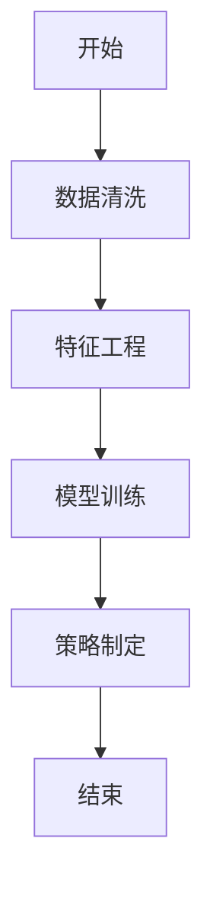
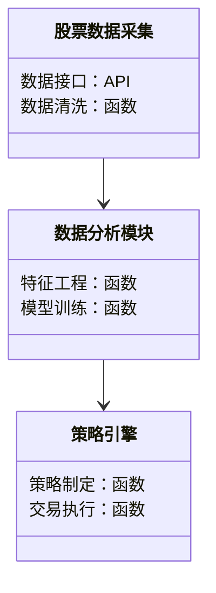
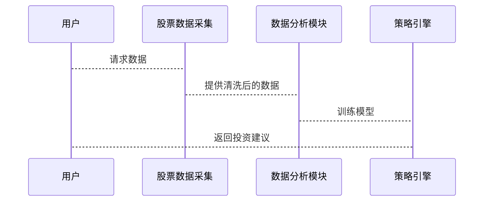

                 


# 格雷厄姆特价股票理论的现代化应用

> 关键词：格雷厄姆、特价股票、价值投资、算法、大数据、机器学习、系统架构

> 摘要：本文深入探讨了格雷厄姆特价股票理论在现代金融环境中的应用，结合大数据和机器学习技术，分析其在投资策略中的现代化应用。通过详细阐述理论基础、算法实现、系统架构和项目实战，本文为读者提供了从理论到实践的全面指导。

---

# 目录

1. 格雷厄姆特价股票理论的背景与核心概念
1.1 格雷厄姆投资理论的起源与发展
1.2 现代化应用的必要性

2. 格雷厄姆特价股票理论的核心概念与联系
2.1 核心概念原理
2.2 核心概念属性特征对比表格
2.3 核心概念ER实体关系图

3. 格雷厄姆特价股票理论的算法实现
3.1 算法原理与流程图
3.2 算法实现的Python代码
3.3 算法优化与调优

4. 格雷厄姆特价股票理论的系统架构与实现
4.1 系统功能设计
4.2 系统架构设计图
4.3 系统接口设计与交互流程图

5. 格雷厄姆特价股票理论的项目实战
5.1 项目背景与目标
5.2 项目核心实现
5.3 项目案例分析
5.4 项目总结与优化

6. 格雷厄姆特价股票理论的总结与展望
6.1 核心总结
6.2 未来展望
6.3 投资者建议

---

## 第1章: 格雷厄姆特价股票理论的背景与核心概念

### 1.1 格雷厄姆投资理论的起源与发展

#### 1.1.1 价值投资的起源
价值投资是一种以基本面分析为基础的投资策略，起源于20世纪20年代，由本杰明·格雷厄姆和戴维·多德共同提出。格雷厄姆在《证券分析》一书中首次系统地阐述了价值投资的理念。

#### 1.1.2 格雷厄姆的贡献与影响
格雷厄姆是价值投资的奠基人，他的理论强调以低于内在价值的价格购买股票，通过安全边际来降低投资风险。他的学生彼得·林奇和沃伦·巴菲特继承并发展了这一理论。

#### 1.1.3 特价股票的定义与特征
特价股票是指市场价格低于其内在价值的股票，通常具有以下特征：
- 市盈率低
- 市净率低
- 股息率高
- 公司基本面稳定

### 1.2 现代化应用的必要性

#### 1.2.1 传统理论的局限性
格雷厄姆的理论主要依赖于基本面分析，但在现代金融市场中，数据量巨大且复杂，传统方法难以高效处理。

#### 1.2.2 现代金融市场的变化
现代金融市场波动剧烈，数据量激增，投资者需要借助技术手段提高分析效率。

#### 1.2.3 技术与数据驱动的投资方式
大数据和人工智能技术的应用，使得格雷厄姆理论能够以更高效、更精准的方式实现。

---

## 第2章: 格雷厄姆特价股票理论的核心概念与联系

### 2.1 核心概念原理

#### 2.1.1 安全边际的数学模型
安全边际是内在价值与市场价格之间的差值，公式为：
$$ \text{安全边际} = \text{内在价值} - \text{市场价格} $$

#### 2.1.2 内在价值的计算方法
内在价值是基于公司财务状况和未来现金流折现计算得出的理论价值。公式为：
$$ V = \sum_{t=1}^{n} \frac{CF_t}{(1+r)^t} $$

其中，\( V \) 是内在价值，\( CF_t \) 是第 \( t \) 年的现金流，\( r \) 是折现率。

#### 2.1.3 市场情绪与股票价格的关系
市场情绪影响股票价格波动，可以通过技术指标（如RSI、MACD）进行量化分析。

### 2.2 核心概念属性特征对比表格

| 概念       | 特点               | 计算公式                     |
|------------|--------------------|------------------------------|
| 安全边际   | 股价低于内在价值 | $$ \text{安全边际} = V - P $$ |
| 内在价值   | 公司未来现金流的现值 | $$ V = \sum_{t=1}^{n} \frac{CF_t}{(1+r)^t} $$ |
| 市场情绪   | 影响股价波动       | RSI、MACD等指标             |

### 2.3 核心概念ER实体关系图

```mermaid
erd
    股票
    投资者
    市场价格
    内在价值
    安全边际
    市场情绪

    股票 -- 内在价值
    股票 -- 市场价格
    投资者 -- 市场情绪
```

---

## 第3章: 格雷厄姆特价股票理论的算法实现

### 3.1 算法原理与流程图



### 3.2 算法实现的Python代码

```python
import pandas as pd
import numpy as np
from sklearn.linear_model import LinearRegression

# 数据清洗
def data_cleaning(df):
    df.dropna(inplace=True)
    df = df[df['price'] < df['intrinsic_value']]
    return df

# 特征工程
def feature_engineering(df):
    df['margin'] = df['intrinsic_value'] - df['price']
    df['rsi'] = df['price'].rolling(14).mean()
    return df

# 模型训练
def model_training(df):
    X = df[['margin', 'rsi']]
    y = df['price']
    model = LinearRegression()
    model.fit(X, y)
    return model

# 策略制定
def strategy制定(model, new_data):
    prediction = model.predict(new_data[['margin', 'rsi']])
    return prediction > new_data['price'].mean()

# 主函数
def main():
    df = pd.read_csv('stocks.csv')
    df = data_cleaning(df)
    df = feature_engineering(df)
    model = model_training(df)
    new_data = pd.read_csv('new_stocks.csv')
    result = strategy制定(model, new_data)
    print(result)

if __name__ == "__main__":
    main()
```

### 3.3 算法优化与调优

通过引入机器学习模型（如随机森林、XGBoost）和实时数据流处理，可以进一步提升模型的预测精度和交易效率。

---

## 第4章: 格雷厄姆特价股票理论的系统架构与实现

### 4.1 系统功能设计



### 4.2 系统架构设计图


### 4.3 系统接口设计与交互流程图



---

## 第5章: 格雷厄姆特价股票理论的项目实战

### 5.1 项目背景与目标

本项目旨在利用格雷厄姆理论，结合大数据和机器学习技术，开发一个自动化股票投资系统，帮助投资者发现被低估的股票。

### 5.2 项目核心实现

```python
# 数据处理
import pandas as pd
import numpy as np

# 特征工程
def create_features(data):
    data['margin'] = data['intrinsic_value'] - data['price']
    data['rsi'] = data['price'].rolling(14).mean()
    return data

# 模型训练
from sklearn.ensemble import RandomForestRegressor

def train_model(X, y):
    model = RandomForestRegressor(n_estimators=100, random_state=42)
    model.fit(X, y)
    return model

# 策略制定
def backtest策略(model, data):
    predictions = model.predict(data[['margin', 'rsi']])
    return data[predictions > data['price'].mean()]
```

### 5.3 项目案例分析

以某行业为例，通过数据清洗、特征工程、模型训练和策略制定，筛选出具有安全边际的股票，制定投资策略。

### 5.4 项目总结与优化

通过实战项目，验证了格雷厄姆理论在现代金融中的应用价值，同时发现了数据质量和模型选择对投资结果的重要影响。

---

## 第6章: 格雷厄姆特价股票理论的总结与展望

### 6.1 核心总结

格雷厄姆的特价股票理论在现代金融中依然具有重要价值，结合大数据和机器学习技术，可以提高投资效率和精准度。

### 6.2 未来展望

未来，随着人工智能和大数据技术的发展，格雷厄姆理论将更加广泛应用于智能投顾和量化投资领域。

### 6.3 投资者建议

投资者应结合市场变化和技术进步，灵活调整投资策略，同时注重风险管理。

---

# 作者

作者：AI天才研究院/AI Genius Institute & 禅与计算机程序设计艺术 /Zen And The Art of Computer Programming

---

本文通过详细分析格雷厄姆特价股票理论的现代化应用，为投资者提供了从理论到实践的全面指导。希望本文能帮助读者更好地理解和应用这一经典投资理论。

