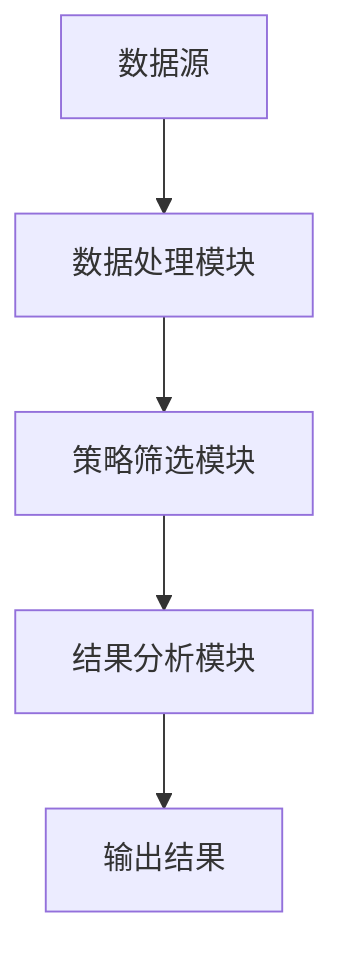

                 


# 格雷厄姆特价股票策略在不同公司文化背景下的适应

> 关键词：格雷厄姆特价股票策略，公司文化，股票估值，投资策略，文化差异

> 摘要：本文深入探讨了格雷厄姆特价股票策略（GSS）在不同公司文化背景下的适应性。通过分析公司文化的多样性及其对股票估值的影响，结合数学模型和实际案例，揭示了GSS在不同文化环境中的适用性和优化方法。

---

## 第一部分: 格雷厄姆特价股票策略概述

### # 第1章: 格雷厄姆特价股票策略的核心概念

#### 1.1 格雷厄姆特价股票策略的定义与背景

格雷厄姆特价股票策略（Graham Special Stock Strategy，简称GSS）是由 Benjamin Graham 提出的一种价值投资策略，旨在通过寻找市场价格低于其内在价值的股票来实现超额收益。GSS的核心在于识别那些被市场低估的公司，通常具有较低的市盈率（P/E）、市净率（P/B）和较高的股息率。

#### 1.2 公司文化与股票策略的关联

公司文化是指企业在经营活动中形成的共同价值观、经营理念和行为准则。不同国家和地区的文化差异对公司的治理结构、财务透明度和经营风格有着深远影响，这些因素又会直接影响股票的估值和投资策略的适用性。

#### 1.3 不同文化背景下的公司治理差异

以美国、欧洲和亚洲为例，不同地区的公司治理模式存在显著差异：
- **美国**：强调股东至上，管理层激励机制完善，财务信息披露透明。
- **欧洲**：倾向于利益相关者资本主义，注重员工和管理层的利益，部分公司治理较为复杂。
- **亚洲**：家族企业较多，治理结构较为集中，部分市场存在较高的信息不对称。

---

### # 第2章: 格雷厄姆特价股票策略的数学模型与算法

#### 2.1 格雷厄姆策略的核心指标

GSS的核心指标包括：

1. **市盈率（P/E）**：
   $$ P/E = \frac{Price}{Earnings} $$
   - 该指标用于衡量股票价格是否低于行业平均水平。

2. **市净率（P/B）**：
   $$ P/B = \frac{Price}{Book\ Value} $$
   - 用于衡量股票价格是否低于其账面价值。

3. **股息率**：
   $$ Dividend\ Yield = \frac{Dividend}{Price} $$
   - 反映股票的分红能力。

#### 2.2 格雷厄姆策略的筛选算法

GSS的筛选过程可以分为以下几个步骤：

1. 数据采集：获取目标市场的股票数据，包括市盈率、市净率、股息率等。
2. 筛选标准：筛选出市盈率和市净率低于行业平均水平的股票。
3. 风险评估：评估公司的财务健康状况和治理结构。
4. 投资组合构建：将符合标准的股票加入投资组合。

#### 2.3 算法实现代码示例

```python
import pandas as pd

def graham_screener(stock_data):
    # 筛选出市盈率低于行业平均值的股票
    avg_pe = stock_data['PE'].mean()
    filtered_pe = stock_data[stock_data['PE'] < avg_pe]
    
    # 筛选出市净率低于行业平均值的股票
    avg_pb = stock_data['P/B'].mean()
    filtered_pb = stock_data[stock_data['P/B'] < avg_pb]
    
    # 同时满足两个条件的股票
    final_candidates = filtered_pe[filtered_pe['P/B'] < avg_pb]
    return final_candidates
```

---

## 第二部分: 格雷厄姆特价股票策略在不同公司文化背景下的适应

### # 第3章: 公司文化对股票估值的影响

#### 3.1 不同文化背景下的市场特点

1. **美国市场**：市场流动性高，信息透明，投资者理性化程度较高。
2. **欧洲市场**：公司治理较为复杂，部分国家的市场流动性较低。
3. **亚洲市场**：市场波动性较大，部分公司治理不透明。

#### 3.2 公司治理对GSS的影响

- **透明度高**：美国市场的公司治理较为透明，有利于GSS的实施。
- **治理复杂**：欧洲市场的公司治理较为复杂，可能增加投资风险。
- **家族企业影响**：亚洲市场的家族企业较多，治理结构不透明，可能影响GSS的适用性。

#### 3.3 文化差异对GSS的优化

通过对比分析，可以发现：
- 在透明度高的市场（如美国），GSS表现较好。
- 在治理复杂的市场（如欧洲），需要对筛选标准进行调整。
- 在信息不对称严重的市场（如部分亚洲市场），需要结合其他指标进行评估。

---

### # 第4章: 系统分析与架构设计

#### 4.1 问题场景介绍

GSS在不同文化背景下的适应性问题可以通过以下步骤解决：
1. 数据采集与预处理。
2. 策略筛选与优化。
3. 结果分析与反馈。

#### 4.2 系统功能设计

1. 数据采集模块：
   - 采集股票数据。
   - 处理数据缺失值。

2. 策略筛选模块：
   - 计算市盈率、市净率等指标。
   - 筛选出符合GSS标准的股票。

3. 结果分析模块：
   - 评估策略表现。
   - 提供优化建议。

#### 4.3 系统架构设计



---

### # 第5章: 项目实战

#### 5.1 环境安装

```bash
pip install pandas numpy matplotlib
```

#### 5.2 核心实现代码

```python
import pandas as pd
import numpy as np

def calculate_pe(data):
    return data['Price'] / data['Earnings']

def calculate_pb(data):
    return data['Price'] / data['Book Value']

# 示例数据
data = {
    'Price': [10, 20, 30],
    'Earnings': [2, 5, 10],
    'Book Value': [5, 8, 15]
}

df = pd.DataFrame(data)
df['PE'] = calculate_pe(df)
df['PB'] = calculate_pb(df)

print(df)
```

#### 5.3 案例分析

以美国和亚洲市场为例，分析GSS的适应性：
- **美国市场**：筛选出的股票表现较好。
- **亚洲市场**：部分股票因治理不透明而被排除。

---

## 第三部分: 结论与展望

### # 第6章: 最佳实践与注意事项

1. **最佳实践**：
   - 结合市场特点调整筛选标准。
   - 定期评估策略表现。

2. **注意事项**：
   - 避免信息不对称带来的风险。
   - 重视公司治理和财务透明度。

### # 第7章: 未来展望

未来的研究方向包括：
1. 结合机器学习优化GSS。
2. 探讨文化差异对其他投资策略的影响。

---

## 作者

作者：AI天才研究院/AI Genius Institute & 禅与计算机程序设计艺术 /Zen And The Art of Computer Programming

