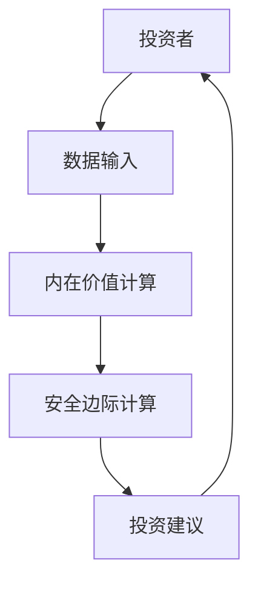

                 


# 格雷厄姆特价股票策略在不同公司生命周期阶段的效果

> 关键词：格雷厄姆策略，价值投资，公司生命周期，内在价值，安全边际

> 摘要：本文详细探讨了格雷厄姆特价股票策略在不同公司生命周期阶段中的应用效果。通过对初创期、成长期、成熟期和衰退期公司的分析，揭示了格雷厄姆策略在不同阶段中的适用性及其优缺点。文章结合数学模型和实际案例，深入分析了格雷厄姆策略的核心原理及其在投资决策中的实际应用，为投资者提供了有益的参考。

---

## 第一部分：引言

### 1.1 背景介绍

格雷厄姆特价股票策略是价值投资的重要组成部分，由本杰明·格雷厄姆提出。该策略强调以低于公司内在价值的价格买入股票，从而在长期实现超额收益。然而，不同公司生命周期阶段的特点会影响格雷厄姆策略的有效性。本文旨在分析该策略在不同阶段中的表现，为投资者提供参考。

### 1.2 核心概念与问题描述

- **价值投资**：买入被市场低估的股票，长期持有以实现收益。
- **内在价值**：公司未来现金流的现值，是股票的合理价格。
- **安全边际**：买入价格与内在价值的差距，提供风险缓冲。

---

## 第二部分：公司生命周期分析

### 2.1 公司生命周期的阶段划分

公司生命周期分为四个阶段：初创期、成长期、成熟期和衰退期。每个阶段的特点和财务表现不同，影响格雷厄姆策略的应用效果。

### 2.2 格雷厄姆策略在不同阶段的适用性

#### 2.2.1 初创期公司

- **特点**：高增长，高风险，财务数据不稳定。
- **策略应用**：内在价值难以准确评估，但可通过安全边际寻找低估机会。
- **优缺点**：潜在高回报，但风险较高。

#### 2.2.2 成长期公司

- **特点**：稳定增长，财务状况改善。
- **策略应用**：内在价值可合理估算，适合买入并持有。
- **优缺点**：回报相对稳定，但估值可能偏高。

#### 2.2.3 成熟期公司

- **特点**：增长放缓，现金流稳定。
- **策略应用**：内在价值较高，适合长期投资。
- **优缺点**：风险较低，回报稳定。

#### 2.2.4 衰退期公司

- **特点**：业务收缩，现金流下降。
- **策略应用**：寻找被市场遗忘的低估股票。
- **优缺点**：风险高，但回报可能丰厚。

---

## 第三部分：格雷厄姆策略的核心原理

### 3.1 内在价值的计算公式

格雷厄姆的内在价值公式基于未来现金流的折现：

$$
\text{内在价值} = \sum_{t=1}^{n} \frac{\text{现金流}_t}{(1 + r)^t}
$$

其中，$r$ 为折现率，$n$ 为预测年数。

### 3.2 安全边际的计算

安全边际 = 内在价值 - 市场价格

---

## 第四部分：系统设计与架构

### 4.1 系统功能设计

- **输入**：公司财务数据、市场数据。
- **输出**：内在价值、安全边际、投资建议。

### 4.2 系统架构图



---

## 第五部分：项目实战

### 5.1 环境安装

安装Python和必要的库（Pandas, NumPy）。

### 5.2 核心代码实现

```python
import pandas as pd
import numpy as np

def calculate_intrinsic_value(FCF, discount_rate, years):
    # 计算未来现金流的现值
    present_value = 0
    for i in range(years):
        present_value += FCF[i] / (1 + discount_rate) ** (i + 1)
    return present_value

# 示例数据
FCF = [100, 150, 200, 250]
discount_rate = 0.1
years = 4

intrinsic_value = calculate_intrinsic_value(FCF, discount_rate, years)
print(f"内在价值：{intrinsic_value}")
```

---

## 第六部分：总结与注意事项

### 6.1 最佳实践

- **长期视角**：格雷厄姆策略适合长期投资者。
- **风险管理**：合理评估安全边际，避免过度冒险。

### 6.2 小结

格雷厄姆策略在不同公司生命周期阶段中表现各异。初创期风险高但回报潜力大，衰退期适合寻找低估机会，成熟期则提供稳定回报。投资者需根据公司所处阶段灵活调整策略。

### 6.3 注意事项

- 避免仅依赖单一指标。
- 结合市场环境和行业趋势进行分析。

### 6.4 拓展阅读

- 格雷厄姆的《 Intelligent Investor 》
- 现代投资组合理论相关书籍

---

## 作者

作者：AI天才研究院/AI Genius Institute & 禅与计算机程序设计艺术 /Zen And The Art of Computer Programming

---

以上是文章的完整结构和内容，涵盖了从理论到实践的各个方面，帮助读者全面理解格雷厄姆策略在不同公司生命周期阶段中的应用效果。

