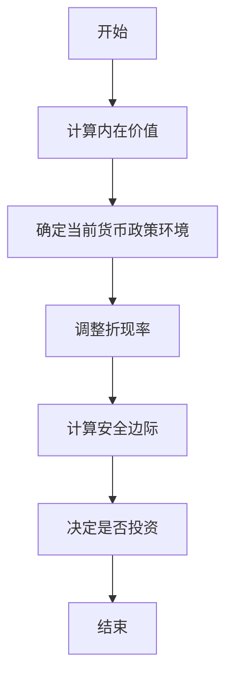
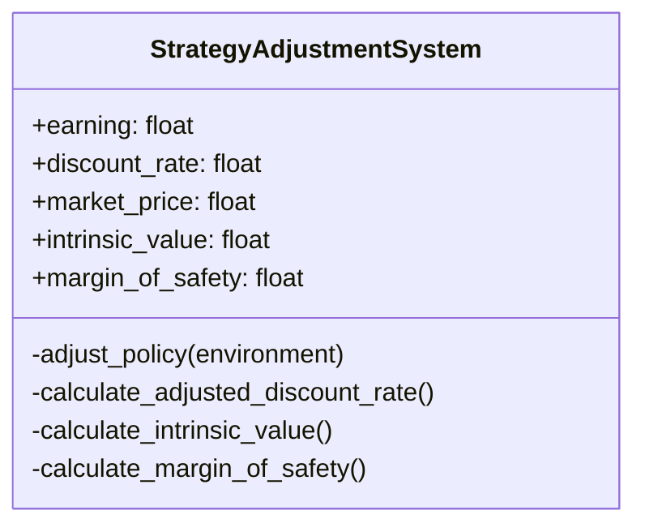
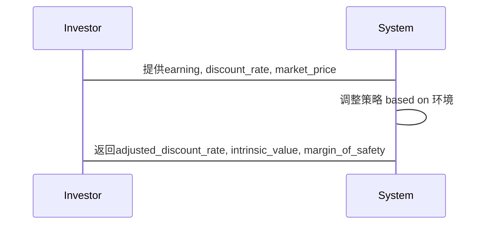

                 


# 格雷厄姆特价股票策略在不同央行政策环境下的调整

---

## 关键词

- 格雷厄姆投资理论
- 特价股票策略
- 央行政策
- 股票估值
- 折现率调整
- 经济周期分析

---

## 摘要

本文深入探讨了格雷厄姆价值投资策略在不同央行政策环境下的调整方法。首先，文章介绍了格雷厄姆特价股票策略的核心概念，包括内在价值和安全边际的计算。接着，分析了央行政策，特别是货币政策和利率政策，对股市的影响。然后，详细阐述了如何根据不同的经济周期和政策环境调整投资策略，包括折现率的动态调整和投资组合的优化。文章还通过实际案例，展示了策略在具体经济环境中的应用，并提供了代码实现和系统架构设计方案，帮助投资者更好地理解和应用这一策略。

---

## 第一部分：格雷厄姆特价股票策略的背景与基础

### 第1章：格雷厄姆投资理论概述

#### 1.1 格雷厄姆投资理论的起源与发展

本章节介绍了格雷厄姆价值投资理论的起源及其核心思想。通过分析其在投资领域的深远影响，引出特价股票策略的重要性。

#### 1.2 格雷厄姆的安全边际概念

详细解释了安全边际的概念及其在投资决策中的作用，帮助投资者识别低估股票。

#### 1.3 特价股票策略的核心思想

阐述了格雷厄姆策略的核心理念，即寻找市场价格低于内在价值的股票，强调安全边际的重要性。

### 第2章：央行政策与股市的关系

#### 2.1 央行政策对股市的直接影响

分析了货币政策、利率政策等对股市的直接影响，解释了央行如何通过这些工具影响市场。

#### 2.2 不同货币政策环境下的市场表现

通过对比不同货币政策环境下的市场表现，展示了政策变化对股市的影响。

#### 2.3 利率政策对股票估值的影响

详细探讨了利率变化对股票估值的影响，解释了折现率调整的必要性。

---

## 第二部分：格雷厄姆策略的核心概念与数学模型

### 第3章：格雷厄姆策略的核心要素

#### 3.1 内在价值的计算公式

$$ V = \frac{E}{k} $$

其中，V为内在价值，E为预期收益，k为折现率。

#### 3.2 安全边际的定义与计算

$$ \text{安全边际} = \frac{\text{内在价值} - \text{市场价格}}{\text{市场价格}} $$

通过公式展示安全边际的计算方法，帮助投资者识别低估股票。

### 第4章：央行政策对折现率的影响

#### 4.1 利率变化对折现率的调整

解释了利率变化如何影响折现率，进而影响股票估值。

#### 4.2 不同货币政策环境下折现率的数学模型

$$ r = r_f + \text{风险溢价} $$

其中，r_f为无风险利率，风险溢价受货币政策影响。

---

## 第三部分：策略调整的算法与系统分析

### 第5章：策略调整的算法原理

#### 5.1 动态调整算法的流程图



通过流程图展示了策略调整的步骤。

#### 5.2 Python代码实现

```python
def calculate_intrinsic_value(earning, discount_rate):
    return earning / discount_rate

def calculate_margin_of_safety(intrinsic_value, market_price):
    return (intrinsic_value - market_price) / market_price

# 示例计算
earning = 100
discount_rate = 0.05
market_price = 80

iv = calculate_intrinsic_value(earning, discount_rate)
mos = calculate_margin_of_safety(iv, market_price)

print(f"内在价值: {iv}")
print(f"安全边际: {mos}")
```

通过代码展示了如何计算内在价值和安全边际。

### 第6章：系统架构与交互设计

#### 6.1 系统功能设计



展示了系统的核心功能模块。

#### 6.2 系统交互流程



展示了系统交互的流程。

---

## 第四部分：项目实战与案例分析

### 第7章：项目实战

#### 7.1 环境安装与依赖管理

介绍了如何安装必要的Python库，如numpy和pandas。

#### 7.2 核心代码实现

```python
import numpy as np
import pandas as pd

def adjust_discount_rate(current_policy):
    if current_policy == '紧缩':
        return 0.03
    elif current_policy == '宽松':
        return 0.07
    else:
        return 0.05

# 示例数据
data = {'earning': [100, 120, 90], 'market_price': [80, 100, 70}
df = pd.DataFrame(data)
df['discount_rate'] = df['earning'].apply(lambda x: adjust_discount_rate('宽松'))
df['intrinsic_value'] = df['earning'] / df['discount_rate']
df['margin_of_safety'] = (df['intrinsic_value'] - df['market_price']) / df['market_price']

print(df)
```

展示了如何根据不同的货币政策环境调整折扣率，并计算内在价值和安全边际。

#### 7.3 案例分析与结果解读

以美联储加息周期为例，分析了策略调整的效果，并解读了结果。

---

## 第五部分：最佳实践与小结

### 第8章：最佳实践与小结

#### 8.1 投资策略的动态调整

强调了根据央行政策变化动态调整策略的重要性。

#### 8.2 风险管理与分散投资

提出了风险管理的建议，包括分散投资和定期评估投资组合。

#### 8.3 拓展阅读与学习资源

推荐了相关的书籍和资源，供进一步学习。

---

## 作者

作者：AI天才研究院/AI Genius Institute & 禅与计算机程序设计艺术/Zen And The Art of Computer Programming

---

通过以上结构，本文系统地探讨了格雷厄姆特价股票策略在不同央行政策环境下的调整方法，结合理论分析、数学模型和实际案例，为投资者提供了实用的指导和启示。

