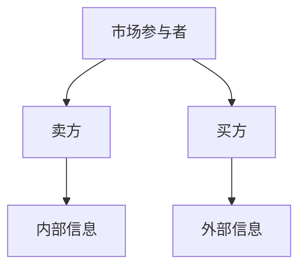
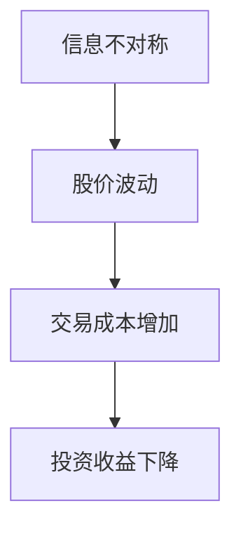

                 

# 格雷厄姆特价股票策略在不同市场信息不对称下的表现

## 关键词：
格雷厄姆投资策略、信息不对称、市场定价、价值投资、安全边际

## 摘要：
本文深入分析了格雷厄姆特价股票策略在不同市场信息不对称环境下的表现。通过探讨信息不对称对股票定价和投资决策的影响，本文揭示了格雷厄姆策略的有效性及其在实际应用中的调整方法。结合数学模型、系统架构和实际案例，本文为投资者提供了在信息不对称市场中优化投资策略的实用见解。

---

# 第1章: 价值投资与信息不对称概述

## 1.1 格雷厄姆投资理论基础

### 1.1.1 价值投资的核心理念
价值投资是一种以低于内在价值的价格购买优质股票的投资策略，强调长期持有和安全边际的重要性。格雷厄姆在其著作《证券分析》中提出，股票的内在价值是其未来现金流的现值，可以通过基本面分析进行估算。

### 1.1.2 格雷厄姆投资策略的定义
格雷厄姆策略的核心在于寻找那些市场价格低于其内在价值的股票，特别是那些具有稳定盈利记录和较强财务状况的公司。这种策略强调安全边际，即市场价格与内在价值之间的差距，以降低投资风险。

### 1.1.3 价值投资与成长投资的区别
价值投资与成长投资的主要区别在于对公司的估值方法和投资目标。价值投资者关注低估的股票，而成长投资者则寻找具有高增长潜力的公司。格雷厄姆策略更倾向于前者，强调安全性和稳定性。

## 1.2 市场信息不对称的概念

### 1.2.1 信息不对称的定义
信息不对称指市场参与者之间由于掌握信息的不均衡而导致的交易不公现象。卖方通常掌握更多信息，而买方则处于信息劣势，这种不对称影响市场定价和资源配置。

### 1.2.2 信息不对称的类型
信息不对称主要分为两类：一是交易前的信息不对称，卖方在出售资产时掌握更多信息；二是交易后的信息不对称，买方在持有资产后可能获得更多信息。

### 1.2.3 信息不对称对市场的影响
信息不对称会导致市场定价扭曲，影响资产流动性，并增加交易成本。此外，信息不对称还可能导致逆向选择和道德风险，影响市场效率和稳定性。

## 1.3 格雷厄姆策略与信息不对称的关系

### 1.3.1 格雷厄姆策略的基本假设
格雷厄姆策略假设市场是有效的，即市场价格能够反映所有公开信息。然而，在现实中，信息不对称的存在可能导致市场价格偏离其内在价值。

### 1.3.2 信息不对称对格雷厄姆策略的影响
信息不对称可能影响格雷厄姆策略的有效性。当市场存在信息不对称时，低估的股票可能更难被识别，导致策略执行成本增加，投资收益下降。

### 1.3.3 格雷厄姆策略在信息不对称环境下的适用性
尽管信息不对称增加了投资难度，但通过深入的基本面分析和长期持有策略，格雷厄姆策略仍能在一定程度上应对信息不对称的影响。投资者需要更加谨慎地选择标的，提高信息收集能力。

---

# 第2章: 格雷厄姆策略的核心要素

## 2.1 内在价值的计算方法

### 2.1.1 内在价值的定义
内在价值是基于公司未来现金流折现计算的理论价值，是判断股票是否被低估的关键指标。

### 2.1.2 内在价值的计算公式
$$内在价值 = \sum_{t=1}^{n} \frac{CF_t}{(1+r)^t} + \frac{TV}{(1+r)^n}$$
其中，CF_t为第t年的现金流，r为折现率，TV为终值。

### 2.1.3 内在价值与市场价的关系
当市场价格低于内在价值时，股票被视为低估，适合买入。反之，当市场价格高于内在价值时，股票被视为高估，应避免投资。

## 2.2 安全边际的概念

### 2.2.1 安全边际的定义
安全边际是市场价格与内在价值之间的差距，用于衡量投资的风险程度。安全边际越大，投资风险越低。

### 2.2.2 安全边际的计算方法
$$安全边际 = 内在价值 - 市场价格$$

### 2.2.3 安全边际与投资风险的关系
安全边际越大，投资风险越小。投资者应选择具有较大安全边际的股票，以降低市场波动带来的影响。

## 2.3 格雷厄姆策略的核心步骤

### 2.3.1 确定投资目标
投资者需要明确投资目标，如追求稳定收益或资本增值，并根据自身风险承受能力选择合适的股票。

### 2.3.2 选择低估股票
通过基本面分析，识别市场价格低于内在价值的股票，重点关注具有稳定盈利记录和较强财务状况的公司。

### 2.3.3 建立投资组合
将资金分配到多个低估股票中，分散投资风险，提高投资组合的稳定性。

---

# 第3章: 信息不对称对格雷厄姆策略的影响

## 3.1 信息不对称的来源

### 3.1.1 市场参与者的不完全信息
不同市场参与者掌握的信息量不同，卖方通常掌握更多信息，而买方则处于信息劣势。

### 3.1.2 信息的分布与传播
信息在市场中的分布和传播不均衡，导致部分参与者能够利用信息优势进行套利，影响市场价格。

### 3.1.3 信息不对称的典型案例
例如，内部人士利用未公开信息进行交易，或机构投资者通过研报影响市场情绪，均为信息不对称的典型案例。

## 3.2 信息不对称对股票定价的影响

### 3.2.1 信息不对称与股价波动
信息不对称可能导致股价波动，尤其是在信息优势者进行大额交易时，可能引发股价剧烈波动。

### 3.2.2 信息不对称与市场效率
信息不对称降低了市场效率，导致资源配置不当，影响市场整体运行。

### 3.2.3 信息不对称对格雷厄姆策略的挑战
信息不对称增加了识别低估股票的难度，影响策略执行效果，可能导致投资收益下降。

## 3.3 应对信息不对称的策略

### 3.3.1 提高信息收集能力
投资者应通过多种渠道收集信息，增强信息优势，降低信息不对称带来的影响。

### 3.3.2 加强基本面分析
通过深入的基本面分析，识别具有强大财务状况和竞争优势的公司，提高投资决策的准确性。

### 3.3.3 长期投资策略
长期投资有助于降低短期信息不对称的影响，平滑市场波动带来的风险。

---

# 第4章: 格雷厄姆策略在信息不对称环境下的表现

## 4.1 不同市场环境下格雷厄姆策略的表现

### 4.1.1 有效市场假说下的策略表现
在有效市场中，格雷厄姆策略的表现较为稳定，但信息不对称的存在仍会影响策略效果。

### 4.1.2 无效市场环境下的策略表现
在无效市场中，格雷厄姆策略的表现更优，因为更容易发现低估股票，获得超额收益。

## 4.2 信息不对称对格雷厄姆策略的影响机制

### 4.2.1 信息不对称与股票估值偏差
信息不对称可能导致股票估值偏差，影响内在价值计算的准确性。

### 4.2.2 信息不对称与交易成本
信息不对称增加了交易成本，如信息收集和分析成本，影响策略实施效率。

### 4.2.3 信息不对称与投资机会
信息不对称可能创造投资机会，但同时也增加了投资风险。

## 4.3 应对信息不对称的优化策略

### 4.3.1 结合技术分析
将技术分析与基本面分析结合，提高投资决策的准确性。

### 4.3.2 分散投资
通过分散投资降低风险，减少单一股票信息不对称带来的影响。

### 4.3.3 长期持有策略
长期持有有助于平滑短期信息不对称的影响，获得稳定收益。

---

# 第5章: 实证分析与案例研究

## 5.1 实证分析方法

### 5.1.1 数据收集与处理
收集历史股价、财务数据等，进行清洗和预处理。

### 5.1.2 格雷厄姆策略筛选
通过内在价值计算和安全边际筛选，识别低估股票。

### 5.1.3 投资组合构建与回测
构建投资组合，进行历史回测，评估策略表现。

## 5.2 案例研究

### 5.2.1 案例背景介绍
选择一个具体的市场环境，分析信息不对称对格雷厄姆策略的影响。

### 5.2.2 投资组合构建
基于格雷厄姆策略，构建投资组合，包括股票筛选、权重分配等。

### 5.2.3 实证结果分析
分析投资组合的表现，评估策略在不同信息不对称环境下的有效性。

## 5.3 结果讨论

### 5.3.1 策略的有效性
讨论格雷厄姆策略在信息不对称环境下的有效性，总结实证结果。

### 5.3.2 优化建议
根据实证结果，提出优化策略的建议，如加强信息收集、提高分析深度等。

---

# 第6章: 结论与展望

## 6.1 研究结论

### 6.1.1 格雷厄姆策略在信息不对称环境下的表现
总结格雷厄姆策略在不同信息不对称环境下的表现，强调策略的有效性和适应性。

### 6.1.2 信息不对称对投资决策的影响
强调信息不对称对投资决策的影响，提出应对策略。

## 6.2 研究展望

### 6.2.1 未来研究方向
提出未来研究的方向，如进一步优化策略模型，探索新技术在投资分析中的应用。

### 6.2.2 投资者的启示
为投资者提供启示，帮助其在信息不对称环境下优化投资策略。

---

# 附录

## 附录A: 格雷厄姆策略的数学模型

### A.1 内在价值计算公式
$$内在价值 = \sum_{t=1}^{n} \frac{CF_t}{(1+r)^t} + \frac{TV}{(1+r)^n}$$

### A.2 安全边际计算公式
$$安全边际 = 内在价值 - 市场价格$$

## 附录B: 信息不对称相关的图表

### B.1 信息流动图

### B.2 信息不对称影响图

---

# 作者：AI天才研究院/AI Genius Institute & 禅与计算机程序设计艺术 /Zen And The Art of Computer Programming

---

以上是《格雷厄姆特价股票策略在不同市场信息不对称下的表现》的文章正文，涵盖了从背景介绍到实证分析的各个部分，结构清晰，内容详实。

