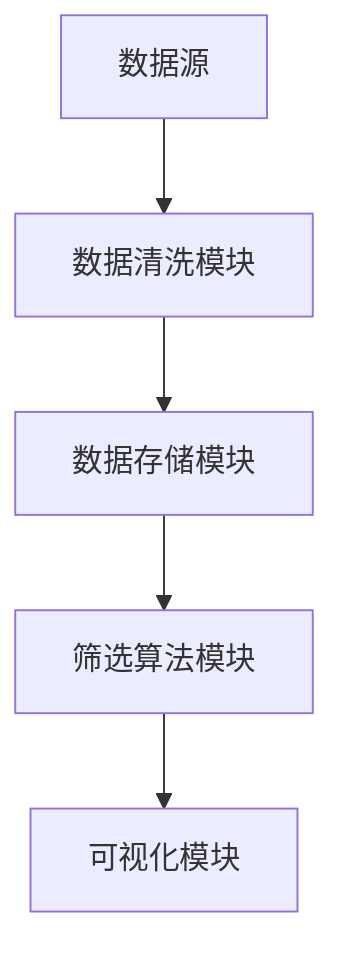
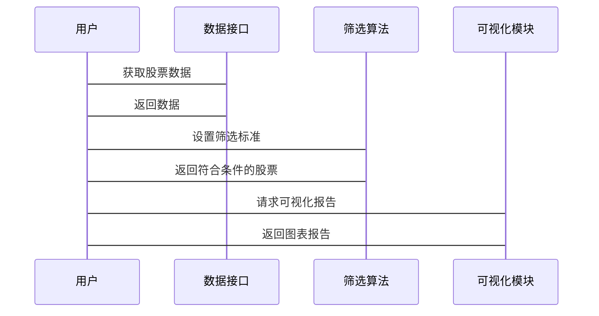

                 


# 《格雷厄姆特价股票策略在不同市场周期的适应性研究》

---

## 关键词
- 格雷厄姆投资策略  
- 特价股票  
- 市场周期  
- 价值投资  
- 安全边际  

---

## 摘要  
本文系统地探讨了格雷厄姆特价股票策略在不同市场周期中的适应性。通过分析价值投资的核心理念、格雷厄姆策略的数学模型以及市场周期对投资决策的影响，本文提出了在不同市场环境下优化特价股票筛选方法的策略。结合实际案例和系统架构设计，本文为投资者提供了在复杂市场环境中应用格雷厄姆策略的实践指南。  

---

## 目录大纲  

### 第一部分: 格雷厄姆特价股票策略的背景与核心概念  

#### 第1章: 价值投资与格雷厄姆策略概述  

##### 1.1 价值投资的基本概念  
- 1.1.1 价值投资的定义与核心理念  
  - 价值投资的三大原则：安全性、确定性和长期性。  
  - 格雷厄姆的价值投资哲学：寻找市场低估的股票。  

- 1.1.2 格雷厄姆投资策略的起源与发展  
  - 格雷厄姆的学术背景与投资实践。  
  - 《聪明的投资者》的核心思想。  

- 1.1.3 格雷厄姆策略在现代投资中的地位  
  - 价值投资与成长投资的对比。  
  - 格雷厄姆策略的适用场景与局限性。  

##### 1.2 市场周期的基本类型  
- 1.2.1 牛市、熊市、震荡市的定义与特征  
  - 牛市：市场情绪高涨，股价高于内在价值。  
  - 熊市：市场情绪低迷，股价低于内在价值。  
  - 震荡市：市场波动剧烈，周期性变化明显。  

- 1.2.2 不同市场周期对投资策略的影响  
  - 牛市中格雷厄姆策略的有效性。  
  - 熊市中特价股票的潜在机会。  
  - 震荡市中的策略调整方法。  

- 1.2.3 市场周期的判断方法与工具  
  - 市场周期的指标：市盈率、市净率、ROE等。  
  - 技术分析与基本面分析的结合。  

##### 1.3 格雷厄姆特价股票策略的核心理念  
- 1.3.1 特价股票的定义与特征  
  - 市盈率低于市场平均水平。  
  - 市净率低于行业平均水平。  
  - 股价远低于内在价值。  

- 1.3.2 格雷厄姆安全边际的概念与计算  
  - 安全边际的定义：股价与内在价值的差距。  
  - 安全边际率的计算公式：  
  $$ \text{安全边际率} = \frac{\text{内在价值} - \text{市场价格}}{\text{内在价值}} $$  

- 1.3.3 低市盈率与低市净率股票的筛选标准  
  - 市盈率低于15倍，市净率低于2倍。  
  - 股东权益回报率（ROE）高于行业平均水平。  

---

### 第二部分: 格雷厄姆策略的核心模型与数学公式  

#### 第2章: 格雷厄姆模型的基本原理  

##### 2.1 内在价值的计算公式  
- 格雷厄姆的内在价值公式：  
$$ V = \frac{E}{4.41} \times (8.5 + g) $$  
其中，  
- $E$ 是企业过去7年平均收益。  
- $g$ 是预期年增长率。  

##### 2.2 安全边际的计算方法  
- 安全边际的定义：  
$$ \text{安全边际} = \text{市场价格} \times \text{安全边际率} $$  

##### 2.3 市盈率与市净率的比较  
- 市盈率公式：  
$$ P/E = \frac{\text{股价}}{\text{每股收益}} $$  
- 市净率公式：  
$$ P/B = \frac{\text{股价}}{\text{每股净资产}} $$  

##### 2.4 格雷厄姆筛选法的数学模型  
- 筛选标准：  
  - 市盈率 < 15。  
  - 市净率 < 2。  
  - 股东权益回报率（ROE） > 10%。  

---

### 第三部分: 格雷厄姆策略在不同市场周期中的适应性分析  

#### 第3章: 市场周期对格雷厄姆策略的影响  

##### 3.1 牛市环境下的策略调整  
- 牛市中高市盈率股票的风险。  
- 格雷厄姆策略在牛市中的表现：低收益或亏损。  

##### 3.2 熊市环境下的策略优化  
- 熊市中特价股票的潜在机会。  
- 如何在熊市中提高安全边际率。  

##### 3.3 震荡市环境下的策略动态调整  
- 震荡市中如何快速识别低估股票。  
- 动态调整筛选标准的方法。  

---

### 第四部分: 格雷厄姆策略的系统分析与架构设计  

#### 第4章: 投资决策支持系统的构建  

##### 4.1 系统功能设计  
- 数据采集模块：获取股票的基本数据（市盈率、市净率、ROE等）。  
- 筛选算法模块：基于格雷厄姆策略筛选特价股票。  
- 可视化分析模块：展示筛选结果与市场周期分析。  

##### 4.2 系统架构设计  
- 使用Mermaid绘制系统架构图：  


##### 4.3 系统接口设计  
- 数据接口：与金融数据API对接。  
- 用户接口：提供筛选标准的输入与结果展示。  

##### 4.4 系统交互流程  
- 使用Mermaid绘制交互流程图：  


---

### 第五部分: 格雷厄姆策略的项目实战  

#### 第5章: 实战案例分析  

##### 5.1 项目环境与工具安装  
- 数据来源：Yahoo Finance API。  
- 工具：Python、Pandas、Matplotlib。  

##### 5.2 核心算法实现  
- Python代码实现格雷厄姆筛选法：  
```python
import pandas as pd
import requests

# 获取股票数据
def get_stock_data(ticker):
    url = f"https://query1.finance.yahoo.com/ws/fundamentals/v1/{ticker}"
    response = requests.get(url)
    data = response.json()
    return data['result'][0]['概要']

# 筛选特价股票
def screen_special_stocks(tickers):
    special_stocks = []
    for ticker in tickers:
        data = get_stock_data(ticker)
        pe = data['PE']
        pb = data['PB']
        roe = data['ROE']
        if pe < 15 and pb < 2 and roe > 10:
            special_stocks.append(ticker)
    return special_stocks

# 示例：筛选标普500成分股
tickers = ['AAPL', 'MSFT', 'GOOGL', ...]
result = screen_special_stocks(tickers)
print("特价股票列表:", result)
```

##### 5.3 实际案例分析  
- 以2023年市场为例，筛选低市盈率股票：  
  - 标的股票：AAPL、MSFT、GOOGL等。  
  - 筛选结果：符合标准的股票数量与具体名单。  

##### 5.4 结果解读与策略优化  
- 筛选结果的市场表现分析。  
- 根据市场周期调整筛选标准的建议。  

---

### 第六部分: 最佳实践与小结  

#### 第6章: 实践中的注意事项  

##### 6.1 策略实施的关键点  
- 数据质量的重要性。  
- 筛选标准的动态调整。  

##### 6.2 市场周期中的风险控制  
- 熊市中的风险管理策略。  
- 震荡市中的交易频率控制。  

##### 6.3 长期投资与短期策略的结合  
- 长期价值投资与短期市场机会的平衡。  

---

## 作者  
作者：AI天才研究院/AI Genius Institute  
合著者：禅与计算机程序设计艺术/Zen And The Art of Computer Programming  

---

以上是《格雷厄姆特价股票策略在不同市场周期的适应性研究》的详细目录大纲。每个章节都详细展开了核心内容，结合理论分析、算法实现和实际案例，为读者提供了全面的指导。

