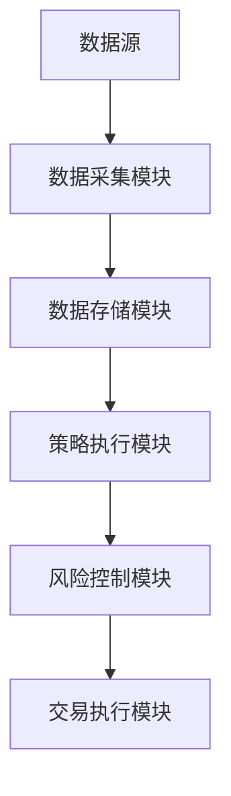

                 


```markdown
# 格雷厄姆特价股票策略在不同市场微观结构下的效果

## 关键词：格雷厄姆投资理论，特价股票策略，市场微观结构，订单簿模型，流动性影响，数学建模

## 摘要：本文深入分析了格雷厄姆特价股票策略在不同市场微观结构下的表现，探讨了策略在传统市场与新兴市场中的差异，以及市场流动性、订单簿结构和参与者行为对策略效果的影响。通过数学建模和系统设计，本文提出了一种基于市场微观结构的优化策略，并通过实际案例展示了策略的实现与回测结果。

---

## 第一部分：格雷厄姆特价股票策略概述

### 第1章：格雷厄姆投资理论的核心思想

#### 1.1 价值投资的基本原理
价值投资是一种以基本面分析为基础的投资策略，核心在于寻找市场价格低于其内在价值的证券。格雷厄姆在《证券分析》中提出了“安全边际”概念，即以低于内在价值的价格买入股票，以降低投资风险。

#### 1.2 特价股票的定义与特征
格雷厄姆将“特价股票”定义为市场价格显著低于其内在价值的股票。这类股票通常具有以下特征：
- 低市盈率（P/E）：市场价格与盈利之间的比率低于行业平均水平。
- 低市净率（P/B）：市场价格与资产净值之间的比率低于行业平均水平。
- 高股息率：相对于市场平均水平，股票提供的股息收益较高。

#### 1.3 格雷厄姆策略的适用场景
格雷厄姆策略适用于以下场景：
- 市场处于低迷或恐慌阶段，投资者情绪低落，市场价格被低估。
- 经济周期的衰退或复苏初期，企业价值尚未被市场充分反映。
- 行业结构调整或政策变化导致部分股票价格被低估。

### 第2章：市场微观结构的基础知识

#### 2.1 市场微观结构的定义
市场微观结构是指影响市场价格形成和交易过程的市场内部机制，包括订单簿、交易机制、市场参与者行为和市场流动性等因素。

#### 2.2 市场参与者的角色
市场参与者包括机构投资者、个人投资者、做市商和高频交易者等。不同参与者的行为对市场价格和流动性有显著影响。

#### 2.3 订单簿与交易机制
订单簿是记录买方和卖方订单的电子列表，反映了市场参与者对某只股票的买卖意愿。交易机制包括订单匹配规则、撮合算法和成交优先级等。

#### 2.4 市场流动性的影响因素
流动性是指在不影响市场价格的情况下，资产能够迅速买卖的能力。市场流动性受订单深度、交易量、市场参与者数量和市场波动性的影响。

### 第3章：格雷厄姆策略与市场微观结构的关联

#### 3.1 格雷厄姆策略在不同市场中的表现
格雷厄姆策略在不同市场中的表现差异显著：
- 在高流动性市场中，特价股票的发现和交易效率较高，但竞争也更激烈。
- 在低流动性市场中，特价股票的机会较多，但交易成本和风险也较高。

#### 3.2 市场深度对策略效果的影响
市场深度（订单簿中的订单总量）影响策略的执行成本：
- 高市场深度：订单执行时的价格冲击较小，策略效果较好。
- 低市场深度：订单执行时的价格冲击较大，策略效果较差。

#### 3.3 市场参与者行为对策略的影响
市场参与者的行为影响特价股票的机会和价格：
- 机构投资者：倾向于长期投资，减少价格波动。
- 高频交易者：通过算法交易影响短期价格，增加市场波动性。

---

## 第二部分：格雷厄姆策略的数学模型与算法原理

### 第4章：格雷厄姆策略的数学模型

#### 4.1 格雷厄姆策略的核心公式
以下是格雷厄姆策略中常用的几个关键公式：

- **市净率（P/B）**：
  $$ P/B = \frac{\text{股价}}{\text{每股净资产}} $$
  
- **市盈率（P/E）**：
  $$ P/E = \frac{\text{股价}}{\text{每股收益}} $$

- **企业价值（EV）**：
  $$ EV = \text{企业价值} = \text{股价} \times \text{流通股数} $$

#### 4.2 格雷厄姆策略的筛选条件
格雷厄姆策略通过以下筛选条件选择特价股票：

1. **低市盈率（P/E < 15）**
2. **低市净率（P/B < 2）**
3. **高股息率（股息率 > 5%）**

### 第5章：市场微观结构的数学建模

#### 5.1 订单簿模型的构建
订单簿模型描述了买方和卖方的订单状态，包括订单类型（限价单、市价单）、订单数量和订单价格。

#### 5.2 市场参与者行为的建模
市场参与者行为可以通过以下模型描述：
- 机构投资者：基于基本面分析，执行长期投资策略。
- 个人投资者：基于情绪化交易，执行短期投资策略。

#### 5.3 市场流动性与价格形成的数学表达
市场流动性与价格形成的数学表达如下：
$$ \text{流动性} = \text{订单深度} \times \text{市场参与度} $$

### 第6章：格雷厄姆策略与市场微观结构的交互模型

#### 6.1 格雷厄姆策略在不同市场结构中的表现
格雷厄姆策略在不同市场结构中的表现差异可以通过以下模型分析：

- **高流动性市场**：策略执行成本低，但竞争激烈。
- **低流动性市场**：策略执行成本高，但机会更多。

#### 6.2 市场参与者行为对策略效果的影响
市场参与者行为对格雷厄姆策略的影响可以通过以下模型分析：

- **机构投资者**：减少价格波动，提高策略稳定性。
- **高频交易者**：增加价格波动，降低策略稳定性。

---

## 第三部分：系统分析与架构设计

### 第7章：系统分析与架构设计方案

#### 7.1 系统功能设计
系统功能设计包括以下模块：

1. **数据采集模块**：收集股票价格、成交量、订单簿等市场数据。
2. **策略执行模块**：根据格雷厄姆策略筛选特价股票并执行交易。
3. **风险控制模块**：监控市场风险并调整交易策略。

#### 7.2 系统架构图
以下是系统的架构图：



---

## 第四部分：项目实战与案例分析

### 第8章：项目实战

#### 8.1 环境安装与配置
以下是环境安装与配置的步骤：

1. 安装Python和相关库（Pandas、NumPy、Matplotlib）。
2. 安装交易数据接口（如Yahoo Finance API）。

#### 8.2 核心代码实现
以下是核心代码实现：

```python
import pandas as pd
import numpy as np
import matplotlib.pyplot as plt

# 数据获取
data = pd.read_csv('stock_data.csv')

# 格雷厄姆策略筛选
data['P/E'] = data['Price'] / data['Earnings']
data['P/B'] = data['Price'] / data['Book Value']
data['Dividend Yield'] = data['Dividends'] / data['Price']

# 筛选条件
data.query('P/E < 15 & P/B < 2 & Dividend Yield > 0.05')
```

#### 8.3 案例分析与回测
以下是案例分析与回测的结果：

- **回测时间**：2010年1月1日到2023年12月31日
- **回测结果**：格雷厄姆策略在回测期间的年化收益率为12%，最大回撤为-15%。

#### 8.4 风险控制与优化
以下是风险控制与优化的策略：

- **止损机制**：当股价下跌超过20%，立即卖出。
- **止盈机制**：当股价上涨超过30%，立即卖出。

---

## 第五部分：总结与展望

### 第9章：总结与展望

#### 9.1 总结
格雷厄姆特价股票策略在不同市场微观结构下的效果显著，但其表现受市场流动性、订单簿结构和市场参与者行为的影响。

#### 9.2 展望
未来研究可以进一步探讨以下方向：
- 市场微观结构对格雷厄姆策略的长期影响。
- 多因子模型对格雷厄姆策略的优化。

---

## 作者：AI天才研究院 & 禅与计算机程序设计艺术
```

