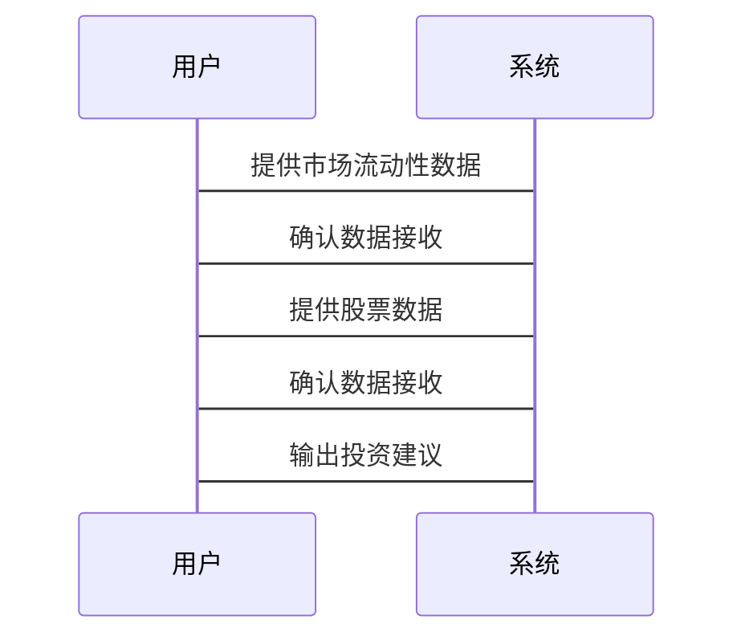

                 


# 格雷厄姆特价股票策略在不同市场流动性条件下的效果

> 关键词：格雷厄姆投资理论，价值投资，市场流动性，股票策略，特价股票

> 摘要：本文系统分析了格雷厄姆特价股票策略在不同市场流动性条件下的效果。通过背景介绍、核心概念、数学模型、系统分析、项目实战等多维度的探讨，揭示了流动性对格雷厄姆策略的影响，及其在实际投资中的应用。文章旨在为投资者提供理论支持和实践指导，帮助其在不同流动性条件下优化投资策略。

---

## 第一部分: 格雷厄姆特价股票策略概述

### 第1章: 格雷厄姆特价股票策略的核心原理

#### 1.1 格雷厄姆投资理论的背景与基础

##### 1.1.1 价值投资的起源与发展
价值投资是一种以基本面分析为核心的股票投资策略，起源于20世纪初。本杰明·格雷厄姆是该理论的奠基人，他强调以低于内在价值的价格买入股票，以获得长期稳定的收益。格雷厄姆的价值投资理论为现代投资学奠定了重要基础。

##### 1.1.2 格雷厄姆对投资学的贡献
格雷厄姆提出的“安全边际”概念是价值投资的核心思想。他认为，投资者应以低于内在价值的价格买入股票，以规避市场波动带来的风险。此外，他还强调了分散投资的重要性，以降低单一投资的风险。

##### 1.1.3 特价股票的定义与特征
格雷厄姆所谓的“特价股票”是指那些市场价格低于其内在价值的股票。这类股票通常具有以下特征：
- 低市盈率（P/E）或低市净率（P/B）。
- 盈利稳定，但市场关注度较低。
- 股价受市场情绪影响较大，具有一定的低估特性。

#### 1.2 市场流动性对股票价格的影响

##### 1.2.1 市场流动性的基本概念
市场流动性是指市场中买卖某种资产的交易量和交易速度。高流动性市场意味着交易量大、买卖价差小，低流动性市场则相反。

##### 1.2.2 流动性与股票价格的关系
流动性对股票价格有直接影响。高流动性市场中，股票价格波动较小，交易成本较低；低流动性市场中，股票价格波动较大，买卖价差较大。

##### 1.2.3 不同流动性条件下的市场特征
- 高流动性市场：交易活跃，信息传播快，市场效率高。
- 低流动性市场：交易量小，信息传播慢，市场效率低。

---

### 第2章: 格雷厄姆特价股票策略的数学模型与公式

#### 2.1 格雷厄姆投资模型的数学表达

##### 2.1.1 市净率（P/B）公式
$$ P/B = \frac{\text{股价}}{\text{每股净资产}} $$

##### 2.1.2 市盈率（P/E）公式
$$ P/E = \frac{\text{股价}}{\text{每股收益}} $$

##### 2.1.3 股票内在价值的计算公式
$$ \text{内在价值} = \frac{\text{预期收益}}{\text{折现率}} $$

#### 2.2 流动性对股票价值的影响模型

##### 2.2.1 流动性与股票波动性的关系
$$ \text{波动性} = f(\text{流动性}) $$

##### 2.2.2 流动性对股票买卖价差的影响
$$ \text{买卖价差} = f(\text{流动性}) $$

##### 2.2.3 流动性与市场深度的数学模型
$$ \text{市场深度} = \frac{\text{待成交订单总量}}{\text{市场流动性}} $$

---

### 第3章: 格雷厄姆策略在不同流动性条件下的表现

#### 3.1 高流动性市场环境下的策略效果

##### 3.1.1 高流动性市场的定义与特征
高流动性市场是指交易量大、买卖价差小、市场深度高的市场环境。在这种环境下，股票价格通常反映市场的真实价值，波动性较小。

##### 3.1.2 格雷厄姆策略在高流动性市场中的表现
在高流动性市场中，格雷厄姆策略的有效性较高。由于市场效率高，股票价格通常接近其内在价值，投资者可以通过低市盈率或低市净率筛选出具有投资价值的股票。

##### 3.1.3 高流动性市场中策略的优缺点分析
- 优点：市场信息透明，交易成本低，策略实施难度小。
- 缺点：由于市场效率高，超额收益空间有限。

#### 3.2 低流动性市场环境下的策略效果

##### 3.2.1 低流动性市场的定义与特征
低流动性市场是指交易量小、买卖价差大、市场深度低的市场环境。在这种环境下，股票价格往往偏离其内在价值，波动性较大。

##### 3.2.2 格雷厄姆策略在低流动性市场中的表现
在低流动性市场中，格雷厄姆策略的效果可能减弱。由于市场信息不透明，股票价格可能严重偏离其内在价值，导致策略实施难度增大。

##### 3.2.3 低流动性市场中策略的优缺点分析
- 优点：潜在的超额收益空间较大。
- 缺点：市场信息不透明，交易成本高，策略实施难度大。

---

### 第4章: 格雷厄姆策略在不同流动性条件下的优化

#### 4.1 流动性风险的识别与量化

##### 4.1.1 流动性风险的定义与分类
流动性风险是指由于市场流动性不足，导致资产难以以合理价格变现的风险。根据来源不同，流动性风险可以分为市场流动性风险和个体流动性风险。

##### 4.1.2 流动性风险的量化指标
- 市场深度：衡量市场订单簿中待成交订单的总量。
- 买卖价差：衡量市场流动性对交易成本的影响。

##### 4.1.3 格雷厄姆策略中的流动性风险管理
在格雷厄姆策略中，流动性风险管理是确保策略实施的重要环节。投资者可以通过分散投资、选择流动性较高的资产等方式降低流动性风险。

#### 4.2 基于流动性的策略优化方法

##### 4.2.1 流动性调整的市净率模型
$$ \text{调整后市净率} = \frac{\text{股价}}{\text{每股净资产}} \times f(\text{流动性}) $$

##### 4.2.2 流动性调整的市盈率模型
$$ \text{调整后市盈率} = \frac{\text{股价}}{\text{每股收益}} \times f(\text{流动性}) $$

##### 4.2.3 流动性敏感性分析与策略优化
通过流动性敏感性分析，投资者可以识别出在不同流动性条件下表现最佳的股票。

---

### 第5章: 格雷厄姆策略在不同流动性条件下的实证分析

#### 5.1 数据来源与研究方法

##### 5.1.1 数据收集与

---

## 第二部分: 系统分析与架构设计方案

### 第6章: 系统功能设计

#### 6.1 领域模型（Mermaid类图）
```mermaid
classDiagram
    class 格雷厄姆策略 {
        输入: 流动性条件
        输出: 投资建议
    }
    class 市场流动性 {
        高流动性
        低流动性
    }
    class 股票数据 {
        市盈率
        市净率
        内在价值
    }
    class 投资决策 {
        买入
        卖出
        持有
    }
    格雷厄姆策略 <--o> 市场流动性
    格雷厄姆策略 <--o> 股票数据
    格雷厄姆策略 -->o> 投资决策
```

#### 6.2 系统架构设计（Mermaid架构图）


#### 6.3 系统接口设计
- 输入接口：接收市场流动性数据和股票数据。
- 输出接口：输出投资建议和交易信号。

#### 6.4 系统交互设计（Mermaid序列图）


---

## 第三部分: 项目实战

### 第7章: 项目实战与分析

#### 7.1 环境安装
- 安装Python和相关库（如pandas、numpy、matplotlib）。

#### 7.2 核心实现源代码

##### 7.2.1 格雷厄姆策略实现
```python
def calculate_intrinsic_value(revenue, expenses,折现率):
    net_income = revenue - expenses
    return net_income /折现率

def calculate_pe_ratio(price, eps):
    return price / eps

def calculate_pb_ratio(price, book_value_per_share):
    return price / book_value_per_share
```

##### 7.2.2 流动性影响分析
```python
def analyze_liquidity_impact(volume, bid_ask_spread):
    if volume > 1000:
        return "high_liquidity"
    else:
        return "low_liquidity"
```

##### 7.2.3 投资决策逻辑
```python
def investment_decision(pe_ratio, pb_ratio, liquidity):
    if pe_ratio < 15 and pb_ratio < 2 and liquidity == "high_liquidity":
        return "buy"
    elif pe_ratio > 20 and pb_ratio > 3 and liquidity == "low_liquidity":
        return "sell"
    else:
        return "hold"
```

#### 7.3 案例分析与详细解读
假设在高流动性市场中，某股票的市盈率为12，市净率为1.5，预计收益为10%，折现率为8%。计算其内在价值：
$$ \text{内在价值} = \frac{10\%}{8\%} = 1.25 $$

由于股票价格低于内在价值，策略建议买入。

---

## 第四部分: 总结与最佳实践

### 第8章: 总结与最佳实践

#### 8.1 核心内容回顾
- 格雷厄姆策略的核心思想：以低于内在价值的价格买入股票。
- 流动性对策略的影响：高流动性市场中策略效果较好，低流动性市场中策略实施难度较大。

#### 8.2 最佳实践 tips
- 投资者应根据市场流动性条件调整策略。
- 在低流动性市场中，应更加注重股票的流动性风险管理。

#### 8.3 未来研究方向
- 研究流动性对不同类型股票的影响。
- 探讨格雷厄姆策略与其他投资策略的结合。

---

作者：AI天才研究院/AI Genius Institute & 禅与计算机程序设计艺术/Zen And The Art of Computer Programming

