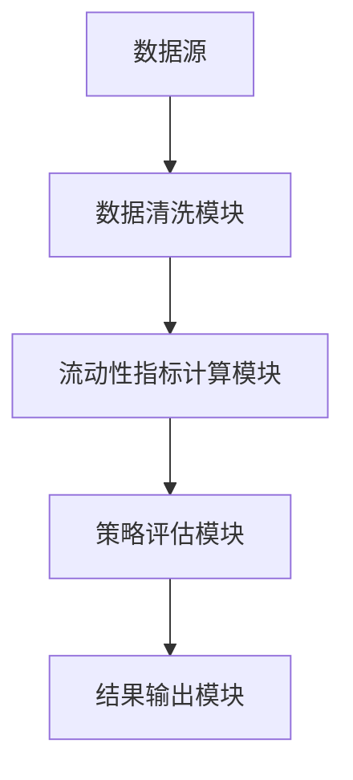

                 


# 格雷厄姆特价股票策略在不同市场流动性结构下的效果

> 关键词：格雷厄姆投资理论，特价股票，市场流动性，股票交易策略，投资策略优化

> 摘要：本文深入探讨格雷厄姆特价股票策略在不同市场流动性结构下的效果，通过分析市场流动性对策略收益、风险和执行的影响，提出优化策略的实施方法。文章结合理论分析和实证研究，构建数学模型，设计算法框架，提供系统架构方案，并通过项目实战验证策略的有效性，最终得出在不同流动性结构下格雷厄姆策略的最佳实践方法。

---

# 第一部分: 格雷厄姆特价股票策略概述

## 第1章: 格雷厄姆投资理论的核心思想

### 1.1 格雷厄姆投资理论的基本原理
- 1.1.1 价值投资的核心概念：寻找低于内在价值的股票
- 1.1.2 特价股票的定义：市场价格低于内在价值的股票
- 1.1.3 格雷厄姆策略的目标：通过长期持有实现超额收益

### 1.2 市场流动性结构的定义与分类
- 1.2.1 流动性定义：市场中买卖资产的难易程度
- 1.2.2 流动性结构分类：
  - 高流动性市场：交易量大、买卖价差小、成交速度快
  - 中等流动性市场：交易量适中、买卖价差一般、成交时间较长
  - 低流动性市场：交易量小、买卖价差大、成交困难

### 1.3 格雷厄姆策略与市场流动性结构的关系
- 1.3.1 格雷厄姆策略在不同流动性结构下的适用性
- 1.3.2 流动性结构对策略效果的影响机制
- 1.3.3 策略效果的边界与外延

---

# 第二部分: 格雷厄姆策略在不同流动性结构下的应用分析

## 第2章: 不同市场流动性结构对策略效果的影响

### 2.1 高流动性市场环境下的策略表现
- 2.1.1 高流动性市场的特征
- 2.1.2 格雷厄姆策略在高流动性市场中的表现
- 2.1.3 高流动性市场中的策略优化

### 2.2 低流动性市场环境下的策略表现
- 2.2.1 低流动性市场的特征
- 2.2.2 格雷厄姆策略在低流动性市场中的表现
- 2.2.3 低流动性市场中的策略调整

### 2.3 中等流动性市场环境下的策略表现
- 2.3.1 中等流动性市场的特征
- 2.3.2 格雷厄姆策略在中等流动性市场中的表现
- 2.3.3 中等流动性市场中的策略优化

## 第3章: 格雷厄姆策略与流动性结构的交互作用

### 3.1 流动性结构对策略收益的影响
- 3.1.1 流动性与策略收益的关系
- 3.1.2 不同流动性结构下的收益差异
- 3.1.3 流动性对策略收益的传导机制

### 3.2 流动性结构对策略风险的影响
- 3.2.1 流动性与策略风险的关系
- 3.2.2 不同流动性结构下的风险特征
- 3.2.3 流动性对策略风险的管理策略

### 3.3 流动性结构对策略执行的影响
- 3.3.1 流动性与策略执行效率的关系
- 3.3.2 不同流动性结构下的执行挑战
- 3.3.3 流动性对策略执行的优化建议

---

# 第三部分: 格雷厄姆策略在不同流动性结构下的数学模型与算法

## 第4章: 格雷厄姆策略的数学模型

### 4.1 格雷厄姆策略的基
### 4.2 流动性指标的构建
### 4.3 策略效果的评估模型
### 4.4 数学公式推导
- 4.4.1 流动性对收益的影响公式
- 4.4.2 流动性对风险的影响公式

---

# 第四部分: 格雷厄姆策略的系统架构与实现

## 第5章: 系统架构设计

### 5.1 系统功能模块
- 5.1.1 数据收集模块
- 5.1.2 数据处理模块
- 5.1.3 策略评估模块

### 5.2 系统架构图


## 第6章: 项目实战

### 6.1 环境安装
- 安装必要的Python库（如pandas、numpy、scipy）

### 6.2 核心实现代码
```python
import pandas as pd
import numpy as np

def calculate_liquidity(stock_data):
    # 计算流动性指标
    volume = stock_data['volume']
    turnover = stock_data['turnover']
    liquidity_ratio = turnover / volume
    return liquidity_ratio

def graham_strategy(liquidity_ratio, stock_price):
    # 格雷厄姆策略实现
    intrinsic_value = stock_price * 2.5
    margin_of_safety = intrinsic_value * 0.75
    return margin_of_safety

# 示例数据
data = {
    'volume': [1000, 2000, 1500],
    'turnover': [50000, 100000, 75000],
    'stock_price': [50, 60, 40]
}

df = pd.DataFrame(data)
liquidity_ratio = calculate_liquidity(df)
margin_of_safety = graham_strategy(liquidity_ratio, df['stock_price'])
print("Margin of Safety:", margin_of_safety)
```

### 6.3 实际案例分析
- 案例1：高流动性市场的策略应用
- 案例2：低流动性市场的策略调整

---

# 第五部分: 总结与展望

## 第7章: 总结

### 7.1 核心结论
- 格雷厄姆策略在高流动性市场中表现优异
- 低流动性市场中需要调整策略参数
- 中等流动性市场中需要动态优化

### 7.2 最佳实践 tips
- 定期监控市场流动性变化
- 根据流动性调整策略参数
- 结合其他指标进行综合判断

### 7.3 小结与注意事项
- 注意市场流动性变化对策略的影响
- 确保数据的准确性和及时性
- 合理控制风险

## 第8章: 展望

### 8.1 研究的局限性
- 数据样本的局限性
- 策略的适用性限制

### 8.2 未来研究方向
- 多因子模型的构建
- 机器学习在策略优化中的应用

---

# 作者：AI天才研究院/AI Genius Institute & 禅与计算机程序设计艺术 /Zen And The Art of Computer Programming

