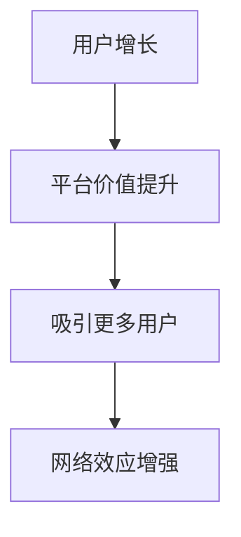
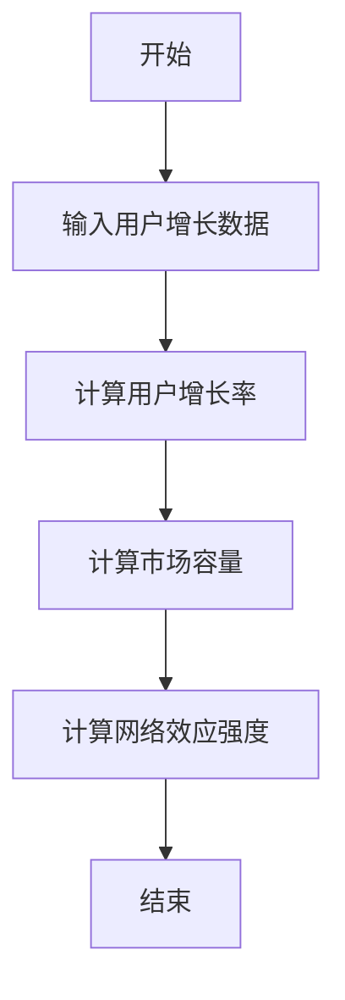
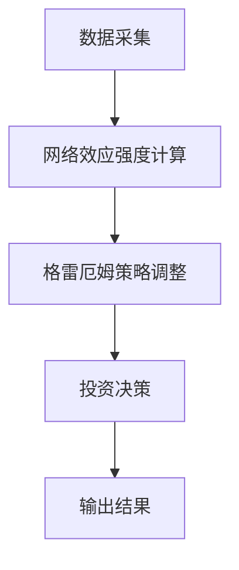
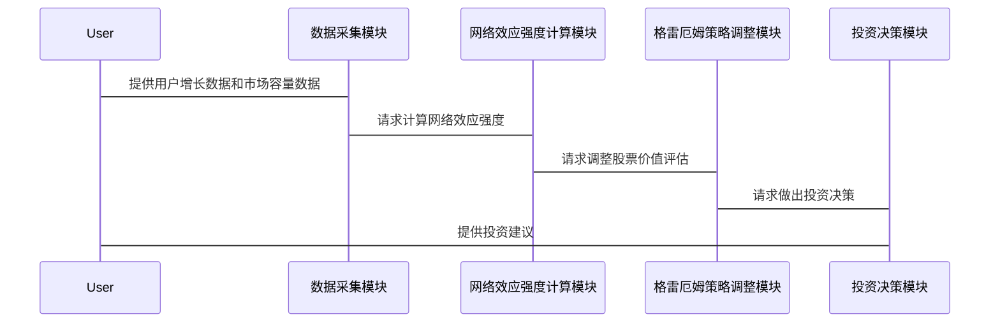

                 


# 《格雷厄姆特价股票策略在不同数字市场网络效应强度下的效果》

---

## 关键词：
- 格雷厄姆特价股票策略
- 数字市场
- 网络效应
- 投资策略
- 量化分析

---

## 摘要：
本文系统地探讨了格雷厄姆特价股票策略在不同数字市场网络效应强度下的效果。通过分析网络效应的量化指标及其对股票估值的影响，本文提出了在网络效应环境下调整格雷厄姆策略的方法，并结合实际案例进行了详细分析。文章还探讨了网络效应强度对投资决策的指导意义，为投资者在网络化市场中应用价值投资策略提供了理论依据和实践指导。

---

## 第一部分：背景介绍

### 第1章：核心概念与问题背景

#### 1.1 格雷厄姆特价股票策略概述

##### 1.1.1 价值投资的核心理念
格雷厄姆的价值投资策略强调以低于内在价值的价格购买优质股票。其核心在于识别市场价格与内在价值的差距，通过长期持有优质资产实现收益。内在价值的计算基于企业的基本面，包括盈利能力、资产质量、财务状况等因素。

##### 1.1.2 格雷厄姆策略的基本框架
格雷厄姆策略包括以下几个关键步骤：
1. 识别具有安全边际的股票（即市场价格显著低于内在价值）。
2. 选择具有稳定盈利能力和良好财务状况的企业。
3. 长期持有，避免频繁交易。
4. 分散投资，降低风险。

##### 1.1.3 特价股票的定义与识别标准
特价股票是指市场价格显著低于内在价值的股票。识别标准包括：
- 市净率（P/B）低于2。
- 市盈率（P/E）低于行业平均水平。
- 股息率高于行业平均水平。
- 企业盈利能力稳定，财务状况健康。

#### 1.2 数字市场与网络效应

##### 1.2.1 数字市场的定义与特征
数字市场是指基于互联网技术的市场环境，具有以下特征：
- **信息透明化**：信息传播速度快，范围广。
- **去中介化**：减少了传统中介的作用，降低了交易成本。
- **网络效应**：用户数量的增加会提高平台的价值。
- **数据驱动**：利用大数据进行精准营销和决策。

##### 1.2.2 网络效应的定义与类型
网络效应是指用户数量的增加导致平台或产品的价值提升。网络效应可以分为以下几种类型：
- **直接网络效应**：用户数量增加直接提高了产品的价值（如社交媒体）。
- **间接网络效应**：用户数量增加间接提高了产品的价值（如企业间的协同合作）。
- **正反馈网络效应**：用户数量增加导致更多的用户加入，形成正反馈循环。

##### 1.2.3 网络效应在数字市场中的表现形式
网络效应在数字市场中主要通过以下方式表现：
- **用户增长**：用户数量的快速增长。
- **用户参与度**：用户活跃度的提高。
- **用户粘性**：用户对平台的依赖性增强。
- **平台价值提升**：平台的整体价值随着用户数量的增加而提升。

#### 1.3 问题背景与研究意义

##### 1.3.1 数字市场中的网络效应强度变化
数字市场的快速发展使得网络效应强度发生了显著变化。例如，社交媒体平台的用户增长速度和用户参与度的提升，使得网络效应强度不断加强。

##### 1.3.2 格雷厄姆策略在传统市场与数字市场的差异
在传统市场中，格雷厄姆策略主要依赖于企业的基本面分析。而在数字市场中，网络效应成为影响股票价值的重要因素。因此，传统的格雷厄姆策略需要进行调整，以适应数字市场的特点。

##### 1.3.3 研究网络效应强度对策略效果的影响的意义
研究网络效应强度对格雷厄姆策略效果的影响，有助于投资者更好地理解数字市场中的投资机会和风险。这不仅可以提高投资决策的准确性，还可以帮助投资者在快速变化的市场环境中保持竞争优势。

---

## 第二部分：核心概念与联系

### 第2章：网络效应强度与格雷厄姆策略的关系

#### 2.1 网络效应强度的量化

##### 2.1.1 网络效应强度的定义
网络效应强度是指用户数量增加对平台或产品价值的影响程度。它可以用以下公式表示：
$$网络效应强度 = \frac{用户增长速度}{市场容量}$$

##### 2.1.2 网络效应强度的衡量指标
网络效应强度可以通过以下指标进行衡量：
- 用户增长率：$$用户增长率 = \frac{新增用户数}{总用户数} \times 100\%$$
- 用户参与度：$$用户参与度 = \frac{活跃用户数}{总用户数} \times 100\%$$
- 用户粘性：$$用户粘性 = \frac{回头用户数}{总用户数} \times 100\%$$

##### 2.1.3 网络效应强度与市场参与者的互动关系
网络效应强度与市场参与者的互动关系可以用以下图示表示：



#### 2.2 格雷厄姆策略在网络效应环境下的调整

##### 2.2.1 格雷厄姆策略在网络效应下的适用性分析
在数字市场中，格雷厄姆策略需要进行以下调整：
- 考虑网络效应强度对股票价值的影响。
- 评估平台的用户增长潜力和用户粘性。
- 结合企业的基本面分析和网络效应强度进行综合判断。

##### 2.2.2 网络效应强度对股票估值的影响
网络效应强度对股票估值的影响可以通过以下公式表示：
$$调整后的股票价值 = 格雷厄姆原始价值 \times 网络效应强度系数$$
其中，网络效应强度系数介于0和1之间，系数越大，网络效应强度对股票价值的提升作用越显著。

##### 2.2.3 网络效应强度对投资决策的指导意义
网络效应强度对投资决策的指导意义体现在以下几个方面：
- 网络效应强度高的平台具有更大的增长潜力。
- 网络效应强度低的平台可能面临增长瓶颈。
- 投资者应选择具有高网络效应强度和良好基本面的企业进行投资。

#### 2.3 核心概念对比与联系

##### 2.3.1 核心概念对比表格
| 比较维度 | 格雷厄姆策略 | 网络效应强度 |
|----------|--------------|--------------|
| 核心要素 | 内在价值、安全边际 | 用户增长、平台价值 |
| 适用场景 | 传统市场 | 数字市场 |
| 影响因素 | 企业基本面 | 用户行为、技术发展 |

##### 2.3.2 网络效应强度与格雷厄姆策略的ER实体关系图
以下是一个简单的ER实体关系图：

```mermaid
erd
    User
    Market
    NetworkEffectStrength
    StockValue

    User --> NetworkEffectStrength: 影响
    Market --> NetworkEffectStrength: 决定
    NetworkEffectStrength --> StockValue: 影响
    Market --> StockValue: 决定
```

---

## 第三部分：算法原理与数学模型

### 第3章：网络效应强度的计算算法

#### 3.1 网络效应强度的计算模型

##### 3.1.1 网络效应强度的数学公式
$$网络效应强度 = \frac{用户增长速度}{市场容量}$$
其中，用户增长速度可以用月增长率表示，市场容量可以用行业市场规模表示。

##### 3.1.2 算法流程图


##### 3.1.3 代码实现
以下是一个简单的Python代码示例，用于计算网络效应强度：

```python
def calculate_network_effectiveness(user_growth, market_capacity):
    return user_growth / market_capacity

# 示例数据
user_growth = 0.2  # 20%的用户增长率
market_capacity = 1000000  # 市场容量为100万

network_effectiveness = calculate_network_effectiveness(user_growth, market_capacity)
print(f"网络效应强度为：{network_effectiveness}")
```

---

## 第四部分：系统分析与架构设计

### 第4章：系统分析与架构设计方案

#### 4.1 系统功能设计

##### 4.1.1 系统功能模块划分
- 数据采集模块：负责采集用户增长数据、市场容量数据等。
- 网络效应强度计算模块：根据数据计算网络效应强度。
- 格雷厄姆策略调整模块：根据网络效应强度调整股票价值评估。
- 投资决策模块：根据调整后的股票价值评估做出投资决策。

##### 4.1.2 系统功能流程图


#### 4.2 系统架构设计

##### 4.2.1 系统架构图


##### 4.2.2 系统接口设计
- 数据采集接口：负责接收用户增长数据和市场容量数据。
- 网络效应强度计算接口：负责计算网络效应强度并返回结果。
- 格雷厄姆策略调整接口：负责根据网络效应强度调整股票价值评估。
- 投资决策接口：负责根据调整后的股票价值评估做出投资决策。

##### 4.2.3 系统交互流程图


---

## 第五部分：项目实战

### 第5章：项目实战与案例分析

#### 5.1 环境配置

##### 5.1.1 系统环境
- 操作系统：Windows 10 或 macOS 10.15及以上
- 开发工具：Python 3.8及以上，Jupyter Notebook
- 数据库：MySQL 8.0及以上

##### 5.1.2 数据来源
- 用户增长数据：可以通过社交媒体平台获取。
- 市场容量数据：可以通过行业报告获取。

#### 5.2 核心代码实现

##### 5.2.1 数据采集代码
```python
import requests
from bs4 import BeautifulSoup

def scrape_user_growth(url):
    response = requests.get(url)
    soup = BeautifulSoup(response.text, 'html.parser')
    user_growth = soup.find('div', {'class': 'user-growth'}).text
    return float(user_growth)

# 示例数据
url = 'https://example.com/user-growth'
user_growth = scrape_user_growth(url)
print(f"用户增长率为：{user_growth}%")
```

##### 5.2.2 网络效应强度计算代码
```python
def calculate_network_effectiveness(user_growth, market_capacity):
    return user_growth / market_capacity

# 示例数据
user_growth = 0.2  # 20%的用户增长率
market_capacity = 1000000  # 市场容量为100万

network_effectiveness = calculate_network_effectiveness(user_growth, market_capacity)
print(f"网络效应强度为：{network_effectiveness}")
```

##### 5.2.3 格雷厄姆策略调整代码
```python
def calculate_adjusted_stock_value(intrinsic_value, network_effectiveness):
    return intrinsic_value * network_effectiveness

# 示例数据
intrinsic_value = 100  # 内在价值为100
network_effectiveness = 0.8  # 网络效应强度为0.8

adjusted_stock_value = calculate_adjusted_stock_value(intrinsic_value, network_effectiveness)
print(f"调整后的股票价值为：{adjusted_stock_value}")
```

#### 5.3 案例分析

##### 5.3.1 案例背景
假设我们正在分析一家社交媒体平台，其用户增长率为20%，市场容量为100万。

##### 5.3.2 网络效应强度计算
$$网络效应强度 = \frac{0.2}{1000000} = 0.0002$$

##### 5.3.3 股票价值调整
假设该平台的内在价值为100，调整后的股票价值为：
$$调整后的股票价值 = 100 \times 0.0002 = 20$$

##### 5.3.4 投资决策
根据调整后的股票价值，投资者可以决定是否购买该股票。

#### 5.4 项目总结

##### 5.4.1 网络效应强度对投资决策的影响
网络效应强度高的平台具有更大的增长潜力，因此在投资决策中应优先考虑这些平台。

##### 5.4.2 投资策略调整的总结
在数字市场中，投资者需要综合考虑企业的基本面和网络效应强度，才能做出科学的投资决策。

---

## 第六部分：最佳实践与小结

### 第6章：最佳实践与小结

#### 6.1 最佳实践

##### 6.1.1 数据采集与处理
- 确保数据的准确性和及时性。
- 使用可靠的来源获取数据。

##### 6.1.2 网络效应强度的计算
- 使用科学的公式和方法计算网络效应强度。
- 定期更新和调整计算模型。

##### 6.1.3 格雷厄姆策略的调整
- 结合网络效应强度和企业基本面进行综合判断。
- 定期评估和调整投资组合。

#### 6.2 小结
本文系统地探讨了格雷厄姆特价股票策略在不同数字市场网络效应强度下的效果。通过分析网络效应的量化指标及其对股票估值的影响，本文提出了在网络效应环境下调整格雷厄姆策略的方法，并结合实际案例进行了详细分析。

#### 6.3 注意事项

##### 6.3.1 数据风险
- 数据的准确性和完整性可能影响计算结果。

##### 6.3.2 市场风险
- 数字市场的快速变化可能导致网络效应强度的变化。

##### 6.3.3 投资风险
- 投资决策的错误可能导致资金损失。

#### 6.4 拓展阅读

##### 6.4.1 推荐书籍
- 《股票作手回忆录》——杰西·利弗莫尔
- 《投资学原理》——威廉·夏普

##### 6.4.2 推荐博客
- 网络效应与投资策略（链接）
- 数字市场分析（链接）

---

## 作者：AI天才研究院/AI Genius Institute & 禅与计算机程序设计艺术/Zen And The Art of Computer Programming

