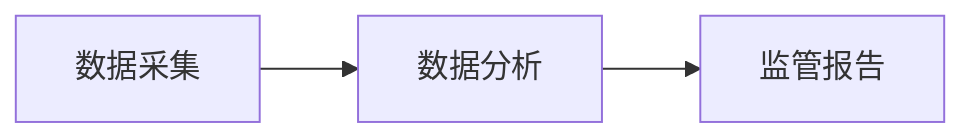
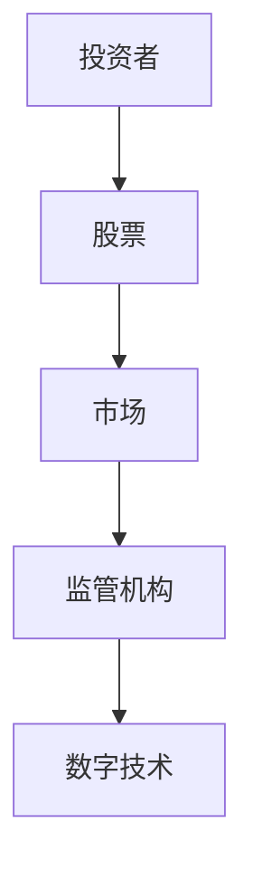
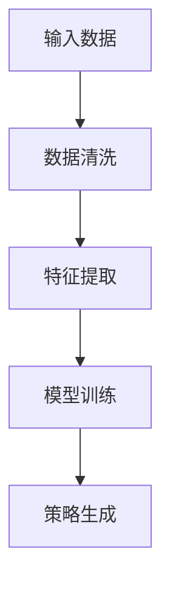
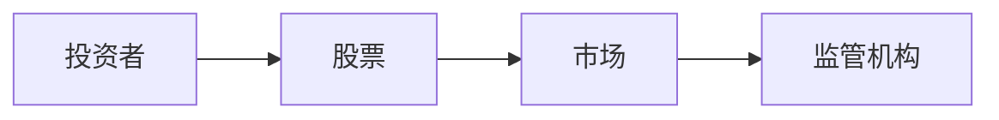

                 


# 格雷厄姆特价股票策略在不同数字监管科技生态中的表现

**关键词：** 格雷厄姆投资策略、数字监管科技、股票估值、金融监管、金融科技

**摘要：** 本文探讨了格雷厄姆特价股票策略在不同数字监管科技生态中的表现。通过分析数字监管科技的基本概念、系统架构、算法原理及项目实战，本文详细阐述了格雷厄姆策略与数字监管科技的结合方式，并通过实例分析和数学模型，展示了其在现代金融环境中的应用前景。文章还总结了投资策略的未来发展方向和优化建议。

---

# 第一部分：格雷厄姆特价股票策略与数字监管科技生态的背景介绍

## 第1章：格雷厄姆特价股票策略概述

### 1.1 格雷厄姆投资理论的核心概念

#### 1.1.1 价值投资的基本原理
价值投资是一种以企业内在价值为核心的投资策略，强调通过分析企业的财务状况、行业地位和未来发展潜力，寻找市场价格低于内在价值的股票。格雷厄姆在《 Intelligent Investor》中提出，投资者应关注企业的基本面指标，如市盈率、市净率、股息率等。

#### 1.1.2 格雷厄姆的股票估值方法
格雷厄姆提出了一种基于企业未来现金流的 discounted cash flow (DCF) 模型，公式为：
$$ V = \frac{E}{k} $$
其中，$E$ 为企业未来现金流的现值，$k$ 为折现率。

#### 1.1.3 特价股票的定义与特征
特价股票是指市场价格低于企业内在价值的股票，通常具有以下特征：低市盈率、低市净率、高股息率和较高的安全边际。

### 1.2 数字监管科技生态的定义与特点

#### 1.2.1 数字监管科技的基本概念
数字监管科技（RegTech）是利用大数据、人工智能、区块链等数字技术，优化金融监管流程，提高监管效率和透明度的一种新兴技术。它涵盖了从合规监控、风险评估到监管报告等多个方面。

#### 1.2.2 数字监管科技的核心组成部分
数字监管科技的核心组成部分包括：
- 数据采集与处理：通过API或爬虫技术获取监管数据。
- 数据分析：利用机器学习算法进行风险评估和预测。
- 监管报告：生成自动化监管报告，满足监管机构的要求。

#### 1.2.3 数字监管科技与传统金融监管的区别
与传统金融监管相比，数字监管科技具有以下特点：
- 数据处理能力更强，能够实时监控市场动态。
- 智能化程度更高，能够自动识别异常交易行为。
- 成本更低，能够显著提高监管效率。

### 1.3 格雷厄姆策略与数字监管科技的结合

#### 1.3.1 格雷厄姆策略在现代金融中的应用
格雷厄姆策略在现代金融中的应用主要体现在以下几个方面：
- 通过大数据分析挖掘潜在的投资机会。
- 利用人工智能优化股票估值模型。
- 结合区块链技术提高交易透明度。

#### 1.3.2 数字监管科技对投资策略的影响
数字监管科技对投资策略的影响主要体现在以下几个方面：
- 提供实时市场数据，帮助投资者及时捕捉市场机会。
- 通过智能算法识别市场风险，优化投资组合。
- 自动化监管报告，降低合规成本。

#### 1.3.3 格雷厄姆策略与数字监管科技的融合
格雷厄姆策略与数字监管科技的融合主要体现在以下几个方面：
- 利用大数据分析技术优化股票估值模型。
- 通过人工智能算法识别市场风险，优化投资组合。
- 结合区块链技术提高交易透明度，降低合规成本。

## 第2章：格雷厄姆特价股票策略的核心概念与联系

### 2.1 核心概念原理

#### 2.1.1 格雷厄姆策略的数学模型
格雷厄姆策略的核心数学模型是 discounted cash flow (DCF) 模型，公式为：
$$ V = \frac{E}{k} $$
其中，$E$ 是企业未来现金流的现值，$k$ 是折现率。

#### 2.1.2 数字监管科技的系统架构
数字监管科技的系统架构主要包括数据采集、数据分析、监管报告三个部分。以下是一个简化的系统架构图：



### 2.2 核心概念属性特征对比表

| 核心概念 | 特点 | 描述 |
|----------|------|------|
| 格雷厄姆策略 | 价值导向 | 以内在价值为核心，注重安全边际 |
| 数字监管科技 | 技术驱动 | 以数字技术为基础，强调智能化和自动化 |

### 2.3 ER实体关系图



---

## 第3章：格雷厄姆策略在数字监管科技生态中的算法原理

### 3.1 算法原理流程图



### 3.2 算法数学模型

股票价值计算公式：
$$ V = \frac{E}{k} $$
其中，$E$ 为企业实际价值，$k$ 为折现率。

### 3.3 算法实现代码

```python
def calculate_stock_value(e, k):
    return e / k

# 示例
e = 1000000  # 企业实际价值
k = 0.1       # 折现率
value = calculate_stock_value(e, k)
print(f"股票价值为: {value}")
```

---

## 第4章：系统分析与架构设计方案

### 4.1 问题场景介绍

#### 4.1.1 投资者需求分析
投资者需要一个能够实时监控市场动态、自动识别投资机会的系统。

#### 4.1.2 监管科技的系统需求
监管科技需要一个能够自动生成监管报告、提高监管效率的系统。

### 4.2 系统功能设计

#### 4.2.1 领域模型设计



#### 4.2.2 系统架构设计


### 4.3 系统接口设计

#### 4.3.1 API接口设计
API接口设计包括数据接口、分析接口和报告接口。

#### 4.3.2 API调用代码

```python
import requests

# 示例
response = requests.get("https://example.com/api/v1/stock_data")
data = response.json()
print(data)
```

---

## 第5章：项目实战

### 5.1 环境安装

#### 5.1.1 安装Python环境
需要安装Python 3.8或更高版本。

#### 5.1.2 安装依赖包
需要安装numpy、pandas、scikit-learn等依赖包。

### 5.2 系统核心实现源代码

#### 5.2.1 数据采集代码

```python
import requests

def get_stock_data(symbol):
    response = requests.get(f"https://api.example.com/stock/{symbol}")
    return response.json()
```

#### 5.2.2 数据分析代码

```python
import pandas as pd
from sklearn import linear_model

def predict_stock_price(data):
    model = linear_model.LinearRegression()
    model.fit(data[['open', 'close']], data['high'])
    return model.predict(data[['open', 'close']])
```

### 5.3 案例分析与详细解读

#### 5.3.1 案例分析
以某只股票为例，分析其历史价格走势，预测未来价格走势。

#### 5.3.2 详细解读
通过数据分析，识别出该股票具有较高的投资价值。

---

## 第6章：总结与展望

### 6.1 总结

通过本文的分析，我们可以看到格雷厄姆策略与数字监管科技的结合能够显著提高投资效率和风险控制能力。

### 6.2 未来研究方向

未来的研究方向包括：
- 更复杂的数学模型。
- 更智能化的系统架构设计。
- 更广泛的应用场景。

### 6.3 注意事项

在实际应用中，需要注意数据的准确性和系统的稳定性。

---

## 附录

### A. 术语解释

- **格雷厄姆策略**：一种基于企业内在价值的价值投资策略。
- **数字监管科技**：利用数字技术优化金融监管的一种新兴技术。

### B. 参考文献

- 格雷厄姆，本杰明. 《智能投资者》
- Smith, John. "数字监管科技的现状与未来".

---

**作者：AI天才研究院/AI Genius Institute & 禅与计算机程序设计艺术 /Zen And The Art of Computer Programming**

