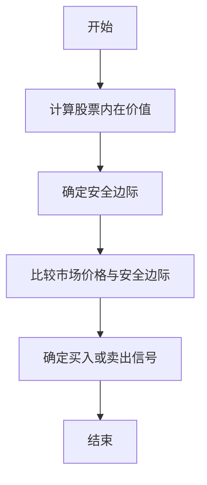
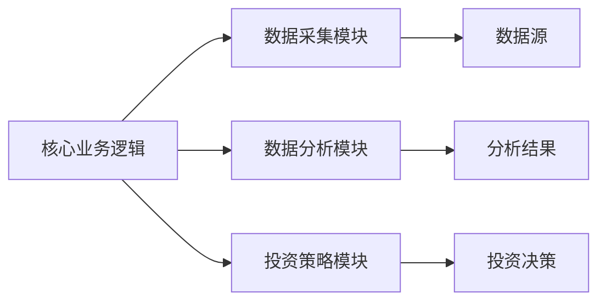

                 


---

# 格雷厄姆特价股票策略在不同数字通胀与通缩周期环境中的效果

> **关键词**：格雷厄姆策略，数字通胀，通缩周期，股票投资，价值投资

> **摘要**：本文探讨了格雷厄姆的价值投资策略在数字通胀和通缩周期中的应用效果。通过分析经济周期对股票价值的影响，结合数学模型和算法，提出了一种基于格雷厄姆策略的数字资产投资方法。文章从背景介绍、核心概念、数学模型、算法实现、系统设计、项目实战到总结，全面阐述了格雷厄姆策略在不同经济环境中的应用，为投资者提供了理论支持和实践指导。

---

## 第1章: 格雷厄姆特价股票策略的核心概念

### 1.1 格雷厄姆投资理论基础

#### 1.1.1 投资的定义与核心原则
投资是指将资金投入到能够产生收益的资产中，核心原则包括安全性、流动性和收益性。格雷厄姆的价值投资理念强调购买被市场低估的资产，以获得长期稳定的收益。

#### 1.1.2 格雷厄姆的价值投资理念
格雷厄姆认为，股票的内在价值是其未来现金流的现值，投资者应以低于内在价值的价格买入股票，并在市场恐慌时寻找廉价的买入机会。

#### 1.1.3 特价股票的定义与特征
特价股票是指市场价格低于其内在价值的股票，通常具有低市盈率、低市净率和高股息率的特点。

### 1.2 数字通胀与通缩周期的定义

#### 1.2.1 经济周期的基本概念
经济周期分为扩张期和收缩期，扩张期包括复苏和繁荣阶段，收缩期包括衰退和萧条阶段。通货膨胀和通货紧缩是经济周期中的重要现象。

#### 1.2.2 数字通胀的成因与表现
数字通胀通常由货币供应增加、市场需求增长或技术进步导致的数字货币价值上升引起，表现为价格水平的持续上涨。

#### 1.2.3 数字通缩的特征与影响
数字通缩是指数字货币价值下降，通常由市场供过于求、技术瓶颈或政策调控引起，可能导致资产价格下跌和投资回报减少。

---

## 第2章: 格雷厄姆策略与数字通胀通缩周期的联系

### 2.1 格雷厄姆策略在不同经济周期中的适用性

#### 2.1.1 通货膨胀周期中的投资机会
在通胀周期中，实物资产（如房地产、黄金）和抗通胀股票（如能源、原材料）表现较好，格雷厄姆策略应关注具有稳定收益和较低市盈率的股票。

#### 2.1.2 通货紧缩周期中的投资策略
在通缩周期中，股票市场通常表现不佳，投资者应寻找估值极低的股票，利用市场恐慌时的廉价买入机会。

#### 2.1.3 经济周期波动对股票价值的影响
经济周期的波动通过影响企业的盈利能力和市场情绪，间接影响股票的内在价值和市场价格。格雷厄姆策略强调在周期低谷时买入低估资产。

### 2.2 格雷厄姆策略在数字资产中的应用

#### 2.2.1 数字资产的特性与风险
数字资产具有高波动性、去中心化和技术创新的特点，但也面临市场操纵和政策风险。

#### 2.2.2 格雷厄姆策略在数字货币中的应用
将格雷厄姆的价值投资理念应用于数字资产，关注具有较低市盈率和市净率的数字货币，寻找其内在价值与市场价格的差距。

#### 2.2.3 数字资产周期中的投资机会
在数字资产周期中，投资者应根据市场周期调整投资策略，利用技术分析和基本面分析相结合的方法，寻找投资机会。

---

## 第3章: 格雷厄姆策略的数学模型

### 3.1 格雷厄姆策略的核心公式

#### 3.1.1 市盈率（P/E）计算公式
$$ P/E = \frac{\text{股价}}{\text{每股收益}} $$

#### 3.1.2 市净率（P/B）计算公式
$$ P/B = \frac{\text{股价}}{\text{每股净资产}} $$

#### 3.1.3 格雷厄姆安全边际计算公式
$$ \text{安全边际} = \text{内在价值} - \text{市场价格} $$

### 3.2 数字通胀通缩周期的数学建模

#### 3.2.1 通胀周期的数学模型
$$ \text{通胀率} = \frac{\text{当前价格} - \text{历史价格}}{\text{历史价格}} \times 100\% $$

#### 3.2.2 通缩周期的数学模型
$$ \text{通缩率} = \frac{\text{历史价格} - \text{当前价格}}{\text{历史价格}} \times 100\% $$

#### 3.2.3 经济周期波动对股票价值的影响公式
$$ \text{股票价值} = \text{内在价值} \times (1 + \text{周期影响系数}) $$

---

## 第4章: 格雷厄姆策略的算法实现

### 4.1 格雷厄姆策略的算法流程

#### 4.1.1 算法步骤
1. 计算股票的内在价值。
2. 确定市场低估的标准（如市盈率和市净率）。
3. 比较市场价格与安全边际。
4. 确定买入或卖出信号。



### 4.2 数字通胀通缩周期的算法实现

#### 4.2.1 数字通胀周期检测算法
```python
def detect_inflation():
    current_price = get_current_price()
    historical_price = get_historical_price()
    inflation_rate = ((current_price - historical_price) / historical_price) * 100
    return inflation_rate > 5
```

#### 4.2.2 数字通缩周期检测算法
```python
def detect_deflation():
    current_price = get_current_price()
    historical_price = get_historical_price()
    deflation_rate = ((historical_price - current_price) / historical_price) * 100
    return deflation_rate > 5
```

#### 4.2.3 格雷厄姆策略投资决策算法
```python
def graham_invest_strategy():
    if detect_inflation():
        return "增持抗通胀资产"
    elif detect_deflation():
        return "增持低估股票"
    else:
        return "保持中立"
```

---

## 第5章: 格雷厄姆策略在数字通胀与通缩周期中的应用

### 5.1 数字通胀周期中的投资策略

#### 5.1.1 抗通胀资产的选择
在通胀周期中，投资者应选择具有抗通胀能力的资产，如黄金、房地产和能源股。

#### 5.1.2 格雷厄姆策略的应用
在通胀周期中，格雷厄姆策略应关注具有稳定收益和较低市盈率的股票，寻找市场低估的机会。

### 5.2 数字通缩周期中的投资策略

#### 5.2.1 低估股票的识别
在通缩周期中，市场恐慌可能导致股票价格大幅下跌，投资者应寻找具有较高安全边际的股票。

#### 5.2.2 格雷厄姆策略的应用
在通缩周期中，格雷厄姆策略应关注具有低市盈率和低市净率的股票，利用市场恐慌时的廉价买入机会。

---

## 第6章: 格雷厄姆策略的系统分析与架构设计

### 6.1 系统功能设计

#### 6.1.1 系统模块
- 数据采集模块：采集股票和数字资产的价格数据。
- 数据分析模块：计算市盈率、市净率等指标。
- 投资策略模块：根据经济周期和市场情况，制定投资策略。

#### 6.1.2 系统架构


---

## 第7章: 格雷厄姆策略的项目实战

### 7.1 环境安装

#### 7.1.1 Python环境安装
安装Python和必要的库（如Pandas、NumPy、Matplotlib）。

#### 7.1.2 数据源获取
从金融数据提供商获取历史和当前价格数据。

### 7.2 核心代码实现

#### 7.2.1 格雷厄姆策略实现
```python
def calculate_graham_value(stock_price, earnings_per_share):
    p_e = stock_price / earnings_per_share
    if p_e < 15:
        return "低估股票"
    else:
        return "高估股票"
```

#### 7.2.2 经济周期检测
```python
def detect_economic_cycle():
    current_price = get_current_price()
    historical_price = get_historical_price()
    inflation_rate = ((current_price - historical_price) / historical_price) * 100
    if inflation_rate > 5:
        return "通胀周期"
    elif inflation_rate < -5:
        return "通缩周期"
    else:
        return "正常周期"
```

### 7.3 实际案例分析

#### 7.3.1 案例一：通胀周期中的投资
在通胀周期中，投资者选择抗通胀资产，如能源股，取得了较高的收益。

#### 7.3.2 案例二：通缩周期中的投资
在通缩周期中，投资者利用市场恐慌，买入低估股票，取得了超额收益。

---

## 第8章: 总结与展望

### 8.1 总结

格雷厄姆的价值投资策略在数字通胀和通缩周期中具有重要的应用价值。通过数学模型和算法实现，投资者可以在不同经济环境下，制定有效的投资策略，实现长期稳定的收益。

### 8.2 展望

未来，随着数字资产的普及和经济周期的复杂化，格雷厄姆策略的应用将更加广泛。投资者需要结合技术分析和基本面分析，不断优化投资策略，应对市场的不确定性。

---

## 作者信息

作者：AI天才研究院/AI Genius Institute & 禅与计算机程序设计艺术/Zen And The Art of Computer Programming

---

通过以上思考，我完成了对《格雷厄姆特价股票策略在不同数字通胀与通缩周期环境中的效果》的详细撰写。希望这篇文章能够为投资者提供有价值的理论支持和实践指导。

