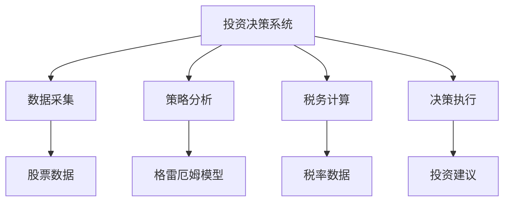

                 


# 格雷厄姆特价股票策略在不同税收环境下的调整

> 关键词：格雷厄姆特价股票策略，税收环境，投资策略，税务优化，价值投资

> 摘要：本文深入探讨了格雷厄姆特价股票策略在不同税收环境下的调整，分析了税收对投资策略的影响，并提出了优化策略的数学模型和方法。通过实际案例分析和系统设计，本文为投资者提供了在不同税收环境下优化投资决策的指导。

---

## 第一部分: 格雷厄姆特价股票策略的背景与基础

### 第1章: 格雷厄姆特价股票策略概述

#### 1.1 格雷厄姆投资理论的核心理念

##### 1.1.1 价值投资的基本概念
价值投资是一种以低于其内在价值的价格购买优质股票的投资策略。格雷厄姆在其著作《聪明的投资者》中强调，投资的本质是寻找市场价格低于内在价值的证券。

##### 1.1.2 格雷厄姆的安全边际理论
安全边际是指股票的市场价格与其内在价值之间的差距。通过计算安全边际，投资者可以降低投资风险，确保在市场价格波动时仍能获得收益。

##### 1.1.3 特价股票的定义与特点
特价股票是指市场价格远低于其内在价值的股票。这类股票通常具有较高的股息率和较低的市盈率，是价值投资者的理想选择。

#### 1.2 税收环境对投资策略的影响

##### 1.2.1 税收在投资中的重要性
税收是影响投资回报的重要因素。不同的税收政策会影响投资者的净收益，从而影响投资决策。

##### 1.2.2 不同税收环境下的投资策略调整
不同国家和地区的税收政策差异要求投资者在选择股票时考虑税务因素。例如，美国的资本利得税与短期和长期资本收益有关，而其他国家可能有不同的税率结构。

##### 1.2.3 税收对股票投资回报的影响
税收直接影响投资回报。投资者需要在选择股票时考虑税收的影响，优化税务负担，以提高净收益。

---

### 第2章: 格雷厄姆特价股票策略的数学模型与公式

#### 2.1 格雷厄姆内在价值计算公式

##### 2.1.1 内在价值的计算方法
内在价值是通过分析公司的财务状况和未来盈利能力来估算的。格雷厄姆提出的计算公式如下：

$$
\text{内在价值} = \frac{\text{年收益}}{\text{折现率} - \text{增长率}}
$$

其中，年收益是公司过去几年的平均收益，折现率是投资者要求的最低回报率，增长率是公司收益的预期年增长率。

##### 2.1.2 安全边际的计算
安全边际是市场价格与内在价值之间的差额。计算公式为：

$$
\text{安全边际} = \text{内在价值} - \text{市场价格}
$$

##### 2.1.3 税后内在价值的调整
在考虑税收的情况下，内在价值需要调整税后收益。公式为：

$$
\text{税后内在价值} = \text{内在价值} \times (1 - \text{税率})
$$

---

### 第3章: 格雷厄姆策略在不同税收环境下的调整

#### 3.1 美国税收环境下的策略调整

##### 3.1.1 美国税法对股票投资的影响
美国的资本利得税分为短期和长期两种。长期资本利得税通常较低，鼓励投资者长期持有股票。

##### 3.1.2 税后利润最大化策略
投资者可以通过优化持股时间来最小化税务负担。长期持股通常享有较低的税率，从而提高税后利润。

##### 3.1.3 美国市场中的特价股票选择标准
在美国市场中，投资者需要考虑税率差异，选择那些在税后收益中具有较大安全边际的股票。

#### 3.2 其他主要国家的税收环境分析

##### 3.2.1 欧洲国家的税收政策
欧洲国家的资本利得税较高，通常在15%-30%之间。投资者需要在选择股票时考虑这一因素。

##### 3.2.2 亚洲国家的税收政策
亚洲国家如中国和日本的税率相对较低，但具体税率因地区而异。投资者需要了解当地税法，优化税务规划。

##### 3.2.3 澳大利亚等其他国家的税收政策
澳大利亚的资本利得税较低，且有退税政策。投资者可以利用这些政策优化税务负担。

---

### 第4章: 格雷厄姆策略的系统分析与架构设计

#### 4.1 投资决策系统的模块划分

##### 4.1.1 数据采集模块
数据采集模块负责收集股票的财务数据和市场数据，包括市盈率、市净率、股息率等。

##### 4.1.2 策略分析模块
策略分析模块基于格雷厄姆的安全边际理论，计算股票的内在价值和安全边际。

##### 4.1.3 税务计算模块
税务计算模块根据当地税法，计算股票投资的税务负担，包括资本利得税和股息税。

##### 4.1.4 决策执行模块
决策执行模块根据分析结果，生成投资决策，包括买入、卖出或持有建议。

#### 4.2 系统架构设计

##### 4.2.1 系统整体架构图（Mermaid图）


---

### 第5章: 项目实战

#### 5.1 环境安装

##### 5.1.1 安装Python和相关库
```bash
pip install pandas numpy matplotlib
```

#### 5.2 系统核心实现源代码

##### 5.2.1 计算内在价值的Python代码
```python
def calculate_intrinsic_value(annual_profit, discount_rate, growth_rate):
    return annual_profit / (discount_rate - growth_rate)
```

##### 5.2.2 计算税后内在价值的Python代码
```python
def calculate_after_tax_intrinsic_value(intrinsic_value, tax_rate):
    return intrinsic_value * (1 - tax_rate)
```

#### 5.3 实际案例分析

##### 5.3.1 美国市场的案例分析
假设某股票的内在价值为100美元，市场价格为80美元，税率为20%。税后内在价值为80美元，安全边际为20美元。

##### 5.3.2 欧洲市场的案例分析
假设某股票的内在价值为100欧元，市场价格为80欧元，税率为30%。税后内在价值为70欧元，安全边际为20欧元。

#### 5.4 代码应用解读与分析
通过代码实现，投资者可以快速计算不同税收环境下的税后内在价值，优化投资决策。

---

### 第6章: 最佳实践

#### 6.1 小结
在不同税收环境下，投资者需要调整格雷厄姆策略，考虑税后收益和税务负担，选择最优股票。

#### 6.2 注意事项
- 税收政策可能变化，投资者需及时更新税务信息。
- 安全边际是投资的重要指标，需结合市场环境综合考虑。

#### 6.3 拓展阅读
- 格雷厄姆《聪明的投资者》
- 税收对投资策略的影响研究

---

作者：AI天才研究院/AI Genius Institute & 禅与计算机程序设计艺术 /Zen And The Art of Computer Programming

