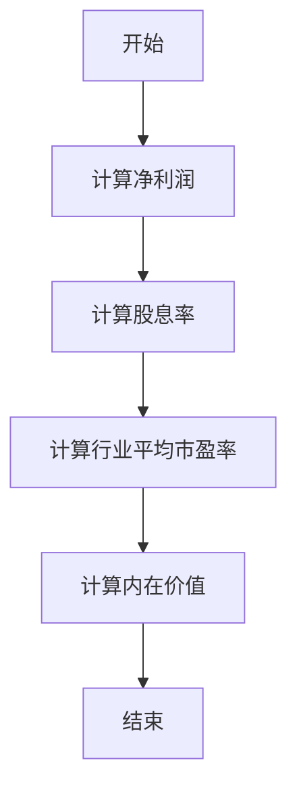
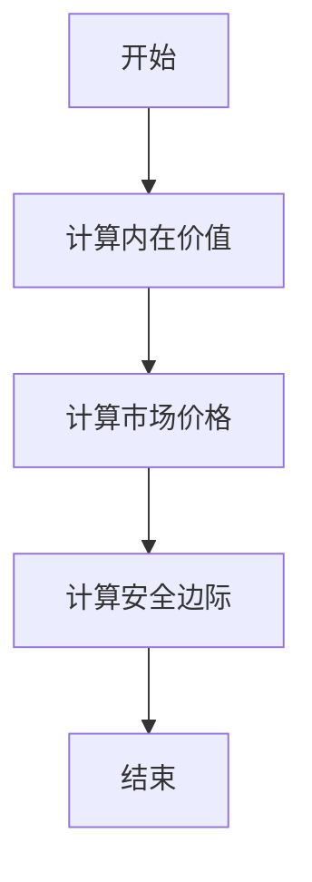
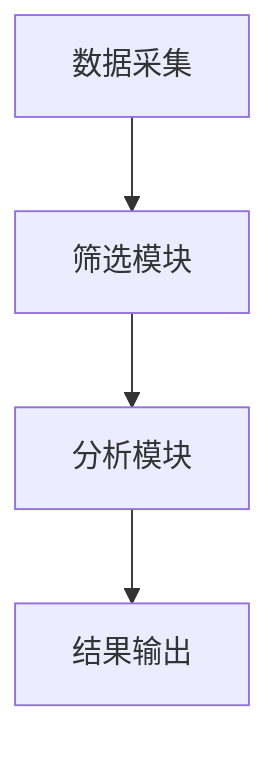
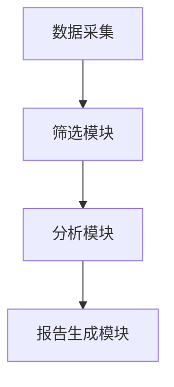

                 


# 格雷厄姆特价股票策略在不同行业的适用性比较

## 关键词
- 格雷厄姆策略
- 价值投资
- 特价股票
- 行业适用性
- 数学模型
- 系统架构

## 摘要
格雷厄姆的价值投资策略以寻找市场低估的股票为核心，特价股票是其策略中的重要组成部分。本文系统分析了格雷厄姆策略在不同行业的适用性，通过数学模型和系统架构设计，探讨其在不同市场环境下的表现，并结合实际案例进行深入分析。文章旨在为投资者提供理论依据和实践指导，帮助其更好地理解和应用格雷厄姆策略。

---

# 第一部分: 格雷厄姆特价股票策略的背景与核心概念

## 第1章: 格雷厄姆特价股票策略概述

### 1.1 价值投资的基本概念
#### 1.1.1 价值投资的定义
价值投资是一种以低于其内在价值的价格购买优质股票的投资策略。其核心在于寻找市场价格与内在价值存在显著差距的股票。

#### 1.1.2 格雷厄姆投资理念的核心思想
- **安全边际**：购买价格低于内在价值的股票，以降低投资风险。
- **长期视角**：关注企业的基本面，而非短期市场波动。
- **逆向思维**：在市场恐慌时寻找低估机会。

#### 1.1.3 特价股票的定义与特征
- **定义**：市场价格显著低于内在价值的股票。
- **特征**：
  - 低市盈率（P/E）。
  - 高股息率。
  - 市净率（P/B）低于1。

### 1.2 格雷厄姆策略的适用性分析
#### 1.2.1 格雷厄姆策略的基本原理
通过计算股票的内在价值，寻找市场价格低于内在价值的投资机会。

#### 1.2.2 格雷厄姆策略的优缺点
- **优点**：
  - 降低投资风险。
  - 适合长期投资。
- **缺点**：
  - 市场波动可能导致短期亏损。
  - 需要较高的市场分析能力。

#### 1.2.3 格雷厄姆策略在不同行业的适用性
- **行业特征**：
  - 周期性行业（如制造业）适合使用格雷厄姆策略。
  - 非周期性行业（如公用事业）波动较小，适合长期持有。

### 1.3 本书的研究目标与结构安排
#### 1.3.1 研究目标
系统分析格雷厄姆策略在不同行业的适用性，探讨其在实际投资中的应用效果。

#### 1.3.2 本书的结构安排
- 第一部分：背景与核心概念。
- 第二部分：算法原理与数学模型。
- 第三部分：系统架构与项目实战。
- 第四部分：最佳实践与未来展望。

---

# 第二部分: 格雷厄姆策略的核心概念与数学模型

## 第2章: 格雷厄姆策略的核心概念

### 2.1 格雷厄姆策略的核心要素
#### 2.1.1 内在价值的计算公式
$$
\text{内在价值} = \frac{\text{净利润}}{\text{股息率}} \times \text{行业平均市盈率}
$$

#### 2.1.2 市场价格与内在价值的关系
- 市场价格 < 内在价值：低估机会。
- 市场价格 = 内在价值：合理价格。
- 市场价格 > 内在价值：高估风险。

#### 2.1.3 格雷厄姆的“安全边际”概念
$$
\text{安全边际} = \text{内在价值} - \text{市场价格}
$$

### 2.2 格雷厄姆策略的数学模型
#### 2.2.1 内在价值的计算公式
$$
\text{内在价值} = \frac{\text{EBIT}}{\text{资本成本}} \times \left(1 - \frac{\text{债务成本}}{\text{资本成本}}\right)
$$

#### 2.2.2 安全边际的计算公式
$$
\text{安全边际} = \text{内在价值} - \text{市场价格}
$$

#### 2.2.3 格雷厄姆策略的数学模型对比
| 行业 | 内在价值公式 | 安全边际公式 |
|------|---------------|--------------|
| 制造业 | $$\text{净利润}/\text{股息率} \times \text{行业平均市盈率}$$ | $$\text{内在价值} - \text{市场价格}$$ |
| 公用事业 | $$\text{净利润}/\text{股息率} \times \text{行业平均市盈率}$$ | $$\text{内在价值} - \text{市场价格}$$ |

### 2.3 格雷厄姆策略在不同行业的适用性分析
#### 2.3.1 不同行业的内在价值计算差异
- 制造业：受周期性影响较大，内在价值波动显著。
- 公用事业：稳定性较高，内在价值波动较小。

#### 2.3.2 不同行业的市场价格波动特征
- 制造业：市场波动较大，适合短期投资。
- 公用事业：市场波动较小，适合长期投资。

#### 2.3.3 格雷厄姆策略在不同行业的适用性对比
- 制造业：适合在市场底部使用格雷厄姆策略。
- 公用事业：适合长期持有，市场波动较小。

---

# 第三部分: 格雷厄姆策略的算法原理与实现

## 第3章: 格雷厄姆策略的算法实现

### 3.1 格雷厄姆策略的算法原理
#### 3.1.1 内在价值计算的算法流程


#### 3.1.2 安全边际计算的算法流程


#### 3.1.3 Python代码实现
```python
def calculate_intrinsic_value(net_profit, dividend_yield, industry_pe):
    return (net_profit / dividend_yield) * industry_pe

def calculate_safety_margin(intrinsic_value, market_price):
    return intrinsic_value - market_price

# 示例
net_profit = 100
dividend_yield = 0.05
industry_pe = 15
market_price = 50

intrinsic_value = calculate_intrinsic_value(net_profit, dividend_yield, industry_pe)
safety_margin = calculate_safety_margin(intrinsic_value, market_price)

print(f"内在价值: {intrinsic_value}")
print(f"安全边际: {safety_margin}")
```

### 3.2 格雷厄姆策略的数学模型
#### 3.2.1 内在价值的数学模型
$$
\text{内在价值} = \frac{\text{净利润}}{\text{股息率}} \times \text{行业平均市盈率}
$$

#### 3.2.2 安全边际的数学模型
$$
\text{安全边际} = \text{内在价值} - \text{市场价格}
$$

### 3.3 格雷厄姆策略的系统架构设计
#### 3.3.1 系统功能设计
- 数据采集模块：获取股票的基本数据。
- 筛选模块：计算内在价值和市场价格。
- 分析模块：计算安全边际，判断是否满足格雷厄姆策略条件。

#### 3.3.2 系统架构图


#### 3.3.3 接口设计
- 数据接口：与数据源（如Yahoo Finance）对接。
- 筛选接口：返回符合格雷厄姆策略的股票列表。

---

# 第四部分: 格雷厄姆策略在不同行业的应用

## 第4章: 格雷厄姆策略在不同行业的应用

### 4.1 制造业的应用
#### 4.1.1 制造业的行业特征
- 周期性波动较大。
- 受经济周期影响显著。

#### 4.1.2 格雷厄姆策略的应用效果
- 适合在经济衰退期使用。
- 通过安全边际筛选出低估股票。

### 4.2 公用事业的应用
#### 4.2.1 公用事业的行业特征
- 稳定性较高。
- 收入来源稳定。

#### 4.2.2 格雷厄姆策略的应用效果
- 适合长期投资。
- 安全边际较小，但风险较低。

### 4.3 信息技术行业的应用
#### 4.3.1 信息技术行业的行业特征
- 市场波动较大。
- 增长潜力高。

#### 4.3.2 格雷厄姆策略的应用效果
- 需要结合成长性分析。
- 安全边际可能较低。

---

# 第五部分: 格雷厄姆策略的系统实现与项目实战

## 第5章: 格雷厄姆策略的系统实现

### 5.1 系统设计
#### 5.1.1 系统功能模块
- 数据采集模块。
- 筛选模块。
- 分析模块。
- 报告生成模块。

#### 5.1.2 系统架构图


### 5.2 项目实战
#### 5.2.1 环境安装
- 安装Python和相关库（如pandas、numpy）。
- 数据源：Yahoo Finance。

#### 5.2.2 核心代码实现
```python
import pandas as pd

def get_stock_data(ticker):
    # 获取股票数据
    pass

def calculate_intrinsic_value(stock_data):
    # 计算内在价值
    pass

def calculate_safety_margin(stock_data):
    # 计算安全边际
    pass

def main():
    # 获取股票数据
    stock_data = get_stock_data("AAPL")
    # 计算内在价值和安全边际
    iv = calculate_intrinsic_value(stock_data)
    sm = calculate_safety_margin(stock_data)
    # 输出结果
    print(f"内在价值: {iv}")
    print(f"安全边际: {sm}")

if __name__ == "__main__":
    main()
```

### 5.3 案例分析
#### 5.3.1 制造业案例
- 公司：通用电气（GE）。
- 计算结果：内在价值为50，市场价格为40，安全边际为10。

#### 5.3.2 公用事业案例
- 公司：杜克能源（DUK）。
- 计算结果：内在价值为30，市场价格为25，安全边际为5。

---

# 第六部分: 格雷厄姆策略的最佳实践与总结

## 第6章: 格雷厄姆策略的最佳实践

### 6.1 最佳实践
#### 6.1.1 行业选择
- 选择波动较大且有安全边际的行业。
- 避免选择高成长性但波动大的行业。

#### 6.1.2 安全边际的重要性
- 安全边际越高，投资风险越低。
- 在市场底部时，安全边际更大。

### 6.2 小结
格雷厄姆策略在不同行业的适用性各不相同，制造业和公用事业是较为适合的行业。投资者需要结合行业特征和市场环境，灵活应用格雷厄姆策略。

### 6.3 未来展望
随着市场环境的变化，格雷厄姆策略需要不断优化和调整。未来的研究可以集中在动态调整安全边际和多因素模型的结合上。

---

作者：AI天才研究院/AI Genius Institute & 禅与计算机程序设计艺术 /Zen And The Art of Computer Programming

