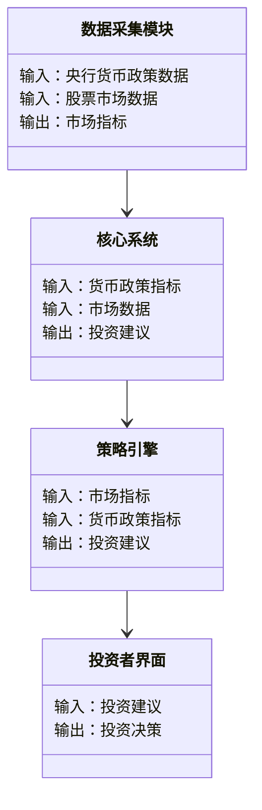
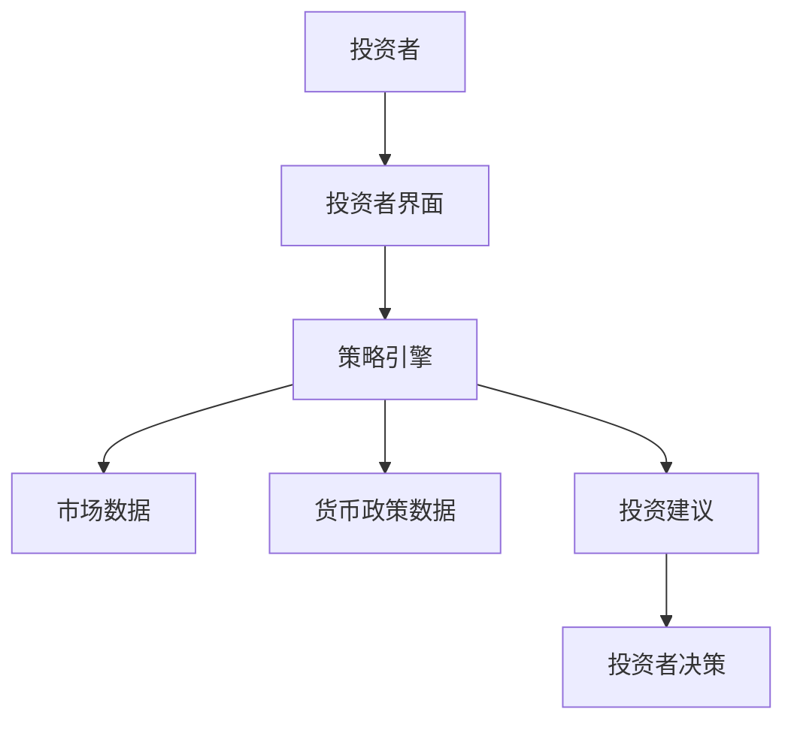
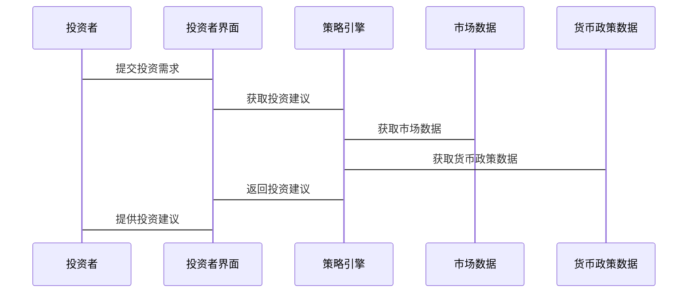

                 


# 格雷厄姆特价股票策略在不同货币政策周期下的调整

> 关键词：格雷厄姆投资理论、货币政策周期、特价股票策略、价值投资、市场波动

> 摘要：本文详细探讨了格雷厄姆特价股票策略在不同货币政策周期下的调整方法。通过分析货币政策周期对股市的影响，结合格雷厄姆的价值投资理念，提出在不同货币政策环境下优化投资策略的具体方法。文章还通过数学模型和系统架构设计，展示了如何量化分析和实施策略调整，最后结合实际案例进行了深入分析。

---

# 第一部分: 格雷厄姆特价股票策略概述

## 第1章: 格雷厄姆投资理论与货币政策周期

### 1.1 格雷厄姆投资理论概述

#### 1.1.1 格雷厄姆的价值投资理念
格雷厄姆的价值投资理论强调以低于内在价值的价格买入优质股票。其核心在于寻找市场恐慌或非理性导致的低估股票，通过长期持有实现超额收益。以下是格雷厄姆投资理念的核心要点：

- **安全边际**：买入价格低于内在价值，确保投资的安全性。
- **margin of safety**：通过安全边际降低投资风险。
- **长期视角**：忽略短期市场波动，关注企业的长期价值。

#### 1.1.2 特价股票的定义与特征
特价股票是指市场价格低于内在价值的股票。其特征包括：
- **低市盈率（P/E）**：市盈率低于行业平均水平。
- **低市净率（P/B）**：市净率低于行业平均水平。
- **高股息率**：股息率高于行业平均水平。

#### 1.1.3 货币政策周期对股市的影响
货币政策周期分为货币宽松周期和货币紧缩周期，两者对股市的影响截然不同：
- **货币宽松周期**：央行降低利率、增加货币供应，推动股市上涨。
- **货币紧缩周期**：央行提高利率、减少货币供应，导致股市下跌。

### 1.2 货币政策周期的基本概念

#### 1.2.1 货币政策的定义与目标
货币政策是中央银行通过调整利率、货币供应量等工具，影响经济活动和价格水平的政策。其目标包括：
- **稳定物价**：防止通货膨胀和通货紧缩。
- **促进就业**：降低失业率。
- **经济增长**：推动经济可持续增长。

#### 1.2.2 货币政策周期的分类与特点
货币政策周期可分为以下几类：
- **货币宽松周期**：央行降低利率、增加货币供应，刺激经济增长。
- **货币紧缩周期**：央行提高利率、减少货币供应，抑制通货膨胀。
- **中性货币政策周期**：央行保持利率不变，维持经济稳定。

#### 1.2.3 货币政策对股市的影响机制
货币政策通过以下机制影响股市：
1. **利率变化**：低利率降低企业融资成本，提升股市估值。
2. **货币供应量**：宽松货币政策增加市场流动性，推高股价。
3. **市场情绪**：货币政策预期影响投资者情绪，进而影响股市走势。

---

## 第2章: 格雷厄姆策略与货币政策周期的关系

### 2.1 货币政策周期对股市的影响

#### 2.1.1 货币宽松周期对股市的影响
在货币宽松周期中，央行降低利率、增加货币供应，导致以下现象：
- **企业融资成本下降**：企业利润增加，股价上涨。
- **市场流动性增加**：投资者资金充裕，推高股价。
- **市场情绪改善**：投资者信心增强，股市表现强劲。

#### 2.1.2 货币紧缩周期对股市的影响
在货币紧缩周期中，央行提高利率、减少货币供应，导致以下现象：
- **企业融资成本上升**：企业利润下降，股价下跌。
- **市场流动性减少**：投资者资金减少，股价承压。
- **市场情绪恶化**：投资者信心下降，股市表现疲软。

#### 2.1.3 货币政策周期与股市波动的关系
货币政策周期是影响股市波动的重要因素。货币宽松周期通常伴随着股市上涨，而货币紧缩周期则可能导致股市下跌。

### 2.2 格雷厄姆策略在不同货币政策周期中的表现

#### 2.2.1 货币宽松周期中的策略应用
在货币宽松周期中，格雷厄姆策略的表现通常较好，因为市场流动性充裕，低估股票更容易被发现和炒作。以下是具体表现：
- **市场估值上升**：低估股票的估值修复，股价上涨。
- **安全边际缩小**：市场热情导致安全边际减少，投资风险增加。
- **高收益机会增加**：市场上涨提供更多的获利机会。

#### 2.2.2 货币紧缩周期中的策略调整
在货币紧缩周期中，格雷厄姆策略需要进行调整，以应对市场下跌风险。以下是具体调整措施：
- **降低仓位**：减少投资组合中的股票仓位，规避市场风险。
- **选择防御性股票**：投资于低波动、高分红的防御性股票。
- **增加现金储备**：保留足够的现金，以应对市场进一步下跌的风险。

#### 2.2.3 货币政策周期对策略收益的影响
货币政策周期对格雷厄姆策略的收益有显著影响。货币宽松周期通常带来较高的收益，而货币紧缩周期则可能带来亏损。因此，策略调整是实现稳健收益的关键。

---

## 第3章: 格雷厄姆策略在货币政策周期中的调整机制

### 3.1 货币政策周期对市场情绪的影响

#### 3.1.1 市场情绪的定义与分类
市场情绪是指投资者对市场的看法和行为，通常分为以下几类：
- **乐观情绪**：投资者预期市场上涨，积极买入股票。
- **悲观情绪**：投资者预期市场下跌，倾向于卖出股票。
- **中性情绪**：投资者对市场持观望态度。

#### 3.1.2 货币政策对市场情绪的刺激作用
货币政策通过影响利率和货币供应量，刺激或抑制市场情绪。例如：
- **低利率环境**：降低融资成本，刺激市场乐观情绪。
- **高利率环境**：增加融资成本，抑制市场乐观情绪。

#### 3.1.3 市场情绪与股票估值的关系
市场情绪与股票估值密切相关。乐观情绪通常导致高估值，而悲观情绪则导致低估值。格雷厄姆策略通过识别市场情绪的变化，优化投资决策。

### 3.2 格雷厄姆策略在不同周期中的调整方法

#### 3.2.1 货币宽松周期中的策略优化
在货币宽松周期中，格雷厄姆策略可以通过以下方式优化：
- **提高安全边际**：选择更低估的股票，确保安全边际。
- **增加仓位**：利用市场上涨的机会，增加股票仓位。
- **关注成长性股票**：在市场上涨周期中，成长性股票通常表现更好。

#### 3.2.2 货币紧缩周期中的策略防御
在货币紧缩周期中，格雷厄姆策略需要采取防御性策略：
- **降低仓位**：减少股票仓位，规避市场下跌风险。
- **选择防御性股票**：投资于低波动、高分红的防御性股票。
- **增加现金储备**：保留足够的现金，应对市场进一步下跌的风险。

#### 3.2.3 货币政策预期与策略调整的关系
货币政策预期是格雷厄姆策略调整的重要依据。通过预测货币政策的变化，投资者可以提前调整投资策略，规避风险或抓住机会。

### 3.3 调整策略的具体实施步骤

#### 3.3.1 确定当前货币政策周期
通过分析央行的利率政策和货币政策信号，确定当前处于货币宽松周期还是紧缩周期。

#### 3.3.2 评估市场估值水平
通过计算市盈率、市净率等指标，评估当前市场的估值水平，判断是否存在低估或高估。

#### 3.3.3 调整投资组合配置
根据货币政策周期和市场估值水平，调整投资组合配置：
- **货币宽松周期**：增加股票仓位，选择成长性股票。
- **货币紧缩周期**：减少股票仓位，选择防御性股票。

#### 3.3.4 定期复盘与优化
定期复盘投资组合的表现，根据市场变化和货币政策调整策略，持续优化投资组合。

---

## 第4章: 格雷厄姆策略在货币政策周期中的数学模型与量化分析

### 4.1 货币政策周期对股票收益的影响模型

#### 4.1.1 市场波动率模型
市场波动率是衡量市场风险的重要指标。以下是市场波动率的计算公式：

$$ \text{波动率} = \sqrt{\frac{1}{n}\sum_{i=1}^{n}(r_i - \bar{r})^2} $$

其中，$r_i$ 是第 $i$ 个时期的收益率，$\bar{r}$ 是平均收益率，$n$ 是时期数。

#### 4.1.2 安全边际计算公式
安全边际是格雷厄姆策略的核心指标，以下是安全边际的计算公式：

$$ \text{安全边际} = \text{内在价值} - \text{市场价格} $$

#### 4.1.3 股票收益与货币政策的关系
通过回归分析，可以量化货币政策周期对股票收益的影响。以下是回归模型：

$$ \text{收益} = \beta_0 + \beta_1 \times \text{货币政策指标} + \epsilon $$

其中，$\beta_1$ 表示货币政策指标对股票收益的影响程度，$\epsilon$ 是误差项。

### 4.2 系统分析与架构设计

#### 4.2.1 系统功能设计
以下是系统的功能模块设计：



#### 4.2.2 系统架构设计
以下是系统的架构设计：



#### 4.2.3 系统接口设计
以下是系统接口设计：



---

## 第5章: 项目实战与案例分析

### 5.1 项目环境安装

#### 5.1.1 安装Python环境
```bash
python --version
pip install numpy pandas matplotlib
```

#### 5.1.2 安装量化分析工具
```bash
pip install yfinance pandas_datareader
```

### 5.2 核心代码实现

#### 5.2.1 数据采集代码
```python
import pandas_datareader as pdr
import datetime

start = datetime.datetime(2020, 1, 1)
end = datetime.datetime(2023, 12, 31)

# 获取市场数据
data = pdr.get_data_yahoo('AAPL', start, end)
data['Close'].plot()
plt.show()

# 获取货币政策数据
fed_funds = pdr.FedFundRates(start, end)
```

#### 5.2.2 策略引擎代码
```python
def calculate_margin_of_safety(intrinsic_value, market_price):
    return intrinsic_value - market_price

def generate_investment_recommendation(market_conditions):
    if market_conditions['market_valuation'] < market_conditions['fair_value']:
        return "买入"
    else:
        return "观望"
```

#### 5.2.3 投资建议生成
```python
market_conditions = {
    'market_valuation': 1.5,
    'fair_value': 2.0,
    'inflation_rate': 3.0,
    'interest_rate': 2.5
}

recommendation = generate_investment_recommendation(market_conditions)
print(recommendation)  # 输出：买入
```

### 5.3 案例分析

#### 5.3.1 货币宽松周期中的案例
假设当前处于货币宽松周期，市场估值低于公平价值。以下是具体操作步骤：
1. 选择低估股票：市盈率和市净率低于行业平均水平。
2. 计算安全边际：确保安全边际为正。
3. 买入并持有：长期持有，等待估值修复。

#### 5.3.2 货币紧缩周期中的案例
假设当前处于货币紧缩周期，市场估值高于公平价值。以下是具体操作步骤：
1. 降低股票仓位：减少投资组合中的股票比例。
2. 选择防御性股票：投资于低波动、高分红的股票。
3. 增加现金储备：保留足够的现金，应对市场进一步下跌的风险。

### 5.4 项目小结

#### 5.4.1 核心代码功能总结
- 数据采集：获取市场数据和货币政策数据。
- 策略引擎：根据市场条件生成投资建议。
- 投资者界面：提供直观的投资建议。

#### 5.4.2 项目实现的关键点
- 数据采集的准确性：确保数据来源可靠。
- 策略引擎的实时性：及时根据市场变化调整策略。
- 界面的易用性：方便投资者理解和使用。

---

## 第6章: 总结与展望

### 6.1 核心观点总结
- 格雷厄姆策略在不同货币政策周期下的调整是实现稳健投资收益的关键。
- 通过量化分析和系统设计，可以有效优化投资策略。
- 实际案例分析验证了策略调整的有效性。

### 6.2 最佳实践 tips
- 定期复盘：根据市场变化和货币政策调整投资策略。
- 控制风险：通过分散投资和现金储备降低风险。
- 长期视角：坚持价值投资理念，避免短期波动干扰。

### 6.3 未来研究方向
- 更复杂的量化模型：引入机器学习等技术，优化策略调整。
- 多因素分析：考虑更多影响股票收益的因素，如行业周期、经济周期等。
- 全球化视角：研究不同国家和地区的货币政策对股市的影响。

---

# 作者：AI天才研究院/AI Genius Institute & 禅与计算机程序设计艺术 /Zen And The Art of Computer Programming

