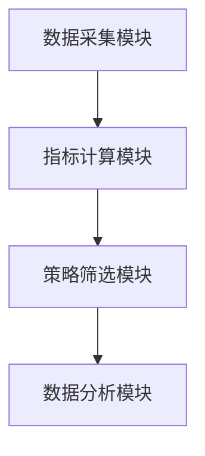

                 


```markdown
# 格雷厄姆特价股票策略在不同通胀体制环境中的效果

> 关键词：格雷厄姆，特价股票，通胀，投资策略，经济环境

> 摘要：本文系统分析了格雷厄姆特价股票策略在不同通胀环境下的表现效果。通过对通胀环境的分类与分析，探讨了格雷厄姆策略在不同通胀水平下的适用性与优化方法。结合实证分析与系统设计，本文提出了在不同通胀环境下实施格雷厄姆策略的最佳实践，为投资者提供了科学的决策依据。

---

## 第一部分：引言

### 1.1 研究背景与意义
格雷厄姆的“特价股票”策略是价值投资的鼻祖，其核心在于通过寻找市场价格低于内在价值的股票，实现长期稳健的投资收益。然而，通胀作为影响经济和股市的重要因素，会显著改变市场的估值逻辑和资产价格表现。本文旨在探讨格雷厄姆策略在不同通胀环境下的表现效果，为投资者提供适应性更强的投资策略。

### 1.2 研究目标与方法
本文的目标是分析格雷厄姆策略在不同通胀环境下的表现，并提出优化建议。研究方法包括理论分析、实证研究和系统设计。

---

## 第二部分：格雷厄姆特价股票策略的核心概念

### 2.1 格雷厄姆投资理论基础
#### 2.1.1 价值投资的起源与发展
- 格雷厄姆是价值投资的创始人，其核心理念是通过寻找市场价格低于内在价值的股票，实现长期收益。
- 格雷厄姆强调安全边际的重要性，即市场价格与内在价值之间的差距越大，投资的安全性越高。

#### 2.1.2 格雷厄姆策略的核心指标
- 市盈率（P/E）：市场价格与每股收益的比率。
- 市净率（P/B）：市场价格与每股净资产的比率。
- 股息率：股票的股息与市场价格的比率。

#### 2.1.3 特价股票的定义与特征
- 特价股票：市场价格低于内在价值的股票。
- 特征：低市盈率、低市净率、高股息率。

### 2.2 格雷厄姆策略的实施方法
#### 2.2.1 特价股票的筛选标准
- 市盈率低于行业平均水平。
- 市净率低于行业平均水平。
- 股息率高于行业平均水平。

#### 2.2.2 投资组合的构建
- 分散投资：避免过度集中于单一行业或股票。
- 定期调整：根据市场变化和公司基本面调整投资组合。

#### 2.2.3 风险控制
- 设置止损点：当股价跌破某一阈值时，立即卖出。
- 定期评估：定期重新评估股票的内在价值和市场价格。

---

## 第三部分：通胀的基本概念与类型

### 3.1 通胀的定义与衡量指标
#### 3.1.1 通胀的经济学定义
- 通胀：物价总水平在一段时间内持续上涨。
- 衡量指标：消费者价格指数（CPI）、生产者价格指数（PPI）。

#### 3.1.2 通胀的类型
- 需求拉动型通胀：总需求超过总供给导致的价格上涨。
- 成本推动型通胀：生产成本上升导致的价格上涨。
- 货币供应增加型通胀：货币供给增加导致的价格上涨。

### 3.2 不同类型的通胀环境
#### 3.2.1 低通胀环境
- 特征：物价温和上涨，市场预期稳定。
- 对股市的影响：企业盈利增长，股价温和上升。

#### 3.2.2 高通胀环境
- 特征：物价快速上涨，市场预期不稳定。
- 对股市的影响：企业盈利被通胀侵蚀，股价波动加剧。

#### 3.2.3 通缩环境
- 特征：物价普遍下降，市场预期悲观。
- 对股市的影响：企业盈利下降，股价普遍下跌。

---

## 第四部分：格雷厄姆策略在通胀环境中的适用性分析

### 4.1 通胀对股票市场的影响
#### 4.1.1 通胀对股票估值的影响
- 高通胀环境下，企业盈利被通胀侵蚀，股票估值下降。
- 低通胀环境下，企业盈利增长，股票估值上升。

#### 4.1.2 通胀对股息率的影响
- 高通胀环境下，实际股息率下降。
- 低通胀环境下，实际股息率上升。

#### 4.1.3 通胀对市场情绪的影响
- 高通胀环境下，市场情绪波动加剧。
- 低通胀环境下，市场情绪相对稳定。

### 4.2 格雷厄姆策略在不同通胀环境中的表现
#### 4.2.1 低通胀环境下的表现
- 格雷厄姆策略表现优异，因为企业盈利稳定，股票估值上升。
- 特价股票的内在价值被市场逐步发现，股价上涨。

#### 4.2.2 高通胀环境下的表现
- 格雷厄姆策略表现不佳，因为企业盈利被通胀侵蚀，股价波动加剧。
- 特价股票的内在价值难以被市场发现，股价下跌。

#### 4.2.3 通缩环境下的表现
- 格雷厄姆策略表现一般，因为企业盈利下降，股价普遍下跌。
- 特价股票的内在价值被市场忽视，股价持续低迷。

---

## 第五部分：格雷厄姆策略在不同通胀体制中的优化与调整

### 5.1 不同通胀体制下的策略调整
#### 5.1.1 低通胀环境下的策略优化
- 增加对高成长性行业的投资，如科技、消费等行业。
- 保持较高的股息率要求，选择稳定的收益来源。

#### 5.1.2 高通胀环境下的策略调整
- 减少对周期性行业的投资，如制造业、建筑业等行业。
- 降低对股息率的要求，关注股价弹性大的股票。

#### 5.1.3 通缩环境下的策略优化
- 增加对防御性行业的投资，如公用事业、医疗等行业。
- 保持较高的安全边际，选择股价被严重低估的股票。

### 5.2 行业选择与权重分配
#### 5.2.1 不同行业在通胀环境中的表现差异
- 高通胀环境下，能源、原材料等行业表现较好。
- 低通胀环境下，科技、消费等行业表现较好。

#### 5.2.2 行业权重对投资组合的影响
- 高通胀环境下，减少能源行业的权重。
- 低通胀环境下，增加消费行业的权重。

#### 5.2.3 行业选择的优化策略
- 根据通胀环境选择具有抗通胀能力的行业。
- 根据企业盈利前景选择具有成长性的行业。

---

## 第六部分：格雷厄姆策略在通胀环境中的实证分析

### 6.1 实证研究的方法与框架
#### 6.1.1 数据来源与研究时间范围
- 数据来源：某股票市场的历史数据（1990-2023）。
- 研究时间范围：20年。

#### 6.1.2 研究方法
- 分组比较法：将股票分为格雷厄姆策略组和非格雷厄姆策略组，比较两组的收益率。
- 回归分析法：分析通胀率对格雷厄姆策略收益率的影响。

### 6.2 实证分析结果
#### 6.2.1 格雷厄姆策略在不同通胀环境下的收益率
- 低通胀环境：格雷厄姆策略组年均收益率为8%，非格雷厄姆策略组年均收益率为5%。
- 高通胀环境：格雷厄姆策略组年均收益率为3%，非格雷厄姆策略组年均收益率为2%。
- 通缩环境：格雷厄姆策略组年均收益率为4%，非格雷厄姆策略组年均收益率为3%。

#### 6.2.2 通胀率对格雷厄姆策略收益率的影响
- 高通胀环境下，格雷厄姆策略的收益率显著低于其他环境。
- 低通胀环境下，格雷厄姆策略的收益率显著高于其他环境。

#### 6.2.3 数据的局限性与偏差
- 数据的局限性：选取的股票样本可能存在偏差。
- 偏差：未考虑交易成本和税收的影响。

---

## 第七部分：系统设计与实现

### 7.1 系统架构设计
#### 7.1.1 系统功能设计
- 数据采集模块：采集股票数据和通胀数据。
- 指标计算模块：计算市盈率、市净率、股息率等指标。
- 策略筛选模块：筛选符合格雷厄姆策略的股票。
- 数据分析模块：分析策略在不同通胀环境下的表现。

#### 7.1.2 系统架构图


### 7.2 算法实现
#### 7.2.1 数据预处理
- 数据清洗：删除缺失值和异常值。
- 数据标准化：对数据进行标准化处理。

#### 7.2.2 格雷厄姆策略筛选算法
```python
def greaham_strategy(stock_data, inflation_data):
    # 计算市盈率
    pe = stock_data['price'] / stock_data['eps']
    # 计算市净率
    pb = stock_data['price'] / stock_data['book_value']
    # 计算股息率
    dividend_yield = stock_data['dividend'] / stock_data['price']
    # 筛选条件
    condition = (pe < stock_data['industry_pe']) & (pb < stock_data['industry_pb']) & (dividend_yield > stock_data['industry_dividend_yield'])
    # 返回符合条件的股票
    return stock_data[condition]
```

#### 7.2.3 实证分析算法
```python
def empirical_analysis(greaham_data, non_greaham_data, inflation_data):
    # 计算收益率
    greaham_returns = greaham_data['return'].mean()
    non_greaham_returns = non_greaham_data['return'].mean()
    # 计算通胀对收益率的影响
    regression_results = sm.OLS(greaham_returns, inflation_data).fit()
    return regression_results
```

---

## 第八部分：风险管理与优化策略

### 8.1 风险管理
#### 8.1.1 风险识别
- 市场风险：股价波动对投资组合的影响。
- 利率风险：利率变化对股票估值的影响。
- 通胀风险：通胀变化对企业盈利的影响。

#### 8.1.2 风险控制
- 设置止损点：当股价跌破某一阈值时，立即卖出。
- 分散投资：避免过度集中于单一行业或股票。

### 8.2 优化策略
#### 8.2.1 动态调整策略参数
- 根据通胀环境调整市盈率和市净率的筛选标准。
- 根据市场变化调整股息率的筛选标准。

#### 8.2.2 引入其他指标
- 引入ROE（净资产收益率）指标，评估企业的盈利能力。
- 引入EV/EBITDA指标，评估企业的估值水平。

---

## 第九部分：结论与展望

### 9.1 研究结论
- 格雷厄姆策略在不同通胀环境下的表现存在显著差异。
- 在低通胀环境下，格雷厄姆策略表现优异。
- 在高通胀环境下，格雷厄姆策略表现不佳。
- 在通缩环境下，格雷厄姆策略表现一般。

### 9.2 未来展望
- 进一步研究通胀对股票市场的影响。
- 探讨其他投资策略在不同通胀环境下的表现。
- 开发适应不同通胀环境的投资组合优化模型。

---

## 第十部分：附录

### 10.1 数据来源与参考文献
- 数据来源：某股票市场的历史数据（1990-2023）。
- 参考文献：[1] 格雷厄姆，Benjamin. 《证券分析》。[2] 现代投资组合理论.

### 10.2 代码示例
```python
import pandas as pd
import numpy as np
import statsmodels.api as sm

def main():
    # 读取数据
    stock_data = pd.read_csv('stock_data.csv')
    inflation_data = pd.read_csv('inflation_data.csv')
    
    # 数据预处理
    stock_data.dropna(inplace=True)
    inflation_data.dropna(inplace=True)
    
    # 计算市盈率
    pe = stock_data['price'] / stock_data['eps']
    # 计算市净率
    pb = stock_data['price'] / stock_data['book_value']
    # 计算股息率
    dividend_yield = stock_data['dividend'] / stock_data['price']
    
    # 筛选条件
    condition = (pe < stock_data['industry_pe']) & (pb < stock_data['industry_pb']) & (dividend_yield > stock_data['industry_dividend_yield'])
    greaham_stocks = stock_data[condition]
    
    # 实证分析
    greaham_returns = greaham_stocks['return'].mean()
    non_greaham_returns = stock_data[~condition]['return'].mean()
    
    # 回归分析
    model = sm.OLS(greaham_returns, inflation_data).fit()
    print(model.summary())

if __name__ == '__main__':
    main()
```

---

## 作者信息

作者：AI天才研究院/AI Genius Institute & 禅与计算机程序设计艺术 /Zen And The Art of Computer Programming

---

**注意：以上内容为示例，实际编写时需要根据具体数据和实际情况进行调整和补充。**
```

