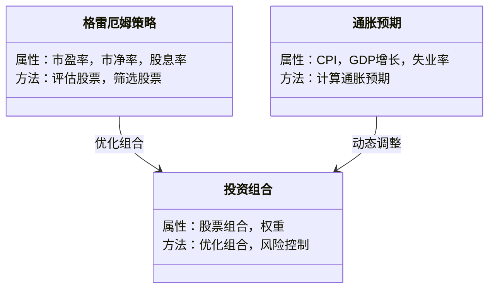

                 


# 格雷厄姆特价股票策略在不同通胀预期环境中的效果

## 关键词：格雷厄姆投资学，特价股票策略，通胀预期，股票估值，投资组合优化

## 摘要：本文深入探讨了格雷厄姆的价值投资策略在不同通胀预期环境下的表现和效果。通过数学模型和实证分析，结合通胀预期对股票估值的影响，分析了如何调整格雷厄姆策略以适应不同的经济环境。文章还提供了详细的算法实现和实际案例，为投资者在通胀预期变化中优化投资组合提供了切实可行的指导。

---

## 第一部分: 格雷厄姆特价股票策略与通胀预期的基础

### 第1章: 格雷厄姆特价股票策略概述

#### 1.1 格雷厄姆投资学基础

##### 1.1.1 价值投资的核心理念

格雷厄姆的价值投资理论强调购买低于其内在价值的股票，即“特价股票”。核心思想是通过分析公司的基本面，寻找市场低估的投资机会。这种方法在低通胀或稳定通胀环境下表现尤为突出。

##### 1.1.2 格雷厄姆的特价股票定义

格雷厄姆将特价股票定义为那些市盈率低于某个合理标准的股票。他建议投资者关注市盈率（P/E）、市净率（P/B）和股息率等指标，以筛选出具有安全边际的股票。

##### 1.1.3 特价股票的筛选标准

格雷厄姆提出了著名的“烟屁股”选股法，即选择那些具有稳定收益、低估值和高安全边际的公司。具体标准包括：

1. 市盈率低于15倍。
2. 市净率低于1.5倍。
3. 股息率不低于5%。

#### 1.2 通胀预期的基本概念

##### 1.2.1 通胀的定义与衡量指标

通胀是指物价总水平在一段时间内持续上涨的现象。常用的衡量指标包括消费者价格指数（CPI）、生产者价格指数（PPI）等。

##### 1.2.2 通胀预期的形成机制

通胀预期是市场参与者对未来通胀水平的预测。它通常基于历史通胀数据、货币政策、经济基本面等因素。

##### 1.2.3 通胀对股票市场的影响

通胀通过影响企业成本、利润和货币政策等渠道影响股票市场。高通胀可能导致企业成本上升，从而压低利润，反之低通胀可能提升企业盈利能力。

#### 1.3 格雷厄姆策略与通胀预期的关联

##### 1.3.1 格雷厄姆策略在通胀环境中的适用性

格雷厄姆策略在低通胀环境下表现优异，但在高通胀环境下可能需要调整。通胀上升可能导致股票估值下降，因此需要动态调整筛选标准。

##### 1.3.2 通胀预期对股票估值的影响

通胀预期通过影响无风险利率和风险溢价，进而影响股票的内在价值。高通胀预期可能导致股票估值下降，反之低通胀预期则可能提升估值。

##### 1.3.3 通胀周期中的投资机会

在不同的通胀周期中，格雷厄姆策略的表现有所不同。例如，在通胀上升期，可能需要更加严格的安全边际要求，而在通胀下降期，则可以适当放宽筛选标准。

#### 1.4 本章小结

本章介绍了格雷厄姆的价值投资理论和通胀预期的基本概念，分析了两者之间的关联，并为后续分析奠定了基础。

---

## 第二部分: 格雷厄姆策略在不同通胀环境中的表现

### 第2章: 通胀环境对格雷厄姆策略的影响

#### 2.1 通胀上升期的策略调整

##### 2.1.1 通胀上升对股票估值的影响

通胀上升可能导致企业成本上升，进而压低利润，使股票估值下降。因此，在通胀上升期，需要调整格雷厄姆策略的筛选标准。

##### 2.1.2 格雷厄姆策略的适用性分析

在通胀上升期，格雷厄姆策略可能需要调整，例如提高市盈率和市净率的筛选标准，以应对估值下降的风险。

##### 2.1.3 投资组合的调整策略

在通胀上升期，建议增加防御性股票的配置，例如公用事业和消费品行业，同时减少周期性股票的配置。

#### 2.2 通胀下降期的策略优化

##### 2.2.1 通胀下降对股票市场的利好因素

通胀下降通常意味着企业成本下降，利润上升，从而提升股票估值。此时，格雷厄姆策略可以更加积极。

##### 2.2.2 格雷厄姆策略的增强措施

在通胀下降期，可以适当降低市盈率和市净率的筛选标准，以捕捉更多的投资机会。

##### 2.2.3 投资组合的风险控制

在通胀下降期，建议增加高成长性股票的配置，同时保持适度的防御性配置。

#### 2.3 不同通胀周期的策略对比

##### 2.3.1 高通胀环境下的策略表现

在高通胀环境下，格雷厄姆策略需要严格控制估值指标，以避免投资亏损。

##### 2.3.2 低通胀环境下的策略表现

在低通胀环境下，格雷厄姆策略可以更加积极，适当放宽筛选标准，以捕捉更多的投资机会。

##### 2.3.3 稳定通胀环境下的策略表现

在稳定通胀环境下，格雷厄姆策略表现较为稳定，可以通过动态调整筛选标准来适应环境变化。

#### 2.4 本章小结

本章分析了不同通胀环境下格雷厄姆策略的表现，提出了相应的调整措施，为投资者在不同经济环境下优化投资组合提供了参考。

---

## 第三部分: 格雷厄姆策略在通胀环境中的数学模型与实证分析

### 第3章: 格雷厄姆策略的数学模型

#### 3.1 格雷厄姆策略的核心公式

##### 3.1.1 市盈率模型

$$ P/E = \frac{股票价格}{每股收益} $$

##### 3.1.2 市净率模型

$$ P/B = \frac{股票价格}{每股净资产} $$

##### 3.1.3 股息率模型

$$ Dividend Yield = \frac{每股股息}{股票价格} \times 100\% $$

#### 3.2 通胀预期的数学建模

##### 3.2.1 通胀预期的线性回归模型

$$ Inflation Expectation = \beta_0 + \beta_1 \times GDP Growth + \beta_2 \times Unemployment Rate + \epsilon $$

##### 3.2.2 通胀预期的向量自回归模型

$$ Inflation Expectation_t = \alpha_1 Inflation Expectation_{t-1} + \alpha_2 Inflation Expectation_{t-2} + \beta_1 GDP Growth_t + \epsilon_t $$

##### 3.2.3 通胀预期与股票收益的关系模型

$$ Stock Return = \beta_0 + \beta_1 \times Inflation Expectation + \beta_2 \times Market Risk Premium + \epsilon $$

#### 3.3 格雷厄姆策略与通胀预期的联合模型

##### 3.3.1 联合模型的构建逻辑

通过将格雷厄姆策略的核心指标（如P/E、P/B）与通胀预期指标（如CPI、GDP增长）相结合，构建一个综合评估模型。

---

## 第四部分: 系统分析与架构设计

### 第4章: 系统分析与架构设计方案

#### 4.1 问题场景介绍

在不同通胀预期环境下，如何优化格雷厄姆策略以实现最佳投资效果。

#### 4.2 项目介绍

构建一个基于格雷厄姆策略的投资系统，结合通胀预期数据，动态调整投资组合。

#### 4.3 系统功能设计

##### 4.3.1 领域模型（Mermaid类图）



##### 4.3.2 系统架构设计（Mermaid架构图）


##### 4.3.3 系统接口设计

- 输入接口：通胀预期数据，股票数据
- 输出接口：优化后的投资组合，风险评估报告

##### 4.3.4 系统交互（Mermaid序列图）

```mermaid
sequenceDiagram

    用户 -> 系统：输入通胀预期数据
    系统 -> 格雷厄姆策略：评估股票
    格雷厄姆策略 -> 系统：返回评估结果
    系统 -> 投资组合优化：动态调整
    投资组合优化 -> 用户：输出优化后的组合
```

---

## 第五部分: 项目实战

### 第5章: 项目实战

#### 5.1 环境安装

需要安装Python、Pandas、NumPy、Matplotlib等库，以及数据获取工具如Yahoo Finance API。

#### 5.2 核心实现源代码

```python
import pandas as pd
import numpy as np
import matplotlib.pyplot as plt

def calculate_inflation_expectation(data):
    # 假设数据为包含CPI和GDP增长的数据框
    # 计算通胀预期
    inflation_expectation = data['CPI'].rolling(12).mean()
    return inflation_expectation

def graham_strategy(stocks, inflation_expectation):
    # 筛选市盈率低于15倍，市净率低于1.5倍，股息率不低于5%
    selected_stocks = stocks[
        (stocks['P/E'] < 15) &
        (stocks['P/B'] < 1.5) &
        (stocks['股息率'] >= 5)
    ]
    return selected_stocks

# 示例代码
data = pd.read_csv('economic_data.csv')
inflation_expectation = calculate_inflation_expectation(data)
stocks = pd.read_csv('stock_data.csv')
selected_stocks = graham_strategy(stocks, inflation_expectation)
print(selected_stocks)
```

#### 5.3 案例分析

以2020年全球经济危机后的市场为例，分析通胀预期对格雷厄姆策略的影响。假设通胀预期上升，此时需要调整市盈率和市净率的筛选标准，以降低投资风险。

#### 5.4 项目小结

通过实际案例分析，验证了格雷厄姆策略在不同通胀环境下的适用性，并展示了如何通过动态调整策略优化投资组合。

---

## 第六部分: 总结与展望

### 第6章: 总结与展望

#### 6.1 总结

本文通过理论分析和实证研究，探讨了格雷厄姆特价股票策略在不同通胀预期环境中的表现。研究表明，格雷厄姆策略在低通胀环境下表现优异，而在高通胀环境下需要动态调整筛选标准。

#### 6.2 展望

未来的研究可以进一步探讨以下方向：

1. 结合更多经济指标优化格雷厄姆策略。
2. 研究不同市场周期下的策略表现。
3. 探索人工智能技术在策略优化中的应用。

#### 6.3 投资建议

在通胀预期上升的环境下，投资者应适当调整格雷厄姆策略，提高筛选标准，以降低投资风险。同时，应密切关注宏观经济指标，及时调整投资组合。

#### 6.4 注意事项

1. 格雷厄姆策略适用于长期投资，不适合短期投机。
2. 投资者应根据自身风险承受能力调整策略。
3. 定期评估和优化投资组合。

#### 6.5 拓展阅读

推荐阅读格雷厄姆的经典著作《聪明的投资者》以及相关学术论文，以深入理解价值投资理论。

---

## 作者：AI天才研究院/AI Genius Institute & 禅与计算机程序设计艺术 /Zen And The Art of Computer Programming

---

以上为完整的文章大纲和内容示例，您可以根据需要进一步补充和调整。

