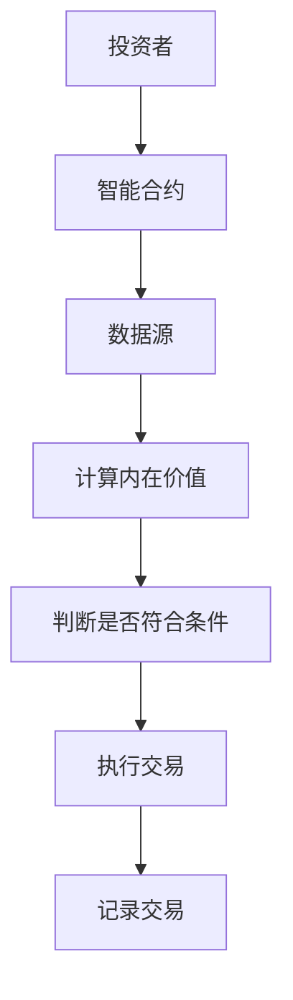

                 


# 格雷厄姆特价股票策略在区块链驱动的金融市场中的应用

**关键词：** 格雷厄姆策略, 区块链, 去中心化金融（DeFi）, 智能合约, 价值投资

**摘要：**  
本文探讨了格雷厄姆特价股票策略在区块链驱动金融市场中的应用，分析了传统金融市场的局限性与区块链技术的优势。通过详细讲解格雷厄姆策略的核心原理、区块链技术的特点，以及两者结合的可能性，展示了如何利用智能合约实现自动化价值投资。文章内容涵盖理论分析、算法实现、系统架构设计、项目实战等，为读者提供从基础到实践的全面指导。

---

# 第一部分：背景介绍

## 第1章：传统金融市场的局限性

### 1.1 传统金融市场的运作机制
- 传统金融市场的核心参与者：投资者、上市公司、券商、交易所、监管机构
- 传统投资策略：价值投资、成长投资、趋势投资
- 传统市场的局限性：
  - 信息不对称
  - 交易成本高
  - 监管复杂

### 1.2 格雷厄姆特价股票策略的核心思想
- 价值投资的核心理念：寻找市场价格低于内在价值的股票
- 格雷厄姆策略的特点：
  - 长期投资
  - 低风险、高回报
  - 侧重于基本面分析

## 第2章：区块链技术的崛起

### 2.1 区块链技术的基本概念
- 区块链的定义：分布式账本技术
- 区块链的核心特性：
  - 去中心化
  - 透明性
  - 不可篡改
  - 点对点传输

### 2.2 区块链在金融领域的应用
- 股票交易：去中心化交易所（DEX）
- 资产发行：代币化资产
- 智能合约：自动执行金融协议

---

# 第二部分：格雷厄姆策略与区块链技术的结合

## 第3章：区块链驱动金融市场的特点

### 3.1 去中心化金融（DeFi）的优势
- DeFi的核心理念：去中心化、透明、无信任
- DeFi的主要应用：借贷、交易、投资
- DeFi与传统金融的对比：

| 特性 | 传统金融 | DeFi |
|------|----------|------|
| 中心化 | 高       | 低   |
| 透明性 | 低       | 高   |
| 成本 | 高       | 低   |

### 3.2 区块链技术如何提升金融市场的效率
- 智能合约的应用：自动执行投资策略
- 去中心化交易所：降低交易成本
- 区块链的安全性：防止数据篡改

---

## 第4章：格雷厄姆策略在区块链中的应用潜力

### 4.1 格雷厄姆策略的核心步骤
1. 评估股票的内在价值
2. 寻找市场价格低于内在价值的股票
3. 长期持有，等待市场回归

### 4.2 区块链如何实现格雷厄姆策略
- 智能合约的作用：自动执行投资决策
- 数据源的利用：实时获取股票数据
- 投资策略的自动化：基于智能合约触发交易

---

# 第三部分：算法原理与技术实现

## 第5章：格雷厄姆策略的算法实现

### 5.1 格雷厄姆策略的数学模型
- 内在价值公式：
  $$\text{内在价值} = \sum_{t=1}^{\infty} \frac{D_t}{(1+r)^t}$$
  其中，\( D_t \) 是第 \( t \) 年的股息，\( r \) 是期望回报率。

### 5.2 智能合约的实现步骤
1. 数据采集：获取目标股票的基本面数据
2. 评估内在价值：计算股票的内在价值
3. 判断投资机会：比较市场价格与内在价值
4. 执行交易：通过智能合约自动买入或卖出

### 5.3 算法流程图


## 第6章：系统架构设计

### 6.1 系统功能设计
- 数据采集模块：实时获取股票数据
- 智能合约模块：执行投资决策
- 用户界面模块：展示投资结果

### 6.2 系统架构图


### 6.3 接口设计
- API接口：用于数据采集和交易执行
- 智能合约接口：用于与区块链交互

---

# 第四部分：项目实战

## 第7章：搭建环境与实现步骤

### 7.1 安装Solidity
- 下载Solidity编译器
- 配置以太坊节点

### 7.2 编写智能合约代码
```solidity
// SPDX-License-Identifier: MIT
pragma solidity ^0.8.0;

contract GrahamStrategy {
    // 数据存储
    struct Stock {
        uint price;
        uint dividend;
        uint growthRate;
    }

    // 评估内在价值
    function calculateIntrinsicValue(uint dividend, uint growthRate, uint discountRate) public pure returns (uint) {
        return dividend / (discountRate - growthRate);
    }

    // 判断是否符合条件
    function shouldInvest(uint price, uint intrinsicValue) public pure returns (bool) {
        return price < intrinsicValue;
    }
}
```

### 7.3 代码解读与实际案例分析
- 分析某公司股票的基本面数据
- 计算其内在价值
- 判断是否符合投资条件

---

# 第五部分：总结与展望

## 第8章：总结与展望

### 8.1 核心小结
- 格雷厄姆策略在区块链中的应用潜力巨大
- 智能合约能够实现投资策略的自动化
- DeFi为价值投资提供了新的可能性

### 8.2 注意事项与风险提示
- 智能合约的安全性问题
- 市场波动的风险
- 监管政策的变化

### 8.3 拓展阅读
- 《The Intelligent Investor》
- 《Blockchain Basics: A Non-Technical Guide to Understanding Blockchain》

---

作者：AI天才研究院/AI Genius Institute & 禅与计算机程序设计艺术 /Zen And The Art of Computer Programming

