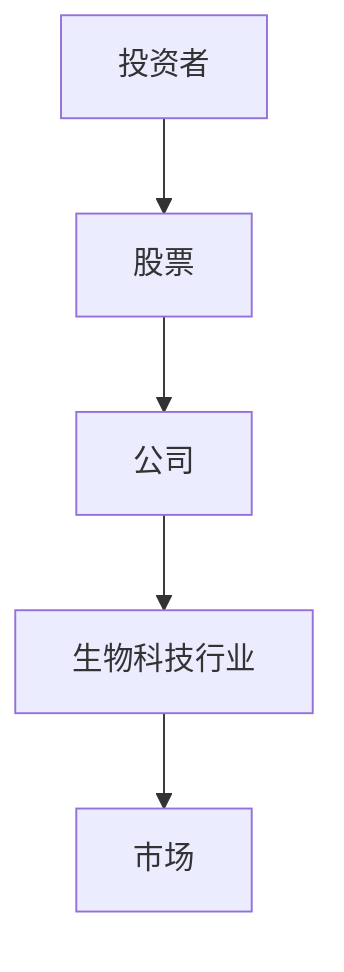
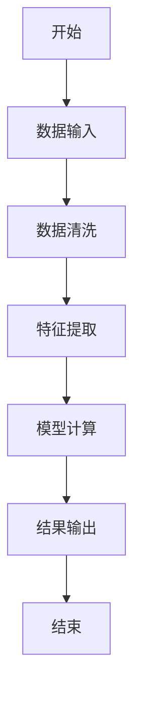
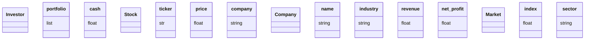
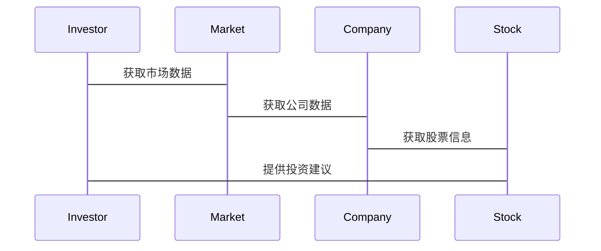

                 


# 格雷厄姆特价股票策略在生物科技行业的应用挑战

> 关键词：价值投资，生物科技，股票策略，市场分析，投资风险

> 摘要：本文探讨了格雷厄姆的价值投资策略在生物科技行业的应用挑战，分析了生物科技行业的独特属性、格雷厄姆策略的核心要素以及两者结合的可行性，通过案例分析和系统设计，揭示了在生物科技行业实施格雷厄姆策略的关键步骤和实际应用中的难点，并提出了相应的解决方案。

---

# 第一部分: 格雷厄姆特价股票策略与生物科技行业概述

## 第1章: 格雷厄姆特价股票策略的核心概念

### 1.1 价值投资的基本原理

#### 1.1.1 价值投资的定义与核心理念
价值投资是一种以基本面分析为基础的投资策略，其核心理念是寻找市场中被低估的资产。格雷厄姆在他的经典著作《聪明的投资者》中提出，投资者应该寻找那些市场价格低于其内在价值的股票。

- **内在价值**：股票的真实价值，基于公司的财务状况、盈利能力、行业地位等因素。
- **安全边际**：市场价格与内在价值之间的差距，是投资的安全垫。

#### 1.1.2 格雷厄姆投资策略的演变
格雷厄姆的价值投资策略经历了多年的发展和演变，主要特点包括：
- 以基本面分析为主，注重企业的财务指标。
- 强调安全边际，避免高风险投资。
- 长期持有，追求稳定收益。

#### 1.1.3 特价股票的识别标准与方法
格雷厄姆提出的特价股票识别标准包括：
- 市盈率低于行业平均水平。
- 股票价格远低于账面价值。
- 公司具有稳定的盈利能力。

### 1.2 生物科技行业的特点与挑战

#### 1.2.1 生物科技行业的定义与范围
生物科技行业是指利用生物技术进行研发、生产和销售的行业，涵盖医药、医疗设备、基因技术等领域。其特点是：
- 技术壁垒高，研发投入大。
- 发展周期长，从研发到商业化通常需要数年时间。
- 市场波动大，受政策和监管影响显著。

#### 1.2.2 生物科技行业的投资特点
- 高风险：产品研发失败的可能性较高。
- 高回报：成功产品的市场潜力巨大。
- 周期长：从研发到商业化周期较长。

#### 1.2.3 生物科技行业的风险与机会
- **风险**：政策变化、研发失败、市场竞争激烈。
- **机会**：技术创新、市场潜力大、政策支持。

### 1.3 格雷厄姆策略在生物科技行业的应用背景

#### 1.3.1 格雷厄姆策略与生物科技行业的契合点
- 格雷厄姆策略注重安全边际，适合在生物科技行业寻找低估的股票。
- 生物科技行业的产品周期与格雷厄姆策略的长期投资理念相契合。

#### 1.3.2 生物科技行业中的价值投资机会
- 技术领先的企业具有长期增长潜力。
- 政策支持下，部分生物科技企业可能被低估。

#### 1.3.3 当前市场环境下的应用挑战
- 生物科技行业的高波动性与格雷厄姆策略的稳定性要求存在矛盾。
- 行业特性与格雷厄姆策略的基本假设存在差异。

---

## 第2章: 格雷厄姆策略与生物科技行业的核心概念

### 2.1 格雷厄姆策略的核心要素

#### 2.1.1 知识产权评估
- 生物科技企业的核心竞争力在于其知识产权，包括专利、技术诀窍等。
- 知识产权的价值评估需要考虑其市场潜力和保护期限。

#### 2.1.2 财务指标分析
- 格雷厄姆策略依赖于企业的财务健康状况，包括净利润、资产负债率等指标。
- 生物科技企业通常研发投入大，财务压力较大。

#### 2.1.3 市场定位与竞争分析
- 格雷厄姆策略要求企业具有较强的市场地位和竞争优势。
- 生物科技行业的市场定位需要考虑政策、技术壁垒等因素。

### 2.2 生物科技行业的核心要素

#### 2.2.1 研发周期与成本
- 生物科技产品的研发周期长，成本高。
- 研发失败的可能性较高，增加了投资风险。

#### 2.2.2 政策环境与监管要求
- 生物科技行业受政策和监管影响较大。
- 政策变化可能影响企业的市场地位和盈利能力。

#### 2.2.3 技术创新与商业化能力
- 技术创新是生物科技行业发展的核心驱动力。
- 商业化能力决定了企业能否将技术转化为实际收益。

### 2.3 核心概念的对比与联系

#### 2.3.1 格雷厄姆策略与生物科技行业的属性对比

| 核心要素       | 格雷厄姆策略                     | 生物科技行业                   |
|----------------|----------------------------------|-------------------------------|
| 投资理念       | 价值投资，寻找低估资产           | 高风险、高回报                 |
| 投资周期       | 长期持有                        | 发展周期长，从研发到商业化     |
| 关键指标       | 财务指标、市盈率                 | 知识产权、研发周期             |

#### 2.3.2 核心概念的ER实体关系图



---

## 第3章: 格雷厄姆策略在生物科技行业的算法原理

### 3.1 格雷厄姆策略的数学模型

#### 3.1.1 格雷厄姆的内在价值公式
$$ V = \frac{E}{(1 + r)^n} $$
其中，$E$ 是企业的预期收益，$r$ 是折现率，$n$ 是投资周期。

#### 3.1.2 格雷厄姆的选股标准
- 市盈率低于行业平均水平。
- 股价远低于账面价值。
- 公司具有稳定的盈利能力。

### 3.2 生物科技行业数据的处理与分析

#### 3.2.1 数据清洗与特征提取
- 清洗数据：去除无效数据，处理异常值。
- 特征提取：提取关键财务指标和市场数据。

#### 3.2.2 财务指标的加权计算
- 根据行业特点调整财务指标的权重。

#### 3.2.3 市场情绪与风险评估
- 利用市场数据和情绪指标评估投资风险。

### 3.3 算法流程图



### 3.4 算法实现

#### 3.4.1 Python代码实现

```python
import pandas as pd
import numpy as np

def calculate_intrinsic_value(revenue, net_profit, growth_rate, discount_rate, period):
    return (revenue * (1 + growth_rate) ** period) / (1 + discount_rate) ** period

data = pd.read_csv('biotech_data.csv')
data['intrinsic_value'] = calculate_intrinsic_value(data['revenue'], data['net_profit'], 0.1, 0.05, 5)
data.to_csv('intrinsic_value.csv', index=False)
```

#### 3.4.2 实际案例分析
假设某生物科技企业过去5年的收入和净利润分别为：
- 年收入：$100 million
- 净利润：$20 million
- 年增长率为：10%
- 折现率为：5%

计算其内在价值：
$$ V = \frac{20}{(1 + 0.05)^5} = \frac{20}{1.276} \approx 15.66 million $$

---

## 第4章: 格雷厄姆策略在生物科技行业的系统分析

### 4.1 系统功能设计

#### 4.1.1 领域模型类图



### 4.2 系统架构设计


### 4.3 系统接口设计
- 输入接口：股票数据、财务指标。
- 输出接口：内在价值、投资建议。

### 4.4 系统交互流程



---

## 第5章: 格雷厄姆策略在生物科技行业的项目实战

### 5.1 项目环境配置
- 数据来源：公开市场数据、财务报表。
- 工具：Python、Pandas、NumPy。

### 5.2 核心代码实现

#### 5.2.1 环境配置

```bash
pip install pandas numpy
```

#### 5.2.2 核心代码

```python
import pandas as pd
import numpy as np

def calculate_intrinsic_value(revenue, net_profit, growth_rate, discount_rate, period):
    return (revenue * (1 + growth_rate) ** period) / (1 + discount_rate) ** period

data = pd.read_csv('biotech_data.csv')
data['intrinsic_value'] = calculate_intrinsic_value(data['revenue'], data['net_profit'], 0.1, 0.05, 5)
data.to_csv('intrinsic_value.csv', index=False)
```

### 5.3 实际案例分析
通过实际案例分析，验证算法的有效性，并根据结果提出投资建议。

### 5.4 项目小结
总结项目实施过程中的经验教训，提出改进建议。

---

## 第6章: 格雷厄姆策略在生物科技行业的最佳实践

### 6.1 小结
总结全文内容，强调格雷厄姆策略在生物科技行业的应用价值和挑战。

### 6.2 注意事项
- 注意行业特性，避免盲目套用策略。
- 定期评估模型，及时调整策略。

### 6.3 拓展阅读
推荐相关书籍和文献，供读者深入学习。

---

# 作者：AI天才研究院/AI Genius Institute & 禅与计算机程序设计艺术 /Zen And The Art of Computer Programming

