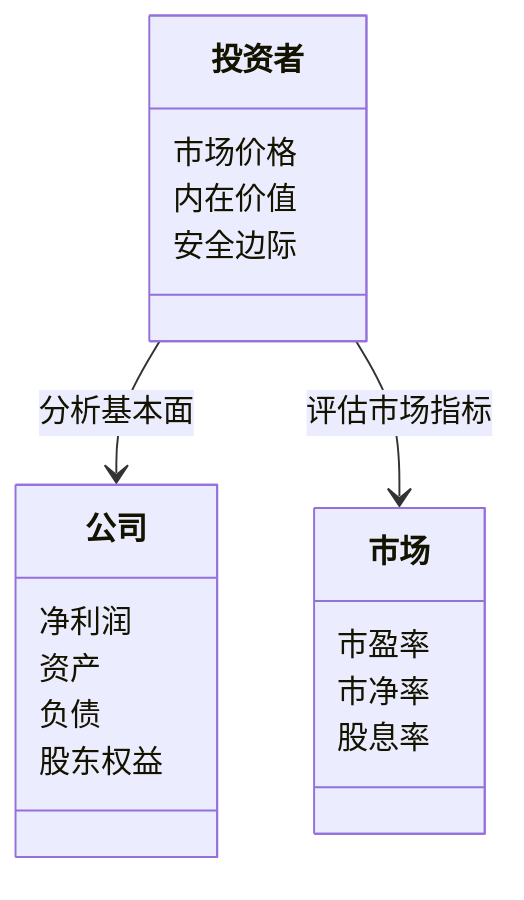
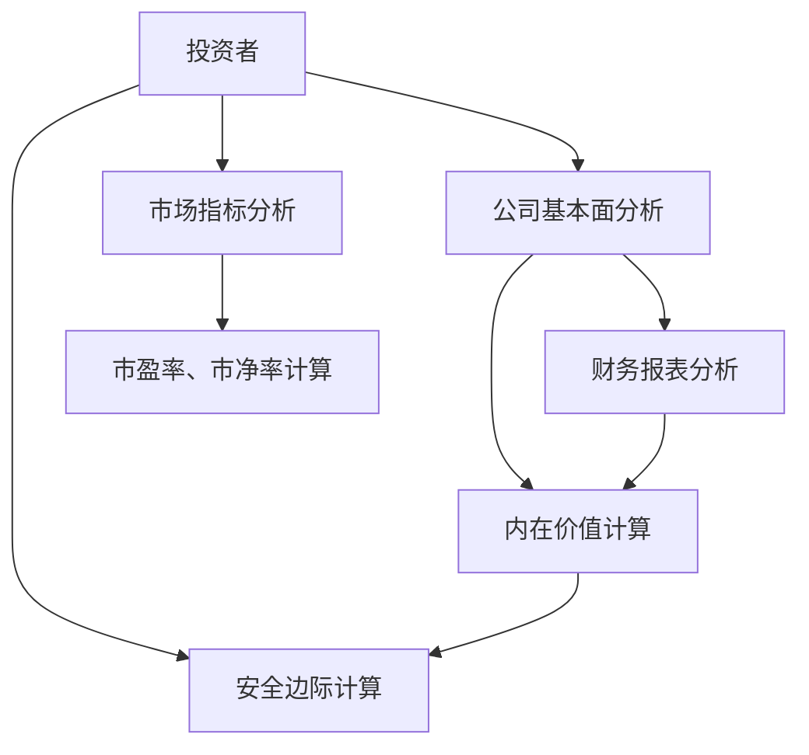

                 


# 格雷厄姆的价值投资名言解读

> 关键词：价值投资、格雷厄姆、内在价值、安全边际、投资策略、投资哲学

> 摘要：本文深入解读了格雷厄姆的价值投资理论，通过分析其核心概念、数学模型、系统架构和实际案例，帮助读者全面理解价值投资的精髓。文章从背景介绍、核心概念、算法原理、系统架构、项目实战到最佳实践，层层剖析，为读者提供一份详尽的价值投资指南。

---

## 第1章: 价值投资的背景与概述

### 1.1 价值投资的基本概念

#### 1.1.1 投资的定义与分类
投资是指将资金投入某个项目或资产，以期望在未来获得收益或资本增值的行为。根据投资对象的不同，可以将投资分为股票投资、债券投资、房地产投资等。在股票投资领域，价值投资是一种以寻找被市场低估的股票为核心策略的投资方法。

#### 1.1.2 价值投资的核心理念
价值投资的核心理念在于寻找市场价格低于其内在价值的股票。格雷厄姆认为，市场的短期波动性使得股票价格与实际价值之间存在差异，投资者应通过基本面分析找到这些价格错配的机会。

#### 1.1.3 格雷厄姆与价值投资的关系
格雷厄姆是价值投资的鼻祖，他的投资理念深刻影响了巴菲特等著名投资者。格雷厄姆的价值投资理论强调安全边际和内在价值的计算，为现代投资理论奠定了基础。

### 1.2 格雷厄姆的生平与贡献

#### 1.2.1 格雷厄姆的生平简介
本杰明·格雷厄姆（Benjamin Graham）是20世纪著名的投资学家，被誉为“价值投资之父”。他出生于1894年，早年从事法律工作，后转投金融领域。他在投资领域的主要贡献在于创立了价值投资理论。

#### 1.2.2 格雷厄姆对投资理论的贡献
格雷厄姆提出了“安全边际”的概念，强调在投资时应留有安全空间，避免承担过高的风险。他还撰写了《证券分析》一书，系统阐述了价值投资的方法。

#### 1.2.3 格雷厄姆投资理念的现代意义
尽管格雷厄姆的投资理论诞生于20世纪，但其核心理念在今天仍然具有重要的指导意义。尤其是在当前市场波动加剧的环境下，格雷厄姆的安全边际理论为投资者提供了重要的风险管理工具。

### 1.3 本书的目标与读者定位

#### 1.3.1 本书的核心目标
本文旨在通过解读格雷厄姆的价值投资名言，帮助读者深入理解价值投资的理论与实践。我们将从格雷厄姆的核心概念、数学模型、系统架构到实际案例进行全面分析。

#### 1.3.2 本书的读者群体
本书适合对价值投资感兴趣的投资新手、经验丰富的投资者以及对投资理论感兴趣的学者。无论读者的背景如何，都能从本文中获得启发。

#### 1.3.3 本书的结构安排
本文将按照逻辑顺序展开，从格雷厄姆的价值投资理论、数学模型、系统架构到实际案例，层层深入，确保读者能够全面理解价值投资的精髓。

---

## 第2章: 格雷厄姆价值投资的核心概念

### 2.1 格雷厄姆的价值投资理论框架

#### 2.1.1 安全边际的概念与作用
安全边际是指股票的市场价格与内在价值之间的差额。格雷厄姆认为，安全边际的存在可以降低投资风险，确保投资者在市场波动中仍能获得收益。

#### 2.1.2 内在价值的定义与计算
内在价值是股票基于其基本面因素（如盈利能力、资产价值等）所具有的真实价值。格雷厄姆提出了内在价值的计算公式：
$$ V = \frac{E}{k} $$
其中，\( V \) 表示内在价值，\( E \) 表示预期收益，\( k \) 表示折现率。

#### 2.1.3 股票与市场的区别
股票价格受市场情绪影响较大，而内在价值则主要取决于公司的基本面。格雷厄姆认为，市场的短期波动为投资者提供了以低于内在价值的价格买入股票的机会。

### 2.2 格雷厄姆的投资策略与原则

#### 2.2.1 质价比（P/E Ratio）的运用
质价比是股票价格与每股收益的比率，用于衡量股票的估值水平。格雷厄姆认为，质价比过高的股票可能被市场高估，投资者应寻找质价比低于市场平均水平的股票。

#### 2.2.2 市净率（P/B Ratio）的分析
市净率是股票价格与每股净资产的比率，用于衡量股票的价值。格雷厄姆认为，市净率低于1的股票通常具有较高的投资价值。

#### 2.2.3 股息率与投资决策
股息率是股票的年股息与股价的比率，用于衡量股票的分红能力。格雷厄姆认为，高股息率的股票通常具有较高的稳定性，是保守投资者的理想选择。

### 2.3 格雷厄姆的投资哲学与心理学

#### 2.3.1 投资中的心理因素
格雷厄姆强调，投资者的心理因素对投资决策有着重要影响。他提醒投资者要避免贪婪和恐惧，保持理性。

#### 2.3.2 格雷厄姆的保守主义投资观
格雷厄姆倡导保守投资，注重风险控制。他认为，投资者应选择那些具有稳定盈利能力和良好财务状况的公司。

#### 2.3.3 风险管理与长期投资
格雷厄姆认为，风险管理是投资成功的关键。他建议投资者应分散投资，避免过度集中在某一只股票或行业。

---

## 第3章: 格雷厄姆价值投资的数学模型与公式

### 3.1 内在价值的计算公式

#### 3.1.1 内在价值的定义公式
$$ V = \frac{E}{k} $$
其中，\( V \) 为内在价值，\( E \) 为预期收益，\( k \) 为折现率。

#### 3.1.2 预期收益的计算方法
预期收益可以通过对公司未来盈利能力的预测来确定。通常，预期收益可以用以下公式计算：
$$ E = \text{净利润} \times (1 + g) $$
其中，\( g \) 为净利润增长率。

#### 3.1.3 折现率的确定
折现率通常基于市场利率和投资风险确定。对于保守型投资者，折现率可能设定为5%~10%。

### 3.2 安全边际的计算与应用

#### 3.2.1 安全边际的计算公式
$$ \text{安全边际} = \text{内在价值} - \text{市场价格} $$

#### 3.2.2 安全边际的应用原则
格雷厄姆建议投资者选择安全边际超过20%的股票进行投资。

### 3.3 其他相关投资指标的公式

#### 3.3.1 市盈率（P/E）公式
$$ \text{市盈率} = \frac{\text{股价}}{\text{每股收益}} $$

#### 3.3.2 市净率（P/B）公式
$$ \text{市净率} = \frac{\text{股价}}{\text{每股净资产}} $$

---

## 第4章: 格雷厄姆价值投资的系统分析与架构设计

### 4.1 问题场景介绍
在投资决策中，投资者需要综合考虑市场环境、公司基本面和财务状况等因素。格雷厄姆的价值投资理论为我们提供了一个系统的分析框架。

### 4.2 系统功能设计（领域模型）



### 4.3 系统架构设计



---

## 第5章: 格雷厄姆价值投资的项目实战

### 5.1 环境安装

#### 5.1.1 投资分析工具
推荐使用Excel或Python（如Pandas库）进行数据处理和分析。

#### 5.1.2 数据获取
获取目标公司的财务报表和市场数据，可以通过公司官网或金融数据平台获取。

### 5.2 系统核心实现源代码

```python
import pandas as pd

def calculate_intrinsic_value(net_income, growth_rate, discount_rate):
    return net_income * (1 + growth_rate) / discount_rate

def calculate_margin_of_safety(market_price, intrinsic_value):
    return intrinsic_value - market_price

# 示例数据
net_income = 100  # 净利润（万元）
growth_rate = 0.1  # 净利润增长率
discount_rate = 0.05  # 折现率
market_price = 20  # 市场价格（元）

intrinsic_value = calculate_intrinsic_value(net_income, growth_rate, discount_rate)
margin_of_safety = calculate_margin_of_safety(market_price, intrinsic_value)

print(f"内在价值: {intrinsic_value}")
print(f"安全边际: {margin_of_safety}")
```

### 5.3 代码应用解读与分析
以上代码展示了如何计算内在价值和安全边际。通过输入公司财务数据和市场数据，投资者可以快速评估股票的投资价值。

### 5.4 案例分析

#### 5.4.1 案例背景
以可口可乐公司为例，假设其净利润为100万元，净利润增长率为10%，折现率为5%，市场价格为20元。

#### 5.4.2 计算过程
```python
intrinsic_value = 100 * (1 + 0.1) / 0.05 = 220
margin_of_safety = 220 - 20 = 200
```

#### 5.4.3 分析结果
可口可乐公司的内在价值为220元，市场价格为20元，安全边际为200元。根据格雷厄姆的理论，安全边际超过20%，说明该股票具有较高的投资价值。

### 5.5 项目小结
通过以上分析，我们可以看到格雷厄姆的价值投资理论在实际操作中的应用。投资者可以通过计算内在价值和安全边际，找到具有投资价值的股票。

---

## 第6章: 格雷厄姆价值投资的最佳实践

### 6.1 小结
格雷厄姆的价值投资理论强调内在价值和安全边际的重要性。投资者应通过基本面分析和数学模型计算，找到具有投资价值的股票。

### 6.2 注意事项
- 投资者应结合市场环境和公司基本面进行综合分析。
- 安全边际是降低投资风险的重要工具，投资者应合理设定安全边际的阈值。
- 长期投资是价值投资的核心理念，投资者应避免短期市场的波动干扰。

### 6.3 拓展阅读
- 《证券分析》——本杰明·格雷厄姆
- 《巴菲特的智慧》——莫伊·佩里
- 《投资学原理》——查理·芒格

---

## 作者：AI天才研究院/AI Genius Institute & 禅与计算机程序设计艺术 /Zen And The Art of Computer Programming

