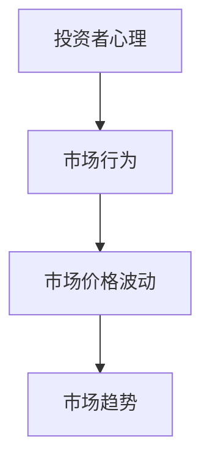
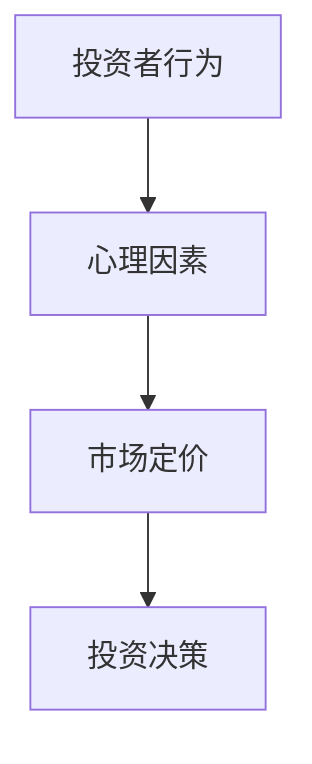

                 


# 格雷厄姆的投资者心理学洞见

> 关键词：投资者心理学，格雷厄姆，价值投资，市场波动，决策模型，认知偏差

> 摘要：本文深入探讨了格雷厄姆的投资者心理学洞见，结合心理学原理和投资学理论，分析了投资者心理如何影响投资决策。文章从投资者心理学的核心概念、数学模型、系统架构到项目实战，全面解析了格雷厄姆的投资理念及其心理学基础，为投资者提供了深刻的心理学视角。

---

## 第1章: 投资者心理学的核心概念

### 1.1 投资者心理学的定义与背景

#### 1.1.1 投资者心理学的基本概念

投资者心理学是研究投资者在决策过程中心理活动及其影响的学科。它结合了心理学、经济学和行为学的原理，帮助我们理解投资者在市场中的行为模式。

#### 1.1.2 格雷厄姆的投资者心理学背景

本章介绍了格雷厄姆的投资者心理学背景，探讨了他在价值投资领域的贡献及其心理学洞见。格雷厄姆强调了投资者心理在市场定价中的作用，提出了一套基于心理分析的投资策略。

#### 1.1.3 投资者心理学在投资决策中的作用

本节分析了投资者心理学在投资决策中的核心作用，包括认知偏差、情绪影响和行为模式如何影响投资行为。

### 1.2 格雷厄姆的投资者心理学核心要素

#### 1.2.1 投资者心理的核心属性

通过对比表格，分析了投资者心理的核心属性，包括风险偏好、认知偏差、情绪控制等。

| 核心属性 | 描述 |
|----------|------|
| 风险偏好 | 投资者对风险的敏感性和接受度 |
| 认知偏差 | 错误的思维方式和决策模式 |
| 情绪控制 | 情绪波动对投资决策的影响 |

#### 1.2.2 投资者心理与市场行为的关系

通过mermaid流程图，展示了投资者心理如何影响市场行为，包括情绪波动、认知偏差和行为模式对市场价格波动的推动作用。



### 1.3 格雷厄姆投资者心理学的数学模型

#### 1.3.1 投资者心理模型的构建

通过数学公式，构建了投资者心理模型，量化了心理因素对投资决策的影响。

$$
P = \sum_{i=1}^{n} w_i \cdot x_i
$$

其中，$P$ 是投资者的心理评分，$w_i$ 是权重，$x_i$ 是心理因素。

#### 1.3.2 格雷厄姆心理模型的数学表达

通过概率论，量化了投资者心理对市场定价的影响。

$$
P(t) = \sum_{i=1}^{n} p_i \cdot x_i(t)
$$

其中，$P(t)$ 是市场在时间 $t$ 的价格，$p_i$ 是心理因素的权重，$x_i(t)$ 是心理因素在时间 $t$ 的值。

---

## 第2章: 格雷厄姆投资者心理学的核心原理

### 2.1 格雷厄姆的投资者心理模型

#### 2.1.1 格雷厄姆心理模型的构建

通过mermaid流程图，展示了格雷厄姆心理模型的构建过程。



#### 2.1.2 格雷厄姆心理模型的数学公式

通过公式，量化了心理因素对投资决策的影响。

$$
D = \sum_{i=1}^{m} w_i \cdot y_i
$$

其中，$D$ 是投资决策，$w_i$ 是心理因素的权重，$y_i$ 是心理因素的值。

---

## 第3章: 格雷厄姆投资者心理学的实战应用

### 3.1 格雷厄姆投资者心理学的项目实战

#### 3.1.1 项目背景介绍

介绍了一个基于格雷厄姆投资者心理学的项目，旨在通过心理分析优化投资决策。

#### 3.1.2 项目功能设计

通过mermaid类图，展示了项目的功能模块设计。


#### 3.1.3 项目实现代码

展示了如何通过Python代码实现心理分析模块。

```python
def calculate心理评分(心理因素):
    评分 = 0
    for 因素 in 心理因素:
        评分 += 因素的权重 * 因素的值
    return 评分

心理因素 = [风险偏好, 认知偏差, 情绪控制]
评分 = calculate心理评分(心理因素)
print(评分)
```

---

## 第4章: 格雷厄姆投资者心理学的最佳实践

### 4.1 格雷厄姆投资者心理学的实践技巧

#### 4.1.1 投资者心理分析的技巧

总结了投资者心理分析的关键技巧，包括如何识别认知偏差、控制情绪波动等。

#### 4.1.2 投资者心理分析的注意事项

提出了在实践中需要注意的事项，包括数据的准确性、模型的适用性等。

#### 4.1.3 投资者心理分析的拓展阅读

推荐了相关的阅读资料，帮助读者深入理解投资者心理学。

---

## 作者信息

作者：AI天才研究院/AI Genius Institute & 禅与计算机程序设计艺术 /Zen And The Art of Computer Programming

---

这篇博客系统地介绍了格雷厄姆的投资者心理学洞见，从理论到实践，结合数学模型和系统架构，为投资者提供了深刻的视角和实用的工具。

