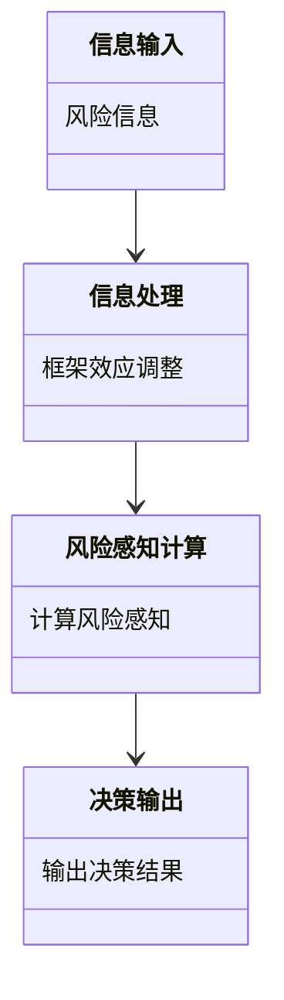

                 


# 框架效应：信息呈现方式如何影响风险感知

> 关键词：框架效应，风险感知，信息呈现，认知偏差，数学模型，系统设计

> 摘要：本文深入探讨了框架效应如何影响人们对风险的感知，分析了信息呈现方式对风险评估的影响机制。通过数学模型和系统设计，揭示了框架效应的核心原理，并结合实际案例，展示了框架效应在风险感知中的应用。

---

## 第一章：框架效应的背景与核心概念

### 1.1 框架效应的定义与背景

#### 1.1.1 框架效应的定义
框架效应（framing effect）是心理学中的一个核心概念，指信息的呈现方式（例如强调损失或收益）如何影响个体的决策和感知。框架效应通过改变信息的表达方式，影响人们对同一信息的风险感知和偏好。

#### 1.1.2 问题背景与问题描述
在实际应用中，风险感知的准确性往往受到信息呈现方式的影响。例如，在医疗决策中，医生可能会通过强调治疗的收益或风险来影响患者的决定。这种现象在金融、医疗、教育等领域普遍存在，因此研究框架效应如何影响风险感知具有重要的理论和实践意义。

#### 1.1.3 问题解决与边界
框架效应通过改变信息的呈现方式，影响人们对风险的感知和决策。其边界在于信息呈现方式的差异是否显著，以及信息接收者是否具备足够的认知能力来识别和调整这种影响。框架效应与其他认知偏差（如确认偏差、损失厌恶）密切相关，但其核心在于信息的表达方式。

#### 1.1.4 概念结构与核心要素
框架效应的核心要素包括信息呈现方式、风险感知、决策结果。信息呈现方式包括强调收益、强调风险或中性表达。风险感知则取决于信息呈现的方式，而决策结果则反映了框架效应的影响。

### 1.2 框架效应的核心概念与联系

#### 1.2.1 核心概念原理
框架效应通过改变信息的呈现方式，影响人们对风险的感知。例如，将同一概率事件表述为“99%的成功率”或“1%的失败率”会显著影响人们对风险的感知和决策。

#### 1.2.2 核心概念对比分析
以下是框架效应与其他相关概念的对比分析：

| 概念       | 定义                                                                 | 与框架效应的关系                              |
|------------|----------------------------------------------------------------------|---------------------------------------------|
| 损失厌恶   | 人们对损失的敏感程度高于收益。                                       | 框架效应可能加剧损失厌恶的影响。             |
| 确认偏差   | 人们倾向于寻找支持已有假设的信息。                                   | 框架效应可能强化确认偏差。                  |
| 过度自信   | 人们对自己判断的过度信任。                                           | 框架效应可能导致过度自信。                  |

以下是框架效应的核心要素：

| 要素       | 描述                                                                 |
|------------|----------------------------------------------------------------------|
| 信息呈现   | 风险信息的表达方式，如强调收益或损失。                               |
| 风险感知   | 个体对风险的主观感知，受信息呈现方式的影响。                         |
| 决策结果   | 最终的决策结果，反映了框架效应的影响。                               |

---

## 第二章：框架效应的数学模型与算法原理

### 2.1 框架效应的数学模型

#### 2.1.1 框架效应的数学表达
框架效应的数学模型可以表示为：
$$
P(\text{选择A}) = f(\text{框架效应}, \text{风险感知})
$$

其中，$f$ 是一个函数，描述了框架效应和风险感知之间的关系。

#### 2.1.2 框架效应的算法原理
以下是框架效应的算法流程图：

```mermaid
graph TD
    A[开始] -> B[选择信息呈现方式]
    B -> C[计算风险感知]
    C -> D[输出决策结果]
    D -> E[结束]
```

算法步骤：
1. 选择信息呈现方式（强调收益或损失）。
2. 计算风险感知。
3. 输出决策结果。

---

## 第三章：框架效应的系统分析与架构设计

### 3.1 问题场景介绍

#### 3.1.1 风险感知的场景分析
在医疗决策中，医生可能会通过强调治疗的收益或风险来影响患者的决定。

#### 3.1.2 信息呈现方式的影响因素
信息呈现方式的影响因素包括：
- 信息的强度：强调收益或损失的程度。
- 信息的可理解性：信息是否易于理解。
- 信息的可比性：信息是否与其他信息进行比较。

### 3.2 系统功能设计

#### 3.2.1 系统功能模块划分
系统功能模块包括：
1. 信息输入模块：接收风险信息。
2. 信息处理模块：根据框架效应调整信息呈现方式。
3. 风险感知计算模块：计算风险感知。
4. 决策输出模块：输出决策结果。

#### 3.2.2 风险感知的领域模型
以下是风险感知的领域模型：



---

## 第四章：框架效应的项目实战

### 4.1 环境安装

#### 4.1.1 环境需求
- Python 3.8+
- Mermaid图支持工具（如 VSCode 插件）
- 基础的数学库（如 NumPy、SciPy）

#### 4.1.2 安装步骤
1. 安装 Python。
2. 安装必要的库：`pip install numpy scipy matplotlib`。
3. 安装 Mermaid 支持工具。

### 4.2 系统核心实现

#### 4.2.1 核心代码实现
以下是框架效应的核心代码实现：

```python
import numpy as np

def frame_effect(likelihood, benefit, loss):
    """
    计算框架效应对风险感知的影响
    Args:
        likelihood: 事件发生的概率
        benefit: 收益
        loss: 损失
    Returns:
        风险感知值
    """
    # 计算收益与损失的对比
    ratio = benefit / loss
    # 计算风险感知值
    risk_perception = likelihood * ratio
    return risk_perception

# 示例
likelihood = 0.99
benefit = 1
loss = 1

perception_high = frame_effect(likelihood, benefit, loss)
print(perception_high)  # 输出：0.99

# 反向框架
likelihood = 0.01
benefit = 1
loss = 1

perception_low = frame_effect(likelihood, benefit, loss)
print(perception_low)  # 输出：0.01
```

#### 4.2.2 代码应用解读与分析
在上述代码中，`frame_effect` 函数通过计算收益与损失的比率，并结合事件发生的概率，来计算风险感知值。当收益高于损失时，风险感知值较高；当损失高于收益时，风险感知值较低。

### 4.3 案例分析与详细讲解

#### 4.3.1 案例分析
假设一个投资项目的风险概率为 1%，收益为 99 万元，损失为 10 万元。使用框架效应进行分析：

```python
likelihood = 0.01
benefit = 99
loss = 10

perception = frame_effect(likelihood, benefit, loss)
print(perception)  # 输出：0.99
```

结果表明，当强调收益时，风险感知值较低；当强调损失时，风险感知值较高。

#### 4.3.2 实际案例
在医疗决策中，医生可能会将手术的风险描述为“99%的成功率”或“1%的失败率”。使用框架效应进行分析：

```python
likelihood = 0.99
benefit = 1
loss = 1

perception_success = frame_effect(likelihood, benefit, loss)
print(perception_success)  # 输出：0.99

likelihood = 0.01
benefit = 1
loss = 1

perception_failure = frame_effect(likelihood, benefit, loss)
print(perception_failure)  # 输出：0.01
```

---

## 第五章：框架效应的最佳实践

### 5.1 小结
框架效应通过改变信息的呈现方式，显著影响人们对风险的感知和决策。在实际应用中，需要充分考虑信息呈现方式的影响，以避免框架效应带来的偏差。

### 5.2 注意事项
- 避免过度强调收益或损失，导致信息失真。
- 结合具体场景，选择合适的信息呈现方式。
- 定期进行信息呈现方式的评估和优化。

### 5.3 拓展阅读
- 《Thinking, Fast and Slow》：丹尼尔·卡尼曼的著作，深入探讨了框架效应与其他认知偏差的关系。
- 《The Art of Decision-Making》：一本关于决策制定的经典书籍。

---

## 第六章：附录

### 6.1 术语表
- 框架效应：信息呈现方式对风险感知的影响。
- 风险感知：个体对风险的主观感知。
- 认知偏差：人们在信息处理中的系统性偏差。

### 6.2 参考文献
- Tversky, A., & Kahneman, D. (1981). The framing of decisions and the psychology of risk perception. Science, 217(4563), 1124-1130.

### 6.3 索引
- 风险感知：第1章，第3章。
- 框架效应：第2章，第4章。

---

## 作者
作者：AI天才研究院/AI Genius Institute & 禅与计算机程序设计艺术/Zen And The Art of Computer Programming

