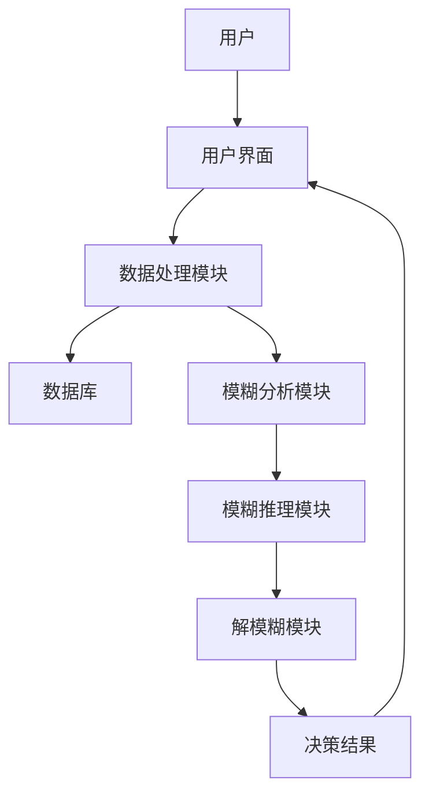
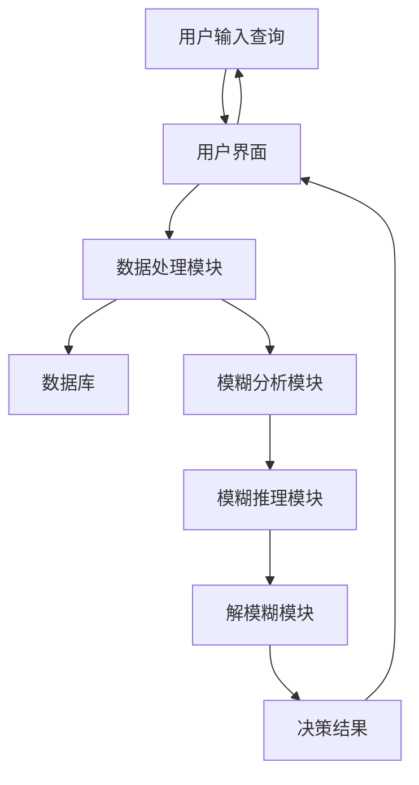

                 


# 模糊逻辑在投资决策支持系统中的应用

> **关键词**: 模糊逻辑, 投资决策支持系统, 投资决策, 模糊推理, 模糊集合

> **摘要**: 本文探讨了模糊逻辑在投资决策支持系统中的应用，分析了模糊逻辑的基本原理及其在处理投资决策中的不确定性和模糊性问题中的优势。文章详细介绍了模糊逻辑的核心概念、算法原理、系统架构设计以及实际项目中的应用案例，展示了如何通过模糊逻辑提升投资决策的准确性和效率。通过本文的分析，读者可以深入了解模糊逻辑在投资决策支持系统中的重要作用，并掌握其实际应用的方法和技巧。

---

## 第1章: 模糊逻辑与投资决策支持系统概述

### 1.1 模糊逻辑的起源与发展

模糊逻辑是一种处理模糊性和不确定性问题的数学工具，其核心思想是通过隶属度函数来描述事物的模糊性。模糊逻辑的概念最早由美国控制理论专家 Lofti Zadeh 于 1965 年提出，旨在解决传统逻辑在处理模糊信息时的局限性。模糊逻辑在投资决策中的应用，可以有效应对市场波动、经济指标变化等不确定性问题。

**问题背景**: 在投资决策中，许多因素（如市场趋势、公司财务状况、政策变化等）往往是模糊的、不确定的，传统的基于精确数据的决策方法难以充分捕捉这些模糊信息。因此，引入模糊逻辑可以帮助投资者更好地处理这些不确定性。

**模糊逻辑的特点**: 模糊逻辑允许事物的属性（如“高风险”、“高收益”）具有一定的模糊性，并通过隶属度函数量化这些模糊性。与传统逻辑相比，模糊逻辑更接近人类的自然思维方式，能够更好地处理复杂的现实问题。

### 1.2 投资决策支持系统的概念与特点

**投资决策支持系统 (IDSS)** 是一种辅助投资者进行决策的计算机系统，其核心功能包括数据收集、分析、预测和决策支持。IDSS 的特点包括：

1. **数据驱动**: 系统依赖大量的历史数据和实时数据进行分析。
2. **智能化**: 系统能够通过算法和模型提供智能化的决策建议。
3. **动态性**: 系统能够实时更新数据和模型，适应市场变化。
4. **多目标优化**: 系统能够帮助投资者在多个目标之间进行权衡，找到最优解。

### 1.3 模糊逻辑在投资决策中的重要性

在投资决策中，模糊逻辑的主要作用体现在以下几个方面:

1. **处理模糊性**: 模糊逻辑能够量化市场趋势、公司财务状况等模糊信息，帮助投资者更好地理解市场动态。
2. **提高决策效率**: 通过模糊逻辑算法，系统可以在短时间内处理大量复杂信息，提供决策支持。
3. **降低决策风险**: 模糊逻辑能够帮助投资者识别和评估潜在风险，制定更加稳健的投资策略。

---

## 第2章: 模糊逻辑的核心概念与数学基础

### 2.1 模糊集合与隶属度函数

**模糊集合**: 模糊集合是一种允许元素部分属于集合的数学概念。与传统集合不同，模糊集合中的元素属于集合的程度（隶属度）是通过隶属度函数来度量的。

**隶属度函数**: 隶属度函数用于描述某个元素属于某个模糊集合的程度。常见的隶属度函数包括：

1. **三角形函数**: 用于描述线性变化的隶属度。
2. **梯形函数**: 用于描述非对称的隶属度。
3. **高斯函数**: 用于描述正态分布的隶属度。

### 2.2 模糊推理与模糊规则

**模糊推理**: 模糊推理是通过模糊规则对模糊集合进行推理的过程。模糊规则通常采用“如果-那么”形式，例如：“如果市场趋势是上升，那么投资风险是低”。

**模糊规则的构建**: 模糊规则的构建需要结合领域知识和经验，确保规则的合理性和有效性。

### 2.3 模糊逻辑与传统逻辑的对比

| **对比维度** | **模糊逻辑** | **传统逻辑** |
|--------------|--------------|--------------|
| 处理对象     | 模糊信息     | 精确信息     |
| 处理方式     | 隶属度函数   | 真值命题     |
| 应用场景     | 不确定性问题 | 确定性问题   |

---

## 第3章: 模糊逻辑在投资决策中的算法与数学模型

### 3.1 模糊逻辑算法的基本步骤

**模糊控制算法** 是一种基于模糊逻辑的控制方法，其基本步骤如下:

1. **模糊化**: 将输入信息转换为模糊集合。
2. **知识库构建**: 定义模糊规则和隶属度函数。
3. **推理过程**: 根据模糊规则进行推理，得到模糊输出。
4. **解模糊**: 将模糊输出转换为具体决策。

**流程图**: 使用 Mermaid 绘制模糊控制算法的流程图如下：


### 3.2 模糊逻辑的数学模型

**隶属度函数**: 以三角形函数为例，隶属度函数可以表示为：

$$
\mu(x) = \begin{cases}
0 & \text{if } x < a \\
\frac{x - a}{b - a} & \text{if } a \leq x \leq b \\
1 & \text{if } x \geq b \\
\end{cases}
$$

**模糊推理**: 假设模糊规则为“如果市场趋势是上升，那么投资风险是低”，则可以通过模糊推理算法（如重心法）计算出投资风险的隶属度。

### 3.3 模糊逻辑算法的实现

**Python 实现**: 下面是一个简单的模糊逻辑算法的 Python 实现示例：

```python
def fuzzy_inference(input_value, a, b):
    # 模糊化过程
    if input_value < a:
        membership = 0
    elif input_value > b:
        membership = 1
    else:
        membership = (input_value - a) / (b - a)
    return membership

# 示例调用
input_value = 70
a = 50
b = 80
membership = fuzzy_inference(input_value, a, b)
print(f"输入值 {input_value} 的隶属度为 {membership}")
```

---

## 第4章: 投资决策支持系统的系统分析与架构设计

### 4.1 系统功能设计

**领域模型**: 使用 Mermaid 绘制领域模型图如下：


### 4.2 系统架构设计

**系统架构图**: 使用 Mermaid 绘制系统架构图如下：



### 4.3 接口设计与交互流程

**交互流程图**: 使用 Mermaid 绘制交互流程图如下：



---

## 第5章: 模糊逻辑在投资决策中的项目实战

### 5.1 环境安装与配置

**所需工具**: Python 3.8+, NumPy, Matplotlib, Scikit-learn

**安装命令**:

```bash
pip install numpy matplotlib scikit-learn
```

### 5.2 核心代码实现

**模糊逻辑算法实现**: 下面是一个完整的模糊逻辑算法实现示例：

```python
def fuzzy_inference(input_value, a, b, c, d):
    # 模糊化过程
    if input_value < a:
        membership = 0
    elif input_value > b:
        membership = 1
    else:
        membership = (input_value - a) / (b - a)
    
    # 推理过程
    if membership < 0.5:
        output = c
    else:
        output = d
    
    return output

# 示例调用
input_value = 70
a = 50
b = 80
c = 20
d = 50
result = fuzzy_inference(input_value, a, b, c, d)
print(f"输入值 {input_value} 的输出结果为 {result}")
```

### 5.3 案例分析与解读

**案例分析**: 假设某公司股票的历史数据如下：

| 日期 | 收盘价 | 涨跌幅 |
|------|--------|--------|
| 1    | 100    | 2%     |
| 2    | 105    | 1.5%   |
| 3    | 103    | -0.5%  |

**模糊分析**: 使用模糊逻辑算法对股票的未来走势进行预测，假设规则为“如果涨跌幅为正，则未来价格为上升”。

**分析结果**: 根据模糊逻辑算法，未来价格的预测结果为上升。

---

## 第6章: 模糊逻辑在投资决策支持系统中的最佳实践

### 6.1 投资决策支持系统的设计要点

1. **数据的准确性**: 确保输入数据的准确性和完整性。
2. **模型的可解释性**: 模糊逻辑模型需要具有较高的可解释性，以便投资者理解决策过程。
3. **算法的鲁棒性**: 确保算法在不同市场条件下的稳定性和 robustness。

### 6.2 投资决策支持系统的注意事项

1. **模型的局限性**: 模糊逻辑模型在处理复杂问题时可能需要更多的规则和参数，导致模型的复杂性增加。
2. **数据的实时性**: 投资决策支持系统需要实时更新数据，以保证决策的及时性和准确性。
3. **用户体验**: 系统的用户界面需要简洁直观，方便投资者使用。

### 6.3 拓展阅读

1. **推荐书籍**: 《模糊集与模糊逻辑》（作者：Zadeh）
2. **推荐论文**: "Fuzzy Logic in Investment Decision Support Systems"

---

## 作者：AI天才研究院/AI Genius Institute & 禅与计算机程序设计艺术 /Zen And The Art of Computer Programming

