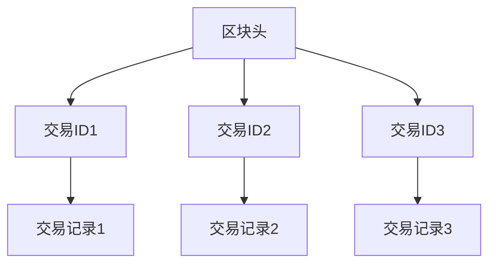

                 

# 比特币和加密货币：数字资产的投资价值

> 关键词：比特币、加密货币、区块链、投资价值、数字资产

> 摘要：本文深入分析比特币和加密货币的背景、技术原理、经济模型以及投资价值，探讨其在全球金融体系中的地位和未来发展趋势。通过详细的技术分析和实际案例，帮助读者理解数字资产的投资机会与风险。

---

# 第1章: 比特币和加密货币的起源与背景

## 1.1 比特币的起源

### 1.1.1 中本聪与比特币白皮书
比特币的起源可以追溯到2008年，由中本聪（Satoshi Nakamoto）提出的比特币白皮书《比特币：一种点对点的电子现金系统》。中本聪在白皮书中详细阐述了比特币的设计理念，提出了一个去中心化的电子货币系统，旨在解决传统金融体系中的信任问题。

### 1.1.2 区块链技术的提出
比特币的创新之处在于其底层技术——区块链。区块链是一种分布式账本技术，通过去中心化的共识机制，确保数据的安全性和不可篡改性。中本聪在比特币白皮书中首次提出了区块链的概念，并将其应用于电子货币的发行和交易。

### 1.1.3 比特币的诞生与早期发展
2009年，中本聪基于比特币白皮书发布了比特币的第一个开源实现，并通过 minedGenesisBlock 的方式启动了比特币网络。比特币的诞生不仅标志着数字资产的诞生，也引发了全球对区块链技术的关注和研究。

## 1.2 加密货币的核心概念

### 1.2.1 什么是加密货币
加密货币是一种基于密码学技术的数字货币，通过区块链等技术实现去中心化的价值转移和存储。与传统货币不同，加密货币不依赖于中央银行或政府，而是依靠分布式网络实现价值的全球流通。

### 1.2.2 区块链技术的基本原理
区块链是一种分布式账本技术，通过去中心化的节点网络记录交易信息。每个区块包含一组交易数据，并通过哈希值与前一个区块相连，形成一条不可篡改的区块链。区块链的核心特点包括去中心化、透明性和不可篡改性。

### 1.2.3 加密货币与传统货币的对比
与传统货币相比，加密货币具有以下特点：
1. **去中心化**：加密货币不依赖于中央机构，交易由分布式网络完成。
2. **匿名性**：加密货币交易通常匿名或半匿名，保护用户隐私。
3. **全球性**：加密货币可以在全球范围内自由流通，不受地域限制。
4. **技术创新**：区块链技术的应用使得加密货币具有更高的安全性和效率。

---

# 第2章: 区块链技术的核心原理

## 2.1 区块链的基本概念

### 2.1.1 区块链的定义与特点
区块链是一种去中心化的分布式账本技术，通过多个节点协作记录和验证交易信息。其特点包括：
- **去中心化**：没有单一的控制机构。
- **不可篡改**：数据一旦写入区块链，难以被修改。
- **透明性**：交易记录公开透明，但用户身份可匿名。

### 2.1.2 区块链的核心要素
区块链的核心要素包括：
1. **区块**：存储交易数据的容器。
2. **链式结构**：区块通过哈希值形成链式结构。
3. **共识机制**：节点通过共识机制达成一致。
4. **加密算法**：确保数据安全和隐私保护。

### 2.1.3 区块链的分类与应用场景
区块链主要分为公链、私链和联盟链。公链（如比特币）面向所有人开放，私链用于特定组织内部，联盟链用于多个组织之间的协作。区块链的应用场景包括金融支付、智能合约、供应链管理等。

## 2.2 区块链的工作原理

### 2.2.1 区块链的区块结构
每个区块包含以下数据：
1. **交易记录**：记录用户的交易信息。
2. **区块头**：包含区块的哈希值、时间戳等信息。
3. **默克尔树**：用于验证交易数据的完整性。

区块的结构可以通过 Mermaid 图表示如下：

### 2.2.2 区块链的共识机制
共识机制是区块链的核心，用于确保所有节点对交易记录达成一致。常见的共识机制包括：
1. **工作量证明（PoW）**：比特币采用的机制，通过计算哈希值的难度证明。
2. **权益证明（PoS）**：以太坊计划采用的机制，通过持有代币的权益决定记账权。

### 2.2.3 区块链的交易验证流程
区块链的交易验证流程如下：
1. **交易发起**：用户发起交易请求。
2. **交易广播**：交易信息通过网络广播到所有节点。
3. **交易验证**：节点验证交易的有效性。
4. **区块打包**：多个交易被打包成区块。
5. **共识确认**：节点通过共识机制确认区块。
6. **区块上链**：区块被添加到区块链中。

## 2.3 区块链的去中心化特性

### 2.3.1 去中心化的定义与优势
去中心化是指系统不依赖于单个中心机构，而是通过多个节点协作完成任务。其优势包括：
1. **抗审查性**：没有中心机构可以随意冻结账户。
2. **抗攻击性**：去中心化网络更难被攻击。
3. **透明性**：所有交易记录公开透明。

### 2.3.2 区块链的分布式账本
区块链的分布式账本通过多个节点同步数据，确保数据的可靠性和一致性。每个节点都有一份完整的账本副本，通过共识机制保持同步。

### 2.3.3 去中心化与加密货币的关系
去中心化是加密货币的核心特征，使其能够实现无须信任的点对点价值转移。比特币的去中心化特性使其不依赖于任何中央机构，真正实现了货币的自由流通。

## 2.4 区块链的安全性分析

### 2.4.1 加密算法的作用
区块链中的加密算法用于确保数据的安全性。常见的加密算法包括哈希函数（如SHA-256）和数字签名算法（如ECDSA）。这些算法确保交易数据的完整性和真实性。

### 2.4.2 区块链的安全威胁
区块链面临的主要安全威胁包括：
1. **51%攻击**：攻击者控制超过50%的算力，可能进行双重支付攻击。
2. **私钥泄露**：用户的私钥被泄露可能导致资金损失。
3. **恶意节点**：恶意节点可能试图破坏共识机制。

### 2.4.3 51%攻击与防御机制
51%攻击是比特币面临的主要威胁之一。防御机制包括：
1. **提高攻击成本**：通过增加算力要求防止51%攻击。
2. **监控与举报**：通过社区监控和举报恶意行为。
3. **惩罚机制**：通过惩罚机制降低攻击者的收益。

---

# 第3章: 比特币的经济模型与投资价值分析

## 3.1 比特币的总量与发行机制

### 3.1.1 比特币的总量限制
比特币的总量被设计为2100万枚，每枚比特币可被分割为100,000,000个单位（即小数点后8位）。总量限制使得比特币具有抗通胀特性。

### 3.1.2 比特币的发行机制
比特币的发行采用渐减式机制，每经过一定数量的区块（每210,000个区块，约4年）减半。初始的比特币发行速度为每10分钟产生1个区块，每个区块奖励50比特币。2009年比特币创世区块奖励为50比特币，2012年减半为25比特币，2016年减半为12.5比特币，2020年减半为6.25比特币。

### 3.1.3 比特币的发行速度计算公式
比特币的发行速度可以通过以下公式计算：

$$
\text{发行速度} = \frac{210000 \text{个区块}}{4 \text{年}}
$$

---

## 3.2 比特币的经济特性

### 3.2.1 比特币的抗通胀特性
比特币的总量固定为2100万枚，且发行速度逐渐递减，使得比特币具有抗通胀特性。与传统货币不同，比特币的发行量不会被中央银行随意增加，从而避免了通货膨胀的风险。

### 3.2.2 比特币的稀缺性
比特币的稀缺性是其价值的重要支撑。由于总量有限，比特币的稀缺性类似于贵金属（如黄金），使得其具有保值和增值的潜力。

### 3.2.3 比特币的分割性
比特币的分割性使得其可以满足不同的交易需求。比特币的最小单位为“聪”（1比特币 = 100,000,000聪），使得其可以用于小额交易。

## 3.3 加密货币的通货膨胀与通货紧缩

### 3.3.1 通货膨胀
通货膨胀是指货币供应量的增加导致货币购买力下降。传统货币的通货膨胀主要由中央银行的货币政策决定。

### 3.3.2 通货紧缩
通货紧缩是指货币供应量的减少导致货币购买力上升。比特币的总量固定，且发行速度递减，可能引发通货紧缩效应。

### 3.3.3 比特币的通货紧缩特性
比特币的总量固定且发行速度递减，可能导致其具有通货紧缩特性。随着时间推移，比特币的供应量增长趋缓，市场对比特币的需求增加，可能导致其价格上涨。

---

## 3.4 比特币和加密货币的市场价值分析

### 3.4.1 比特币的市场定位
比特币是目前市值最高的加密货币，被称为“数字黄金”。比特币的市场定位决定了其在加密货币市场中的重要地位。

### 3.4.2 加密货币的投资机会
加密货币市场具有较高的波动性和不确定性，但也存在较大的投资机会。投资者可以通过长期持有、价值投资等方式参与加密货币市场。

### 3.4.3 比特币的投资风险
比特币的投资风险包括市场波动风险、政策风险、技术风险等。投资者需要充分了解这些风险，并采取适当的风险管理措施。

---

## 3.5 比特币的经济模型与投资策略

### 3.5.1 比特币的经济模型
比特币的经济模型基于其总量和发行机制，具有抗通胀和稀缺性特性。比特币的经济模型类似于贵金属的经济模型，具有保值和增值的潜力。

### 3.5.2 投资策略
投资者可以采取以下策略：
1. **长期持有**：长期持有比特币，利用其稀缺性和抗通胀特性实现财富增值。
2. **分批投资**：分批买入比特币，分散投资风险。
3. **定投策略**：定期定额买入比特币，降低市场波动对投资的影响。

---

## 3.6 比特币与传统资产的对比

### 3.6.1 比特币与股票
股票代表公司的所有权，投资者通过持有股票获得公司分红或资本增值。比特币与股票不同，其价值主要基于市场供需和网络效应。

### 3.6.2 比特币与黄金
比特币被称为“数字黄金”，与黄金具有相似的特性，包括抗通胀、避险功能等。但比特币的市场波动性高于黄金，风险也更大。

### 3.6.3 比特币与其他加密货币
比特币是加密货币市场的领头羊，其他加密货币（如以太坊、ripple等）在技术、应用场景等方面各有特点。

---

## 3.7 比特币的未来发展趋势

### 3.7.1 比特币的技术创新
比特币的技术正在不断改进，包括闪电网络、侧链技术等。这些技术创新将提升比特币的交易效率和扩展性。

### 3.7.2 比特币的机构化
越来越多的机构投资者开始关注比特币，包括对冲基金、资产管理公司等。机构化的趋势将推动比特币市场的成熟和规范化。

### 3.7.3 比特币的全球化
比特币的全球化特性使其能够在全球范围内自由流通。随着比特币技术的普及和接受度的提高，其在全球金融体系中的地位将逐步提升。

---

## 3.8 本章小结

比特币的经济模型和投资价值是加密货币市场的重要研究方向。比特币的总量限制、发行机制和经济特性决定了其稀缺性、抗通胀和保值特性。投资者可以通过长期持有、分批投资等方式参与比特币市场。未来，比特币的技术创新和机构化趋势将推动其在全球金融体系中的发展。

---

**作者：AI天才研究院/AI Genius Institute & 禅与计算机程序设计艺术 /Zen And The Art of Computer Programming**

