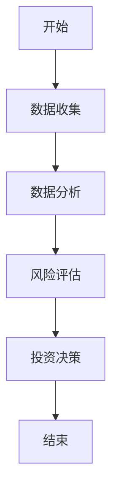

                 


```markdown
# 气候变化适应性技术的投资机会识别

## 关键词：气候变化适应性技术、投资机会识别、可再生能源、碳捕获技术、可持续发展、风险管理

## 摘要：
气候变化适应性技术是应对全球气候变化的关键手段之一，本文将从技术背景、核心概念、算法原理、数学模型、系统架构设计以及项目实战等方面，详细分析气候变化适应性技术的投资机会识别方法。通过多维度的分析和实际案例，为投资者提供科学的决策依据，助力实现可持续发展目标。

---

## 第1章: 气候变化适应性技术的背景介绍

### 1.1 气候变化的现状与挑战
#### 1.1.1 气候变化的定义与主要驱动因素
气候变化是指长期变化的趋势，包括温度上升、极端天气事件增多等。主要驱动因素包括温室气体排放、森林砍伐、工业活动等。

#### 1.1.2 气候变化对全球经济和社会的影响
气候变化导致的自然灾害、资源短缺和生态破坏，对企业运营、农业生产和人类健康造成严重影响。

#### 1.1.3 适应性技术在应对气候变化中的作用
适应性技术通过减少温室气体排放、提高资源利用效率和增强生态系统韧性，帮助缓解气候变化的影响。

### 1.2 气候变化适应性技术的定义与特点
#### 1.2.1 适应性技术的核心概念
适应性技术是指能够减少气候变化负面影响，并提高社会对气候变化适应能力的技术。

#### 1.2.2 适应性技术与减缓性技术的对比
| 技术类型 | 目标 | 实施方式 | 投资周期 |
|----------|------|----------|----------|
| 适应性技术 | 减少气候变化的影响 | 提高抗灾能力 | 中短期 |
| 减缓性技术 | 减少温室气体排放 | 发展清洁能源 | 长期 |

#### 1.2.3 适应性技术的主要分类与应用场景
1. **可再生能源技术**：如太阳能、风能，减少化石燃料使用。
2. **碳捕获技术**：捕获并封存二氧化碳，减少大气中的碳含量。
3. **节水技术**：提高水资源利用效率，适应水资源短缺。
4. **智能农业技术**：通过精准农业减少资源浪费，提高产量。

---

## 第2章: 气候变化适应性技术的核心概念与联系

### 2.1 核心概念的原理与特征
#### 2.1.1 适应性技术的原理
通过技术创新和优化资源配置，提高社会对气候变化的适应能力。

#### 2.1.2 实体关系图（ER图）展示技术间的联系
```mermaid
er
  actor 投资者
  actor 技术开发者
  actor 项目实施者
  object 气候变化适应性技术
  object 投资机会
  relation --> "投资" -->
  relation --> "开发" -->
```

### 2.2 核心概念的ER实体关系图
通过ER图展示适应性技术在不同主体之间的流动和关联。

---

## 第3章: 气候变化适应性技术的算法原理讲解

### 3.1 适应性技术投资机会评估的算法原理
#### 3.1.1 多因素分析模型
使用多因素分析模型评估不同技术的投资潜力。

#### 3.1.2 算法流程图


#### 3.1.3 Python代码示例
```python
import pandas as pd

def calculate_profit(data):
    # 数据预处理
    data['收益'] = data['收入'] - data['成本']
    return data['收益'].sum()

# 示例数据
data = pd.DataFrame({
    '收入': [100, 200, 300],
    '成本': [50, 100, 150]
})

# 计算总收益
total_profit = calculate_profit(data)
print(f"总收益: {total_profit}")
```

---

## 第4章: 气候变化适应性技术的数学模型

### 4.1 净现值（NPV）模型
#### 4.1.1 NPV公式
$$ NPV = \sum_{t=1}^{n} \frac{CF_t}{(1 + r)^t} $$

#### 4.1.2 实际案例计算
假设年现金流为100万元，贴现率为5%，计算NPV。

---

## 第5章: 气候变化适应性技术的系统分析与架构设计

### 5.1 问题场景介绍
#### 5.1.1 系统功能设计
- 数据输入模块：收集气候变化数据。
- 分析模块：评估技术的适应性和投资潜力。
- 可视化模块：展示分析结果。

#### 5.1.2 系统架构图


---

## 第6章: 气候变化适应性技术的项目实战

### 6.1 项目环境安装
#### 6.1.1 安装必要的库
```bash
pip install pandas numpy
```

### 6.2 项目核心实现
#### 6.2.1 核心代码实现
```python
import pandas as pd
import numpy as np

def calculateIRR(cash_flows):
    return np.irr(cash_flows)

# 示例现金流数据
cash_flows = [-100, 40, 50, 90]
IRR = calculateIRR(cash_flows)
print(f"内部收益率: {IRR}")
```

---

## 第7章: 最佳实践与小结

### 7.1 小结
气候变化适应性技术的投资机会识别是一个复杂但重要的任务，需要结合技术分析和市场评估。

### 7.2 注意事项
- 考虑技术的可扩展性和可持续性。
- 关注政策支持和市场趋势。

### 7.3 拓展阅读
- 推荐阅读《气候变化经济学》和《可持续发展技术指南》。

---

## 作者：AI天才研究院/AI Genius Institute & 禅与计算机程序设计艺术 /Zen And The Art of Computer Programming
```

