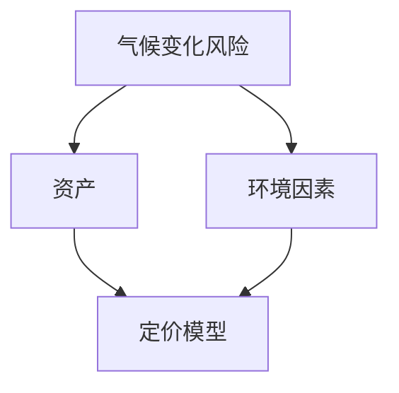

                 


---

# 气候变化风险在资产定价模型中的整合

> 关键词：气候变化风险，资产定价模型，金融风险管理，可持续投资，环境因素，量化模型，风险管理

> 摘要：随着全球气候变化问题的日益严重，气候变化风险对资产定价的影响逐渐成为金融市场关注的焦点。本文系统地探讨了如何在资产定价模型中整合气候变化风险，从理论基础到实际应用，详细分析了气候变化风险对资产定价的影响机制，并提出了相应的解决方案和实施策略。通过结合实际案例和数学模型，本文为金融从业者和研究人员提供了深入的理论支持和实践指导。

---

## 第一部分：气候变化风险在资产定价模型中的整合概述

### 第1章：气候变化风险与资产定价模型的背景介绍

#### 1.1 气候变化风险的核心概念

##### 1.1.1 问题背景与问题描述
气候变化是全球性的问题，其带来的极端天气事件（如洪水、干旱、飓风等）对企业运营、资产价值和金融市场稳定性产生了深远影响。随着全球变暖的加剧，投资者越来越关注气候变化对资产价值的潜在影响，尤其是在房地产、能源、农业和保险等行业。气候变化风险的量化与整合到资产定价模型中，成为金融市场风险管理的重要组成部分。

##### 1.1.2 问题解决的必要性
传统的资产定价模型（如CAPM和APT）通常忽略了环境因素对资产价值的影响。然而，随着气候变化的影响日益显著，投资者需要更加全面的模型来评估和管理与气候变化相关的风险。将气候变化风险整合到资产定价模型中，可以帮助投资者更准确地评估资产的价值，制定更加稳健的投资策略。

##### 1.1.3 气候变化风险的边界与外延
气候变化风险的边界包括直接风险（如极端天气对基础设施的破坏）和间接风险（如政策变化对行业的影响）。其外延则涉及环境、社会和治理（ESG）因素，这些因素对资产价值的影响需要通过模型进行量化和评估。

##### 1.1.4 核心概念结构与组成要素
气候变化风险的结构可以分解为以下几个要素：
- **物理风险**：气候变化对资产物理属性的影响。
- **转型风险**：向低碳经济转型过程中产生的风险。
- **法律与政策风险**：与气候变化相关的法律法规和政策变化。

---

#### 1.2 资产定价模型的基本原理

##### 1.2.1 资产定价模型的定义
资产定价模型是用来估计资产公允价值的数学模型。常见的模型包括：
- **CAPM（资本资产定价模型）**：用于估计资产的预期收益。
- **APT（ arbitrage pricing theory）**：基于套利原理的资产定价模型。

##### 1.2.2 资产定价模型的核心属性
资产定价模型的核心属性包括：
- **风险与收益的权衡**：资产的风险越高，预期收益也越高。
- **市场均衡**：模型假设市场是有效的，价格反映了所有相关信息。
- **时间一致性**：模型需要考虑不同时间 horizon 下的风险和收益。

##### 1.2.3 气候变化风险与资产定价模型的关联性
气候变化风险通过影响资产的未来现金流和折现率，对资产定价产生影响。例如，气候变化可能导致某些资产的未来收益下降，从而降低其公允价值。

---

### 第2章：气候变化风险与资产定价模型的核心概念联系

#### 2.1 核心概念原理

##### 2.1.1 气候变化风险的量化方法
量化气候变化风险的方法包括：
- **情景分析法**：通过构建不同气候变化情景，评估资产在不同情景下的表现。
- **蒙特卡洛模拟**：模拟气候变化对资产价值的影响。
- **物理风险评估模型**：基于地理位置和资产类型，评估气候变化对资产的物理影响。

##### 2.1.2 资产定价模型的适应性调整
为了整合气候变化风险，资产定价模型需要进行以下调整：
- **引入气候变化因子**：将气候变化因子（如温度、降水等）作为模型的输入变量。
- **动态调整风险溢价**：根据气候变化风险的动态变化，调整资产的风险溢价。

##### 2.1.3 气候变化对资产价值的影响机制
气候变化通过以下机制影响资产价值：
- **直接物理影响**：极端天气事件导致资产毁损或贬值。
- **间接市场影响**：气候变化政策和法规的改变影响市场供需，进而影响资产价值。
- **社会声誉影响**：高碳排放企业可能面临社会责任压力，影响其市场价值。

---

#### 2.2 气候变化风险与资产定价模型的对比分析

##### 2.2.1 概念属性特征对比表格

| 概念 | 气候变化风险 | 资产定价模型 |
|------|--------------|--------------|
| 定义 | 气候变化对资产价值的影响 | 资产公允价值的估计方法 |
| 输入 | 气候数据、资产特征 | 资产风险、市场收益 |
| 输出 | 资产价值变化 | 资产预期收益 |
| 关联性 | 高 | 高 |

##### 2.2.2 气候变化风险与资产定价模型的ER实体关系图


---

### 第3章：气候变化风险在资产定价模型中的算法原理

#### 3.1 算法原理概述

##### 3.1.1 气候变化风险评估的步骤
1. 数据收集：收集气候变化相关数据（如温度、降水、自然灾害等）。
2. 特征提取：从数据中提取对资产价值影响的关键特征。
3. 模型训练：使用机器学习算法（如随机森林、神经网络）训练气候变化风险评估模型。
4. 模型应用：将模型应用于资产定价。

##### 3.1.2 资产定价模型的构建过程
1. 确定资产的风险特征。
2. 确定市场风险溢价。
3. 计算资产的预期收益。
4. 结合气候变化风险因子，调整资产的定价。

##### 3.1.3 算法的输入输出关系
输入：资产特征、气候变化数据、市场数据  
输出：资产的预期价值

---

#### 3.2 数学模型与公式

##### 3.2.1 气候变化风险评估的数学模型
$$ R_i = \alpha + \beta R_m + \gamma C_i + \epsilon $$
其中，$R_i$ 是资产的超额收益，$R_m$ 是市场收益，$C_i$ 是气候变化风险因子，$\gamma$ 是其对应的系数，$\epsilon$ 是误差项。

##### 3.2.2 资产定价模型的数学公式
$$ P_i = \sum_{j=1}^n w_j R_j $$
其中，$P_i$ 是资产的价格，$w_j$ 是权重，$R_j$ 是资产的收益。

---

## 第4章：系统分析与架构设计方案

### 4.1 问题场景介绍

#### 4.1.1 气候变化风险对资产价值的影响
气候变化可能导致资产的物理毁损、运营成本增加，进而影响其市场价值。

#### 4.1.2 资产定价模型的适应性需
资产定价模型需要动态调整，以反映气候变化风险的变化。

---

### 第5章：项目实战

#### 5.1 环境安装
为了运行本项目，您需要安装以下软件和库：
- Python 3.8+
- NumPy
- Pandas
- Scikit-learn
- Matplotlib

#### 5.2 核心代码实现

##### 5.2.1 数据处理
```python
import pandas as pd
import numpy as np

# 假设我们有一个包含资产收益和气候变化因子的数据集
data = pd.DataFrame({
    'asset_return': np.random.randn(100),
    'climate_factor': np.random.randn(100)
})

# 数据预处理
data['predicted_return'] = data['asset_return'] + data['climate_factor']
```

##### 5.2.2 模型训练
```python
from sklearn.linear_model import LinearRegression

model = LinearRegression()
model.fit(data[['climate_factor']], data['predicted_return'])
```

##### 5.2.3 结果分析
```python
# 预测资产价值
climate_factor = 0.5
predicted_return = model.predict([[climate_factor]])[0]
print(predicted_return)
```

#### 5.3 案例分析
假设我们有一个能源公司，其资产价值受到气候变化的影响。我们可以通过上述模型估计其资产价值的变化。

---

## 第6章：最佳实践

### 6.1 小结
在资产定价模型中整合气候变化风险是金融市场风险管理的重要组成部分。通过量化气候变化风险并将其纳入模型，投资者可以更好地评估和管理相关风险。

### 6.2 注意事项
- 数据的准确性和完整性是关键。
- 模型需要动态调整，以反映气候变化风险的变化。
- 考虑到政策和法规的变化，模型需要具备一定的灵活性。

### 6.3 拓展阅读
- 《气候变化与金融风险管理》
- 《资产定价模型的现代发展》

---

**作者：AI天才研究院/AI Genius Institute & 禅与计算机程序设计艺术 /Zen And The Art of Computer Programming**

