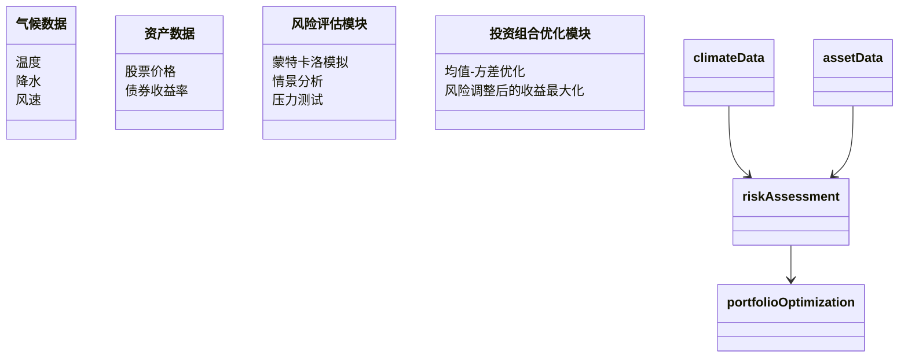
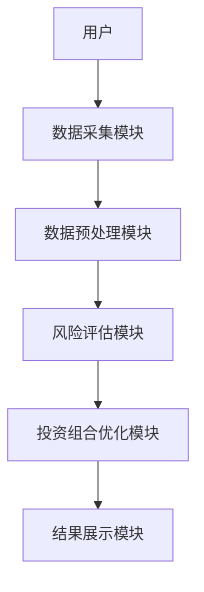

                 


# 气候相关金融风险的量化与投资组合优化

---

## 关键词
气候风险、金融风险、投资组合优化、蒙特卡洛模拟、情景分析、压力测试

---

## 摘要
随着全球气候变化的加剧，气候相关金融风险（Climate-Related Financial Risk）已成为金融市场的重要议题。本文系统地探讨了气候相关金融风险的量化方法及其对投资组合优化的影响。首先，我们介绍了气候相关金融风险的背景与核心概念，包括气候变化对金融系统的潜在影响、金融风险的分类以及投资组合优化的基本原理。接着，详细分析了气候风险的量化方法，包括蒙特卡洛模拟、情景分析和压力测试等工具，并结合数学模型和实际案例进行了深入探讨。随后，我们提出了基于气候风险的投资组合优化算法，结合现代投资组合理论（MPT）和风险调整后的收益模型，构建了一个综合性的投资组合优化框架。最后，通过系统设计与架构分析，展示了如何将气候风险量化与投资组合优化相结合，为金融从业者提供实践指导。本文旨在为理解和应对气候相关金融风险提供理论支持与实践方案。

---

## 第1章: 气候相关金融风险的背景与概述

### 1.1 气候变化对金融系统的影响

#### 1.1.1 气候变化的定义与特征
气候变化是指地球气候系统的长期变化，包括温度、降水模式和极端天气事件的变化。其主要特征是不可预测性、广泛性和不可逆性。

#### 1.1.2 气候变化对金融系统的潜在影响
气候变化可能导致资产减值、企业违约风险增加、保险成本上升等。例如，极端天气事件可能导致基础设施损毁，进而影响企业的运营能力和偿债能力。

#### 1.1.3 金融系统中的气候相关风险类型
- **物理风险**：由于气候变化导致的资产损失风险。
- **转型风险**：由于政策变化或技术变革导致的资产价值下降风险。
- **法律风险**：由于气候变化相关法律诉讼或监管变化导致的财务损失风险。

### 1.2 金融风险量化的核心概念

#### 1.2.1 金融风险的定义与分类
金融风险是指由于不确定性因素导致的资产损失或收益下降的风险。主要分类包括市场风险、信用风险、操作风险和流动性风险。

#### 1.2.2 气候相关金融风险的特殊性
气候相关金融风险具有复杂性、长期性和不确定性。与传统金融风险相比，其影响范围更广，且难以通过历史数据准确预测。

#### 1.2.3 风险量化的目标与方法
风险量化的目标是通过模型和工具，评估和预测气候相关金融风险的潜在影响。常用方法包括蒙特卡洛模拟、情景分析和压力测试。

### 1.3 投资组合优化的基本原理

#### 1.3.1 投资组合优化的定义
投资组合优化是指通过调整资产配置，以实现风险和收益的最优平衡。

#### 1.3.2 风险调整后的收益模型
风险调整后的收益模型考虑了资产的风险水平，以评估其在不同风险水平下的收益表现。

#### 1.3.3 现代投资组合理论（MPT）概述
MPT由Harry Markowitz提出，通过优化资产配置，使投资组合的收益最大化，同时风险最小化。

---

## 第2章: 气候相关金融风险的量化方法

### 2.1 气候风险的量化模型

#### 2.1.1 蒙特卡洛模拟在气候风险量化中的应用
蒙特卡洛模拟通过生成大量可能的气候情景，评估其对金融资产的影响。

#### 2.1.2 情景分析法在气候风险评估中的应用
情景分析法通过构建不同气候情景，评估其对投资组合的影响。

#### 2.1.3 压力测试在气候风险量化中的作用
压力测试用于评估极端气候事件对金融资产的潜在影响。

### 2.2 气候风险的数学模型

#### 2.2.1 气候风险的概率分布模型
假设资产价格的变化服从正态分布，可以通过均值和方差进行风险评估。

#### 2.2.2 气候风险的回归分析模型
通过回归分析，建立气候变量与资产收益之间的关系模型。

#### 2.2.3 气候风险的时间序列分析模型
利用ARIMA模型分析气候变量的时间序列，预测未来气候风险。

### 2.3 气候风险量化工具与平台

#### 2.3.1 常用气候风险量化工具介绍
- **Python**：通过NumPy和Pandas进行数据处理和分析。
- **R语言**：用于统计分析和风险建模。
- **Excel**：用于简单的数据处理和模拟。

#### 2.3.2 开源气候风险量化平台分析
- **OpenClimate**：提供气候数据和模拟工具。
- **Climate Risk Mapper**：用于风险评估和可视化。

#### 2.3.3 商业气候风险量化软件的特点
- ** Bloomberg**：提供实时气候数据和风险评估工具。
- **Morgan Stanley Capital**：提供气候风险分析和投资组合优化服务。

---

## 第3章: 投资组合优化的算法原理

### 3.1 现代投资组合理论（MPT）的核心算法

#### 3.1.1 均值-方差优化模型
通过优化资产的预期收益和方差，构建最优投资组合。

#### 3.1.2 风险调整后的收益最大化模型
在给定风险水平下，最大化预期收益。

#### 3.1.3 资产配置优化算法
通过调整资产权重，实现投资组合的最优配置。

### 3.2 基于气候风险的投资组合优化算法

#### 3.2.1 考虑气候风险的均值-方差优化
在传统的均值-方差模型中，引入气候风险因子。

#### 3.2.2 基于情景分析的投资组合优化
根据不同的气候情景，调整资产配置。

#### 3.2.3 压力测试驱动的投资组合优化
通过极端气候情景的压力测试，优化投资组合的抗风险能力。

### 3.3 投资组合优化的数学模型

#### 3.3.1 投资组合优化的数学表达式
$$ \text{目标函数：} \min_w \mathbb{E}[w^T \Sigma w] $$
$$ \text{约束条件：} \mathbb{E}[r_w] = \mu, \quad \sum_{i=1}^n w_i = 1 $$

#### 3.3.2 风险调整后的收益函数
$$ \text{收益：} \mathbb{E}[r_p] = w^T \mu $$
$$ \text{风险：} \sigma_p = \sqrt{w^T \Sigma w} $$

#### 3.3.3 资产配置优化的拉格朗日乘数法
通过拉格朗日乘数法，解决优化问题中的约束条件。

---

## 第4章: 气候相关金融风险的系统分析与架构设计

### 4.1 系统功能设计

#### 4.1.1 领域模型


### 4.2 系统架构设计



---

## 第5章: 项目实战

### 5.1 环境安装

```bash
pip install numpy pandas matplotlib
```

### 5.2 核心实现

```python
import numpy as np
import pandas as pd

# 示例数据
np.random.seed(42)
returns = np.random.normal(0.05, 0.1, 100)

# 计算均值和方差
mean_return = np.mean(returns)
variance = np.var(returns)
std_dev = np.sqrt(variance)

print(f"平均收益：{mean_return}")
print(f"方差：{variance}")
print(f"标准差：{std_dev}")
```

### 5.3 实际案例分析

假设我们有三个资产，其收益率分别为$ r_1, r_2, r_3 $，我们可以通过均值-方差优化，找到最优资产配置。

---

## 第6章: 总结与展望

### 6.1 总结
本文系统地探讨了气候相关金融风险的量化方法及其对投资组合优化的影响。通过理论分析和实际案例，展示了如何在金融决策中考虑气候变化因素。

### 6.2 展望
未来的研究可以进一步探索机器学习在气候风险量化中的应用，以及如何结合多因子模型优化投资组合。

---

## 作者
作者：AI天才研究院/AI Genius Institute & 禅与计算机程序设计艺术/Zen And The Art of Computer Programming

