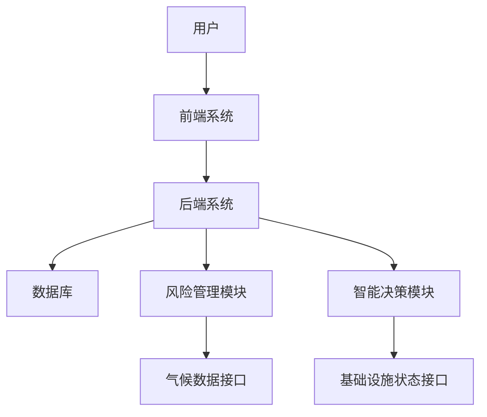
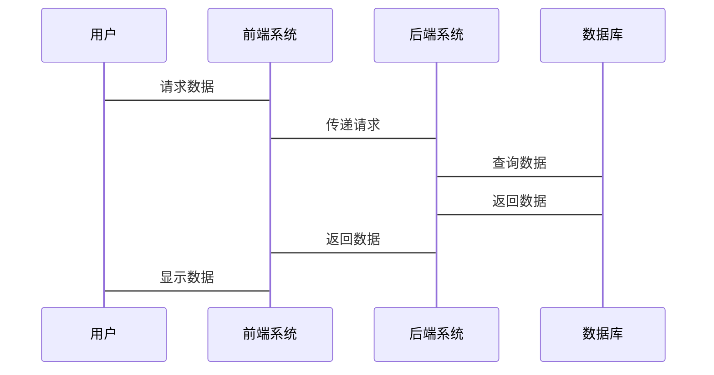

                 


# 气候适应性基础设施的投资需求与机遇

> **关键词**：气候适应性基础设施、投资需求、气候变化、可持续发展、绿色投资、风险管理

> **摘要**：气候适应性基础设施是指能够在气候变化条件下维持功能和韧性的基础设施系统。随着气候变化的加剧，全球对气候适应性基础设施的投资需求日益增长。本文将从气候适应性基础设施的核心概念、投资评估方法、技术与创新、系统架构设计以及项目实战等多个方面进行详细探讨，分析其投资需求与机遇，为投资者和决策者提供有价值的参考。

---

## 第一部分: 气候适应性基础设施的背景与概念

### 第1章: 气候变化与基础设施的脆弱性

#### 1.1 气候变化的全球挑战
- **1.1.1 气候变化的定义与影响**  
  气候变化是指全球气候系统长期的变化趋势，主要表现为全球变暖、极端天气事件增多等。气候变化对基础设施的影响包括洪水、干旱、海平面上升等，导致基础设施的损坏和功能失效。

- **1.1.2 基础设施在气候变化中的角色**  
  基础设施是社会经济发展的重要支撑，包括交通、能源、水利、建筑等领域。气候变化的加剧使得传统基础设施的脆弱性逐渐显现，尤其是在应对极端天气事件时，基础设施的功能发挥受到严重挑战。

- **1.1.3 气候适应性基础设施的必要性**  
  气候适应性基础设施是能够在气候变化条件下维持功能和韧性的基础设施系统。其必要性体现在应对气候变化的直接威胁、减少灾害损失、保障社会经济的持续发展等方面。

#### 1.2 气候适应性基础设施的核心概念
- **1.2.1 气候适应性基础设施的定义**  
  气候适应性基础设施是指在设计、建设和运营过程中考虑气候变化因素，能够应对极端天气事件和环境变化的基础设施系统。

- **1.2.2 气候适应性基础设施的特点**  
  气候适应性基础设施具有以下特点：  
  1. **韧性**：能够在极端天气事件中保持功能或快速恢复。  
  2. **可持续性**：采用绿色技术，减少碳排放，降低对环境的负担。  
  3. **适应性**：能够根据气候变化趋势进行调整和优化。  

- **1.2.3 气候适应性基础设施与可持续发展的关系**  
  气候适应性基础设施是实现可持续发展的关键组成部分。通过减少碳排放、提高资源利用效率，气候适应性基础设施能够为社会经济发展提供绿色支持，同时增强社会的抗灾能力。

### 第2章: 气候适应性基础设施的核心概念与联系

#### 2.1 气候适应性基础设施的核心原理
- **2.1.1 气候适应性基础设施的系统性**  
  气候适应性基础设施是一个复杂的系统工程，需要在设计、建设和运营过程中考虑气候因素对各子系统的影响。  

- **2.1.2 气候适应性基础设施的韧性特征**  
  韧性是气候适应性基础设施的核心特征，体现在系统的抗干扰能力、恢复能力和适应能力上。  

- **2.1.3 气候适应性基础设施的可持续性**  
  可持续性是气候适应性基础设施的最终目标，体现在资源节约、环境友好和经济可行三个方面。

#### 2.2 气候适应性基础设施的概念对比表
- **2.2.1 气候适应性基础设施与传统基础设施的对比**  
  | **特征**         | **传统基础设施**                  | **气候适应性基础设施**               |
  |------------------|-----------------------------------|------------------------------------|
  | 设计目标         | 服务特定功能需求                 | 应对气候变化，增强韧性                |
  | 材料与技术       | 传统建筑材料，技术相对固定       | 绿色材料，可再生能源技术，智能化技术|
  | 维护成本         | 高，依赖外部支持                 | 低，具有自我修复能力                 |

- **2.2.2 气候适应性基础设施与防灾减灾基础设施的对比**  
  | **特征**         | **防灾减灾基础设施**              | **气候适应性基础设施**               |
  |------------------|----------------------------------|------------------------------------|
  | 目标             | 减少灾害损失                     | 应对气候变化，增强系统的适应能力     |
  | 适用范围         | 局部区域                         | 全球范围                            |
  | 投资周期         | 短期                             | 长期                                |

- **2.2.3 气候适应性基础设施与绿色基础设施的对比**  
  | **特征**         | **绿色基础设施**                 | **气候适应性基础设施**               |
  |------------------|----------------------------------|------------------------------------|
  | 定义             | 以生态为核心，减少碳排放         | 以适应气候变化为核心，增强系统韧性   |
  | 适用领域         | 城市绿化、污水处理等             | 防洪、交通、能源等领域               |
  | 投资重点         | 环境保护                         | 应对气候变化                        |

#### 2.3 气候适应性基础设施的ER实体关系图
```mermaid
erd
  左对齐
  title 气候适应性基础设施ER图
  class 气候适应性基础设施 {
    <主键> 项目ID
    项目名称
    项目类型
    投资金额
    <外键> 所属区域
    <外键> 业主单位
    <外键> 设计单位
  }
  class 区域 {
    <主键> 区域ID
    区域名称
    气候风险等级
  }
  class 业主单位 {
    <主键> 单位ID
    单位名称
    责任范围
  }
  class 设计单位 {
    <主键> 单位ID
    单位名称
    设计资质
  }
  气候适应性基础设施 --> 区域: 所属区域
  气候适应性基础设施 --> 业主单位: 业主单位
  气候适应性基础设施 --> 设计单位: 设计单位
```

---

## 第二部分: 气候适应性基础设施的投资评估与分析

### 第3章: 气候适应性基础设施的投资评估方法

#### 3.1 投资评估的核心原理
- **3.1.1 投资评估的基本概念**  
  投资评估是指对气候适应性基础设施项目在经济、环境和社会三个维度上的价值进行综合评估，以确定其可行性和投资回报。

- **3.1.2 投资评估的主要方法**  
  常用的气候适应性基础设施投资评估方法包括：  
  1. **成本效益分析（Cost-Benefit Analysis）**：比较项目的总成本和总效益，判断其经济可行性。  
  2. **净现值法（Net Present Value, NPV）**：计算项目未来现金流的现值，判断其是否具有投资价值。  
  3. **内部收益率法（Internal Rate of Return, IRR）**：计算项目资金的内部收益率，判断其投资回报率是否符合预期。  

- **3.1.3 投资评估的数学模型**  
  - **净现值公式**：  
    $$ NPV = \sum_{t=1}^{n} \frac{CF_t}{(1+r)^t} - I_0 $$  
    其中，\( CF_t \) 是第 \( t \) 年的现金流，\( r \) 是贴现率，\( I_0 \) 是初始投资。  
  - **内部收益率公式**：  
    $$ NPV = 0 = \sum_{t=1}^{n} \frac{CF_t}{(1+IRR)^t} - I_0 $$  

#### 3.2 投资评估的案例分析
- **3.2.1 某城市防洪设施的投资评估**  
  某城市计划建设一条防洪堤，预计总投资为 10 亿元，建成后可减少每年因洪水造成的损失约 2 亿元。假设贴现率为 5%，则：  
  - 净现值计算：  
    $$ NPV = \frac{2}{(1+0.05)^1} + \frac{2}{(1+0.05)^2} + \cdots + \frac{2}{(1+0.05)^n} - 10 $$  
    经计算，NPV > 0，项目可行。  

- **3.2.2 某绿色能源项目的投资评估**  
  某风力发电项目总投资为 5 亿元，预计运营期 10 年，年均收益为 0.8 亿元。贴现率为 8%，则：  
  $$ NPV = \frac{0.8}{(1+0.08)^1} + \frac{0.8}{(1+0.08)^2} + \cdots + \frac{0.8}{(1+0.08)^{10}} - 5 $$  
  经计算，NPV > 0，项目可行。  

### 第4章: 气候适应性基础设施的投资机会分析

#### 4.1 投资机会的核心原理
- **4.1.1 投资机会的定义**  
  投资机会是指在气候适应性基础设施领域中，具有较高回报潜力和可行性的项目。

- **4.1.2 投资机会的识别方法**  
  - **需求分析法**：根据气候变化对基础设施的影响，识别高风险区域的需求。  
  - **技术分析法**：分析绿色技术的创新和应用潜力，寻找投资机会。  
  - **政策分析法**：结合政府政策和资金支持，寻找政策鼓励的领域。  

- **4.1.3 投资机会的评估标准**  
  1. 项目的社会效益：是否能够有效应对气候变化，减少灾害损失。  
  2. 项目的经济效益：是否具有可行的商业模式和投资回报。  
  3. 项目的环境效益：是否能够降低碳排放，促进可持续发展。  

#### 4.2 投资机会的数学模型与公式
- **4.2.1 投资机会的评估模型**  
  $$ ROI = \frac{收益 - 成本}{成本} \times 100\% $$  
  其中，\( ROI \) 是投资回报率，收益和成本均考虑时间价值。  

- **4.2.2 投资机会的风险评估公式**  
  $$ VaR = \alpha \times 标准差 $$  
  其中，\( VaR \) 是在风险度量中，表示在一定置信水平下的潜在损失，\( \alpha \) 是置信水平，标准差是收益的波动性。  

---

## 第三部分: 气候适应性基础设施的技术与创新

### 第5章: 气候适应性基础设施的技术与创新

#### 5.1 可再生能源技术的应用
- **5.1.1 太阳能技术**  
  太阳能技术在气候适应性基础设施中的应用包括太阳能发电系统、太阳能热水系统等。  

- **5.1.2 风能技术**  
  风能技术适用于建设海上风电场，为沿海城市提供绿色能源支持。  

- **5.1.3 智能能源管理系统**  
  智能能源管理系统能够实时监测和优化能源使用，提高能源利用效率。  

#### 5.2 智慧基础设施的创新
- **5.2.1 智慧交通系统**  
  智慧交通系统通过物联网、大数据和人工智能技术，优化交通流量，减少碳排放。  

- **5.2.2 智慧水利系统**  
  智慧水利系统通过实时监测和数据分析，提高水资源利用效率，增强防洪能力。  

- **5.2.3 智慧建筑系统**  
  智慧建筑系统通过智能传感器和自动化控制，实现节能减排，降低运营成本。  

---

## 第四部分: 气候适应性基础设施的系统架构设计

### 第6章: 气候适应性基础设施的系统架构设计

#### 6.1 系统功能设计
- **6.1.1 数据采集与处理**  
  系统需要采集气候数据、基础设施运行数据等，进行清洗和分析。  

- **6.1.2 风险评估与预警**  
  系统通过分析气候数据和基础设施状态，评估潜在风险并发出预警。  

- **6.1.3 智能决策支持**  
  系统提供基于数据分析的决策支持，优化基础设施的运行和维护。  

#### 6.2 系统架构设计


#### 6.3 系统接口设计
- **6.3.1 数据接口**  
  系统需要与气候数据源、基础设施传感器等外部系统进行数据交互。  

- **6.3.2 用户接口**  
  系统提供直观的用户界面，方便用户查看数据和使用系统功能。  

#### 6.4 系统交互设计


---

## 第五部分: 气候适应性基础设施的项目实战

### 第7章: 气候适应性基础设施的项目实战

#### 7.1 环境安装与配置
- **7.1.1 系统环境**  
  - 操作系统：Linux/Windows  
  - 开发工具：Python、Java、C++  
  - 数据库：MySQL、PostgreSQL  

- **7.1.2 依赖安装**  
  - 安装Python库：`pip install numpy pandas scikit-learn`  
  - 安装JDK：`sudo apt-get install openjdk-8-jdk`  

#### 7.2 系统核心实现
- **7.2.1 数据采集模块**  
  ```python
  import pandas as pd
  import requests

  def fetch_data(api_url):
      response = requests.get(api_url)
      data = response.json()
      return pd.DataFrame(data)
  ```

- **7.2.2 风险评估模块**  
  ```python
  from sklearn.ensemble import RandomForestRegressor

  def risk_assessment(data):
      model = RandomForestRegressor()
      model.fit(data.drop('risk', axis=1), data['risk'])
      return model.predict(new_data)
  ```

#### 7.3 项目实战案例分析
- **7.3.1 某城市防洪项目的实施**  
  通过气候数据和基础设施数据的分析，优化防洪堤的设计和建设，降低洪水风险。  

- **7.3.2 某绿色能源项目的实施**  
  通过智能能源管理系统，优化能源使用，减少碳排放，提高能源利用效率。  

---

## 第六部分: 结论与展望

### 第8章: 结论与展望

#### 8.1 气候适应性基础设施的核心结论
- 气候适应性基础设施是应对气候变化的关键措施，具有重要的社会、经济和环境价值。  
- 投资气候适应性基础设施需要综合考虑经济、环境和社会三个维度，采用科学的投资评估方法。  

#### 8.2 气候适应性基础设施的未来展望
- 随着技术的进步和政策的支持，气候适应性基础设施的投资需求将进一步增加。  
- 未来的气候适应性基础设施将更加智能化、绿色化和韧性化，为社会经济发展提供更有力的支持。  

#### 8.3 最佳实践 tips
- 在投资气候适应性基础设施时，应注重项目的社会效益和环境效益，而不仅仅是经济效益。  
- 采用创新技术和智能化系统，提高基础设施的韧性和适应性。  

---

## 附录

### 附录A: 术语表
- **气候适应性基础设施**：能够在气候变化条件下维持功能和韧性的基础设施系统。  
- **净现值（NPV）**：项目未来现金流的现值与初始投资的差额。  
- **内部收益率（IRR）**：项目资金的内部回报率。  

### 附录B: 数据来源与参考文献
- 数据来源：公开气候数据、学术研究论文、行业报告。  
- 参考文献：  
  1. IPCC 第六次评估报告。  
  2. 全球气候变化投资报告。  

### 附录C: 拓展阅读
- 推荐书籍：  
  - 《气候变化经济学》  
  - 《绿色投资与可持续发展》  

---

**作者：AI天才研究院/AI Genius Institute & 禅与计算机程序设计艺术 /Zen And The Art of Computer Programming**

