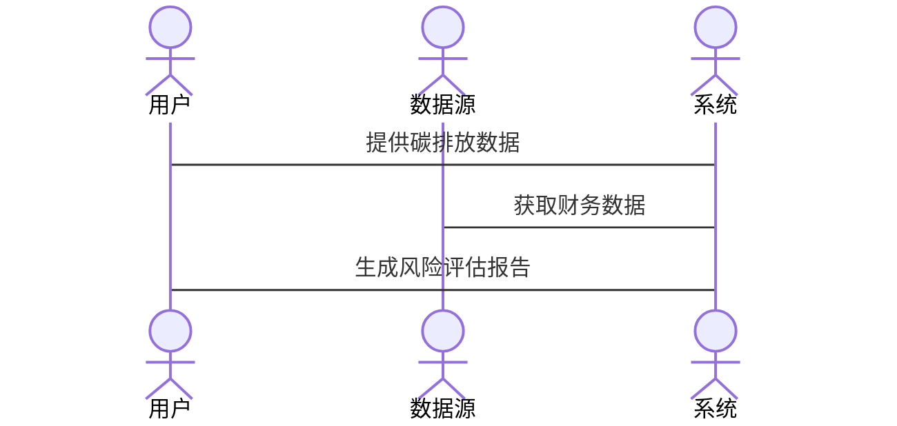

                 


# 气候风险信息披露对公司估值的影响

> 关键词：气候风险，信息披露，公司估值，TCFD，碳排放，风险管理

> 摘要：本文深入探讨气候风险信息披露对公司估值的影响，从理论分析到实际案例，结合系统架构设计和数学模型，全面解析气候风险如何通过信息披露影响企业价值和市场反应。文章还提出了气候风险管理的最佳实践和未来研究方向。

---

## 第一部分：背景与核心概念

### 第1章：气候变化与气候风险概述

#### 1.1 气候变化的背景与挑战

气候变化是21世纪最严峻的全球性问题之一。根据联合国政府间气候变化专门委员会（IPCC）的报告，人类活动导致的温室气体排放是气候变化的主要驱动因素。气候变化不仅影响自然生态系统，还对经济社会发展产生了深远影响，包括极端天气事件增加、海平面上升、农业生产下降等。

气候变化对企业的影响是多方面的，包括运营成本增加、供应链中断、法规风险等。例如，极端天气可能导致企业财产损失，而碳排放限制政策可能增加企业的合规成本。因此，气候风险是企业面临的重要风险之一。

#### 1.2 气候风险的特征与影响

气候风险具有多维性，包括物理风险（如极端天气事件对企业资产的破坏）、转型风险（如碳中和政策对企业业务模式的影响）和法律风险（如碳排放法规的罚款）。此外，气候风险具有时间维度和空间维度：短期风险可能来自极端天气事件，而长期风险则来自气候变化的累积效应。

气候风险对经济和社会的影响是深远的。例如，气候变化可能导致某些地区的水资源短缺，进而影响农业生产和粮食安全，从而引发通货膨胀。此外，气候变化还可能导致某些行业（如能源、建筑）的资产贬值。

#### 1.3 气候风险信息披露的定义与机制

气候风险信息披露是指企业在财务报告或其他公开文件中，披露与气候变化相关的风险和机会。这些披露通常包括企业在减少碳排放方面的努力、气候变化对业务的影响以及企业应对气候变化的策略。

常见的气候风险披露框架包括：
1. **TCFD（气候变化相关财务信息披露工作组）**：TCFD建议企业披露与气候变化相关的财务信息，包括治理、战略、风险管理、指标和目标。
2. **CDP（碳披露项目）**：CDP要求企业披露碳排放数据、气候变化风险管理措施以及气候变化对业务的影响。

气候风险信息披露的实施路径包括：数据收集、分析、报告和持续改进。企业需要收集与气候变化相关的数据，如碳排放量、能源消耗等，并分析这些数据对财务状况的影响。

#### 1.4 气候风险信息披露对公司估值的影响

气候风险信息披露直接影响市场对企业的认知和估值。例如，披露碳排放数据可以帮助投资者评估企业的环境风险，从而影响股价。此外，气候风险信息披露还可以提高企业的透明度和可信度，增强投资者对企业的信任。

---

## 第二部分：气候风险信息披露的理论分析

### 第2章：气候风险披露的理论基础

#### 2.1 气候风险披露的框架与模型

TCFD框架是目前最常用的气候风险披露框架之一。TCFD框架要求企业在治理、战略、风险管理、指标和目标四个方面披露信息。例如，企业在治理部分需要披露董事会对气候变化的管理情况。

气候风险披露的数学模型可以表示为：

$$ \text{企业价值} = f(\text{财务状况}, \text{气候风险}) $$

其中，气候风险包括物理风险和转型风险，而财务状况包括收入、成本和资产价值。

#### 2.2 气候风险与企业价值的关系

气候风险对企业价值的影响可以通过以下路径实现：
1. 气候风险增加企业的运营成本，从而降低净利润。
2. 气候风险可能导致企业的资产贬值，从而影响资产负债表。
3. 气候风险可能影响企业的未来现金流，从而影响折现率。

例如，假设一家企业的碳排放较高，而碳中和政策可能导致其合规成本增加，从而影响其净利润和股价。

#### 2.3 气候风险披露的市场反应模型

气候风险披露对市场反应的影响可以通过以下路径实现：
1. 信息披露提高市场对气候风险的认知，从而影响股价。
2. 投资者根据气候风险信息调整其投资决策，从而影响市场定价效率。

例如，如果一家企业披露了较高的碳排放数据，投资者可能会认为该企业面临较高的环境风险，从而降低对该企业的估值。

---

## 第三部分：气候风险对估值的影响机制

### 第3章：气候风险对财务表现的影响

#### 3.1 气候风险对收入与成本的影响

气候风险可能通过以下方式影响企业的收入与成本：
1. 物理风险：极端天气事件可能导致企业生产中断，从而影响收入。
2. 转型风险：碳中和政策可能导致企业需要更换设备或技术，从而增加成本。

例如，一家依赖化石燃料的企业可能面临转型风险，因为碳中和政策可能导致其业务模式受到限制。

#### 3.2 气候风险对资产价值的影响

气候风险可能通过以下方式影响企业的资产价值：
1. 资产贬值：气候变化可能导致某些资产（如房地产）的价值下降。
2. 资产减值：企业可能需要对某些资产进行减值准备，以反映其未来的盈利能力下降。

例如，一家位于沿海地区的企业的房地产资产可能因海平面上升而贬值。

#### 3.3 气候风险对现金流的影响

气候风险可能通过以下方式影响企业的现金流：
1. 现金流减少：气候变化可能导致企业收入减少，从而影响现金流。
2. 现金流增加：企业可能需要增加资本支出，以应对气候变化的影响。

例如，企业可能需要投资于可再生能源技术，以减少碳排放，从而增加现金流。

---

## 第四部分：系统分析与架构设计

### 第4章：气候风险影响评估系统

#### 4.1 问题场景介绍

气候风险影响评估系统的目标是帮助企业量化气候风险对其财务状况的影响。该系统需要考虑企业的碳排放数据、气候变化政策和市场反应等因素。

#### 4.2 系统功能设计

系统功能包括：
1. 数据采集：收集企业的碳排放数据、财务数据和政策数据。
2. 风险评估：量化气候风险对企业财务状况的影响。
3. 信息披露：生成气候风险披露报告。
4. 监测与反馈：实时监测气候风险的变化，并提供反馈。

#### 4.3 系统架构设计

以下是系统架构的Mermaid图：


#### 4.4 系统接口设计

系统接口包括：
1. 数据输入接口：接收企业的碳排放数据和财务数据。
2. 数据处理接口：处理数据并生成风险评估报告。
3. 报告生成接口：生成气候风险披露报告。

#### 4.5 系统交互设计

以下是系统交互的Mermaid序列图：



---

## 第五部分：项目实战

### 第5章：气候风险信息披露的系统实现

#### 5.1 环境安装

需要安装以下工具：
1. Python
2. Pandas
3. Matplotlib
4. TCFD框架

#### 5.2 系统核心实现源代码

以下是系统核心实现的Python代码：

```python
import pandas as pd
import matplotlib.pyplot as plt

# 数据采集
def collect_data():
    data = pd.read_csv('climate_risk.csv')
    return data

# 风险评估
def assess_risk(data):
    risk = data['carbon_emission'] * 0.1  # 假设碳排放对风险的影响系数为0.1
    return risk

# 信息披露
def disclose_info(risk):
    report = pd.DataFrame({'风险等级': ['低', '中', '高'], '对应风险值': [0, 0.5, 1]})
    return report

# 可视化
def visualize(risk):
    plt.hist(risk, bins=10)
    plt.title('气候风险分布')
    plt.show()

# 主函数
def main():
    data = collect_data()
    risk = assess_risk(data)
    report = disclose_info(risk)
    visualize(risk)

if __name__ == '__main__':
    main()
```

#### 5.3 代码应用解读与分析

上述代码实现了一个简单的气候风险信息披露系统。数据采集函数从CSV文件中读取数据，风险评估函数计算风险值，信息披露函数生成报告，可视化函数绘制风险分布图。

#### 5.4 案例分析

以能源行业为例，假设某能源企业的碳排放数据如下：

| 年份 | 碳排放量（吨） |
|------|----------------|
| 2020 | 1000            |
| 2021 | 1200            |
| 2022 | 1100            |

运行上述代码，系统将生成风险评估报告，显示企业的风险等级为“高”，并绘制风险分布图。

#### 5.5 项目小结

通过上述案例分析，可以看出气候风险信息披露对企业估值的影响是显著的。企业需要积极应对气候变化，减少碳排放，以降低气候风险对估值的影响。

---

## 第六部分：结论与建议

### 第6章：气候风险管理的最佳实践

#### 6.1 结论

气候风险信息披露是企业应对气候变化的重要手段。通过信息披露，企业可以提高透明度，增强投资者对企业的信任，从而提升估值。此外，气候风险信息披露还可以帮助企业识别和管理气候风险，降低企业的财务风险。

#### 6.2 政策建议

政策制定者应推动气候风险信息披露的标准化，鼓励企业采用TCFD等框架，披露与气候变化相关的财务信息。此外，政策制定者还应加强对气候风险的监管，确保企业披露的信息真实、准确。

#### 6.3 未来研究方向

未来研究可以关注以下方面：
1. 气候风险信息披露对股价波动的影响。
2. 气候风险信息披露对投资者决策的影响。
3. 气候风险信息披露的国际比较与借鉴。

---

## 第七部分：注意事项与扩展阅读

### 7.1 注意事项

企业在进行气候风险信息披露时，应确保披露信息的准确性和完整性。此外，企业还应关注气候变化政策的变化，及时调整信息披露策略。

### 7.2 扩展阅读

1. TCFD框架：https://www.tcfd.global
2. CDP报告：https://www.cdp.net
3. 气候风险与企业价值的相关研究

---

## 作者信息

作者：AI天才研究院/AI Genius Institute & 禅与计算机程序设计艺术/Zen And The Art of Computer Programming

---

**版权声明：** 本文章版权归作者所有，转载请注明出处，并保留原文地址。

