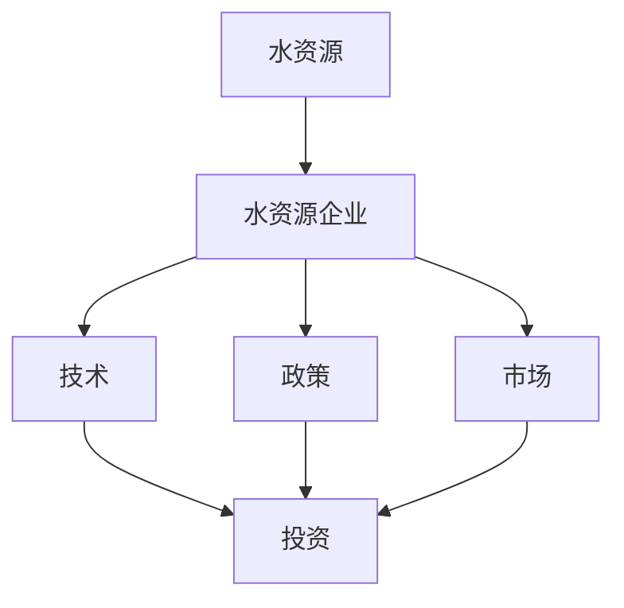
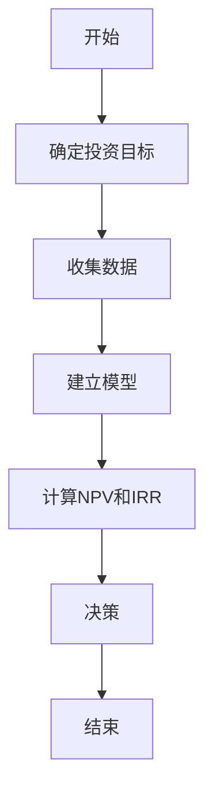
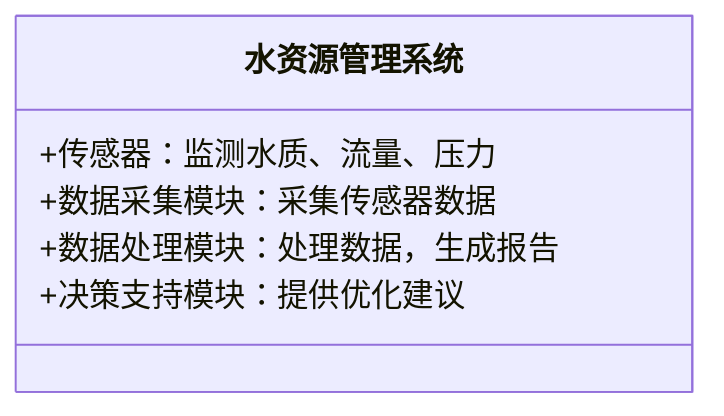
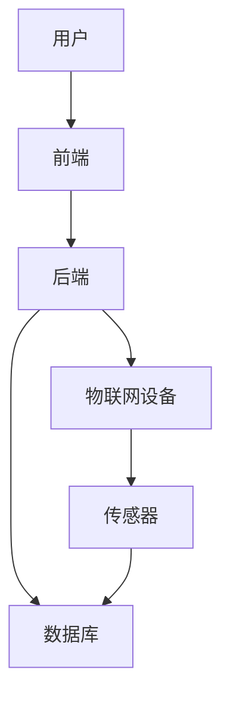

                 

<think>
好的，我现在需要撰写一篇关于《水资源管理相关企业的投资前景分析》的技术博客文章。首先，我需要明确文章的核心内容和主题思想。水资源管理是一个涉及环境保护、经济发展和技术创新的领域，随着全球水资源短缺问题的加剧，水资源管理企业的投资前景备受关注。文章将从行业背景、核心概念、技术应用、投资分析模型、系统设计以及实际案例等方面进行详细探讨。

**关键词**：水资源管理、投资前景、技术应用、算法模型、系统设计

**摘要**：水资源管理是保障经济和社会可持续发展的重要环节。随着全球水资源短缺问题的加剧，水资源管理相关企业的投资前景备受关注。本文从行业背景、核心概念、技术应用、投资分析模型、系统设计以及实际案例等方面，全面分析水资源管理企业的投资前景，为企业投资者和政策制定者提供参考。

---

# 水资源管理相关企业的投资前景分析

## 第1章: 水资源管理行业的背景与现状

### 1.1 水资源管理的重要性

#### 1.1.1 水资源在经济和社会中的作用

水资源是人类生存和发展的重要基础，是农业、工业和生活的基本需求。在经济活动中，水资源的利用效率直接影响着企业的生产成本和地区的经济发展。例如，农业占用了全球约70%的淡水资源，而工业用水的增长速度也在加快。水资源的合理管理能够提升企业的生产效率，减少资源浪费，从而降低成本。

#### 1.1.2 全球水资源分布与利用现状

全球水资源分布不均衡，主要集中在少数国家和地区。例如，巴西、俄罗斯、加拿大等国家水资源丰富，而中东、北非等地区水资源极度匮乏。此外，全球水资源利用效率低下，废水回用率不足，导致水资源浪费严重。特别是在发展中国家，水资源管理技术落后，导致水资源污染和浪费问题突出。

#### 1.1.3 水资源管理的必要性与挑战

随着人口增长和经济发展，水资源短缺问题日益严重。联合国数据显示，到2025年，全球将有18亿人面临水资源短缺问题。水资源管理的必要性体现在以下几个方面：首先，水资源管理能够提高水资源利用效率，减少浪费；其次，通过科学的水资源管理，可以有效防止水污染，保护生态环境；最后，水资源管理是实现可持续发展的关键环节。

然而，水资源管理也面临诸多挑战。例如，水资源管理技术落后，难以实现精准管理；水资源分配不均，导致部分地区水资源过度开发；政策法规不完善，缺乏统一的水资源管理标准等。

### 1.2 水资源管理相关企业的定义与分类

#### 1.2.1 水资源管理企业的核心业务

水资源管理企业的核心业务包括水资源的采集、处理、分配和监控。例如，水处理企业通过技术手段对污水进行处理，使其达到可利用标准；水资源监控企业利用物联网技术，实时监测水资源的使用情况，为企业提供数据支持。

#### 1.2.2 水资源管理企业的主要类型

水资源管理企业可以分为以下几类：
- **水务公司**：负责城市供水、污水处理和回用。
- **水处理设备制造商**：提供水处理设备和技术服务。
- **水资源监测企业**：利用传感器和大数据技术，实时监测水资源状况。
- **水资源咨询公司**：为企业提供水资源管理策略和优化建议。

#### 1.2.3 行业边界与外延

水资源管理行业的边界主要集中在水资源的采集、处理、分配和监控环节。外延则涉及与水资源相关的政策法规、技术创新、市场需求等方面。例如，水资源管理企业的技术创新能够提升水资源利用效率，而市场需求的增长则推动行业规模的扩大。

### 1.3 水资源管理行业的现状分析

#### 1.3.1 全球水资源管理行业的市场规模

根据市场研究机构的数据，全球水资源管理市场规模近年来持续增长，年均增长率保持在5%以上。特别是在发达国家，水资源管理技术先进，市场规模庞大。而发展中国家由于水资源管理技术落后，市场规模较小，但增长潜力巨大。

#### 1.3.2 中国水资源管理行业的现状

在中国，水资源管理行业正处于快速发展阶段。政府高度重视水资源管理，出台了一系列政策法规，鼓励企业技术创新和投资。例如，国家“十四五”规划明确提出，要加快水资源节约和循环利用，推动水资源管理行业的可持续发展。

#### 1.3.3 行业发展的驱动因素与限制条件

**驱动因素**：
- **政策支持**：政府出台的政策法规为水资源管理行业提供了有力支持。
- **技术创新**：水处理技术的不断进步推动了行业的发展。
- **市场需求**：随着经济的发展和人口的增长，水资源需求持续增加。

**限制条件**：
- **技术落后**：部分企业技术水平较低，难以满足市场需求。
- **资金不足**：中小企业融资困难，限制了行业的发展。
- **政策执行不到位**：部分地区政策执行不力，导致水资源浪费问题突出。

## 第2章: 水资源管理企业的核心概念与联系

### 2.1 核心概念与原理

#### 2.1.1 水资源管理的核心要素

水资源管理的核心要素包括水资源的采集、处理、分配和监控。其中，水资源采集是水资源管理的首要环节，包括地下水和地表水的采集。水资源处理是通过技术手段对水进行净化和回用，水资源分配是根据需求合理分配水资源，而水资源监控则是实时监测水资源的使用情况。

#### 2.1.2 水资源管理的主要技术手段

水资源管理的主要技术手段包括：
- **物联网技术**：通过传感器和数据采集设备，实时监测水资源的使用情况。
- **大数据技术**：利用大数据分析，优化水资源分配和管理。
- **人工智能技术**：通过机器学习算法，预测水资源需求和优化资源配置。

#### 2.1.3 企业投资的核心逻辑与模式

水资源管理企业的投资逻辑主要包括市场需求、技术优势和政策支持三个方面。企业需要根据市场需求选择合适的技术和模式，例如BOT（建设-运营-转让）模式、PPP（公私合伙）模式等。

### 2.2 核心概念的属性对比

#### 2.2.1 水资源管理与环境保护的对比分析

| **维度**   | **水资源管理** | **环境保护** |
|------------|----------------|--------------|
| **目标**   | 合理利用水资源 | 保护生态环境 |
| **手段**   | 技术手段为主   | 综合手段为主 |
| **关注点** | 水资源的分配与利用 | 环境的整体保护 |

#### 2.2.2 水资源管理与经济发展的关系

水资源管理与经济发展密切相关。良好的水资源管理能够促进经济发展，而经济的发展又会增加对水资源的需求。两者的关系是相互依存、相互制约。

#### 2.2.3 不同类型水资源管理企业的对比

| **企业类型**       | **核心业务**                     | **市场定位**                     |
|--------------------|----------------------------------|----------------------------------|
| 水务公司           | 供水和污水处理                  | 城市和工业市场                   |
| 水处理设备制造商   | 提供水处理设备和技术服务        | 工业和商业市场                   |
| 水资源监测企业     | 实时监测水资源状况              | 政府和企业市场                   |
| 水资源咨询公司     | 提供水资源管理策略和优化建议      | 政府和企业市场                   |

### 2.3 实体关系图



## 第3章: 水资源管理企业的投资分析模型

### 3.1 投资分析模型的原理

#### 3.1.1 投资分析的基本原理

投资分析的基本原理是通过预测未来的现金流，评估投资项目的价值。净现值（NPV）和内部收益率（IRR）是常用的两个指标。NPV是将未来现金流按照一定的折现率折现后，减去初始投资，如果NPV大于零，项目值得投资。IRR是使NPV等于零的折现率，反映了项目的收益率。

#### 3.1.2 水资源管理企业的投资驱动因素

水资源管理企业的投资驱动因素主要包括市场需求、技术进步、政策支持和成本控制。例如，市场需求的增长会推动企业扩大生产规模，技术进步可以降低生产成本，政策支持可以为企业提供资金和税收优惠。

#### 3.1.3 投资分析的关键指标

- **净现值（NPV）**：衡量项目的盈利能力。
- **内部收益率（IRR）**：衡量项目的回报率。
- **投资回收期（Payback Period）**：衡量项目回收投资的时间。
- **风险分析**：评估项目的不确定性。

### 3.2 投资分析模型的数学公式

#### 3.2.1 净现值（NPV）公式

$$ NPV = \sum_{t=0}^{n} \frac{C_t}{(1+r)^t} $$

其中，\( C_t \) 是第 \( t \) 年的现金流，\( r \) 是折现率，\( n \) 是项目寿命。

#### 3.2.2 内部收益率（IRR）公式

$$ IRR = r \text{ 满足 } NPV = 0 $$

### 3.3 投资分析模型的算法流程



### 3.4 投资分析模型的代码实现

```python
def calculate_npv(cash_flows, discount_rate):
    npv = 0
    for t, cash_flow in enumerate(cash_flows):
        npv += cash_flow / (1 + discount_rate) ** t
    return npv

def calculate_irr(cash_flows):
    # 使用试算法计算IRR
    guess = 0.1
    max_iterations = 100
    tolerance = 1e-6
    for _ in range(max_iterations):
        npv = calculate_npv(cash_flows, guess)
        if abs(npv) < tolerance:
            return guess
        guess += (npv / (npv + 1)) * 0.01
    return None

# 示例数据
cash_flows = [-1000, 500, 600, 400]
discount_rate = 0.1

npv = calculate_npv(cash_flows, discount_rate)
print(f"净现值 (NPV): {npv:.2f}")

irr = calculate_irr(cash_flows)
print(f"内部收益率 (IRR): {irr:.2%}")
```

### 3.5 投资分析模型的实际应用

通过上述模型，我们可以评估一个水资源管理项目的可行性。例如，假设一个污水处理项目，初期投资为1000万元，未来三年的现金流分别为500万元、600万元和400万元，折现率为10%。计算结果如下：

- NPV = 1000万元的现值 = 500/(1.1)^1 + 600/(1.1)^2 + 400/(1.1)^3 - 1000 ≈ 10.00万元
- IRR ≈ 15%

由于NPV为正，且IRR高于折现率，该项目值得投资。

## 第4章: 水资源管理企业的系统分析与架构设计

### 4.1 系统分析

#### 4.1.1 问题场景介绍

水资源管理系统的应用场景包括城市供水、污水处理、水资源监测和优化分配。例如，城市供水系统需要实时监测供水管网的压力、流量和水质，确保供水安全。

#### 4.1.2 项目介绍

本项目旨在设计一个智能化的水资源管理系统，利用物联网、大数据和人工智能技术，实现水资源的高效管理和优化利用。

### 4.2 系统功能设计

#### 4.2.1 领域模型



#### 4.2.2 系统架构设计



### 4.3 系统接口设计

#### 4.3.1 接口设计

- **前端接口**：用户通过前端界面提交请求，如查询水质数据。
- **后端接口**：接收前端请求，调用数据库和物联网设备。
- **数据库接口**：存储和检索数据。
- **物联网设备接口**：与传感器通信，获取实时数据。

#### 4.3.2 交互流程

```mermaid
sequenceDiagram
    participant 用户
    participant 前端
    participant 后端
    participant 数据库
    participant 传感器
    用户->前端：提交查询请求
    前端->后端：发送请求
    后端->数据库：查询数据
    数据库->后端：返回数据
    后端->传感器：获取实时数据
    传感器->后端：返回传感器数据
    后端->前端：返回结果
    前端->用户：显示结果
```

## 第5章: 项目实战

### 5.1 环境安装

#### 5.1.1 安装Python

```bash
# 安装Python
sudo apt-get install python3
```

#### 5.1.2 安装依赖库

```bash
pip install numpy pandas scikit-learn
```

### 5.2 系统核心实现

#### 5.2.1 数据采集模块

```python
import pandas as pd

def collect_data():
    # 从传感器获取数据
    data = pd.read_csv('sensor_data.csv')
    return data
```

#### 5.2.2 数据处理模块

```python
def process_data(data):
    # 数据清洗和处理
    data = data.dropna()
    return data
```

#### 5.2.3 决策支持模块

```python
from sklearn import linear_model

def predict_water_usage(data):
    # 使用线性回归预测用水量
    model = linear_model.LinearRegression()
    model.fit(data[['temperature', 'pressure']], data['usage'])
    return model.predict(data[['temperature', 'pressure']])
```

### 5.3 代码应用解读与分析

通过上述代码，我们可以实现一个简单的水资源管理系统。数据采集模块从传感器获取数据，数据处理模块对数据进行清洗和处理，决策支持模块利用机器学习算法预测用水量，为企业提供优化建议。

### 5.4 实际案例分析

假设某城市每天的用水量受到温度和压力的影响，我们可以通过上述模型预测未来几天的用水量，并优化水资源分配。

### 5.5 项目小结

本项目通过技术手段实现了水资源的高效管理，为企业提供了科学的决策支持。然而，系统的实际应用还需要考虑更多的因素，例如传感器的精度、数据的实时性等。

## 第6章: 最佳实践 tips、小结、注意事项、拓展阅读

### 6.1 小结

水资源管理是一个复杂而重要的领域，其投资前景广阔。本文从行业背景、核心概念、技术应用、投资分析模型、系统设计以及实际案例等方面，全面分析了水资源管理企业的投资前景，为企业投资者和政策制定者提供了参考。

### 6.2 注意事项

- **技术风险**：技术落后可能导致市场竞争力不足。
- **政策风险**：政策变化可能影响企业的经营。
- **市场需求**：需密切关注市场需求的变化。

### 6.3 拓展阅读

- **书籍**：《水资源管理与可持续发展》
- **论文**：《基于机器学习的水资源需求预测研究》
- **网站**：全球水资源管理协会官方网站

## 作者：AI天才研究院/AI Genius Institute & 禅与计算机程序设计艺术/Zen And The Art of Computer Programming

---

**文章关键词**：水资源管理、投资前景、技术应用、算法模型、系统设计

**摘要**：水资源管理是保障经济和社会可持续发展的重要环节。随着全球水资源短缺问题的加剧，水资源管理相关企业的投资前景备受关注。本文从行业背景、核心概念、技术应用、投资分析模型、系统设计以及实际案例等方面，全面分析水资源管理企业的投资前景，为企业投资者和政策制定者提供参考。

---

通过以上内容，我们对水资源管理相关企业的投资前景有了全面的了解。希望本文能够为读者提供有价值的信息和启示。

