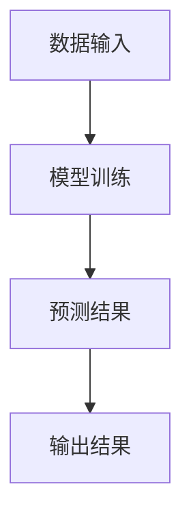

                 


# 《汇率波动风险管理策略》

---

## 关键词：
汇率波动、风险管理、时间序列分析、GARCH模型、机器学习、系统架构、风险管理策略

---

## 摘要：
本文深入探讨了汇率波动风险管理的核心策略，从背景、模型、系统设计到实战案例，全面分析了汇率波动对经济的影响及其风险管理的重要性。通过时间序列分析、GARCH模型和机器学习方法，结合系统架构设计和项目实战，提供了有效的风险管理解决方案。最后，总结了最佳实践，为读者提供了实用的指导和建议。

---

# 第一部分: 汇率波动风险管理背景与基础

## 第1章: 汇率波动与风险管理概述

### 1.1 汇率波动的定义与特性
- **1.1.1 汇率的基本概念**  
  汇率是两种货币之间的兑换比率，反映两国经济实力和市场信心。  
- **1.1.2 汇率波动的特性**  
  汇率波动具有随机性、周期性和非线性特征，受宏观经济政策、市场情绪等多种因素影响。  
- **1.1.3 汇率波动对经济的影响**  
  汇率波动可能导致国际贸易摩擦、资本流动不稳定和企业盈利波动。

### 1.2 汇率风险管理的重要性
- **1.2.1 汇率波动对企业的影响**  
  企业可能面临汇率波动带来的成本增加和利润下降风险。  
- **1.2.2 风险管理的核心作用**  
  通过有效的风险管理，企业可以降低损失，提高资本运作效率。  
- **1.2.3 全球化背景下的风险管理挑战**  
  全球化加剧了汇率波动的复杂性，企业需要更灵活的管理策略。

### 1.3 汇率风险管理的边界与外延
- **1.3.1 风险管理的边界**  
  风险管理的范围包括货币兑换、贸易结算和外汇投资等方面。  
- **1.3.2 风险管理的外延**  
  风险管理不仅涉及汇率，还包括利率、通货膨胀等其他金融风险。  
- **1.3.3 风险管理与相关概念的对比**  
  风险管理与风险评估、风险控制等概念的区别与联系。

### 1.4 汇率风险管理的核心要素
- **1.4.1 核心要素组成**  
  包括风险识别、风险评估、风险控制和风险监控四个核心要素。  
- **1.4.2 各要素之间的关系**  
  风险识别是基础，风险评估是关键，风险控制是手段，风险监控是保障。  
- **1.4.3 核心要素的特征对比**  
  列表展示了各要素的目标、方法和应用场景的对比。

---

# 第二部分: 汇率波动风险管理的核心模型与算法

## 第2章: 时间序列分析模型

### 2.1 时间序列分析的基本原理
- **2.1.1 时间序列的定义**  
  时间序列是按时间顺序排列的数据，常用于预测未来趋势。  
- **2.1.2 时间序列分析的分类**  
  包括平稳时间序列和非平稳时间序列。  
- **2.1.3 时间序列分析的数学模型**  
  介绍ARIMA模型的基本公式：  
  $$ ARIMA(p, d, q) $$

### 2.2 ARIMA模型
- **2.2.1 ARIMA模型的定义**  
  自回归积分滑动平均模型，适用于非平稳时间序列。  
- **2.2.2 ARIMA模型的参数估计**  
  使用极大似然估计法进行参数估计。  
- **2.2.3 ARIMA模型的优缺点**  
  优点：适合短期预测；缺点：假设条件严格，对异常值敏感。

### 2.3 模型的mermaid流程图


---

## 第3章: 波动率模型

### 3.1 GARCH模型
- **3.1.1 GARCH模型的定义**  
  广义自回归条件异方差模型，用于捕捉金融时间序列的波动性。  
- **3.1.2 GARCH模型的参数估计**  
  使用非线性优化方法进行参数估计。  
- **3.1.3 GARCH模型的优缺点**  
  优点：适合捕捉波动性；缺点：计算复杂，参数过多。

### 3.2 机器学习方法
- **3.2.1 支持向量回归（SVR）**  
  SVR通过构建支持向量进行非线性回归，适用于复杂波动预测。  
- **3.2.2 随机森林**  
  随机森林通过集成学习提高模型的泛化能力，适合多因素影响的汇率波动预测。  
- **3.2.3 神经网络模型**  
  LSTM网络适用于捕捉时间序列的长期依赖关系。

---

# 第三部分: 汇率波动风险管理的系统分析与架构设计

## 第4章: 系统分析与架构设计

### 4.1 问题场景介绍
- **4.1.1 问题背景**  
  企业面临汇率波动带来的财务风险，需要构建实时监控和预警系统。  
- **4.1.2 项目介绍**  
  构建一个基于机器学习的汇率波动预测与管理系统。  

### 4.2 系统功能设计
- **4.2.1 领域模型设计**  
  使用mermaid类图展示系统的主要实体和关系：  
  ```mermaid
  classDiagram
      class 汇率数据 {
          时间戳：Date
          汇率值：Float
      }
      class 预测模型 {
          参数：List[Float]
          预测结果：Float
      }
      class 风险管理系统 {
          数据库：Database
          用户界面：UI
      }
      汇率数据 --> 预测模型
      预测模型 --> 风险管理系统
  ```

### 4.3 系统架构设计
- **4.3.1 系统架构图**  
  使用mermaid架构图展示系统的模块划分：  
  ```mermaid
  architecture
      Client
      Server
      Database
  ```

### 4.4 系统接口设计
- **4.4.1 API接口设计**  
  提供RESTful API接口，用于数据获取、模型训练和结果查询。  
- **4.4.2 接口交互流程**  
  使用mermaid序列图展示接口交互流程：  
  ```mermaid
  sequenceDiagram
      User -> API: 获取汇率数据
      API -> Database: 查询历史数据
      Database --> API: 返回历史数据
      API -> Model: 训练预测模型
      Model --> API: 返回预测结果
      API -> User: 返回预测结果
  ```

---

# 第四部分: 项目实战

## 第5章: 项目实战

### 5.1 环境安装与配置
- **5.1.1 安装Python环境**  
  使用Anaconda或虚拟环境安装Python 3.8以上版本。  
- **5.1.2 安装依赖库**  
  安装numpy、pandas、sklearn、tensorflow等库。  
- **5.1.3 配置开发环境**  
  使用Jupyter Notebook或VS Code进行代码开发。

### 5.2 核心实现
- **5.2.1 数据预处理**  
  数据清洗、标准化和特征工程。  
- **5.2.2 模型实现**  
  使用Keras构建LSTM模型，代码示例：  
  ```python
  import numpy as np
  from tensorflow.keras.models import Sequential
  from tensorflow.keras.layers import LSTM, Dense
  model = Sequential()
  model.add(LSTM(50, input_shape=(timesteps, features)))
  model.add(Dense(1))
  model.compile(optimizer='adam', loss='mean_squared_error')
  ```

### 5.3 案例分析
- **5.3.1 数据来源**  
  使用历史汇率数据进行模型训练。  
- **5.3.2 模型评估**  
  使用均方误差（MSE）和R²系数评估模型性能。  
- **5.3.3 实际应用**  
  部署模型到生产环境，实时监控汇率波动。

---

# 第五部分: 最佳实践与总结

## 第6章: 最佳实践与总结

### 6.1 最佳实践
- **6.1.1 小结**  
  总结本章的主要内容和关键点。  
- **6.1.2 注意事项**  
  提醒读者在实际应用中需要注意的问题。  
- **6.1.3 拓展阅读**  
  推荐相关书籍和文献，供读者深入学习。

---

# 作者：AI天才研究院/AI Genius Institute & 禅与计算机程序设计艺术 /Zen And The Art of Computer Programming

