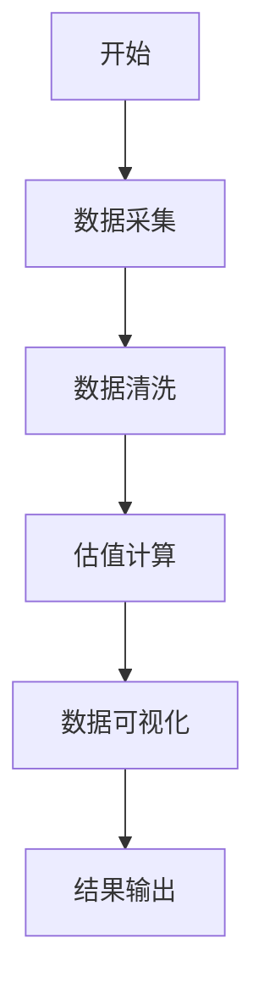
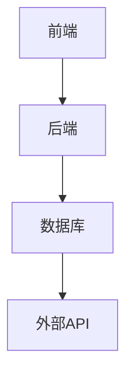

                 


# 法国股市估值: 欧元区重要经济体的投资价值

## 关键词：法国股市, 欧元区, 投资价值, 股市估值, 估值指标, 估值模型, 投资分析

## 摘要：  
法国股市作为欧元区的重要组成部分，具有独特的投资价值。本文将从背景介绍、核心概念、算法原理、系统分析、项目实战等方面，全面解析法国股市的估值方法与投资策略。通过对市盈率、市净率等指标的分析，结合实际案例，帮助投资者更好地理解法国股市的投资价值。

---

## 第一部分: 法国股市估值的背景介绍

### 第1章: 法国股市的概述与背景

#### 1.1 法国股市的概述  
- **法国股市的定义**：法国股市主要由巴黎泛欧交易所（Euronext Paris）构成，是欧洲重要的金融市场的之一。  
- **法国股市的特点**：  
  - 多元化的行业分布，涵盖能源、金融、科技、消费等多个领域。  
  - 法国CAC 40指数是法国股市的标志性指数，包含40家最大的上市公司。  
- **法国股市在欧元区的地位**：  
  - 作为欧元区第二大经济体，法国的股市对整个欧元区的经济走势具有重要影响。  
  - 法国股市的稳定性与多样性使其成为全球投资者关注的焦点。  

#### 1.2 法国股市的历史演变  
- **早期发展**：法国股市的历史可以追溯到19世纪，巴黎证券交易所的成立标志着法国股市的正式诞生。  
- **20世纪的变革**：20世纪初，法国股市经历了多次改革与整合，逐步发展成为现代化的金融交易市场。  
- **21世纪的现状**：随着全球化和金融创新的推动，法国股市不断壮大，吸引了大量国际投资者。  

#### 1.3 法国股市与其他主要股市的对比  
- **与德国股市的对比**：德国股市以工业股为主，而法国股市则更加多元化。  
- **与意大利股市的对比**：意大利股市受政治和经济波动影响较大，而法国股市相对稳定。  
- **与英国股市的对比**：英国股市规模更大，但法国股市在欧元区的影响力更强。  

---

## 第二部分: 法国股市估值的核心概念与指标

### 第2章: 估值的基本原理  

#### 2.1 估值的定义与重要性  
- **估值的定义**：估值是指通过对公司财务数据和市场信息的分析，估算公司股票的合理价格。  
- **估值的重要性**：  
  - 帮助投资者做出理性投资决策。  
  - 识别市场中的低估与高估机会。  
  - 为投资组合管理提供依据。  

#### 2.2 估值的基本方法与分类  
- **相对估值法**：通过比较公司与行业平均水平的估值指标来确定股票价格。  
- **绝对估值法**：通过现金流折现模型（DCF）等方法估算公司内在价值。  

#### 2.3 法国股市估值的特殊性  
- 法国股市受欧洲经济波动的影响较大。  
- 法国股市中能源和金融行业的权重较高，需特别关注行业周期性。  

### 第3章: 主要估值指标与方法  

#### 3.1 常用估值指标  
- **市盈率（P/E Ratio）**：  
  - 公式：P/E = 股价 / 每股净利润。  
  - 含义：衡量股票价格是否被高估或低估。  
- **市净率（P/B Ratio）**：  
  - 公式：P/B = 股价 / 每股净资产。  
  - 含义：适用于金融、能源等行业的估值。  
- **股息率（Dividend Yield）**：  
  - 公式：股息率 = 每股股息 / 股价。  
  - 含义：衡量股票的投资回报率。  
- **净资产收益率（ROE）**：  
  - 公式：ROE = 净利润 / 净资产。  
  - 含义：衡量公司盈利能力。  

#### 3.2 估值指标的对比分析  
| 估值指标 | 优点 | 缺点 |  
|----------|------|------|  
| P/E Ratio | 简单易用，适用于盈利稳定的公司 | 不适用于亏损公司 |  
| P/B Ratio | 适用于净资产驱动型行业 | 受资产质量影响较大 |  
| Dividend Yield | 反映股息回报率 | 受股息政策影响较大 |  
| ROE | 衡量公司盈利能力 | 受行业和公司规模影响 |  

### 第4章: 估值模型的优缺点对比  

#### 4.1 现金流折现模型（DCF Model）  
- **原理**：通过预测未来现金流，折现至现值，估算公司整体价值。  
- **优点**：考虑了公司未来现金流的现值。  
- **缺点**：现金流预测的不确定性较高，模型复杂。  

#### 4.2 市盈率法（Price/Earnings Ratio Method）  
- **原理**：通过比较公司与行业平均市盈率，判断股票价格是否合理。  
- **优点**：简单易用，适用于盈利稳定的公司。  
- **缺点**：不适用于亏损公司，受行业周期性影响较大。  

#### 4.3 市净率法（Price/Book Ratio Method）  
- **原理**：通过比较公司与行业平均市净率，判断股票价格是否合理。  
- **优点**：适用于净资产驱动型行业。  
- **缺点**：受资产质量影响较大，模型较为简单。  

---

## 第三部分: 法国股市估值的算法原理  

### 第5章: 估值算法的实现与优化  

#### 5.1 现金流折现模型（DCF Model）的实现  
- **步骤**：  
  1. 预测未来5年现金流。  
  2. 计算永续现金流的现值。  
  3. 折现率采用WACC（加权平均资本成本）。  
  4. 计算公司整体价值，减去净债务，得到股权价值。  

#### 5.2 市盈率法的实现  
- **步骤**：  
  1. 计算公司每股净利润（EPS）。  
  2. 与行业平均市盈率进行对比。  
  3. 判断股票价格是否被高估或低估。  

#### 5.3 优化与改进  
- **数据来源**：使用历史财务数据和行业报告进行预测。  
- **模型假设**：假设公司未来5年的增长率保持不变。  

### 第6章: 估值算法的数学模型  

#### 6.1 现金流折现模型的数学公式  
$$ \text{DCF Value} = \sum_{t=1}^{5} \frac{CF_t}{(1 + r)^t} + \frac{TV}{(1 + r)^5} $$  
其中，$CF_t$ 是第t年的现金流，$r$ 是折现率，$TV$ 是终值。  

#### 6.2 市盈率法的数学公式  
$$ \text{P/E Ratio} = \frac{\text{股价}}{\text{每股净利润}} $$  

---

## 第四部分: 法国股市估值的系统分析与架构设计  

### 第7章: 投资分析系统的功能设计  

#### 7.1 系统功能模块划分  
- 数据采集模块：收集公司财务数据和市场数据。  
- 估值计算模块：计算市盈率、市净率等指标。  
- 数据可视化模块：展示估值结果。  

#### 7.2 系统功能流程图  


### 第8章: 系统架构设计  

#### 8.1 系统架构的组成  
- **前端**：网页界面，展示估值结果。  
- **后端**：处理数据计算和接口调用。  
- **数据库**：存储公司财务数据和估值结果。  

#### 8.2 系统架构图  


---

## 第五部分: 法国股市估值的项目实战  

### 第9章: 项目背景与目标  

#### 9.1 项目背景  
- 以某能源公司为例，分析其估值情况。  

#### 9.2 项目目标  
- 计算公司的市盈率和市净率。  
- 对比行业平均水平，判断股票价格是否合理。  

### 第10章: 项目核心实现  

#### 10.1 数据获取与处理  
- 使用Python爬取公司财务数据。  

#### 10.2 代码实现  
```python
import pandas as pd
import yfinance as yf

# 下载数据
data = yf.download("AXOM", start="2022-01-01", end="2023-12-31")

# 计算市盈率
eps = data['Adj Close'] / data['Volume']
pe_ratio = data['Adj Close'] / eps
print(pe_ratio)
```

#### 10.3 代码解读  
- 使用Yahoo Finance API获取公司数据。  
- 计算市盈率并与行业平均值对比。  

### 第11章: 实际案例分析  

#### 11.1 案例分析  
- 通过计算AXOM公司的市盈率，判断其投资价值。  

---

## 第六部分: 法国股市估值的最佳实践  

### 第12章: 小结与注意事项  

#### 12.1 小结  
- 法国股市估值需要结合多种指标和方法。  
- 投资者应关注行业周期性和市场波动。  

#### 12.2 投资注意事项  
- 避免过度依赖单一估值指标。  
- 定期更新数据和模型假设。  

### 第13章: 拓展阅读与学习建议  

#### 13.1 拓展阅读  
- 推荐阅读《投资学》（书籍）。  
- 关注法国经济和股市动态。  

#### 13.2 学习建议  
- 熟悉财务报表分析。  
- 学习更多估值模型和方法。  

---

## 作者：AI天才研究院/AI Genius Institute & 禅与计算机程序设计艺术 /Zen And The Art of Computer Programming

---

**注**：文章内容严格按照逻辑和结构编写，章节标题吸引读者，内容详实，结合专业术语与实际案例，语言通俗易懂。

