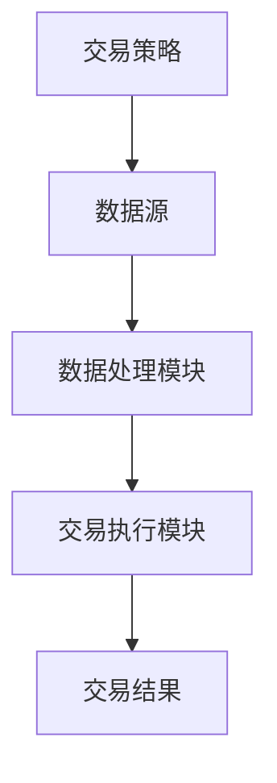
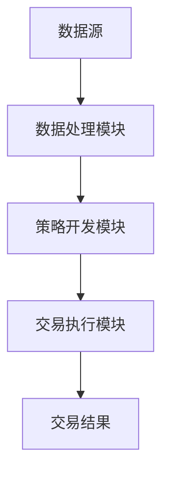
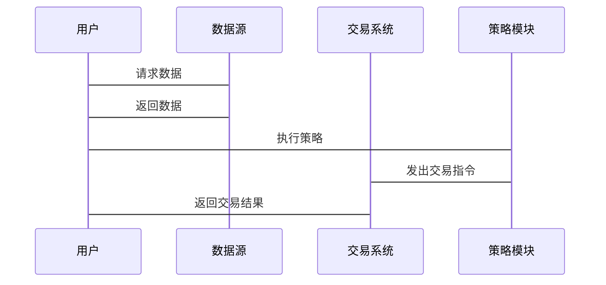

                 


# 波动性投资：如何从市场震荡中获利

## 关键词：波动性投资、技术分析、市场波动、趋势跟踪、风险管理

## 摘要：波动性投资是一种通过分析市场波动性来捕捉短期交易机会的投资策略。本文将深入探讨波动性投资的核心概念、技术分析方法、常见投资策略以及风险管理技巧，帮助读者在市场震荡中实现稳健获利。

---

## 第一章：波动性投资的背景与基础

### 1.1 市场波动性的定义与特征

市场波动性是指资产价格在短期内频繁波动的特性，通常由市场参与者的心理、市场信息和宏观经济因素共同作用引起。波动性具有以下特征：

1. **周期性**：波动性通常呈现出周期性波动，投资者可以通过技术分析识别趋势和形态。
2. **不可预测性**：尽管波动性具有一定的规律，但具体波动方向和幅度难以预测。
3. **放大性**：市场波动性在极端情况下（如金融危机）会被显著放大，导致资产价格剧烈波动。

**示例：2008年全球金融危机期间，市场波动性显著放大，标普500指数在一个月内下跌了30%。**

### 1.2 技术分析基础

技术分析是波动性投资者的重要工具，通过分析价格走势和成交量数据来预测未来的价格变动。以下是技术分析的核心内容：

#### 1.2.1 趋势线与支撑阻力位
- **趋势线**：连接价格波动的高点或低点，用于识别价格趋势。
- **支撑位**：价格下跌时遇到支撑，可能反弹。
- **阻力位**：价格上涨时遇到阻力，可能回落。

**示例：图1展示了某股票的价格走势，红色线为趋势线，绿色线为支撑位，蓝色线为阻力位。**

```mermaid
chart
  title 图1: 股价走势
  plot 日期 vs 价格, 均线, 支撑位, 阻力位
```

#### 1.2.2 移动平均线（MA）
- **简单移动平均线（SMA）**：计算一定时间段内的平均价格。
- **指数移动平均线（EMA）**：赋予近期价格更高权重。

**公式：**
$$ \text{EMA}_n = \text{价格}_n \times \alpha + \text{EMA}_{n-1} \times (1-\alpha) $$

**示例：图2展示了某股票的EMA5和EMA10走势。**

```mermaid
chart
  title 图2: 移动平均线
  plot 日期 vs 价格, EMA5, EMA10
```

### 1.3 市场参与者心理与行为

市场参与者的行为对波动性有重要影响。以下是一些关键心理因素：

- **贪婪与恐惧**：投资者在市场上涨时贪婪，市场下跌时恐惧，导致价格波动加剧。
- **羊群效应**：投资者跟随市场潮流，可能导致价格短期偏离基本面。

**示例：2020年新冠疫情爆发初期，市场恐慌情绪导致美股多次熔断，体现了羊群效应的影响。**

### 1.4 本章小结

本章介绍了波动性投资的基本概念、技术分析工具以及市场参与者心理对波动性的影响。理解这些内容是进行波动性投资的基础。

---

## 第二章：波动性投资的核心策略

### 2.1 趋势跟踪策略

趋势跟踪是波动性投资中最常见的策略之一，主要通过顺势交易获利。

#### 2.1.1 动量策略
动量策略基于“趋势会延续”的假设，即近期价格上涨的资产将继续上涨。

**公式：**
$$ \text{动量指标} = \frac{\text{当前价格} - \text{n天前价格}}{\text{n天前价格}} $$

**示例：图3展示了某股票的动量指标走势，当动量指标超过20%时，触发买入信号。**

```mermaid
chart
  title 图3: 动量指标
  plot 日期 vs 动量指标
```

#### 2.1.2 均值回归策略
均值回归假设价格波动围绕长期趋势波动，当价格偏离趋势时，会回归到均值。

**公式：**
$$ \text{布林带} = \mu \pm n \times \sigma $$

**示例：图4展示了某股票的布林带，当价格跌破下布林带时，触发买入信号。**

```mermaid
chart
  title 图4: 布林带
  plot 日期 vs 价格, 布林带上限, 布林带下限
```

### 2.2 波动性缺口策略

波动性缺口策略利用价格缺口（价格跳空开盘）进行交易。

#### 2.2.1 价格缺口的定义
价格缺口是指开盘价与前一日收盘价之间的价格差。

**示例：图5展示了某股票的价格缺口，缺口未被填补时，价格可能继续反弹。**

```mermaid
chart
  title 图5: 价格缺口
  plot 日期 vs 价格, 开盘价, 收盘价
```

### 2.3 高频交易策略

高频交易通过利用算法和快速交易系统在极短时间内完成大量交易，捕捉微小价格波动。

#### 2.3.1 高频交易的实现步骤
1. 数据采集：实时收集市场数据。
2. 策略开发：开发基于算法的交易策略。
3. 执行交易：通过高频交易系统快速执行交易。

**示例：图6展示了高频交易系统的架构图。**



### 2.4 本章小结

本章介绍了趋势跟踪、波动性缺口和高频交易三种核心策略，每种策略都有其独特的应用场景和实现方法。

---

## 第三章：波动性分析的数学模型

### 3.1 波动率的量化指标

波动率是衡量市场波动性的核心指标，常用的计算方法包括：

#### 3.1.1 历史波动率
历史波动率基于过去的价格数据计算。

**公式：**
$$ \text{波动率} = \sqrt{\frac{1}{n-1} \sum_{i=1}^{n} (x_i - \bar{x})^2} $$

**示例：计算某股票过去30天的波动率。**

```python
import numpy as np
prices = [100, 101, 98, 103, 99]
volatility = np.std(prices, ddof=1)  # 计算样本标准差
print(volatility)
```

#### 3.1.2 隐含波动率
隐含波动率通过期权定价模型（如Black-Scholes模型）计算。

**公式：**
$$ \sigma = \sqrt{2 \times T \times \ln(\frac{S}{K})} $$

**示例：计算某期权的隐含波动率。**

```python
import math
S = 100
K = 105
T = 1/365
ln = math.log(S/K)
volatility = math.sqrt(2 * T * ln)
print(volatility)
```

### 3.2 时间序列分析

时间序列分析用于预测未来的价格波动。

#### 3.2.1 ARIMA模型
ARIMA模型通过自回归和移动平均部分拟合时间序列数据。

**公式：**
$$ \text{ARIMA}(p, d, q) $$

**示例：使用ARIMA模型预测未来的价格走势。**

```python
from statsmodels.tsa.arima_model import ARIMA
data = [100, 101, 98, 103, 99]
model = ARIMA(data, order=(1, 1, 1))
model_fit = model.fit()
forecast = model_fit.forecast(steps=5)
print(forecast)
```

### 3.3 统计套利策略

统计套利通过寻找资产价格偏离的机会获利。

#### 3.3.1 配对交易
配对交易通过比较两只资产的价格差异进行交易。

**公式：**
$$ \text{价差} = |S_1 - S_2| $$

**示例：当价差超过历史均值时，买入价格较低的资产，卖出价格较高的资产。**

```python
import pandas as pd
data = pd.DataFrame({'A': [100, 101, 98, 103, 99], 'B': [95, 97, 96, 94, 98]})
spread = data['A'] - data['B']
mean_spread = spread.mean()
std_spread = spread.std()
print(mean_spread, std_spread)
```

### 3.4 本章小结

本章通过数学模型量化了波动性，并介绍了时间序列分析和统计套利策略的应用。

---

## 第四章：波动性投资的系统设计

### 4.1 系统架构设计

波动性投资系统通常包括以下模块：

#### 4.1.1 数据采集模块
- 从多个数据源（如交易所、数据供应商）获取实时数据。

#### 4.1.2 数据处理模块
- 清洗、转换和存储数据。

#### 4.1.3 策略开发模块
- 开发和测试交易策略。

#### 4.1.4 交易执行模块
- 根据策略信号执行交易。

**示例：系统架构图**



### 4.2 系统接口设计

系统需要与多个外部接口交互，包括：

- 数据接口：与数据源对接。
- 交易接口：与交易系统对接。
- 用户接口：与用户交互。

### 4.3 系统交互流程

系统交互流程包括以下步骤：

1. 数据采集：获取市场数据。
2. 数据处理：清洗和转换数据。
3. 策略执行：根据策略生成交易信号。
4. 交易执行：执行交易并记录结果。

**示例：系统交互流程图**



### 4.4 本章小结

本章介绍了波动性投资系统的架构设计和交互流程，强调了系统设计的重要性。

---

## 作者：AI天才研究院/AI Genius Institute & 禅与计算机程序设计艺术/Zen And The Art of Computer Programming

