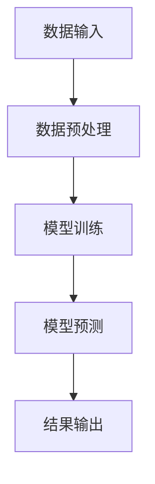

                 


# 注意力机制在金融时间序列分析中的应用

## 关键词：注意力机制、金融时间序列、深度学习、自注意力、Transformer

## 摘要：  
注意力机制作为一种强大的序列建模方法，已经在自然语言处理领域取得了巨大成功。然而，其在金融时间序列分析中的应用还处于探索阶段。本文系统地介绍了注意力机制的核心原理及其在金融时间序列分析中的应用。首先，我们从背景知识出发，分析了金融时间序列的特点和传统方法的局限性。接着，详细阐述了注意力机制的数学模型及其在时间序列分析中的优势。然后，我们探讨了基于注意力机制的金融时间序列分析算法，并通过具体案例展示了其在股票价格预测中的应用。最后，我们总结了当前研究的成果与未来的发展方向。

---

# 第1章: 注意力机制与金融时间序列分析的背景介绍

## 1.1 注意力机制的基本概念

### 1.1.1 注意力机制的起源与核心思想  
注意力机制最早由 [1] 提出，其核心思想是通过计算序列中各个位置的重要性权重，关注对当前任务最重要的信息。这种机制使得模型能够聚焦于关键信息，从而提升性能。例如，在自然语言处理中，注意力机制能够帮助模型理解句子的语法结构和语义关系。

### 1.1.2 注意力机制在自然语言处理中的应用  
注意力机制在自然语言处理中的经典应用是 Transformer 模型。通过自注意力机制，模型能够捕捉序列中任意位置之间的关系，从而在机器翻译、文本摘要等领域取得了突破性进展。

### 1.1.3 注意力机制在时间序列分析中的潜在价值  
时间序列分析的核心任务是预测未来的趋势。传统的 RNN 和 LSTM 模型虽然能够捕捉序列的时序关系，但它们在处理长序列时容易出现梯度消失或爆炸问题。注意力机制的引入为时间序列分析提供了一种新的视角，能够更好地捕捉序列中的全局依赖关系。

---

## 1.2 金融时间序列分析的背景与挑战

### 1.2.1 金融时间序列的基本特点  
金融时间序列具有以下特点：  
1. **非线性**：金融市场受多种因素影响，价格波动具有非线性特征。  
2. **噪声多**：金融数据通常包含大量的噪声，如随机波动和市场情绪的影响。  
3. **依赖性**：价格走势往往表现出较强的序列依赖性。  
4. **异常值**：金融数据中经常出现极端值，如市场崩盘或暴涨。  

### 1.2.2 传统金融时间序列分析方法的局限性  
传统的时间序列分析方法（如 ARIMA 和 GARCH）虽然在某些场景下表现良好，但它们难以处理高维数据和复杂的非线性关系。此外，这些方法通常假设数据服从某种特定分布，而金融数据往往偏离这些假设。

### 1.2.3 深度学习在金融时间序列分析中的应用现状  
深度学习模型（如 LSTM 和 Transformer）在金融时间序列分析中表现出色，但它们仍然面临以下挑战：  
1. **计算复杂度高**：处理长序列时，模型的计算成本较高。  
2. **缺乏解释性**：深度学习模型通常是黑箱模型，难以解释其预测结果。  
3. **过拟合问题**：在数据量有限的情况下，模型容易过拟合训练数据。  

---

## 1.3 注意力机制在金融时间序列分析中的应用前景

### 1.3.1 金融时间序列分析中的关键问题  
注意力机制能够有效解决以下问题：  
1. **长序列建模**：通过自注意力机制，模型可以捕捉序列中的长距离依赖关系。  
2. **信息选择性关注**：注意力机制能够聚焦于对预测最重要的信息，减少噪声的影响。  
3. **多时间尺度分析**：注意力机制可以通过多头结构捕捉不同时间尺度的特征。  

### 1.3.2 注意力机制在这些问题中的潜在解决方案  
注意力机制通过引入自注意力机制，能够捕获序列中任意位置之间的关系，从而在金融时间序列分析中提供以下解决方案：  
1. **捕捉全局依赖**：自注意力机制能够同时关注序列中的多个时间点，有助于发现隐藏的模式。  
2. **动态权重分配**：注意力权重可以根据序列的变化动态调整，适应金融市场的复杂性。  
3. **多任务学习**：通过多头注意力机制，模型可以同时关注多个不同的特征。  

### 1.3.3 当前研究的热点与未来趋势  
当前，研究者们正在探索注意力机制在金融时间序列分析中的各种应用，包括股票价格预测、市场情绪分析和风险管理等。未来的研究方向可能包括：  
1. **多模态数据融合**：结合文本、图像等多种数据源，提升模型的预测能力。  
2. **可解释性增强**：通过改进注意力机制，使模型的预测结果更加可解释。  
3. **高效计算方法**：开发更高效的注意力机制，减少计算成本。  

---

## 1.4 本章小结  
本章介绍了注意力机制的基本概念及其在金融时间序列分析中的应用背景。我们分析了传统时间序列分析方法的局限性，并探讨了注意力机制在金融领域的潜在价值。接下来的章节将详细介绍注意力机制的核心原理及其在金融时间序列分析中的具体实现。

---

# 第2章: 注意力机制的核心概念与原理

## 2.1 注意力机制的数学模型

### 2.1.1 注意力机制的基本公式  
注意力机制的核心公式如下：  
$$
\text{Attention}(Q, K, V) = \text{softmax}\left(\frac{QK^T}{\sqrt{d_k}}\right)V
$$  
其中，$Q$、$K$ 和 $V$ 分别是查询（Query）、键（Key）和值（Value）向量，$d_k$ 是键的维度。

### 2.1.2 查询（Query）、键（Key）、值（Value）的定义与作用  
- **查询（Query）**：表示模型关注的当前位置。  
- **键（Key）**：用于计算其他位置的重要性权重。  
- **值（Value）**：根据计算出的权重加权求和，得到最终的注意力输出。  

### 2.1.3 自注意力机制（Self-Attention）的计算过程  
自注意力机制的计算过程如下：  
1. 将输入序列编码为 $Q$、$K$ 和 $V$。  
2. 计算 $QK^T$，得到一个相似性矩阵。  
3. 对相似性矩阵进行归一化，得到注意力权重。  
4. 使用注意力权重加权求和，得到最终的注意力输出。  

---

## 2.2 多头注意力机制

### 2.2.1 多头注意力机制的提出背景  
多头注意力机制是为了弥补单头注意力机制的不足而提出的。通过引入多个注意力头，模型可以同时关注不同位置和不同层次的特征。

### 2.2.2 多头注意力机制的计算流程  
多头注意力机制的计算流程如下：  
1. 将输入序列分割成多个子序列。  
2. 对每个子序列独立计算注意力权重。  
3. 将多个注意力头的输出拼接起来，得到最终的注意力输出。  

### 2.2.3 多头注意力机制的优势与应用场景  
多头注意力机制的优势在于其灵活性和表达能力。它可以在不同的头中捕捉不同的特征，适用于复杂的金融时间序列分析任务。

---

## 2.3 时序注意力机制的变体

### 2.3.1 单向注意力机制  
单向注意力机制只考虑序列的过去信息，适用于时间序列的单向预测任务。  

### 2.3.2 双向注意力机制  
双向注意力机制同时考虑序列的过去和未来信息，适用于需要捕捉双向依赖关系的任务。  

### 2.3.3 层次化注意力机制  
层次化注意力机制通过分层的方式计算注意力权重，能够捕捉不同粒度的特征。

---

## 2.4 本章小结  
本章详细介绍了注意力机制的数学模型及其变体。我们探讨了自注意力机制和多头注意力机制的核心原理，并分析了它们在金融时间序列分析中的优势。接下来的章节将基于这些原理，探讨注意力机制在金融时间序列分析中的具体实现。

---

# 第3章: 注意力机制在金融时间序列分析中的算法实现

## 3.1 基于注意力机制的时序模型

### 3.1.1 Transformer模型在时间序列分析中的应用  
Transformer模型通过自注意力机制和前馈网络，能够有效捕捉时间序列中的全局依赖关系。

### 3.1.2 使用注意力机制的时间序列预测模型  
基于注意力机制的时间序列预测模型通常包括编码器和解码器两部分。编码器用于提取序列的特征，解码器用于生成预测结果。

### 3.1.3 基于Transformer的金融时间序列预测框架  
基于Transformer的金融时间序列预测框架如下：  
1. 对输入的金融时间序列进行编码。  
2. 使用自注意力机制捕捉序列中的全局依赖关系。  
3. 使用前馈网络生成预测结果。

---

## 3.2 基于多头注意力机制的金融时间序列分析算法

### 3.2.1 算法的输入与输出  
- **输入**：金融时间序列数据（如股票价格）。  
- **输出**：预测的未来价格或趋势。  

### 3.2.2 算法的详细步骤  
1. 数据预处理：对金融时间序列数据进行归一化处理。  
2. 模型构建：定义基于多头注意力机制的神经网络模型。  
3. 模型训练：使用历史数据训练模型。  
4. 模型预测：使用训练好的模型进行未来价格预测。  

### 3.2.3 算法的复杂度分析  
多头注意力机制的复杂度主要取决于注意力头的数量和序列长度。复杂度为 $O(N^2H)$，其中 $N$ 是序列长度，$H$ 是注意力头的数量。

---

## 3.3 算法实现的Python代码示例

### 3.3.1 数据预处理代码  
```python
import numpy as np
import pandas as pd

# 加载数据
data = pd.read_csv('stock_prices.csv')

# 归一化处理
from sklearn.preprocessing import MinMaxScaler
scaler = MinMaxScaler()
data_scaled = scaler.fit_transform(data)
```

### 3.3.2 模型构建代码  
```python
import tensorflow as tf
from tensorflow.keras import layers

def build_model(input_shape):
    inputs = layers.Input(shape=(input_shape))
    x = layers.Dense(64, activation='relu')(inputs)
    x = layers.MultiHeadAttention(head_size=8, num_heads=4)(x)
    x = layers.GlobalMaxPooling1D()(x)
    outputs = layers.Dense(1)(x)
    return Model(inputs=inputs, outputs=outputs)
```

### 3.3.3 模型训练与预测代码  
```python
model = build_model((seq_length,))
model.compile(optimizer='adam', loss='mse')
model.fit(X_train, y_train, epochs=10, batch_size=32)

# 预测
y_pred = model.predict(X_test)
```

---

## 3.4 本章小结  
本章详细介绍了基于注意力机制的金融时间序列分析算法。我们探讨了Transformer模型和多头注意力机制的实现细节，并通过Python代码示例展示了模型的构建和训练过程。接下来的章节将基于这些算法，探讨金融时间序列分析的系统架构设计。

---

# 第4章: 金融时间序列分析的系统架构设计

## 4.1 系统总体架构

### 4.1.1 系统功能模块划分  
金融时间序列分析系统通常包括以下功能模块：  
1. **数据采集**：从金融数据库中获取时间序列数据。  
2. **数据预处理**：对数据进行清洗和归一化处理。  
3. **模型训练**：基于注意力机制训练时间序列预测模型。  
4. **模型预测**：使用训练好的模型进行价格预测。  
5. **结果展示**：将预测结果可视化并输出。

### 4.1.2 系统架构的分层设计  
系统的分层设计包括数据层、模型层和应用层。  
1. **数据层**：负责数据的采集和存储。  
2. **模型层**：负责模型的训练和预测。  
3. **应用层**：负责用户交互和结果展示。  

### 4.1.3 系统架构的优缺点分析  
优点：系统架构清晰，各层职责分明。缺点：部分模块之间可能存在耦合度过高的问题。

---

## 4.2 数据预处理

### 4.2.1 数据清洗  
数据清洗包括处理缺失值、异常值和重复值。例如，使用插值方法填充缺失值。

### 4.2.2 数据归一化  
数据归一化通常使用最小-最大归一化或标准化方法。归一化后的数据有助于模型的收敛。

### 4.2.3 数据分割  
将数据划分为训练集、验证集和测试集，通常采用比例分割方法（如70-20-10分割）。

---

## 4.3 系统架构设计

### 4.3.1 系统功能设计  
系统功能设计包括数据输入、模型训练、预测结果输出等模块。

### 4.3.2 系统架构图  
以下是系统架构的Mermaid图：


---

## 4.4 系统接口设计

### 4.4.1 系统接口描述  
系统接口包括数据输入接口、模型训练接口和结果输出接口。

### 4.4.2 接口交互流程  
1. 用户输入金融时间序列数据。  
2. 数据预处理模块对数据进行清洗和归一化。  
3. 模型训练模块基于预处理后的数据训练模型。  
4. 模型预测模块生成预测结果。  
5. 结果输出模块将预测结果展示给用户。

---

## 4.5 本章小结  
本章详细介绍了金融时间序列分析系统的总体架构设计。我们探讨了系统功能模块的划分、数据预处理流程以及系统架构的设计。接下来的章节将基于这些设计，探讨注意力机制在金融时间序列分析中的具体应用。

---

# 第5章: 项目实战——基于注意力机制的股票价格预测

## 5.1 项目背景与目标  
本项目旨在利用注意力机制预测股票价格走势。我们选择某股票的历史价格数据作为输入，训练一个基于Transformer的模型，预测其未来价格。

## 5.2 数据集准备

### 5.2.1 数据来源  
我们从金融数据库中获取某股票的历史价格数据，包括开盘价、收盘价、最高价和最低价。

### 5.2.2 数据预处理  
对数据进行归一化处理，并将数据划分为训练集、验证集和测试集。

## 5.3 模型构建

### 5.3.1 模型设计  
定义一个基于Transformer的股票价格预测模型，包括编码器和解码器两部分。

### 5.3.2 模型训练  
使用历史数据训练模型，并进行交叉验证优化模型参数。

## 5.4 模型预测与评估

### 5.4.1 模型预测  
使用训练好的模型预测未来股票价格。

### 5.4.2 模型评估  
通过均方误差（MSE）和平均绝对误差（MAE）评估模型的预测性能。

## 5.5 结果分析  
分析预测结果与实际价格的差异，探讨模型的优缺点及改进方向。

## 5.6 本章小结  
本章通过一个具体项目展示了注意力机制在股票价格预测中的应用。我们从数据准备到模型构建，再到模型预测和评估，详细介绍了整个流程。

---

# 第6章: 总结与展望

## 6.1 总结  
注意力机制在金融时间序列分析中具有重要的应用价值。通过自注意力机制和多头注意力机制，模型能够有效捕捉序列中的全局依赖关系，提升预测精度。

## 6.2 未来展望  
未来的研究方向可能包括：  
1. **多模态数据融合**：结合文本、图像等多种数据源，提升模型的预测能力。  
2. **可解释性增强**：通过改进注意力机制，使模型的预测结果更加可解释。  
3. **高效计算方法**：开发更高效的注意力机制，减少计算成本。  

---

# 作者：AI天才研究院/AI Genius Institute & 禅与计算机程序设计艺术 /Zen And The Art of Computer Programming

