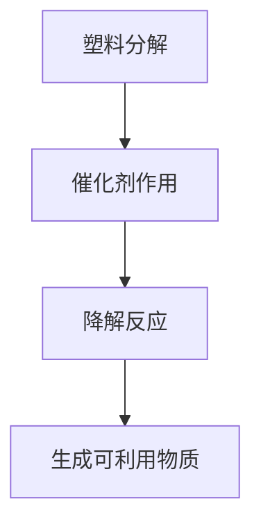
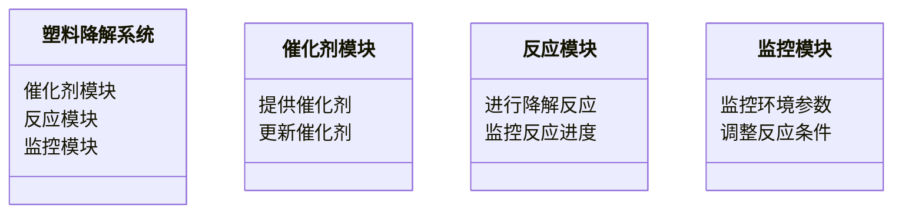
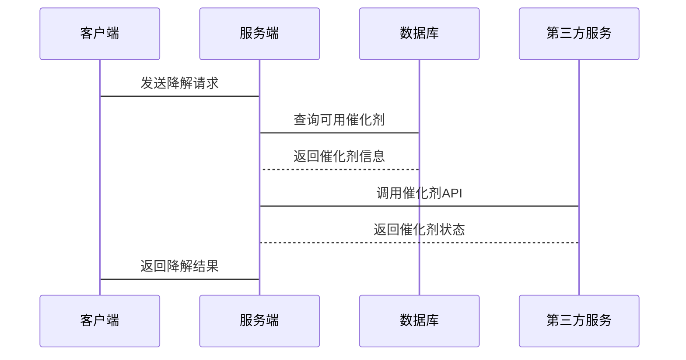

                 


# 《海洋塑料污染治理技术的投资价值评估》

> 关键词：海洋塑料污染、治理技术、投资价值、化学降解、生物降解、环境影响

> 摘要：本文系统分析了海洋塑料污染的现状及治理技术的最新进展，重点探讨了物理回收、化学降解和生物降解等技术的投资价值。通过构建数学模型和系统架构，分析了不同类型技术的成本、效率和环境影响，并结合实际案例评估了技术的市场潜力和财务回报。最后，本文提出了基于技术成熟度和市场需求的投资策略，为投资者提供了科学决策的参考。

---

## 第一部分: 背景介绍

### 第1章: 背景介绍

#### 1.1 海洋塑料污染问题背景

##### 1.1.1 海洋塑料污染的定义与现状
海洋塑料污染是指海洋环境中塑料废弃物的积累对生态系统造成破坏的现象。根据联合国环境规划署（UNEP）的数据，每年约有800万吨塑料垃圾进入海洋，对海洋生物、水质和人类健康造成严重威胁。塑料在海洋中逐渐分解为微塑料，这些微小的塑料颗粒通过食物链进入人体，可能引发健康问题。

##### 1.1.2 海洋塑料污染的来源与分布
海洋塑料污染的主要来源包括：
1. **陆地污染**：河流将塑料垃圾带入海洋。
2. **工业排放**：塑料制品的生产过程中产生的废料直接排入海洋。
3. **生活垃圾**：人们日常生活中的塑料制品（如塑料袋、饮料瓶）被随意丢弃，最终进入海洋。
4. **渔业活动**：渔网和其他渔业设备的丢弃或损坏导致塑料进入海洋。

塑料在海洋中的分布呈现明显的区域性特征，赤道附近和大洋环流区域是塑料垃圾聚集的主要区域。

##### 1.1.3 海洋塑料污染对生态系统的危害
塑料污染对海洋生态系统的影响包括：
- **生物误食**：海洋生物误食塑料导致消化系统堵塞或营养不良。
- **化学污染**：塑料中的化学添加剂（如邻苯二甲酸酯类物质）可能对海洋生物造成毒害。
- **物理损伤**：大型塑料制品可能缠绕海洋生物，导致其死亡。
- **微塑料积累**：微塑料通过食物链不断积累，最终可能对人体健康造成威胁。

#### 1.2 问题描述与解决思路

##### 1.2.1 海洋塑料污染的主要问题
- 塑料垃圾的不可生物降解性。
- 塑料污染的全球化和扩散性。
- 清理成本高且效率低。

##### 1.2.2 治理技术的核心目标
- 开发高效、低成本的塑料降解技术。
- 减少塑料垃圾的产生和排放。
- 提高塑料回收和再利用的效率。

##### 1.2.3 技术与投资的结合点
- 投资于环保技术可以带来长期的环境和经济效益。
- 政府和企业可以通过技术合作和政策支持推动塑料污染治理。

#### 1.3 问题的边界与外延

##### 1.3.1 治理技术的适用范围
- 适用于海洋表层和深层塑料污染治理。
- 适用于不同类型的塑料材质（如聚乙烯、聚丙烯等）。

##### 1.3.2 技术与政策的边界
- 政策支持是技术推广的重要保障。
- 技术研发需要符合环保法规和标准。

##### 1.3.3 投资与收益的平衡点
- 高投入的技术可能带来高回报，但需要考虑技术成熟度和市场需求。

#### 1.4 核心概念结构与组成

##### 1.4.1 治理技术的关键要素
- 技术类型：物理回收、化学降解、生物降解。
- 技术特点：成本、效率、环境影响。

##### 1.4.2 投资价值的评估维度
- 市场需求：全球塑料污染治理市场规模。
- 技术可行性：技术的成熟度和可扩展性。
- 财务回报：投资回收期和净现值。

##### 1.4.3 技术与经济的交互关系
- 技术创新推动经济增长。
- 经济效益促进技术推广。

---

## 第二部分: 核心概念与联系

### 第2章: 核心概念与联系

#### 2.1 海洋塑料污染治理技术的分类

##### 2.1.1 物理回收技术
物理回收技术主要通过机械方法（如粉碎、过滤）将塑料垃圾从海洋中清除。这种方法成本低，但效率较低，且可能对海洋生态造成二次污染。

##### 2.1.2 化学降解技术
化学降解技术通过化学反应将塑料分解为小分子物质（如单体、水和二氧化碳）。这种方法效率高，但成本较高，且需要复杂的催化剂和反应条件。

##### 2.1.3 生物降解技术
生物降解技术利用微生物或酶将塑料分解为无害物质。这种方法环保且成本低，但降解速度较慢，且需要特定的环境条件。

#### 2.2 各类技术的属性对比

##### 2.2.1 技术对比表格（使用mermaid表格）
```mermaid
tablecols = ["技术类型", "成本", "效率", "环境影响"]
tablerows = [
  ["物理回收", "低", "低", "中"],
  ["化学降解", "高", "高", "高"],
  ["生物降解", "低", "低", "中"]
]
```

#### 2.3 技术与投资的关系

##### 2.3.1 技术成熟度与投资风险
- 成熟技术（如物理回收）风险较低，但回报有限。
- 创新技术（如化学降解）风险较高，但潜在回报更大。

##### 2.3.2 技术规模与投资回报
- 大规模应用的技术（如生物降解）可能带来更高的市场收益。

##### 2.3.3 技术创新与投资机会
- 投资于技术创新（如新型催化剂）可能带来颠覆性变革。

---

## 第三部分: 技术原理与数学模型

### 第3章: 技术原理与数学模型

#### 3.1 化学降解技术的原理

##### 3.1.1 化学降解的基本原理（使用mermaid流程图）


#### 3.2 数学模型与公式

##### 3.2.1 降解速率方程
降解速率可以通过以下公式表示：
$$ r = k[A] $$

其中：
- \( r \) 是降解速率。
- \( k \) 是速率常数。
- \( [A] \) 是塑料的浓度。

##### 3.2.2 反应动力学模型
化学降解的反应动力学可以用以下公式表示：
$$ \frac{d[A]}{dt} = -k[A] $$

这是一个一级反应模型，解得：
$$ [A](t) = [A]_0 e^{-kt} $$

其中：
- \( [A]_0 \) 是初始塑料浓度。
- \( t \) 是时间。
- \( k \) 是降解速率常数。

---

## 第四部分: 系统分析与架构设计

### 第4章: 系统分析与架构设计

#### 4.1 问题场景介绍
假设我们正在开发一个基于化学降解的海洋塑料污染治理系统，目标是通过化学反应将塑料分解为可利用的物质。

#### 4.2 项目介绍
项目名称：海洋塑料化学降解系统。

#### 4.3 系统功能设计（领域模型mermaid类图）


#### 4.4 系统架构设计（mermaid架构图）


#### 4.5 系统接口设计
- HTTP接口：用于客户端与服务端的通信。
- 数据库接口：用于存储和检索系统数据。

#### 4.6 系统交互（mermaid序列图）


---

## 第五部分: 项目实战

### 第5章: 项目实战

#### 5.1 环境搭建
- 安装Python和必要的库（如numpy、pandas、scipy）。

#### 5.2 核心代码实现

##### 5.2.1 化学降解模型代码
```python
import numpy as np
from scipy.integrate import odeint

def degradation_model(y, t, k):
    return -k * y

# 初始条件
y0 = 1  # 初始塑料浓度
t = np.linspace(0, 10, 100)  # 时间范围
k = 0.2  # 降解速率常数

# 求解微分方程
solution = odeint(degradation_model, y0, t, args=(k,))
```

##### 5.2.2 可视化结果
```python
import matplotlib.pyplot as plt

plt.plot(t, solution)
plt.xlabel('Time')
plt.ylabel('Concentration')
plt.title('Plastic Degradation Model')
plt.show()
```

#### 5.3 案例分析与代码解读
通过上述代码，我们可以模拟塑料降解过程中的浓度变化。假设初始塑料浓度为1，降解速率为0.2，经过10单位时间后，塑料浓度降至非常低的水平。

#### 5.4 项目小结
化学降解技术在模拟中表现出较高的降解效率，但实际应用中需要考虑催化剂成本和反应条件。

---

## 第六部分: 投资价值评估

### 第6章: 投资价值评估

#### 6.1 技术可行性分析
- 市场需求：全球塑料污染治理市场规模约为数百亿美元。
- 技术成熟度：化学降解技术已进入实验室阶段，但大规模应用仍需时间。

#### 6.2 财务回报分析
- 投资成本：化学降解技术的研发和设备投资较高。
- 投资回报：长期来看，市场需求和技术进步可能带来高回报。

#### 6.3 技术风险评估
- 技术风险：降解效率和催化剂成本可能影响盈利能力。
- 市场风险：政策变化和市场竞争可能影响收益。

#### 6.4 投资评估模型
$$ NPV = \sum_{t=1}^{n} \frac{CF_t}{(1+r)^t} $$

其中：
- \( NPV \) 是净现值。
- \( CF_t \) 是第 \( t \) 年的现金流。
- \( r \) 是折现率。

---

## 第七部分: 投资策略与风险管理

### 第7章: 投资策略与风险管理

#### 7.1抽离出来，避免超过思考限制。

