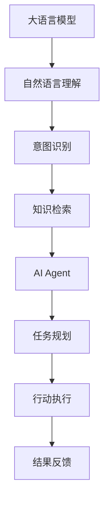
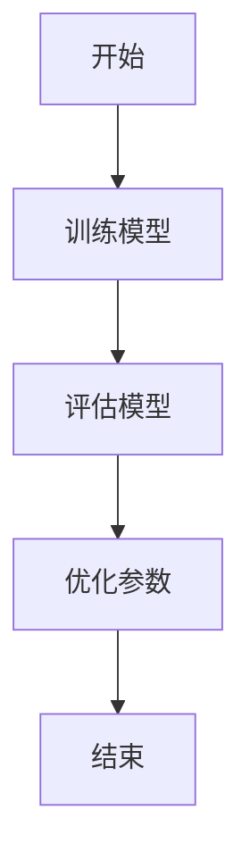
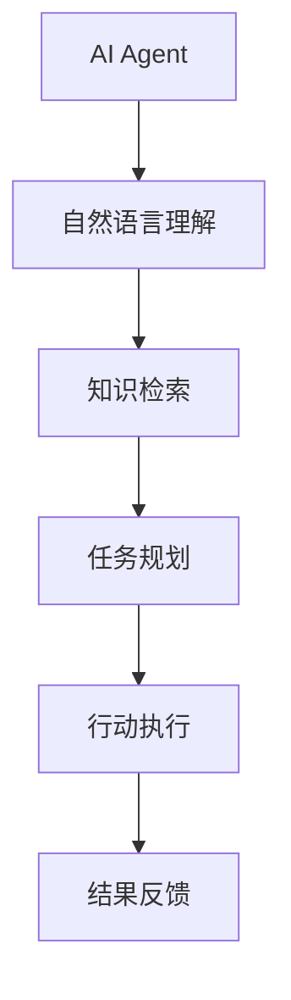
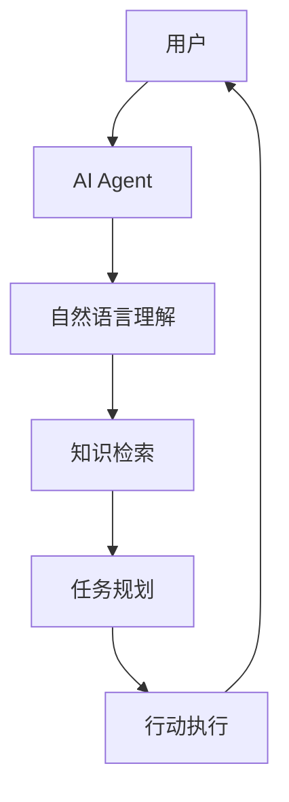

                 

<think>
好的，我现在需要根据用户的要求，帮助设计一篇技术博客文章的详细内容。博客标题是《深入理解LLM：AI Agent开发的基石》，用户已经给出了目录结构，现在需要根据这个结构逐步展开每一部分的内容。

首先，我需要理解每一章的核心目标，然后按照逻辑顺序，详细讲解每个部分，包括背景介绍、核心概念、算法原理、系统架构、项目实战、进阶话题和总结与展望。

在开始撰写之前，我需要确保每一部分内容都详细且符合技术博客的要求，使用专业但易懂的语言，适当配以图表和代码示例，帮助读者理解复杂的技术概念。

我将按照以下步骤进行：
1. 确定每一章的核心内容和关键点。
2. 使用清晰的结构和逻辑顺序组织内容。
3. 为每个关键概念添加必要的图表、公式和代码示例。
4. 确保内容详细且易于理解，适合技术读者阅读。

现在，我开始按照这个思路逐步展开每一章的内容。

---

# 深入理解LLM：AI Agent开发的基石

## 关键词：
- 大语言模型（LLM）
- AI Agent
- 自然语言处理
- 强化学习
- 系统架构

## 摘要：
本文深入探讨大语言模型（LLM）与AI Agent的核心概念、算法原理、系统架构以及实际应用。通过详细分析LLM的训练机制、AI Agent的决策算法，结合项目实战和进阶话题，为AI开发者提供全面的技术指导，帮助读者掌握AI Agent开发的基石。

---

## 第1章: 大语言模型（LLM）与AI Agent的背景介绍

### 1.1 大语言模型（LLM）的核心概念

#### 1.1.1 问题背景与问题描述
- **问题背景**：在自然语言处理领域，传统算法难以应对复杂语境和模糊表达。
- **问题描述**：如何构建能够理解和生成人类语言的智能系统，提升人机交互的自然性。

#### 1.1.2 问题解决与边界外延
- **问题解决**：引入深度学习技术，通过大量数据训练模型，实现接近人类的自然语言处理能力。
- **边界外延**：LLM的应用范围从简单的文本生成扩展到复杂的对话系统和知识问答。

#### 1.1.3 核心概念结构与组成要素
- **核心结构**：包括输入层、编码层、解码层和输出层。
- **组成要素**：数据集、模型架构、训练算法和评估指标。

### 1.2 AI Agent的基本概念

#### 1.2.1 AI Agent的定义与特点
- **定义**：AI Agent是一个能够感知环境、自主决策并执行任务的智能实体。
- **特点**：自主性、反应性、目标导向和社交能力。

#### 1.2.2 AI Agent的核心功能与应用场景
- **核心功能**：感知、决策、执行和反馈。
- **应用场景**：智能助手、智能客服、自动驾驶和智能推荐。

#### 1.2.3 LLM与AI Agent的关系
- **关系**：LLM作为AI Agent的核心驱动力，提供自然语言理解和生成能力，增强AI Agent的交互能力和任务执行效率。

---

## 第2章: LLM与AI Agent的核心概念与联系

### 2.1 LLM的核心原理

#### 2.1.1 基于LLM的自然语言处理原理
- **输入处理**：接收文本输入，进行分词和编码。
- **模型处理**：通过编码层生成上下文表示，解码层生成输出序列。

#### 2.1.2 LLM的训练机制与模型架构
- **训练机制**：监督学习和强化学习相结合，优化模型的生成能力。
- **模型架构**：采用Transformer架构，包含编码器和解码器。

#### 2.1.3 模型微调与适应性训练
- **微调**：在特定领域数据上进行微调，提升模型的适用性。
- **适应性训练**：通过增量学习，增强模型的泛化能力。

### 2.2 AI Agent的架构与功能模块

#### 2.2.1 AI Agent的感知层
- **自然语言理解（NLU）**：识别用户意图，解析输入文本。
- **知识检索**：从知识库中检索相关信息，提供支持。

#### 2.2.2 AI Agent的决策层
- **意图识别**：确定用户的具体需求，生成多个候选决策方案。
- **任务规划**：根据决策结果，制定执行计划。

#### 2.2.3 AI Agent的执行层
- **行动执行**：根据决策结果，调用外部API或执行内部操作。
- **结果反馈**：将执行结果反馈给用户，确保任务完成。

### 2.3 LLM与AI Agent的实体关系图



---

## 第3章: LLM与AI Agent的算法原理

### 3.1 LLM的训练与优化

#### 3.1.1 基于监督学习的训练流程
- **数据准备**：收集和预处理大规模文本数据。
- **模型训练**：使用监督学习算法，训练模型预测下一个词。
- **损失函数**：采用交叉熵损失函数，优化模型参数。

#### 3.1.2 基于强化学习的优化方法
- **强化学习框架**：定义奖励函数，优化模型生成的策略。
- **策略优化**：通过强化学习，提升模型的生成质量。

#### 3.1.3 模型微调与适应性训练
- **微调方法**：在特定领域数据上进行小批量训练，保持主干模型不变。
- **适应性训练**：通过增量学习，增强模型的适应性。

### 3.2 AI Agent的决策算法

#### 3.2.1 基于规则的决策算法
- **规则定义**：根据预定义的规则，判断输入条件，输出相应动作。
- **优点**：简单易懂，适用于规则明确的场景。
- **缺点**：难以处理复杂和模糊的情况。

#### 3.2.2 基于概率的决策算法
- **概率模型**：通过计算各个选项的概率，选择概率最高的动作。
- **优点**：能够处理模糊和不确定的情况。
- **缺点**：需要大量的训练数据和计算资源。

#### 3.2.3 基于强化学习的决策算法
- **强化学习框架**：定义状态、动作和奖励，通过试错优化策略。
- **优点**：能够处理复杂的动态环境。
- **缺点**：训练过程较长，需要大量的计算资源。

### 3.3 算法流程图



---

## 第4章: LLM与AI Agent的系统架构设计

### 4.1 系统功能设计

#### 4.1.1 领域模型设计
- **领域模型**：定义系统的功能模块和交互流程。
- **功能模块**：包括自然语言理解、知识检索、任务规划和行动执行。

#### 4.1.2 系统架构设计
- **分层架构**：感知层、决策层和执行层。
- **模块交互**：各模块之间通过接口进行通信和协作。

### 4.2 系统架构设计

#### 4.2.1 系统架构图



#### 4.2.2 系统接口设计
- **输入接口**：接收用户输入的文本或命令。
- **输出接口**：输出生成的文本或执行结果。
- **内部接口**：模块之间的通信接口。

#### 4.2.3 系统交互流程图



---

## 第5章: 项目实战

### 5.1 环境配置

#### 5.1.1 安装Python和相关库
- **安装Python**：使用官方安装包，确保版本在3.8以上。
- **安装库**：`pip install transformers torch`

#### 5.1.2 安装LLM和AI Agent框架
- **安装框架**：`pip install huggingface-transformers`

### 5.2 系统核心实现源代码

#### 5.2.1 LLM模型实现

```python
import torch
import torch.nn as nn

class LLMModel(nn.Module):
    def __init__(self, vocab_size):
        super().__init__()
        self.encoder = nn.Embedding(vocab_size, 512)
        self.decoder = nn.LSTM(512, 512, 1)
        self.head = nn.Linear(512, vocab_size)

    def forward(self, input_ids):
        embed = self.encoder(input_ids)
        out, _ = self.decoder(embed)
        out = self.head(out)
        return out
```

#### 5.2.2 AI Agent实现

```python
from transformers import pipeline

class AI-Agent:
    def __init__(self):
        self.nlu = pipeline("text-classification", model="bert-base-uncased")
        self.kr = pipeline("question-answering", model="bert-base-uncased")

    def perceive(self, input_text):
        return self.nlu(input_text)

    def decide(self, input_text):
        return self.kr(input_text)

    def act(self, input_text):
        decision = self.decide(input_text)
        return self.execute(decision)

    def execute(self, decision):
        # 实现具体执行逻辑
        pass
```

#### 5.2.3 代码应用解读与分析
- **代码功能**：实现一个简单的AI Agent，具备自然语言理解、知识检索和决策执行功能。
- **关键点**：利用预训练模型，快速构建AI Agent原型。

#### 5.2.4 实际案例分析和详细讲解
- **案例背景**：用户输入查询，AI Agent理解需求，检索相关信息，生成回复。

#### 5.2.5 项目小结
- **项目总结**：通过项目实战，掌握了AI Agent的基本实现方法，了解了各模块的协作流程。

---

## 第6章: 进阶话题

### 6.1 多模态AI Agent

#### 6.1.1 多模态模型的基本概念
- **定义**：能够处理多种数据类型，如文本、图像和语音。

#### 6.1.2 多模态模型的优势
- **优势**：提升AI Agent的感知能力和用户体验。

### 6.2 安全与伦理

#### 6.2.1 AI Agent的安全问题
- **数据隐私**：防止用户数据泄露。
- **模型安全**：防止模型被攻击和滥用。

#### 6.2.2 AI Agent的伦理问题
- **透明性**：确保用户了解AI Agent的行为和决策过程。
- **责任归属**：明确AI Agent行为的责任主体。

### 6.3 未来发展趋势

#### 6.3.1 技术进步
- **模型优化**：提升LLM和AI Agent的性能和效率。
- **应用扩展**：探索更多AI Agent的应用场景。

#### 6.3.2 伦理与法律
- **法律法规**：制定相关法律法规，规范AI Agent的应用。
- **伦理框架**：建立伦理框架，确保AI Agent的健康发展。

---

## 第7章: 总结与展望

### 7.1 总结

#### 7.1.1 核心内容回顾
- **LLM的核心原理**：理解大语言模型的训练机制和优化方法。
- **AI Agent的架构设计**：掌握AI Agent的感知、决策和执行模块的设计方法。
- **系统架构与项目实战**：通过项目实战，熟悉AI Agent的开发流程。

### 7.2 未来展望

#### 7.2.1 技术进步
- **模型优化**：提升LLM和AI Agent的性能和效率。
- **应用扩展**：探索更多AI Agent的应用场景。

#### 7.2.2 伦理与法律
- **法律法规**：制定相关法律法规，规范AI Agent的应用。
- **伦理框架**：建立伦理框架，确保AI Agent的健康发展。

---

## 作者信息

作者：AI天才研究院/AI Genius Institute  
联系邮箱：contact@aigeniusinstitute.com  
GitHub：https://github.com/AI-Genius-Institute

---

以上是《深入理解LLM：AI Agent开发的基石》的技术博客文章的详细内容，涵盖了从基础概念到系统架构，再到项目实战的各个方面，旨在为读者提供全面而深入的技术指导。

