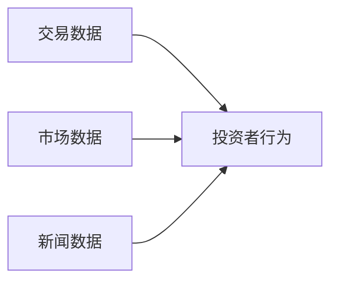
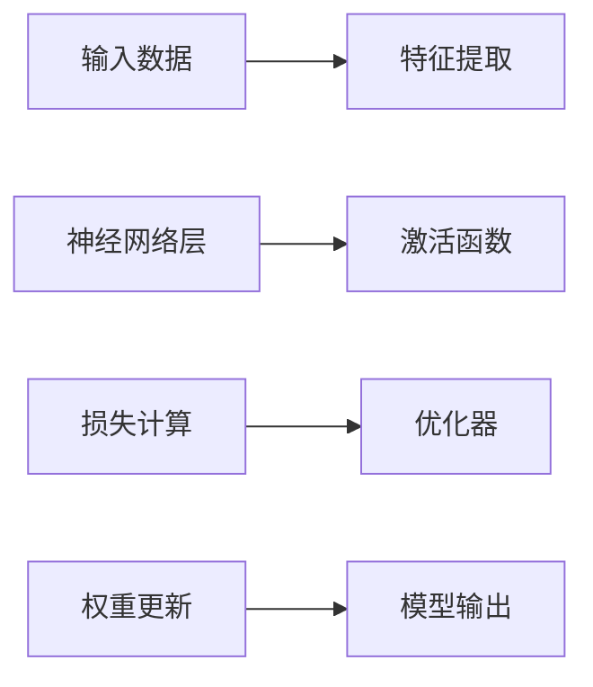
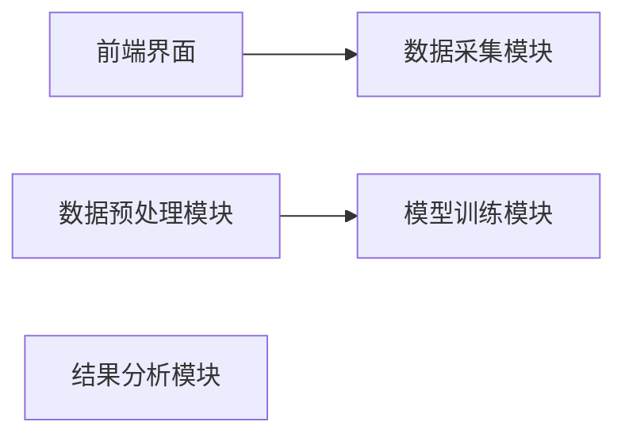
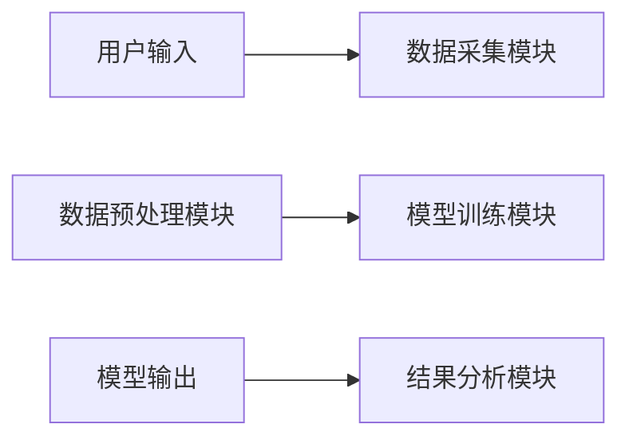

                 


# 深度学习在多源金融数据融合中的应用

## 关键词
- 深度学习
- 金融数据融合
- 多源数据
- 深度神经网络
- 数据预处理
- 模型训练

## 摘要
深度学习在多源金融数据融合中的应用是一门新兴的交叉学科，结合了深度学习技术与金融数据分析的复杂性。本文系统地探讨了多源金融数据融合的核心概念、深度学习算法的原理与实现、以及实际应用中的系统设计与案例分析。文章从问题背景出发，逐步深入，详细阐述了深度学习在金融数据融合中的优势与挑战，并通过具体案例展示了如何利用深度学习模型进行有效的数据融合与预测。本文旨在为金融领域的数据科学家和研究人员提供一套完整的理论框架与实践指南，帮助他们在复杂的金融环境中更好地利用多源数据进行决策支持。

---

# 第1章: 多源金融数据融合的背景与挑战

## 1.1 问题背景介绍
### 1.1.1 金融数据的多样性与复杂性
金融数据的来源多样，包括交易数据、市场数据、新闻数据、投资者行为数据等。这些数据具有异构性、时序性、高频性等特点，且数据量庞大。例如，股票市场的交易数据可能包括开盘价、收盘价、最高价、最低价、成交量等；新闻数据则可能包含情绪分析、关键词提取等。

### 1.1.2 多源数据融合的必要性
在金融领域，单一数据源往往不足以支撑复杂的分析任务，例如预测股价走势、风险评估等。通过融合多源数据，可以提取更全面的信息，提升模型的准确性和鲁棒性。例如，结合市场数据和新闻数据，可以更好地捕捉市场情绪的变化。

### 1.1.3 当前金融数据分析的主要挑战
- 数据异构性：不同数据源的格式和特征差异大，难以直接融合。
- 数据量大：金融数据通常具有高频性，数据量巨大，处理难度高。
- 数据质量：部分数据可能存在缺失、噪声或偏差。
- 模型复杂性：复杂的金融现象需要复杂的模型来捕捉。

## 1.2 多源数据融合的核心概念
### 1.2.1 数据融合的定义与分类
数据融合是指将来自不同数据源的数据进行整合，以提取更全面、更精确的信息。常见的数据融合方法包括基于规则的融合、基于统计的融合、基于机器学习的融合和基于深度学习的融合。

### 1.2.2 多源金融数据的特点与属性对比
| 数据类型 | 特点 | 示例 |
|----------|------|------|
| 交易数据 | 高频性、结构化 | 开盘价、收盘价、成交量 |
| 市场数据 | 全局性、连续性 | 指数、行业板块表现 |
| 新闻数据 | 非结构化、情绪性 | 文本数据、情绪分析 |
| 投资者行为数据 | 个体性、复杂性 | 投资者交易记录、持仓数据 |

### 1.2.3 数据融合的目标与边界
- 数据融合的目标是将多源数据整合为一个统一的数据表示，提取潜在的关联性。
- 数据融合的边界在于如何处理数据的异构性和时序性，同时保证数据的完整性和准确性。

## 1.3 深度学习在金融数据融合中的作用
### 1.3.1 深度学习的基本原理
深度学习通过多层非线性变换，能够自动提取数据的特征，适用于处理复杂的数据模式。

### 1.3.2 深度学习在金融领域的优势
- 强大学习能力：深度学习能够捕捉复杂的非线性关系。
- 自动特征提取：减少人工特征工程的工作量。
- 处理异构数据：能够融合结构化和非结构化数据。

### 1.3.3 数据融合与深度学习的结合
通过深度学习模型，可以将多源数据进行自动融合，提取更丰富的特征。

## 1.4 本章小结
本章从金融数据的多样性与复杂性出发，分析了多源数据融合的必要性，并介绍了深度学习在金融数据融合中的作用和优势。

---

# 第2章: 多源金融数据融合的核心概念与联系

## 2.1 数据融合的核心原理
### 2.1.1 数据预处理与特征提取
数据预处理包括数据清洗、数据标准化、数据对齐等步骤。特征提取则是从数据中提取有用的特征，例如使用词袋模型或TF-IDF对文本数据进行处理。

### 2.1.2 数据关联与匹配
数据关联是指将不同数据源中的数据进行关联，例如通过时间戳将交易数据与新闻数据匹配。

### 2.1.3 数据融合的数学模型
数据融合的数学模型可以是线性回归、随机森林、神经网络等。例如，使用线性回归模型将多源数据进行加权融合。

## 2.2 多源数据融合的属性特征对比
| 属性 | 交易数据 | 市场数据 | 新闻数据 | 投资者行为数据 |
|------|----------|----------|----------|----------------|
| 数据类型 | 结构化 | 结构化 | 非结构化 | 结构化 |
| 数据频率 | 高频 | 低频 | 低频 | 高频 |
| 数据复杂性 | 中等 | 低 | 高 | 高 |

## 2.3 ER实体关系图架构


## 2.4 本章小结
本章详细分析了数据融合的核心原理，并通过属性特征对比和ER图展示了多源数据之间的关系。

---

# 第3章: 深度学习算法原理与数学模型

## 3.1 主流深度学习模型概述
### 3.1.1 RNN与LSTM
RNN（循环神经网络）适用于处理序列数据，LSTM（长短期记忆网络）是RNN的一种改进版本，能够更好地捕捉长序列信息。

### 3.1.2 Transformer模型
Transformer模型基于自注意力机制，适用于处理并行数据，已经在自然语言处理领域取得了巨大成功。

### 3.1.3 图神经网络
图神经网络适用于处理图结构数据，例如社交网络或知识图谱。

## 3.2 深度学习算法的数学模型
### 3.2.1 神经网络的基本结构
$$ y = \sigma(Wx + b) $$
其中，$x$ 是输入，$W$ 是权重矩阵，$b$ 是偏置，$\sigma$ 是激活函数。

### 3.2.2 激活函数的作用
常用的激活函数包括sigmoid、ReLU、tanh等。例如，ReLU函数为：
$$ \text{ReLU}(x) = \max(0, x) $$

### 3.2.3 损失函数与优化器
常用的损失函数包括均方误差（MSE）、交叉熵损失。优化器包括随机梯度下降（SGD）、Adam等。

## 3.3 深度学习模型的数学公式
### 3.3.1 神经网络的前向传播公式
$$ y = \sigma(Wx + b) $$

### 3.3.2 损失函数的计算公式
$$ L = -\frac{1}{n}\sum_{i=1}^{n} y_i \log(p_i) + (1 - y_i)\log(1 - p_i) $$

### 3.3.3 优化器的更新公式
$$ \theta_{new} = \theta - \eta \cdot \frac{\partial L}{\partial \theta} $$

## 3.4 深度学习模型的流程图


## 3.5 本章小结
本章介绍了主流的深度学习模型及其数学公式，并通过流程图展示了模型的训练过程。

---

# 第4章: 系统分析与架构设计方案

## 4.1 项目背景与目标
### 4.1.1 项目背景介绍
本项目旨在利用深度学习技术，对多源金融数据进行融合，提升金融预测的准确性和鲁棒性。

### 4.1.2 项目目标设定
- 数据采集：从多个数据源获取金融数据。
- 数据预处理：清洗、标准化和特征提取。
- 模型训练：训练深度学习模型进行数据融合。
- 结果分析：评估模型性能并优化。

## 4.2 系统功能设计
### 4.2.1 数据采集模块
负责从不同数据源获取数据，例如通过API接口获取股票数据、新闻数据等。

### 4.2.2 数据预处理模块
对数据进行清洗、标准化和特征提取，例如使用TF-IDF对文本数据进行处理。

### 4.2.3 模型训练模块
选择合适的深度学习模型，进行模型训练和调参。

### 4.2.4 结果分析模块
对模型输出的结果进行分析和可视化，评估模型性能。

## 4.3 系统架构设计


## 4.4 系统接口设计
- 数据接口：与数据源对接，获取数据。
- 模型接口：与训练模块对接，传递数据和参数。
- 输出接口：与结果分析模块对接，输出模型结果。

## 4.5 系统交互流程图


## 4.6 本章小结
本章从系统设计的角度，详细介绍了项目的背景、目标、功能设计和架构设计。

---

# 第5章: 项目实战

## 5.1 环境安装与配置
### 5.1.1 安装Python与深度学习框架
安装Python 3.8及以上版本，安装TensorFlow、Keras、PyTorch等深度学习框架。

### 5.1.2 数据源获取
通过Yahoo Finance API获取股票数据，通过API获取新闻数据。

## 5.2 核心代码实现
### 5.2.1 数据预处理代码
```python
import pandas as pd
import numpy as np

# 数据加载
df1 = pd.read_csv('stock_data.csv')
df2 = pd.read_csv('news_data.csv')

# 数据对齐
df1['date'] = pd.to_datetime(df1['date'])
df2['date'] = pd.to_datetime(df2['date'])
merged_df = pd.merge(df1, df2, on='date', how='inner')
```

### 5.2.2 模型训练代码
```python
import tensorflow as tf
from tensorflow.keras import layers

model = tf.keras.Sequential([
    layers.Dense(64, activation='relu'),
    layers.Dense(1, activation='sigmoid')
])
model.compile(optimizer='adam', loss='binary_crossentropy', metrics=['accuracy'])
model.fit(x_train, y_train, epochs=10, batch_size=32)
```

### 5.2.3 模型评估代码
```python
loss, accuracy = model.evaluate(x_test, y_test)
print(f"Loss: {loss}, Accuracy: {accuracy}")
```

## 5.3 实际案例分析
以股票价格预测为例，结合交易数据和新闻数据，训练一个LSTM模型，预测未来几天的股价走势。

## 5.4 最佳实践与注意事项
- 数据预处理是关键，尤其是处理异构数据。
- 模型选择需要根据具体任务进行调整。
- 超参数调优可以显著提升模型性能。

## 5.5 本章小结
本章通过实际案例展示了如何利用深度学习技术进行多源金融数据的融合与分析。

---

# 第6章: 深度学习在多源金融数据融合中的应用展望

## 6.1 当前研究热点
- 多模态数据融合：结合文本、图像等多种数据源。
- 实时数据处理：支持高频交易的实时数据融合。
- 可解释性研究：提升模型的可解释性，便于金融决策。

## 6.2 未来发展趋势
- 更复杂的数据融合方法：例如图神经网络的应用。
- 自监督学习：利用无标签数据进行自监督学习。
- 跨模态学习：结合多种数据模态进行联合建模。

## 6.3 深度学习在金融领域的挑战
- 数据隐私与安全：如何在保证数据隐私的前提下进行数据融合。
- 模型解释性：如何提升模型的可解释性，满足金融监管要求。
- 算法的实时性：如何在实时场景下高效处理数据。

## 6.4 本章小结
本章展望了深度学习在多源金融数据融合中的未来发展方向和面临的挑战。

---

# 作者
作者：AI天才研究院/AI Genius Institute  
作者：禅与计算机程序设计艺术/Zen And The Art of Computer Programming

