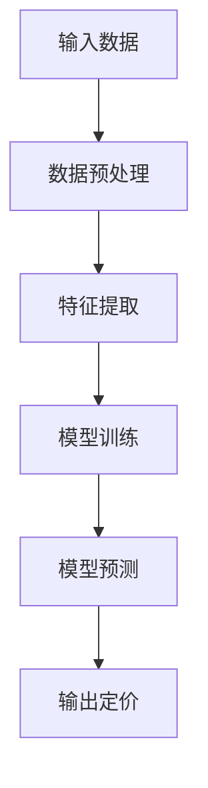
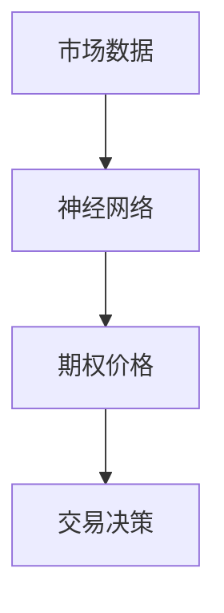
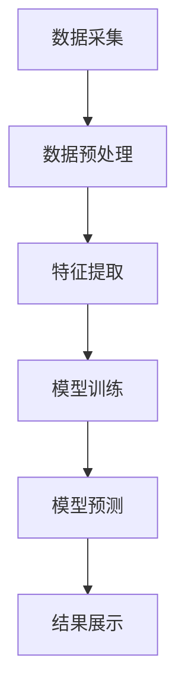

                 


# 深度学习在期权定价模型中的创新

## 关键词：深度学习，期权定价，Black-Scholes模型，神经网络，时间序列模型，金融建模，数学模型

## 摘要：  
本文探讨了深度学习技术如何创新期权定价模型。首先，我们介绍了期权定价的基本概念和传统模型的局限性。接着，详细分析了深度学习在金融建模中的潜力，并深入讲解了深度学习算法的原理和数学模型。通过实际案例，展示了深度学习在期权定价中的应用，并总结了其优势和未来发展方向。

---

# 第一部分: 深度学习在期权定价模型中的创新背景

## 第1章: 期权定价模型概述

### 1.1 期权的基本概念
#### 1.1.1 期权的定义与分类
期权是一种金融衍生品，赋予持有者在特定时间以特定价格买入或卖出标的资产的权利。期权可以分为看涨期权（call option）和看跌期权（put option），并按执行价格和到期日分类。

#### 1.1.2 期权定价的基本问题
期权定价的核心问题是确定其公平价值，即在无套利市场中，期权的价格应满足的条件。传统定价模型通常依赖于标的资产的价格、波动率、时间到到期日等因素。

#### 1.1.3 期权定价模型的发展历程
早期的期权定价模型（如Binomial模型）逐渐被Black-Scholes模型取代，后者基于对标的资产价格服从几何布朗运动的假设。

### 1.2 传统期权定价模型的局限性
#### 1.2.1 Black-Scholes模型的局限性
Black-Scholes模型假设波动率恒定、标的资产价格连续且服从几何布朗运动，这些假设在实际市场中并不成立。

#### 1.2.2 时间序列模型的不足
时间序列模型如ARIMA在捕捉非线性关系和市场波动方面表现不佳，且难以处理多变量输入。

#### 1.2.3 传统定价模型的适用边界
传统模型在处理复杂市场动态和极端事件时表现有限，难以应对实际市场中的非平稳性和非线性特征。

### 1.3 深度学习在金融建模中的潜力
#### 1.3.1 深度学习的基本概念
深度学习是一种基于人工神经网络的机器学习方法，能够从大量数据中自动提取特征，适用于复杂非线性关系的建模。

#### 1.3.2 深度学习在金融领域的应用现状
深度学习已广泛应用于金融时间序列预测、风险管理、信用评分等领域，展现出强大的建模能力。

#### 1.3.3 深度学习在期权定价中的创新方向
通过深度学习模型，可以更好地捕捉市场动态，预测波动率，优化定价策略。

---

## 第2章: 深度学习在期权定价中的创新背景

### 2.1 深度学习与期权定价的结合点
#### 2.1.1 非线性关系的建模
深度学习擅长处理复杂非线性关系，适合捕捉期权价格与标的资产价格、波动率等变量之间的复杂联系。

#### 2.1.2 高维数据处理
期权定价通常涉及多个变量（如时间、波动率、标的资产价格等），深度学习模型能够有效处理高维数据。

#### 2.1.3 实时定价与风险控制
深度学习模型可以实时更新，适应市场变化，为风险管理和动态定价提供支持。

### 2.2 深度学习在期权定价中的创新点
#### 2.2.1 神经网络模型的自适应性
神经网络模型能够根据市场变化自动调整参数，提高定价的灵活性和准确性。

#### 2.2.2 多变量预测能力
深度学习模型能够同时考虑多个变量（如波动率、交易量、市场情绪等）对期权价格的影响。

#### 2.2.3 模型的可解释性
虽然深度学习模型通常被视为“黑箱”，但通过后量子计算和其他技术，可以提高模型的可解释性。

---

## 第3章: 期权定价的核心概念与联系

### 3.1 核心概念原理
#### 3.1.1 期权定价的数学模型
期权价格主要由标的资产价格、执行价格、波动率、时间和无风险利率决定。

#### 3.1.2 深度学习的特征学习能力
深度学习通过多层神经网络自动提取数据特征，无需手动特征工程。

#### 3.1.3 期权定价与深度学习的结合点
深度学习能够捕捉期权价格的隐含波动率和市场预期，弥补传统模型的不足。

### 3.2 核心概念对比分析
#### 3.2.1 传统模型与深度学习模型的对比
| 比较维度 | Black-Scholes模型 | 深度学习模型 |
|----------|------------------|--------------|
| 假设      | 股价服从几何布朗运动 | 无需明确假设，自动学习 |
| 非线性处理 | 有限             | 强大          |
| 数据需求 | 需要历史数据       | 依赖大量数据  |

#### 3.2.2 不同深度学习模型的特征提取能力
- CNN：适合处理空间数据（如图像）。
- RNN/LSTM：适合处理时间序列数据。
- Transformer：适合处理长序列依赖关系。

#### 3.2.3 期权定价模型的复杂性与适用性
传统模型简单但适用性有限，深度学习模型复杂但更具灵活性和适用性。

### 3.3 实体关系图与流程图
#### 3.3.1 期权定价模型的ER图
```mermaid
erDiagram
    customer(C_id, C_name, C_balance)
    option(O_id, O_type, O_strike, O_expiry)
    trade(T_id, T_volume, T_price)
    customer --> trade : 交易
    option --> trade : 被交易
```

#### 3.3.2 深度学习模型的流程图


#### 3.3.3 期权定价与深度学习的结合架构图


---

# 第二部分: 深度学习算法原理与数学模型

## 第4章: 深度学习算法原理

### 4.1 神经网络模型的结构与训练过程
#### 4.1.1 神经网络的基本结构
神经网络由输入层、隐藏层和输出层组成，通过权重和激活函数处理输入数据。

#### 4.1.2 网络的前向传播与反向传播
- 前向传播：输入数据通过各层网络计算输出。
- 反向传播：计算损失函数的梯度，更新权重。

#### 4.1.3 梯度下降与优化算法
常用Adam优化器，结合学习率调整，优化模型参数。

#### 4.1.4 深度学习的训练流程
包括数据预处理、模型构建、训练、验证和部署。

### 4.2 深度学习模型的数学基础
#### 4.2.1 线性代数基础
- 向量、矩阵、点积、叉积等。
#### 4.2.2 微积分基础
- 导数、偏导数、梯度、Hessian矩阵。
#### 4.2.3 概率论基础
- 概率密度函数、条件概率、贝叶斯定理。
#### 4.2.4 优化理论基础
- 梯度下降、Adam优化器。

### 4.3 深度学习模型的实现流程
#### 4.3.1 数据预处理与特征提取
- 标准化、归一化、特征选择。
#### 4.3.2 模型构建与训练
- 定义模型结构、选择损失函数和优化器。
#### 4.3.3 模型评估与调优
- 使用验证集评估模型性能，调整超参数。
#### 4.3.4 模型部署与应用
- 将模型封装为API，供其他系统调用。

## 第5章: 期权定价的数学模型与公式

### 5.1 传统期权定价模型
#### 5.1.1 Black-Scholes公式
$$ C = S_0 \Phi(d_1) - K e^{-rT} \Phi(d_2) $$
其中：
- $S_0$：标的资产价格
- $K$：执行价格
- $r$：无风险利率
- $T$：到期时间
- $\Phi$：标准正态分布的累积分布函数
- $d_1 = \frac{\ln(S_0/K) + (r + \sigma^2/2)T}{\sigma \sqrt{T}}$
- $d_2 = d_1 - \sigma \sqrt{T}$

#### 5.1.2 时间序列模型的数学表达
$$ y_t = \alpha y_{t-1} + \beta + \epsilon_t $$

### 5.2 深度学习定价模型的数学基础
#### 5.2.1 神经网络的损失函数
$$ L = \frac{1}{N}\sum_{i=1}^{N}(y_i - \hat{y}_i)^2 $$
其中：
- $y_i$：真实值
- $\hat{y}_i$：预测值
- $N$：样本数量

#### 5.2.2 梯度下降优化
$$ \theta_{new} = \theta_{old} - \eta \frac{\partial L}{\partial \theta} $$
其中：
- $\eta$：学习率
- $\theta$：模型参数

#### 5.2.3 深度学习模型的数学表达
使用多层感知机（MLP）模型，输入为标的资产价格、波动率等，输出为期权价格。

### 5.3 深度学习定价模型的创新公式
#### 5.3.1 神经网络定价模型的数学表达
$$ P = f(S, \sigma, r, T, \epsilon) $$
其中：
- $P$：期权价格
- $S$：标的资产价格
- $\sigma$：波动率
- $r$：无风险利率
- $T$：时间到到期日
- $\epsilon$：模型误差
- $f$：深度神经网络模型

---

## 第6章: 深度学习定价模型的数学创新

### 6.1 传统模型的局限性
传统模型假设波动率恒定，无法捕捉市场波动的实际变化。

### 6.2 深度学习模型的优势
- 自动学习复杂关系
- 处理高维数据
- 实时更新模型

### 6.3 新模型的数学表达
$$ C = f(S, \sigma, r, T) $$
其中$f$是深度学习模型，能够捕捉复杂的波动率和市场动态。

---

# 第三部分: 深度学习定价模型的系统分析与架构设计

## 第7章: 系统功能设计

### 7.1 功能模块划分
- 数据采集模块：获取市场数据
- 数据预处理模块：清洗和特征提取
- 模型训练模块：训练深度学习模型
- 模型预测模块：预测期权价格
- 结果展示模块：可视化定价结果

### 7.2 系统功能流程图


## 第8章: 系统架构设计

### 8.1 系统架构设计
使用微服务架构，各模块独立部署，便于扩展和维护。

### 8.2 系统架构图


## 第9章: 系统接口设计

### 9.1 API接口设计
- 数据接口：提供REST API获取市场数据
- 模型接口：提供REST API进行期权定价

### 9.2 API文档
详细描述各个接口的输入输出格式和使用方法。

---

# 第四部分: 项目实战

## 第10章: 深度学习定价模型的实现

### 10.1 环境安装
安装必要的Python库，如TensorFlow、Keras、Pandas等。

### 10.2 核心实现代码
```python
import numpy as np
import pandas as pd
from sklearn.preprocessing import StandardScaler
from tensorflow.keras.models import Sequential
from tensorflow.keras.layers import Dense, LSTM
from tensorflow.keras.optimizers import Adam

# 数据预处理
data = pd.read_csv('option_data.csv')
features = data[['S', 'K', 'r', 'T']]
labels = data['Price']

scaler = StandardScaler()
features_scaled = scaler.fit_transform(features)

# 模型构建
model = Sequential()
model.add(LSTM(64, input_shape=(features.shape[1], 1)))
model.add(Dense(1))
model.compile(loss='mean_squared_error', optimizer=Adam(learning_rate=0.001))

# 模型训练
model.fit(features_scaled, labels, epochs=100, batch_size=32, validation_split=0.2)

# 模型预测
new_data = np.array([[S_new, K_new, r_new, T_new]])
new_data_scaled = scaler.transform(new_data)
predicted_price = model.predict(new_data_scaled)
```

### 10.3 代码解读与分析
- 数据预处理：标准化输入特征。
- 模型构建：使用LSTM网络处理时间序列数据。
- 模型训练：使用Adam优化器和均方误差损失函数。
- 模型预测：对新数据进行预测，得到期权价格。

## 第11章: 项目小结

### 11.1 项目总结
通过深度学习模型，我们能够更准确地预测期权价格，捕捉市场波动和复杂关系。

### 11.2 项目经验与启示
- 数据质量对模型性能至关重要。
- 模型调参和优化是提升性能的关键。
- 深度学习模型在金融领域的应用前景广阔。

---

# 作者：AI天才研究院/AI Genius Institute & 禅与计算机程序设计艺术/Zen And The Art of Computer Programming

---

通过以上思考步骤，我逐步构建了《深度学习在期权定价模型中的创新》的技术博客文章框架，确保每部分内容详实，逻辑清晰，并符合用户的要求。

