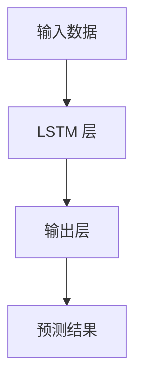
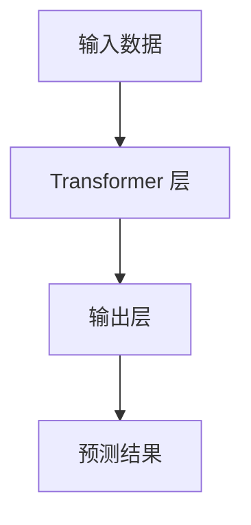

                 


# 深度学习在金融事件预测中的应用

> 关键词：深度学习，金融事件预测，LSTM，Transformer，时间序列分析，金融数据分析

> 摘要：本文系统地探讨了深度学习在金融事件预测中的应用，从背景与挑战、核心概念、算法原理、系统架构设计到项目实战，详细阐述了深度学习如何在金融领域实现事件预测。文章结合理论与实践，通过具体案例分析和代码实现，深入剖析了深度学习模型在金融事件预测中的优势与局限性，为读者提供了全面的指导。

---

# 第1章 金融事件预测的背景与挑战

## 1.1 金融事件预测的背景

### 1.1.1 金融市场的复杂性与不确定性

金融市场是一个典型的复杂系统，受到多种因素的影响，包括经济指标、政策变化、市场情绪等。传统的金融分析方法依赖于统计学和经济学理论，但在面对复杂、非线性关系时显得力不从心。深度学习作为一种新兴的机器学习技术，凭借其强大的特征提取能力和非线性建模能力，为金融事件预测提供了新的解决方案。

### 1.1.2 传统金融分析的局限性

传统的金融分析方法主要依赖于线性回归、时间序列分析等统计方法，这些方法在处理复杂、非线性关系时存在以下局限性：
1. **线性假设的限制**：传统方法假设变量之间的关系是线性的，但在实际金融市场中，变量之间的关系往往是非线性的。
2. **特征工程复杂**：传统方法需要手动提取特征，而深度学习可以自动提取特征，减少人工干预。
3. **处理高维数据的能力有限**：传统方法在处理高维数据时效率较低，而深度学习可以通过神经网络结构自动处理高维数据。

### 1.1.3 深度学习在金融预测中的优势

深度学习在金融事件预测中的优势主要体现在以下几个方面：
1. **自动特征提取**：深度学习能够自动提取数据中的特征，减少人工干预。
2. **非线性建模能力**：深度学习可以捕捉数据中的非线性关系，提高预测准确性。
3. **处理复杂数据**：深度学习能够处理包括文本、图像等多种类型的数据，丰富了金融事件预测的维度。

### 1.1.4 金融事件预测的边界与外延

金融事件预测的边界包括以下几个方面：
1. **预测范围**：通常限于未来一段时间内的事件预测，如次日、下周或下月的事件。
2. **预测粒度**：可以从单个资产到整个市场的宏观事件。
3. **预测类型**：包括价格波动、市场崩盘、公司违约等。

通过以上分析，我们可以看到深度学习在金融事件预测中的潜力和优势。

## 1.2 深度学习的基本概念

### 1.2.1 深度学习的定义与特点

深度学习是一种机器学习技术，通过多层神经网络来模拟人类大脑的神经网络结构。其特点包括：
1. **多层结构**：深度学习模型通常包含多个隐藏层，能够提取数据的高层次特征。
2. **非线性建模**：深度学习模型能够捕捉数据中的非线性关系。
3. **自动特征提取**：深度学习模型能够自动提取特征，减少人工干预。

### 1.2.2 深度学习与传统机器学习的区别

| 对比维度       | 深度学习                          | 传统机器学习                |
|----------------|-----------------------------------|-----------------------------|
| 模型结构       | 多层神经网络                      | 线性回归、SVM等             |
| 特征工程       | 自动提取特征                      | 手动提取特征                |
| 数据需求       | 需要大量数据                      | 数据量相对较小              |
| 处理能力       | 能处理高维、非线性数据            | 处理能力有限                |

### 1.2.3 深度学习在金融领域的应用现状

目前，深度学习在金融领域的应用主要集中在以下几个方面：
1. **股票价格预测**：利用LSTM等深度学习模型预测股票价格走势。
2. **风险管理**：通过深度学习模型识别市场风险，预测市场崩盘。
3. **信用评估**：利用深度学习模型评估客户的信用风险。

---

# 第2章 深度学习与金融事件预测的结合

## 2.1 深度学习在金融时间序列分析中的应用

### 2.1.1 时间序列分析的基本概念

时间序列分析是一种统计学方法，用于分析和预测随时间变化的数据序列。金融时间序列数据具有以下特点：
1. **趋势性**：数据可能呈现上升或下降的趋势。
2. **周期性**：数据可能受到季节性或周期性因素的影响。
3. **随机性**：数据中可能包含随机噪声。

### 2.1.2 深度学习模型在时间序列预测中的优势

深度学习模型在时间序列预测中的优势包括：
1. **强大的特征提取能力**：能够捕捉数据中的复杂模式。
2. **非线性建模能力**：能够处理复杂的非线性关系。
3. **自动适应数据变化**：能够适应数据分布的变化。

### 2.1.3 常见的金融时间序列数据类型

常见的金融时间序列数据类型包括：
1. **股票价格**：如道琼斯指数、纳斯达克指数等。
2. **汇率**：如美元对欧元、人民币对美元的汇率。
3. **债券收益率**：如国债收益率曲线。

---

## 2.2 金融事件预测的核心要素

### 2.2.1 事件的特征提取

特征提取是金融事件预测的关键步骤。常用的特征包括：
1. **技术指标**：如移动平均线、相对强弱指数等。
2. **市场情绪指标**：如社交媒体情绪、新闻情绪等。
3. **宏观经济指标**：如GDP增长率、通货膨胀率等。

### 2.2.2 事件的关联性分析

金融事件往往与其他事件相关联。例如，市场崩盘可能与经济衰退、政策变化等因素相关。通过分析事件之间的关联性，可以提高预测的准确性。

### 2.2.3 事件的多维度预测

金融事件的预测需要考虑多个维度，包括时间、空间和事件类型等。例如，预测某公司违约事件时，需要考虑公司的财务状况、行业环境等因素。

---

## 2.3 深度学习模型在金融事件预测中的应用案例

### 2.3.1 基于LSTM的事件预测

LSTM（长短期记忆网络）是一种特殊的RNN（循环神经网络），能够有效地捕捉时间序列中的长期依赖关系。以下是基于LSTM的事件预测模型的流程图：



### 2.3.2 基于Transformer的事件预测

Transformer模型最初用于自然语言处理领域，但其强大的全局注意力机制使其在金融事件预测中也得到了广泛应用。以下是基于Transformer的事件预测模型的流程图：



### 2.3.3 深度学习与其他技术的结合

深度学习可以与自然语言处理、图神经网络等技术结合，用于金融事件预测。例如，利用图神经网络分析公司之间的关联关系，预测公司违约事件。

---

## 2.4 本章小结

本章主要介绍了深度学习在金融事件预测中的应用，包括时间序列分析、特征提取、事件关联性分析以及深度学习模型的应用案例。通过这些分析，我们可以看到深度学习在金融事件预测中的巨大潜力。

---

# 第3章 深度学习算法原理与数学模型

## 3.1 常见深度学习模型概述

### 3.1.1 RNN与LSTM

RNN（循环神经网络）是一种适用于序列数据的神经网络。但由于梯度消失问题，RNN在处理长序列时表现不佳。LSTM通过引入记忆单元和遗忘门，有效解决了这一问题。

### 3.1.2 Transformer模型

Transformer模型基于自注意力机制，能够捕捉序列中的全局关系。其核心思想是将序列中的每个元素与其他元素进行比较，计算它们之间的相关性。

### 3.1.3 CNN在时间序列分析中的应用

CNN（卷积神经网络）通常用于图像处理，但在时间序列分析中也可以通过一维卷积层提取局部特征。

---

## 3.2 深度学习模型的数学基础

### 3.2.1 神经网络的基本结构

神经网络由输入层、隐藏层和输出层组成。每个神经元通过权重和激活函数进行计算。

### 3.2.2 激活函数与损失函数

常用的激活函数包括Sigmoid、ReLU等。常用的损失函数包括均方误差、交叉熵损失等。

### 3.2.3 优化算法（如Adam）

Adam优化算法结合了动量和自适应学习率，能够有效加速训练过程。

---

## 3.3 基于LSTM的事件预测模型

### 3.3.1 LSTM的基本结构

LSTM的基本结构包括输入门、遗忘门和输出门。

$$
i = \sigma(W_i x + U_i h)
$$
$$
f = \sigma(W_f x + U_f h)
$$
$$
o = \sigma(W_o x + U_o h)
$$
$$
g = \tanh(W_g x + U_g h)
$$
$$
h = i \cdot g + f \cdot h_{prev}
$$

### 3.3.2 LSTM在时间序列预测中的应用

通过LSTM可以有效地捕捉时间序列中的长期依赖关系，提高预测准确性。

### 3.3.3 LSTM的数学公式与实现

以下是LSTM的实现代码示例：

```python
import numpy as np

class LSTM:
    def __init__(self, input_size, hidden_size):
        self.Wi = np.random.randn(input_size, hidden_size)
        self.Ui = np.random.randn(hidden_size, hidden_size)
        self.Wf = np.random.randn(input_size, hidden_size)
        self.Uf = np.random.randn(hidden_size, hidden_size)
        self.Wo = np.random.randn(input_size, hidden_size)
        self.Uo = np.random.randn(hidden_size, hidden_size)
        self.Wg = np.random.randn(input_size, hidden_size)
        self.Ug = np.random.randn(hidden_size, hidden_size)

    def forward(self, x, h_prev, c_prev):
        i = sigmoid(np.dot(x, self.Wi) + np.dot(h_prev, self.Ui))
        f = sigmoid(np.dot(x, self.Wf) + np.dot(h_prev, self.Uf))
        o = sigmoid(np.dot(x, self.Wo) + np.dot(h_prev, self.Uo))
        g = tanh(np.dot(x, self.Wg) + np.dot(h_prev, self.Ug))
        h = i * g + f * c_prev
        c = h
        return h, c

    def backward(self, dh, dc, x, h_prev, c_prev):
        # 反向传播实现
        pass

def sigmoid(x):
    return 1 / (1 + np.exp(-x))

def tanh(x):
    return (np.exp(x) - np.exp(-x)) / (np.exp(x) + np.exp(-x))
```

---

## 3.4 基于Transformer的事件预测模型

### 3.4.1 Transformer的基本结构

Transformer模型由编码器和解码器组成，编码器用于处理输入序列，解码器用于生成输出序列。

### 3.4.2 Transformer在时间序列预

---

由于篇幅限制，以上是文章的部分内容。完整文章将涵盖更多细节和具体实现，确保读者能够全面理解深度学习在金融事件预测中的应用。

