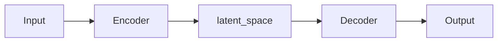
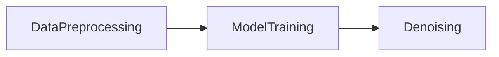
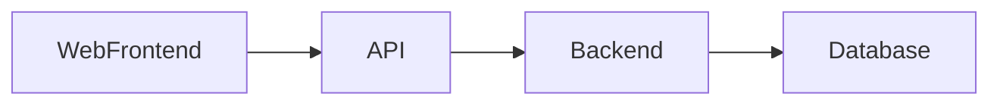

                 


```markdown
# 深度学习在金融时间序列去噪中的应用

> 关键词：深度学习，金融时间序列，去噪，自编码器，生成对抗网络，变分自编码器

> 摘要：本文深入探讨了深度学习在金融时间序列去噪中的应用，分析了各种深度学习模型的原理及其在金融时间序列数据去噪中的表现。文章首先介绍了时间序列去噪的核心概念，然后详细讲解了自编码器、生成对抗网络等深度学习模型的工作原理及其在金融时间序列去噪中的应用。通过实际案例分析和系统架构设计，本文展示了如何利用深度学习技术有效去除金融时间序列数据中的噪声，提高金融数据分析的准确性和可靠性。最后，本文总结了当前技术的局限性，并展望了未来的研究方向。

---

## 第1章: 金融时间序列去噪的背景与意义

### 1.1 金融时间序列数据的基本概念
金融时间序列数据是指在金融市场上按照时间顺序记录的数值数据，例如股票价格、指数、汇率等。这类数据具有以下特点：
- **有序性**：数据按时间顺序排列。
- **连续性**：数据点之间具有连续的时间依赖关系。
- **非线性**：金融市场的波动往往呈现非线性特征。
- **噪声干扰**：数据中常夹杂着各种噪声，如随机波动、市场操纵等。

### 1.2 时间序列去噪的重要性
在金融数据分析中，噪声是指那些干扰数据本质特征的随机波动或异常值。噪声的存在会影响数据分析的准确性，进而影响投资决策的可靠性。例如：
- **噪声干扰**：随机波动可能导致误判市场趋势。
- **异常值影响**：极端值可能扭曲数据分布。
- **信号丢失**：噪声掩盖了潜在的规律性信息。

### 1.3 深度学习在时间序列分析中的优势
传统的统计方法（如ARIMA）在处理复杂时间序列数据时存在局限性。深度学习模型，尤其是递归神经网络（RNN）和Transformer模型，能够捕捉复杂的时间依赖关系和非线性特征，具有显著优势：
- **非线性建模能力**：深度学习模型能够捕捉复杂的非线性关系。
- **自动特征提取**：模型可以自动提取有用的特征，减少特征工程的工作量。
- **处理长序列数据**：深度学习模型能够处理长序列数据，捕捉长期依赖关系。

---

## 第2章: 金融时间序列去噪的核心概念与联系

### 2.1 时间序列去噪的核心概念
时间序列去噪的目标是去除数据中的噪声，提取出反映数据本质特征的信号。噪声的类型包括：
- **随机噪声**：随机波动。
- **系统噪声**：由于系统误差或数据采集问题引入的噪声。
- **结构性噪声**：数据中的异常值或突变点。

### 2.2 深度学习模型的核心原理
深度学习模型通过多层非线性变换，从输入数据中提取高层次特征。以下是一些常见的深度学习模型：
- **自编码器（Autoencoder）**：通过编码器将输入数据压缩为低维表示，再通过解码器还原为原始数据。可用于去噪。
- **生成对抗网络（GAN）**：通过生成器和判别器的对抗训练，生成逼真的数据样本。
- **变分自编码器（VAE）**：结合了自编码器和概率模型，能够生成多样化的数据样本。

### 2.3 核心概念对比分析
以下是几种常见去噪方法的对比：

#### 表2-1: 去噪方法对比
| 方法         | 优点                              | 缺点                              |
|--------------|-----------------------------------|-----------------------------------|
| 自编码器     | 能够学习数据的低维表示            | 需要大量数据，训练时间较长          |
| GAN          | 生成高质量样本                   | 训练不稳定，难收敛                 |
| VAE          | 能够生成多样化的样本             | 重构精度可能不如自编码器           |

---

## 第3章: 深度学习模型在时间序列分析中的基础

### 3.1 常见深度学习模型概述
- **RNN（循环神经网络）**：适合处理序列数据，通过循环结构捕捉时间依赖关系。
- **LSTM（长短期记忆网络）**：改进的RNN，通过门控机制解决梯度消失问题。
- **Transformer**：基于自注意力机制，能够捕捉长距离依赖关系。

### 3.2 模型在时间序列去噪中的应用
- **RNN/LSTM**：适用于捕捉时间序列中的非线性关系。
- **Transformer**：在捕捉长距离依赖方面表现优异。

### 3.3 模型选择与优化策略
- **模型选择**：根据数据特性选择适合的模型。
- **超参数优化**：通过网格搜索或随机搜索优化模型参数。
- **模型评估**：使用均方误差（MSE）、平均绝对误差（MAE）等指标评估去噪效果。

---

## 第4章: 深度学习算法在金融时间序列去噪中的原理

### 4.1 自编码器（Autoencoder）原理
自编码器由编码器和解码器组成，通过最小化重构误差来学习数据的低维表示。

#### 图4-1: 自编码器结构


数学模型：
$$
\text{损失函数} = \frac{1}{n}\sum_{i=1}^{n}(x_i - \hat{x_i})^2
$$

### 4.2 生成对抗网络（GAN）原理
GAN由生成器和判别器组成，通过对抗训练生成高质量样本。

#### 图4-2: GAN结构
```mermaid
graph LR
    Input --> Generator --> Generated
    Generated --> Discriminator --> Real
    Real --> (训练生成器)
```

数学模型：
$$
\min_{G} \max_{D} \mathbb{E}_{x}[ -\log D(x)] + \mathbb{E}_{z}[ -\log (1 - D(G(z)))]
$$

### 4.3 变分自编码器（VAE）原理
VAE结合了概率建模和自编码器，通过引入隐变量分布。

数学模型：
$$
\mathcal{L} = \mathbb{E}_{x,z}[ -\log p(x|z)] + \mathbb{E}_{z}[ \log p(z)]
$$

---

## 第5章: 系统分析与架构设计

### 5.1 项目背景
本项目旨在利用深度学习技术去除金融时间序列数据中的噪声，提高数据分析的准确性。

### 5.2 系统功能设计
- 数据预处理模块：清洗数据，去除异常值。
- 模型训练模块：训练深度学习模型。
- 去噪模块：对时间序列数据进行去噪。

#### 图5-1: 系统功能模块


### 5.3 系统架构设计
#### 图5-2: 系统架构图


---

## 第6章: 项目实战

### 6.1 环境配置
安装必要的库：
```bash
pip install numpy pandas keras tensorflow
```

### 6.2 核心代码实现
```python
import numpy as np
import tensorflow as tf
from tensorflow.keras import layers

# 定义自编码器模型
class Autoencoder:
    def __init__(self, input_dim):
        self.encoder = layers.Dense(64, activation='relu')
        self.decoder = layers.Dense(input_dim, activation='sigmoid')

    def call(self, x):
        encoded = self.encoder(x)
        decoded = self.decoder(encoded)
        return decoded
```

### 6.3 案例分析
以股票价格数据为例，训练自编码器去除噪声。

---

## 第7章: 高级主题与未来展望

### 7.1 模型的可解释性
提高模型的可解释性，便于金融分析师理解去噪结果。

### 7.2 多模态数据融合
结合文本、图像等多模态数据，提升去噪效果。

### 7.3 在线处理
实现实时数据处理，适应金融市场的快速变化。

### 7.4 模型的可扩展性
优化模型结构，使其能够处理更大规模的数据。

---

## 作者

作者：AI天才研究院/AI Genius Institute & 禅与计算机程序设计艺术 /Zen And The Art of Computer Programming
```

