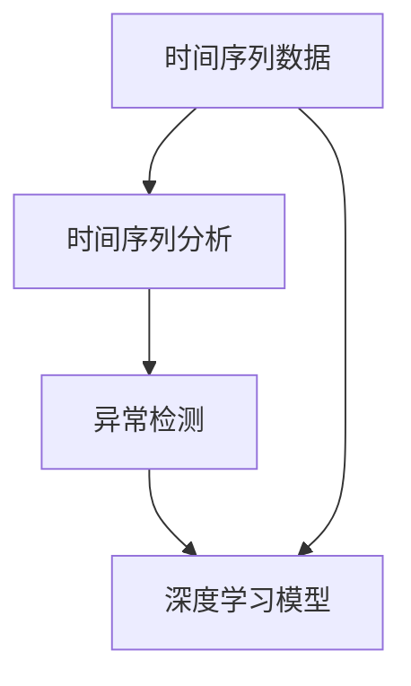
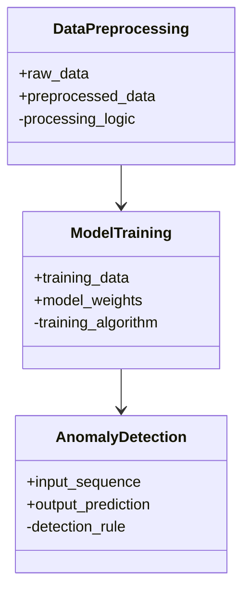
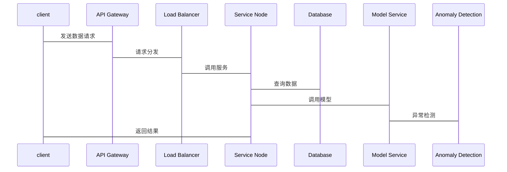

                 


# 深度学习在金融时间序列异常检测中的应用

## 关键词
深度学习，时间序列，异常检测，金融，LSTM，Transformer，Autoencoder

## 摘要
本文系统地探讨了深度学习在金融时间序列异常检测中的应用，从理论基础到实际应用进行了全面分析。文章首先介绍了金融时间序列数据的特点及其异常检测的重要性，随后详细讲解了深度学习模型（如LSTM、Transformer和Autoencoder）在时间序列分析中的原理与优势。接着，通过系统架构设计和项目实战，展示了如何将这些模型应用于实际的金融异常检测场景中。最后，总结了最佳实践和未来的研究方向，为读者提供了一套完整的解决方案。

---

# 第一部分: 背景介绍

## 第1章: 问题背景与描述

### 1.1 问题背景
金融市场的数据呈现高度的时间依赖性，时间序列数据在金融分析中扮演着重要角色。然而，金融市场数据的复杂性（如非线性、噪声干扰和稀疏性）使得传统的统计方法在异常检测中显得力不从心。深度学习的兴起为解决这一问题提供了新的可能性。

#### 1.1.1 金融时间序列数据的特点
- **高维性**：金融市场数据通常包含多个时间序列，如股票价格、成交量、指数等。
- **连续性**：时间序列数据是按时间顺序连续记录的，具有严格的时序关系。
- **非线性**：金融市场的价格波动通常遵循非线性规律，传统线性模型难以捕捉。
- **异常性**：异常事件（如市场崩盘、突发事件）往往对市场产生重大影响，但其发生概率较低。

#### 1.1.2 异常检测的定义与重要性
- **定义**：异常检测是指识别数据中偏离常规模式的样本或子序列。
- **重要性**：在金融领域，异常检测可用于识别市场操纵、欺诈交易、潜在风险事件等。

#### 1.1.3 深度学习在异常检测中的优势
- **非线性建模能力**：深度学习能够捕捉复杂的数据模式。
- **自动特征提取**：深度学习模型可以自动提取高维特征，减少特征工程的工作量。
- **实时性**：通过模型的快速训练和预测能力，深度学习可以实现实时异常检测。

### 1.2 问题解决与边界
#### 1.2.1 异常检测的核心问题
- **数据分布的变化**：异常通常表现为数据分布的变化。
- **稀疏性与噪声**：异常事件通常稀少且被噪声干扰。
- **多模态数据的融合**：金融数据通常涉及多模态信息（如文本、图像、数值等）。

#### 1.2.2 深度学习在金融时间序列中的边界
- **数据量要求**：深度学习模型通常需要大量的训练数据。
- **模型的可解释性**：金融决策通常需要模型的可解释性。
- **实时性与计算效率**：金融市场的实时性要求对模型的计算效率提出了挑战。

#### 1.2.3 核心概念与联系
- **时间序列分析**：研究如何从时间序列数据中提取有用的信息。
- **异常检测**：识别数据中的异常点。
- **深度学习模型**：利用深度神经网络进行特征提取和模式识别。

---

# 第二部分: 核心概念与联系

## 第2章: 核心概念与联系

### 2.1 核心概念原理
#### 2.1.1 时间序列分析
- **时间序列的基本概念**：时间序列是指按照时间顺序排列的数据点。
- **时间序列的分解方法**：常见的分解方法包括加法模型和乘法模型。
- **时间序列的预测模型**：如ARIMA、GARCH等。

#### 2.1.2 异常检测
- **异常检测的分类**：基于统计、机器学习和深度学习的方法。
- **基于统计的方法**：如Z-score、LOF等。
- **基于机器学习的方法**：如Isolation Forest、One-Class SVM等。

#### 2.1.3 深度学习模型
- **深度学习的基本原理**：通过多层神经网络提取数据的高层次特征。
- **常见的深度学习模型**：如RNN、LSTM、Transformer等。
- **深度学习在时间序列分析中的应用**：如股票价格预测、市场趋势分析等。

### 2.2 核心概念对比
#### 2.2.1 时间序列分析与异常检测的对比
| 对比维度 | 时间序列分析 | 异常检测 |
|----------|---------------|----------|
| 目标     | 预测未来值     | 发现异常值 |
| 方法     | ARIMA, LSTM   | Isolation Forest, Autoencoder |

#### 2.2.2 深度学习与其他方法的对比
| 对比维度 | 传统机器学习 | 深度学习 |
|----------|--------------|----------|
| 数据需求 | 需要特征工程 | 自动特征提取 |
| 模型复杂度 | 线性或非线性 | 高度非线性 |
| 计算资源 | 较低          | 较高      |

#### 2.2.3 实体关系图（Mermaid）


---

# 第三部分: 算法原理讲解

## 第3章: 算法原理讲解

### 3.1 基于LSTM的异常检测
#### 3.1.1 LSTM模型原理
- **LSTM的基本结构**：包括输入门、遗忘门和输出门。
- **LSTM的数学模型**：
  - 遗忘门：$f_t = \sigma(W_f x_t + U_f h_{t-1} + b_f)$
  - 输入门：$i_t = \sigma(W_i x_t + U_i h_{t-1} + b_i)$
  - 输出门：$o_t = \sigma(W_o x_t + U_o h_{t-1} + b_o)$
  - 值单元：$g_t = \tanh(W_g x_t + U_g h_{t-1} + b_g)$
  - 隐藏状态：$h_t = o_t \cdot g_t + f_t \cdot h_{t-1}$

#### 3.1.2 LSTM的Python实现示例
```python
import numpy as np
from keras.layers import LSTM, Dense
from keras.models import Sequential

# 模型定义
model = Sequential()
model.add(LSTM(64, input_shape=(None, 1)))
model.add(Dense(1))
model.compile(loss='mean_squared_error', optimizer='adam')
```

### 3.2 基于Transformer的异常检测
#### 3.2.1 Transformer模型原理
- **自注意力机制**：通过计算序列中每个位置的注意力权重，捕捉全局依赖。
- **多头注意力**：通过并行计算多个注意力头，增强模型的表达能力。

#### 3.2.2 Transformer的数学模型
- **查询、键、值**：$Q = W_q h_i, K = W_k h_i, V = W_v h_i$
- **注意力权重**：$A = \text{softmax}\left(\frac{QK^T}{\sqrt{d_k}}\right)$
- **输出**：$\text{Output} = A V$

#### 3.2.3 Transformer的Python实现示例
```python
import tensorflow as tf
from tensorflow.keras.layers import MultiHeadAttention

# 定义多头注意力层
num_heads = 8
d_model = 512
attention_layer = MultiHeadAttention(num_heads=num_heads, key_dim=d_model//num_heads)

# 输入序列
input_seq = tf.random.normal((1, 10, 512))

# 计算注意力输出
output = attention_layer(input_seq, input_seq)
```

### 3.3 基于Autoencoder的异常检测
#### 3.3.1 Autoencoder模型原理
- **编码器**：将输入数据映射到低维特征空间。
- **解码器**：从低维特征重建原始数据。
- **异常分数**：通过重建误差衡量异常程度。

#### 3.3.2 Autoencoder的数学模型
- **编码器**：$z = f(x)$
- **解码器**：$\hat{x} = g(z)$
- **异常分数**：$\text{score} = ||x - \hat{x}||$

#### 3.3.3 Autoencoder的Python实现示例
```python
from keras.layers import Dense
from keras.models import Model

# 编码器
input_layer = Input(shape=(timesteps, features))
lstm_layer = LSTM(64)(input_layer)
dense_layer = Dense(32)(lstm_layer)
# 解码器
decoded = Dense(64, activation='relu')(dense_layer)
output_layer = Dense(features)(decoded)

model = Model(inputs=input_layer, outputs=output_layer)
model.compile(loss='mean_squared_error', optimizer='adam')
```

---

# 第四部分: 系统分析与架构设计

## 第4章: 系统分析与架构设计

### 4.1 问题场景介绍
- **场景描述**：实时监测股票价格波动，识别异常交易行为。
- **数据来源**：股票价格、成交量、市场新闻等。

### 4.2 系统功能设计
#### 4.2.1 领域模型（Mermaid类图）


#### 4.2.2 系统架构设计（Mermaid架构图）


### 4.3 系统接口设计
- **输入接口**：接收实时金融数据流。
- **输出接口**：返回异常检测结果。

### 4.4 系统交互设计（Mermaid序列图）


---

# 第五部分: 项目实战

## 第5章: 项目实战

### 5.1 环境安装
- **Python**：3.8+
- **库的安装**：`pip install numpy pandas keras tensorflow`

### 5.2 核心实现
#### 5.2.1 数据预处理
```python
import pandas as pd
import numpy as np

# 数据加载
data = pd.read_csv('stock_prices.csv')
# 数据清洗
data = data.dropna()
# 特征工程
data['log_return'] = np.log(data['close'] / data['close'].shift(1))
```

#### 5.2.2 模型实现
```python
from keras.models import Sequential
from keras.layers import LSTM, Dense

# 模型定义
model = Sequential()
model.add(LSTM(64, input_shape=(None, 1)))
model.add(Dense(1))
model.compile(loss='mean_squared_error', optimizer='adam')
```

#### 5.2.3 训练与评估
```python
# 训练
model.fit(X_train, y_train, epochs=10, batch_size=32)
# 预测
y_pred = model.predict(X_test)
# 评估
from sklearn.metrics import mean_squared_error
print(mean_squared_error(y_test, y_pred))
```

### 5.3 案例分析
#### 5.3.1 数据分析
- **数据可视化**：绘制股票价格和异常检测结果。
- **异常事件分析**：识别市场崩盘等异常事件。

#### 5.3.2 模型评估
- **准确率**：识别异常事件的准确率。
- **召回率**：识别异常事件的召回率。

### 5.4 项目总结
- **项目目标**：实现金融时间序列异常检测。
- **项目成果**：构建了一个基于LSTM的异常检测系统。
- **经验总结**：模型调参和数据预处理对结果影响较大。

---

# 第六部分: 最佳实践与小结

## 第6章: 最佳实践与小结

### 6.1 最佳实践
#### 6.1.1 数据预处理
- **数据清洗**：处理缺失值和异常值。
- **特征工程**：提取有用的特征。

#### 6.1.2 模型调参
- **超参数优化**：使用网格搜索或随机搜索。
- **模型集成**：结合多种模型提高准确性。

#### 6.1.3 实时性优化
- **分布式计算**：使用分布式训练和推理。
- **轻量化模型**：优化模型结构，减少计算量。

### 6.2 小结
- **核心内容回顾**：深度学习在金融时间序列异常检测中的应用。
- **未来展望**：结合多模态数据和增强学习进一步提升性能。

### 6.3 注意事项
- **数据质量**：确保数据的完整性和准确性。
- **模型解释性**：在金融领域，模型的可解释性至关重要。
- **实时性要求**：根据实际需求优化模型的推理速度。

---

# 第七部分: 扩展阅读

## 第7章: 扩展阅读

### 7.1 推荐书籍
- 《Deep Learning》——Ian Goodfellow
- 《Time Series Analysis and Its Applications》——Robert H. Shumway

### 7.2 推荐论文
- "Long Short-Term Memory"——Hochreiter & Schmidhuber
- "Attention Is All You Need"——Vaswani et al.

---

# 附录

## 附录A: 所有代码汇总

```python
# LSTM模型代码
import numpy as np
from keras.layers import LSTM, Dense
from keras.models import Sequential

model = Sequential()
model.add(LSTM(64, input_shape=(None, 1)))
model.add(Dense(1))
model.compile(loss='mean_squared_error', optimizer='adam')

# Transformer模型代码
import tensorflow as tf
from tensorflow.keras.layers import MultiHeadAttention

num_heads = 8
d_model = 512
attention_layer = MultiHeadAttention(num_heads=num_heads, key_dim=d_model//num_heads)

input_seq = tf.random.normal((1, 10, 512))
output = attention_layer(input_seq, input_seq)

# Autoencoder模型代码
from keras.layers import Input, LSTM, Dense
from keras.models import Model

input_layer = Input(shape=(timesteps, features))
lstm_layer = LSTM(64)(input_layer)
dense_layer = Dense(32)(lstm_layer)
decoded = Dense(64, activation='relu')(dense_layer)
output_layer = Dense(features)(decoded)

model = Model(inputs=input_layer, outputs=output_layer)
model.compile(loss='mean_squared_error', optimizer='adam')
```

---

# 作者信息

作者：AI天才研究院/AI Genius Institute & 禅与计算机程序设计艺术 /Zen And The Art of Computer Programming

---

**本文总结**：通过系统地分析深度学习在金融时间序列异常检测中的应用，从理论到实践，为读者提供了一套完整的解决方案。

