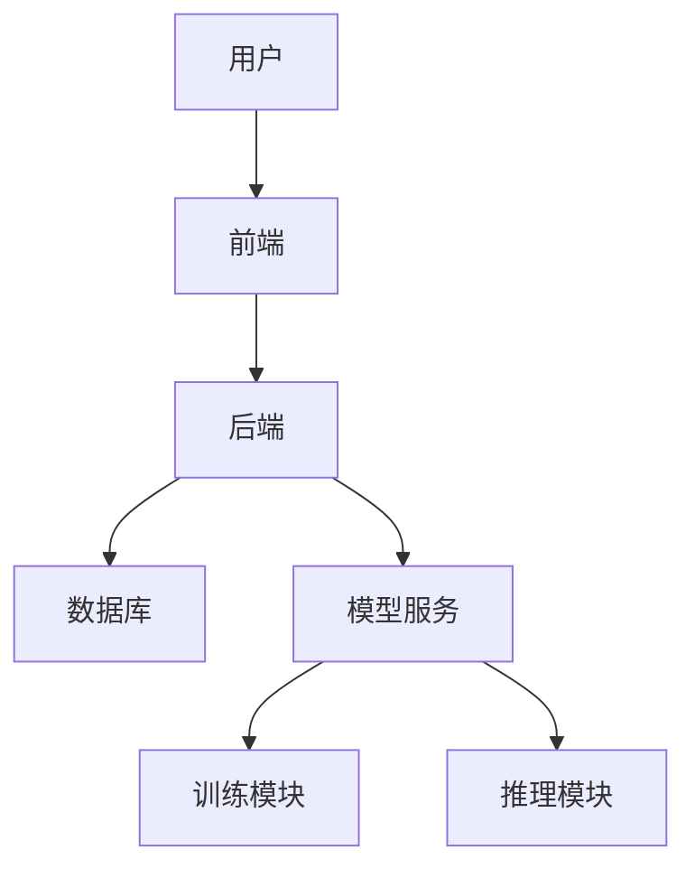

                 


# 深度学习在金融时间序列生成中的应用

## 关键词：深度学习，金融，时间序列，生成模型，神经网络

## 摘要：  
本文深入探讨了深度学习在金融时间序列生成中的应用，从基本概念到核心算法，再到实际应用，全面分析了深度学习如何在金融领域中生成高质量的时间序列数据。通过详细讲解RNN、LSTM、Transformer等模型的原理与优劣，结合生成对抗网络（GAN）和变分自编码器（VAE）的应用，本文为读者提供了从理论到实践的完整指南。此外，文章还结合实际案例，分析了系统架构设计、项目实现流程及最佳实践，帮助读者更好地理解和应用这些技术。

---

# 第1章：时间序列在金融中的重要性

## 1.1 时间序列的定义与特点

### 1.1.1 时间序列的定义  
时间序列是指按时间顺序排列的数据点，通常以等间隔的时间间隔记录。在金融领域，时间序列数据可以是股票价格、汇率、债券收益率、交易量等。

### 1.1.2 金融时间序列的核心特征  
金融时间序列具有以下核心特征：  
1. **非线性**：金融市场的波动往往难以用线性模型描述。  
2. **异质性**：不同金融资产的时间序列行为差异显著。  
3. **相关性**：时间序列数据通常具有自相关性和交叉相关性。  
4. **噪声与随机性**：金融市场受到多种不可预测因素的影响，时间序列中通常存在大量噪声。  

### 1.1.3 时间序列在金融分析中的作用  
时间序列分析在金融领域中具有广泛的应用，包括：  
- **价格预测**：预测股票、外汇等的价格走势。  
- **风险管理**：识别市场风险、波动性分析等。  
- **交易信号生成**：基于时间序列分析生成交易策略。  
- **模拟与回测**：生成模拟数据用于算法交易的回测与验证。  

---

## 1.2 深度学习的崛起与应用

### 1.2.1 深度学习的定义与特点  
深度学习是一种基于人工神经网络的机器学习方法，具有以下特点：  
- **非线性建模能力**：能够捕捉复杂的数据模式。  
- **特征提取能力**：自动从数据中提取有用的特征。  
- **泛化能力**：在 unseen 数据上具有较好的表现。  

### 1.2.2 深度学习在金融领域的应用现状  
深度学习在金融领域的应用主要集中在以下方面：  
- **股票价格预测**：利用深度学习模型预测股票价格走势。  
- **风险管理**：识别市场风险、异常交易检测等。  
- **信用评分**：评估客户信用风险。  
- **自然语言处理**：分析新闻、财报等文本数据以辅助投资决策。  

### 1.2.3 时间序列生成的挑战与机遇  
时间序列生成在金融领域面临以下挑战：  
- **数据稀疏性**：金融时间序列数据通常有限，难以训练复杂的模型。  
- **模型的稳定性**：时间序列生成模型需要具有良好的稳定性和可解释性。  
- **实时性要求**：金融交易需要实时处理，对模型的计算效率提出较高要求。  

---

## 1.3 本书的核心目标与结构

### 1.3.1 本书的核心目标  
本书旨在深入探讨深度学习在金融时间序列生成中的应用，帮助读者理解时间序列生成的核心原理，并掌握实际应用中的关键技巧。

### 1.3.2 本书的主要内容框架  
本书将从以下几方面展开：  
1. 时间序列在金融中的重要性。  
2. 深度学习与时间序列生成的基础概念。  
3. 深度学习模型在金融时间序列生成中的应用。  
4. 深度学习模型的数学原理与实现。  
5. 系统架构与项目实战。  
6. 最佳实践、小结与展望。  

### 1.3.3 本书的读者群体与学习要求  
本书适合以下读者群体：  
- 对深度学习感兴趣的研究者和工程师。  
- 从事金融数据分析的专业人士。  
- 对时间序列生成技术感兴趣的高校学生。  
阅读本书需要一定的数学基础和编程能力，特别是对Python和深度学习框架（如TensorFlow、PyTorch）有一定了解。

---

# 第2章：深度学习与时间序列生成的基础概念

## 2.1 深度学习的基本原理

### 2.1.1 神经网络的基本结构  
神经网络由输入层、隐藏层和输出层组成，通过非线性激活函数（如ReLU、sigmoid）构建复杂的特征提取能力。  

### 2.1.2 深度学习的核心算法  
深度学习的核心算法包括：  
- **卷积神经网络（CNN）**：适用于图像数据。  
- **循环神经网络（RNN）**：适用于序列数据。  
- **Transformer**：适用于长序列数据，基于自注意力机制。  

### 2.1.3 深度学习与传统机器学习的区别  
深度学习的特点在于其自动提取特征的能力，而传统机器学习需要手动设计特征。深度学习在处理高维、复杂数据时表现更优。

---

## 2.2 时间序列生成的数学基础

### 2.2.1 时间序列的数学模型  
时间序列的经典模型包括：  
- **AR模型**：自回归模型，基于过去值预测当前值。  
- **MA模型**：移动平均模型，基于过去误差预测当前值。  
- **ARMA模型**：AR与MA的结合。  
- **ARIMA模型**：ARMA的扩展，适用于非平稳序列。  

### 2.2.2 深度学习中的时间依赖建模  
深度学习通过以下方式建模时间依赖：  
- **循环结构**：RNN通过循环结构捕捉序列的时序关系。  
- **自注意力机制**：Transformer通过自注意力捕捉长距离依赖关系。  

### 2.2.3 时间序列生成的常见任务  
时间序列生成的常见任务包括：  
- **预测未来值**：根据历史数据预测下一步或未来多步的值。  
- **生成模拟数据**：根据现有数据生成新的时间序列数据。  
- **异常检测**：识别时间序列中的异常点。  

---

## 2.3 深度学习在时间序列生成中的优势

### 2.3.1 深度学习的非线性建模能力  
深度学习能够捕捉复杂的非线性关系，而传统统计模型在这种情况下表现有限。  

### 2.3.2 深度学习的特征提取能力  
深度学习能够自动提取时间序列中的高层次特征，减少了手动特征工程的工作量。  

### 2.3.3 深度学习的泛化能力  
深度学习模型在 unseen 数据上的泛化能力较强，适用于金融时间序列的复杂变化。

---

## 2.4 时间序列生成的挑战与解决方案

### 2.4.1 时间序列生成的挑战  
时间序列生成的挑战包括：  
- **数据稀疏性**：金融时间序列数据通常有限，难以训练复杂的模型。  
- **模型的稳定性**：时间序列生成模型需要具有良好的稳定性和可解释性。  
- **实时性要求**：金融交易需要实时处理，对模型的计算效率提出较高要求。  

### 2.4.2 解决方案  
为应对上述挑战，可以采取以下措施：  
- **数据增强**：通过生成对抗网络（GAN）等技术生成更多的训练数据。  
- **模型优化**：采用更高效的时间序列生成模型，如Transformer。  
- **计算优化**：利用 GPU 加速计算，提升模型的训练效率。

---

## 2.5 深度学习在金融时间序列生成中的核心任务

### 2.5.1 股票价格预测  
股票价格预测是时间序列生成的核心任务之一。通过深度学习模型，可以基于历史价格和交易量等数据，预测未来股票价格走势。

### 2.5.2 风险管理与异常检测  
风险管理与异常检测是金融时间序列生成的另一重要任务。通过分析时间序列数据，可以识别市场风险和异常交易行为。

### 2.5.3 金融时间序列的生成与模拟  
金融时间序列的生成与模拟是深度学习在金融领域中的重要应用之一。通过生成模拟数据，可以用于算法交易的回测与验证。

---

## 2.6 深度学习在金融时间序列生成中的优势与挑战

### 2.6.1 深度学习的优势  
深度学习在金融时间序列生成中的优势包括：  
- **非线性建模能力**：能够捕捉复杂的时间序列模式。  
- **特征提取能力**：自动从数据中提取有用的特征。  
- **泛化能力**：在 unseen 数据上具有较好的表现。

### 2.6.2 深度学习的挑战  
深度学习在金融时间序列生成中的挑战包括：  
- **数据稀疏性**：金融时间序列数据通常有限，难以训练复杂的模型。  
- **模型的稳定性**：时间序列生成模型需要具有良好的稳定性和可解释性。  
- **计算效率**：深度学习模型的训练和推理需要较高的计算资源。

### 2.6.3 深度学习在金融时间序列生成中的未来发展方向  
未来，深度学习在金融时间序列生成中的发展方向包括：  
- **更高效的时间序列生成模型**：如Transformer的改进版。  
- **结合多模态数据**：将时间序列数据与其他类型的数据（如文本、图像）结合，提升模型的表现。  
- **强化学习的应用**：利用强化学习优化时间序列生成的策略。

---

# 第3章：深度学习模型在金融时间序列生成中的应用

## 3.1 常见的深度学习模型概述

### 3.1.1 RNN与LSTM
- **RNN**：循环神经网络，适用于处理序列数据，但存在梯度消失问题。  
- **LSTM**：长短时记忆网络，通过门控机制解决梯度消失问题，适用于长序列数据。  

### 3.1.2 Transformer模型
- **Transformer**：基于自注意力机制，适用于长序列数据，具有并行计算能力。  
- **优势**：捕捉长距离依赖关系，计算效率高。  

### 3.1.3 GAN与VAE在时间序列生成中的应用
- **GAN**：生成对抗网络，通过生成器和判别器的对抗训练生成逼真的数据。  
- **VAE**：变分自编码器，通过概率建模生成多样化的数据。  

---

## 3.2 金融时间序列生成的核心任务

### 3.2.1 股票价格预测
- **任务目标**：基于历史股票价格预测未来价格走势。  
- **模型选择**：可以使用LSTM、Transformer等模型进行预测。  

### 3.2.2 风险管理与异常检测
- **任务目标**：识别市场风险和异常交易行为。  
- **模型选择**：可以使用RNN、GAN等模型进行异常检测。  

### 3.2.3 金融时间序列的生成与模拟
- **任务目标**：生成符合实际市场规律的金融时间序列数据。  
- **模型选择**：可以使用VAE、GAN等模型进行数据生成。  

---

## 3.3 深度学习在金融时间序列生成中的优势与挑战

### 3.3.1 深度学习的优势
- **非线性建模能力**：能够捕捉复杂的时间序列模式。  
- **特征提取能力**：自动从数据中提取有用的特征。  
- **泛化能力**：在 unseen 数据上具有较好的表现。  

### 3.3.2 深度学习的挑战
- **数据稀疏性**：金融时间序列数据通常有限，难以训练复杂的模型。  
- **模型的稳定性**：时间序列生成模型需要具有良好的稳定性和可解释性。  
- **计算效率**：深度学习模型的训练和推理需要较高的计算资源。  

### 3.3.3 深度学习在金融时间序列生成中的未来发展方向
- **更高效的时间序列生成模型**：如Transformer的改进版。  
- **结合多模态数据**：将时间序列数据与其他类型的数据（如文本、图像）结合，提升模型的表现。  
- **强化学习的应用**：利用强化学习优化时间序列生成的策略。  

---

# 第4章：深度学习模型的数学原理与实现

## 4.1 RNN与LSTM的数学模型

### 4.1.1 RNN的基本结构与数学公式
- **循环结构**：RNN通过循环结构处理序列数据。  
- **数学公式**：  
  $$ 
  h_t = \tanh(W_{hh} h_{t-1} + W_{hx} x_t + b_h) 
  $$  
  $$ 
  y_t = W_{hy} h_t + b_y 
  $$  

### 4.1.2 LSTM的门控机制与数学公式
- **门控机制**：LSTM通过输入门、遗忘门和输出门控制信息的流动。  
- **数学公式**：  
  $$
  i_t = \sigma(W_{xi} x_t + W_{hi} h_{t-1} + b_i) 
  $$  
  $$
  f_t = \sigma(W_{xf} x_t + W_{hf} h_{t-1} + b_f) 
  $$  
  $$
  o_t = \sigma(W_{xo} x_t + W_{ho} h_{t-1} + b_o) 
  $$  
  $$
  c_t = f_t \cdot c_{t-1} + i_t \cdot tanh(W_{xc} x_t + W_{hc} h_{t-1} + b_c) 
  $$  
  $$
  h_t = o_t \cdot tanh(c_t) 
  $$  

---

## 4.2 Transformer模型的数学原理

### 4.2.1 自注意力机制的数学公式
- **自注意力机制**：  
  $$
  \text{Attention}(Q, K, V) = \text{softmax}\left(\frac{QK^T}{\sqrt{d_k}}\right)V 
  $$  
  其中，$Q$、$K$、$V$分别为查询、键、值矩阵，$d_k$为键的维度。  

### 4.2.2 Transformer的编码与解码结构
- **编码器**：由多个自注意力层和前馈神经网络层组成。  
- **解码器**：由自注意力层和交叉注意力层组成，用于生成目标序列。  

---

## 4.3 GAN与VAE的数学原理

### 4.3.1 GAN的数学模型
- **生成器**：通过深度神经网络生成数据。  
- **判别器**：判别输入数据是否为真实数据。  
- **损失函数**：  
  $$
  \mathcal{L}_{GAN} = \mathbb{E}[\log(D(x))] + \mathbb{E}[\log(1 - D(G(z)))] 
  $$  

### 4.3.2 VAE的数学模型
- **编码器**：将输入数据编码为隐变量 $z$ 的概率分布。  
- **解码器**：根据隐变量 $z$ 生成数据。  
- **损失函数**：  
  $$
  \mathcal{L}_{VAE} = \mathbb{E}[||x - G(z)||^2] + \mathbb{E}[KL(q(z|x) || p(z))] 
  $$  

---

# 第5章：系统架构与项目实战

## 5.1 系统架构设计

### 5.1.1 系统功能设计
- **数据预处理**：包括数据清洗、归一化等。  
- **模型训练**：选择合适的模型进行训练。  
- **模型评估**：通过指标（如MAE、RMSE）评估模型性能。  
- **模型部署**：将模型部署到实际应用场景中。  

### 5.1.2 系统架构图


---

## 5.2 项目实战

### 5.2.1 环境安装
- **Python**：安装Python 3.8及以上版本。  
- **深度学习框架**：安装TensorFlow或PyTorch。  
- **其他依赖**：安装numpy、pandas、matplotlib等库。  

### 5.2.2 系统核心实现源代码
```python
import numpy as np
import tensorflow as tf
from tensorflow.keras import layers

# 定义LSTM模型
def lstm_model(input_shape):
    model = tf.keras.Sequential()
    model.add(layers.LSTM(64, input_shape=input_shape, return_sequences=True))
    model.add(layers.LSTM(32, return_sequences=False))
    model.add(layers.Dense(1))
    return model

# 定义Transformer模型
def transformer_model(input_shape):
    model = tf.keras.Sequential()
    model.add(layers.InputLayer(input_shape))
    model.add(layers.Dense(64, activation='relu'))
    model.add(layers.Dropout(0.1))
    model.add(layers.Dense(32, activation='relu'))
    model.add(layers.Dense(1))
    return model
```

### 5.2.3 代码应用解读与分析
- **LSTM模型**：适用于短序列数据，具有较强的时序建模能力。  
- **Transformer模型**：适用于长序列数据，能够捕捉长距离依赖关系。  

### 5.2.4 实际案例分析
- **案例**：基于股票价格数据，使用LSTM模型进行价格预测。  
- **数据预处理**：将股票价格数据归一化，划分训练集和测试集。  
- **模型训练**：使用训练数据训练模型，设置合适的超参数（如学习率、批量大小）。  
- **模型评估**：使用测试数据评估模型性能，计算MAE、RMSE等指标。  

### 5.2.5 项目小结
- **优势**：深度学习模型在金融时间序列生成中表现优异。  
- **挑战**：模型的训练和调优需要较高的计算资源和专业知识。  
- **改进建议**：结合多模态数据，优化模型结构，提升模型性能。  

---

# 第6章：最佳实践、小结与展望

## 6.1 最佳实践

### 6.1.1 数据预处理
- **归一化**：将数据归一化到 [0, 1] 范围内。  
- **滑动窗口**：使用滑动窗口方法生成训练数据。  

### 6.1.2 模型调优
- **超参数优化**：使用网格搜索或随机搜索优化超参数。  
- **早停法**：防止过拟合，提升模型泛化能力。  

### 6.1.3 模型部署
- **在线推理**：将模型部署到云服务器，提供实时预测服务。  
- **离线分析**：将模型应用于批量数据分析。  

---

## 6.2 小结

深度学习在金融时间序列生成中具有广泛的应用前景。通过本文的探讨，我们了解了深度学习的核心原理，掌握了多种时间序列生成模型的优缺点，并通过实际案例分析了模型的实现与应用。深度学习技术的引入，为金融时间序列生成带来了新的可能性，但也带来了数据稀疏性、模型稳定性等挑战。

---

## 6.3 展望

未来，深度学习在金融时间序列生成中的发展方向包括：  
1. **更高效的时间序列生成模型**：如改进版的Transformer模型。  
2. **多模态数据的应用**：结合文本、图像等多种数据源，提升模型表现。  
3. **强化学习的应用**：利用强化学习优化时间序列生成策略。  
4. **可解释性研究**：提升模型的可解释性，满足金融领域的合规要求。  

---

# 作者：AI天才研究院/AI Genius Institute & 禅与计算机程序设计艺术 /Zen And The Art of Computer Programming

